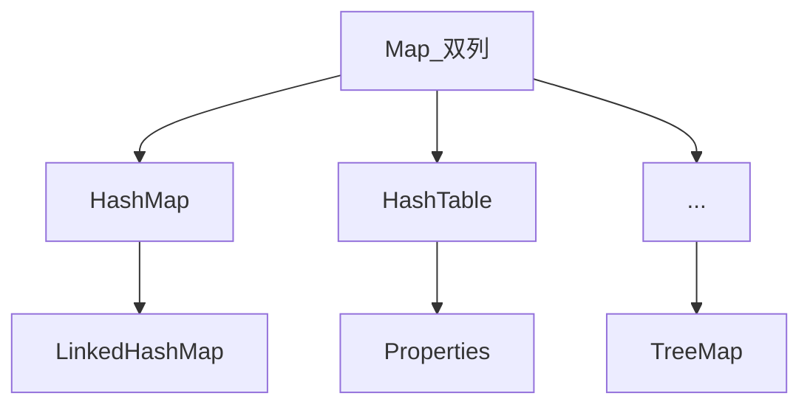
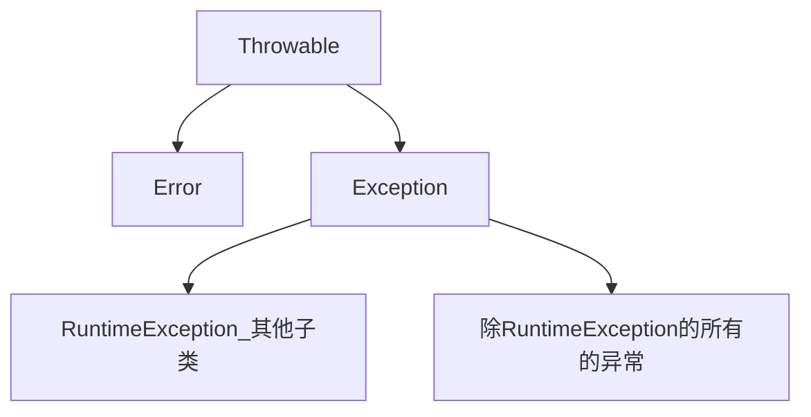
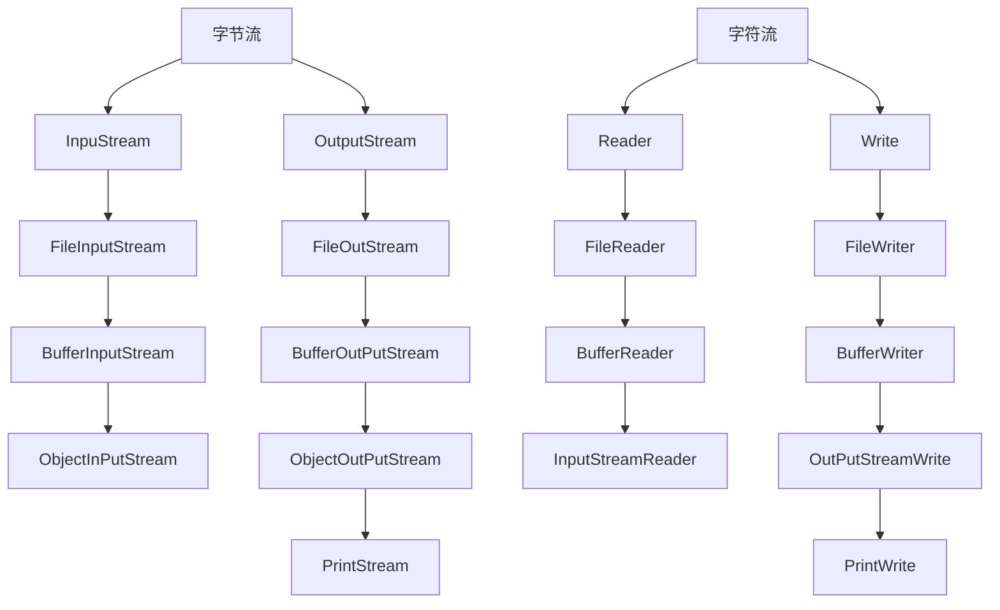

# JavaSE基础

TD

LR

### 注释及其他

单行注释--> //  多行注释--> /* 文本 */

javaDoc 注释 --> /**   文本   */

#### ascii

- 大写字母“A”到“Z”的ASCII码值分别为65到90；

- 小写字母“a”到“z”的ASCII码值分别为97到到122;

- 数字0到9的ASCII码值分别为48到57;
- 空格的ASCII码值为32；

 **DOC命令**


1.切换盘：例如e盘--> e:

2.查看e盘的文件--> dir

3.进入e盘的文件夹 *例如ID* cd ID

4.回退到上一个文件-->  cd.. 一次回退多级 cd ID\Doc  直接回退根目录 cd \

## 基本语法

### 关键字

1.关键字字母全部**小写**

2.在常用的编辑器中，关键字有特殊颜色 大概有50多个


**空常量不能直接输出**

### 数据类型

计算机最小信息单元是“位（bit）”又叫比特位，通常用小写*b*表示，最小的存储单元叫“字节（byte）”通常用大写*B*表示，字节由连续8个位组成。


 

整数默认 int，浮点数默认double。

### 变量

变量：在程序运行过程中，其值可以发生改变的量。

变量组成：变量名，数据类型，变量值--> int a=10.

### 标识符

标识符：给类，方法，变量等起名的符号.

定义规则：由数字，字母，下划线，和美元符号组成、不能数字开头、不能是关键字、区分大小写。

---


### 类型转换


### 运算符


#### 自增自减


#### 逻辑运算


#### 三元运算符

格式：关系表达式？表达式1：表达式2

列子：a>b?a:b

规则：先看运算符，如果是真的就是*表达式1*(a)如果是假的就是*表达式2*(b).

### 输出

#### 1.参数有区别
System.out.println() 可以不写参数
System.out.print(参数) 参数不能为空.必须有

#### 2.效果有区别

println :会在输出完信息后进行换行,产生一个新行
print: 不会产生新行
3.println更简洁, print更灵活
print可以后面跟"\n"来达到和println一样的效果
也可以跟"\t" 制表符, 等.

## 数据输入scanner

```
1. 导包
import java.util.Scanner
2.创建对象
Scanner sc= new Scanner(System.in)
3.接受数据
int i=sc.nextInt()
```


## switch语句

```java
//格式
switch(表达式){
    case 值1:
        语句体;
        break;
    case 值2:
        语句体;
        break;
        ...
    default:
        语句体;
        break;
}
```

case 穿透：当break不写时会执行下一次case的命令直到有break.

## 循环

### for循环


死循环：for（；；）{

System.out.println(i)

}

#### 水仙花


### while循环语句


死循环：while（true）{

System.out.println(i)

}

#### 增强型循环

for (int x:number)


### do while


死循环：do{

System.out.println(i)

}while(true )

### 三、循环区别


### 跳转语句


### Random

```
1.导包
import java.util.Random;
2.创建对象
Random r=new Random();
3.获取随机数
int number=r.nextInt(10); //获取范围：[0,10)
```


## idea 

```
1.快速生成main：psvm或者直接main
2.生成输出语句：sout
3.Ctrl+Alt+space(内容提示，代码补全等)
4.注释：选中代码，Ctrl+/ 单行注释  选择代码，Ctrl+Shift+/ 多行注释
```


#### 快捷键

**ctrl+alt+t（补全循环）**

**ctrl+alt+v（补全函数内容）**

**ctrl+alt+回车（创建函数）**


### 快捷键2

鼠标光标定位快捷键
1.ctrl + Home:定位到一页代码的行头
2.ctrl + end :定位到一页代码的行末
3.home：定位到一行的行头
4.end：定位到一行的行末
有的小键盘可能没有home和end键，就需要自行修改IDEA中的快捷键或者使用键盘映射的方法修改。

将一行代码进行改变位置
1。代码 右 移 ：Tab键
将鼠标光标放到行代码的头部，按Tab

2。代码 左 移 ：Shift+Tab键
将鼠标光标放到行代码的任何地方，按Shift+Tab键

3。代码 上 移 ：Shift+Alt +方向上键
将鼠标光标放到要上移的所在代码行的任何位置，按Shift+Alt+方向上键 ↑

4。代码 下 移 ：Shift+Alt +方向下键
将鼠标光标放到要下移的所在代码行的任何位置，按Shift+Alt+方向下键↓

将多行代码进行改变位置
1。代码 右 移 ：Tab键
选中多行代码，按Tab

2。代码 左 移 ：Shift+Tab键
选中多行代码，按Shift+Tab键

3。代码 上 移 ：Shift+Alt +方向上键
选中多行代码，按Shift+Alt+方向上键 ↑

4。代码 下 移 ：Shift+Alt +方向下键
选中多行代码，按Shift+Alt+方向下键↓

## 数组

### 1.1什么是数组【理解】

​	数组就是存储数据长度固定的容器，存储多个数据的数据类型要一致。 

### 1.2数组定义格式【记忆】

#### 1.2.1第一种

​	数据类型[] 数组名

​	示例：

```java
int[] arr;        
double[] arr;      
char[] arr;
```

#### 1.2.2第二种

​	数据类型 数组名[]

​	示例：

```java
int arr[];
double arr[];
char arr[];
```

### 1.3数组动态初始化【应用】

#### 1.3.1什么是动态初始化

​	数组动态初始化就是只给定数组的长度，由系统给出默认初始化值。

#### 1.3.2动态初始化格式

```java
数据类型[] 数组名 = new 数据类型[数组长度];
```

```java
int[] arr = new int[3];
```

#### 1.3.3动态初始化格式详解

- 等号左边：

  -  int:数组的数据类型

  -  []:代表这是一个数组

  -  arr:代表数组的名称

- 等号右边：

  -   new:为数组开辟内存空间

  -   int:数组的数据类型

  -   []:代表这是一个数组

  -   5:代表数组的长度

### 1.4数组元素访问【应用】

#### 1.4.1什么是索引

​	每一个存储到数组的元素，都会自动的拥有一个编号，从0开始。

​	这个自动编号称为数组索引(index)，可以通过数组的索引访问到数组中的元素。 	

#### 1.4.2访问数组元素格式

```java
数组名[索引];
```

#### 1.4.3示例代码

```java
public class ArrayDemo {
    public static void main(String[] args) {
        int[] arr = new int[3];

        //输出数组名
        System.out.println(arr); //[I@880ec60

        //输出数组中的元素
        System.out.println(arr[0]);
        System.out.println(arr[1]);
        System.out.println(arr[2]);
    }
}
```

### 1.5内存分配【理解】

#### 1.5.1内存概述

​	内存是计算机中的重要原件，临时存储区域，作用是运行程序。

​	我们编写的程序是存放在硬盘中的，在硬盘中的程序是不会运行的。

​	必须放进内存中才能运行，运行完毕后会清空内存。 

​	Java虚拟机要运行程序，必须要对内存进行空间的分配和管理。 

#### 1.5.2java中的内存分配

- 目前我们只需要记住两个内存，分别是：栈内存和堆内存

| 区域名称   | 作用                                                       |
| ---------- | ---------------------------------------------------------- |
| 寄存器     | 给CPU使用，和我们开发无关。                                |
| 本地方法栈 | JVM在使用操作系统功能的时候使用，和我们开发无关。          |
| 方法区     | 存储可以运行的class文件。                                  |
| 堆内存     | 存储对象或者数组，new来创建的，都存储在堆内存。            |
| 方法栈     | 方法运行时使用的内存，比如main方法运行，进入方法栈中执行。 |

### 1.6单个数组的内存图【理解】

### 1.7多个数组的内存图【理解】

### 1.8多个数组指向相同内存图【理解】

### 1.9数组静态初始化【应用】

#### 1.9.1什么是静态初始化

​	在创建数组时，直接将元素确定	

#### 1.9.2静态初始化格式

- 完整版格式

  ```java
  数据类型[] 数组名 = new 数据类型[]{元素1,元素2,...};
  ```

- 简化版格式

  ```java
  数据类型[] 数组名 = {元素1,元素2,...};
  ```

#### 1.9.3示例代码

```java
public class ArrayDemo {
    public static void main(String[] args) {
        //定义数组
        int[] arr = {1, 2, 3};

        //输出数组名
        System.out.println(arr);

        //输出数组中的元素
        System.out.println(arr[0]);
        System.out.println(arr[1]);
        System.out.println(arr[2]);
    }
}
```

### 1.10数组操作的两个常见小问题【应用】

#### 1.10.1索引越界异常

- 出现原因

  ```java
  public class ArrayDemo {
      public static void main(String[] args) {
          int[] arr = new int[3];
          System.out.println(arr[3]);
      }
  }
  ```

  数组长度为3，索引范围是0~2，但是我们却访问了一个3的索引。

  程序运行后，将会抛出ArrayIndexOutOfBoundsException 数组越界异常。在开发中，数组的越界异常是不能出现的，一旦出现了，就必须要修改我们编写的代码。 

- 解决方案

  将错误的索引修改为正确的索引范围即可！

#### 1.10.2空指针异常

- 出现原因

  ```java
  public class ArrayDemo {
      public static void main(String[] args) {
          int[] arr = new int[3];
  
          //把null赋值给数组
          arr = null;
          System.out.println(arr[0]);
      }
  }
  ```

  arr = null 这行代码，意味着变量arr将不会再保存数组的内存地址，也就不允许再操作数组了，因此运行的时候会抛出 NullPointerException 空指针异常。在开发中，数组的越界异常是不能出现的，一旦出现了，就必须要修改我们编写的代码。

- 解决方案

  给数组一个真正的堆内存空间引用即可！

### 1.11数组遍历【应用】

- 数组遍历：就是将数组中的每个元素分别获取出来，就是遍历。遍历也是数组操作中的基石。

  ```java
  public class ArrayTest01 {
  	public static void main(String[] args) {
  		int[] arr = { 1, 2, 3, 4, 5 };
  		System.out.println(arr[0]);
  		System.out.println(arr[1]);
  		System.out.println(arr[2]);
  		System.out.println(arr[3]);
  		System.out.println(arr[4]);
  	}
  }
  ```

  以上代码是可以将数组中每个元素全部遍历出来，但是如果数组元素非常多，这种写法肯定不行，因此我们需要改造成循环的写法。数组的索引是 0 到 lenght-1 ，可以作为循环的条件出现。 

  ```java
  public class ArrayTest01 {
      public static void main(String[] args) {
          //定义数组
          int[] arr = {11, 22, 33, 44, 55};
  
          //使用通用的遍历格式
          for(int x = 0; x < arr.length; x++) {
              System.out.println(arr[x]);
          }
      }
  }
  ```

### 1.12数组最值【应用】

- 最大值获取：从数组的所有元素中找出最大值。

- 实现思路：

  - 定义变量，保存数组0索引上的元素
  - 遍历数组，获取出数组中的每个元素
  - 将遍历到的元素和保存数组0索引上值的变量进行比较
  - 如果数组元素的值大于了变量的值，变量记录住新的值
  - 数组循环遍历结束，变量保存的就是数组中的最大值 

- 代码实现：

  ```java
  public class ArrayTest02 {
      public static void main(String[] args) {
          //定义数组
          int[] arr = {12, 45, 98, 73, 60};
          //定义一个变量，用于保存最大值
          //取数组中第一个数据作为变量的初始值
          int max = arr[0];
          //与数组中剩余的数据逐个比对，每次比对将最大值保存到变量中
          for(int x=1; x<arr.length; x++) {
              if(arr[x] > max) {
                  max = arr[x];
              }
          }
          //循环结束后打印变量的值
          System.out.println("max:" + max);
      }
  }
  ```


### 1.11 Arrays（数组操作工具类）

- **Arrays****类的常用****API**

- 

- | 方法名                                                       | 说明                                             |
  | ------------------------------------------------------------ | ------------------------------------------------ |
  | public static [String](mk:@MSITStore:C:\course\API文档\jdk-9_google.CHM::/java/lang/String.html) toString(类型[] a) | 返回数组的内容（字符串形式）                     |
  | public  static void sort(类型[] a)                           | 对数组进行默认升序排序                           |
  | public  static <T> void sort(类型[] a, [Comparator](mk:@MSITStore:C:\course\API文档\jdk-9_google.CHM::/java/util/Comparator.html)<?  super T> c) | 使用比较器对象自定义排序                         |
  | public  static int binarySearch(int[] a,  int key)           | 二分搜索数组中的数据，存在返回索引，不存在返回-1 |

```java
import java.util.Arrays;

public class ArraysDemo1 {
    public static void main(String[] args) {
        int[] arr={5,15,99,3,146,77};
        System.out.println(Arrays.toString(arr));//打印数组
        Arrays.sort(arr);// 升序排序
        System.out.println(Arrays.toString(arr));// 打印数组
        //二分排序 （前提是数组从小到大排序好） 不然会报错
        int idnex=Arrays.binarySearch(arr,77);
        System.out.println(idnex);

        // 返回不存在元素规律 会出现负数
        int idenx2=Arrays.binarySearch(arr,999);
        System.out.println(idenx2);
    }
}
```


- Arrays类排序方法

- 

- | 方法名                                                       | 说明                     |
  | ------------------------------------------------------------ | ------------------------ |
  | public  static void sort(类型[] a)                           | 对数组进行默认升序排序   |
  | public  static <T> void sort(类型[] a, [Comparator](mk:@MSITStore:C:\course\API文档\jdk-9_google.CHM::/java/util/Comparator.html)<?  super T> c) | 使用比较器对象自定义排序 |

```java
import java.util.Arrays;
import java.util.Comparator;

public class Demo2 {
    public static void main(String[] args) {
        // 需求 降序排序 （自定义比较器对象 ，只能支持引用类型的排序！！！）
        Integer[] arr={12,56,99,36,2};
        /**
         * 参数一：被排序的数组，必须是引用类型的元素
         * 参数二：匿名内部类对象，代表一个比较器
         */

        Arrays.sort(arr, new Comparator<Integer>() {
            @Override
            public int compare(Integer o1, Integer o2) {
              /*  if (o1>o2){
                    return 1;
                }else if(o1<o2){     比较规则是 左边数据大于右边数据返回正数 反之 返回负数 两者相等返回0
                    return -1;
                }
                return 0;*/
                return o2-o1;
            }
        });
        System.out.println(Arrays.toString(arr));

        //当类型是集合时怎么排序
        System.out.println("------------------");
        Student[] students=new Student[3];
        students[0]=new Student("王磊",18,198.5);
        students[1]=new Student("冷号提",20,188.5);
        students[2]=new Student("君克",17,178.5);
        System.out.println(Arrays.toString(students));//输出的是地址 所以要去Student中重写toString
        Arrays.sort(students, new Comparator<Student>() {
            @Override
            public int compare(Student o1, Student o2) {
             //   return o1.getAge()-o2.getAge();//按照年龄升序
                return Double.compare(o1.getHeight(), -o2.getHeight());// 比较浮点型必须要这样写
            }
        });
        System.out.println(Arrays.toString(students));
    }
}
```


## 方法

### 1.1 方法的概念（理解）

​	方法（method）是将具有独立功能的代码块组织成为一个整体，使其具有特殊功能的代码集

* 注意：
  * 方法必须先创建才可以使用，该过程成为方法定义
  * 方法创建后并不是直接可以运行的，需要手动使用后，才执行，该过程成为方法调用

### 2.方法的定义和调用

#### 2.1 无参数方法定义和调用（掌握）

* 定义格式：

  ```java
  public static void 方法名 (   ) {
  	// 方法体;
  }
  ```

* 范例：

  ```java
  public static void method (    ) {
  	// 方法体;
  }
  ```

* 调用格式：

  ```java
  方法名();
  ```

* 范例：

  ```java
  method();
  ```

* 注意：

  ​	方法必须先定义，后调用，否则程序将报错

#### 2.2 方法调用过程图解（理解）


* 总结：每个方法在被调用执行的时候，都会进入栈内存，并且拥有自己独立的内存空间，方法内部代码调用完毕之后，会从栈内存中弹栈消失。

#### 2.3 无参数方法的练习（应用）

* 需求：设计一个方法用于打印两个数中的较大数 
* 思路：
  * ①定义一个方法，用于打印两个数字中的较大数，例如getMax() 
  * ②方法中定义两个变量，用于保存两个数字 
  * ③使用分支语句分两种情况对两个数字的大小关系进行处理 
  * ④在main()方法中调用定义好的方法 
* 代码：

```java
public class MethodTest {
    public static void main(String[] args) {
        //在main()方法中调用定义好的方法
        getMax();
    }

    //定义一个方法，用于打印两个数字中的较大数，例如getMax()
    public static void getMax() {
        //方法中定义两个变量，用于保存两个数字
        int a = 10;
        int b = 20;

        //使用分支语句分两种情况对两个数字的大小关系进行处理
        if(a > b) {
            System.out.println(a);
        } else {
            System.out.println(b);
        }
    }
}
```

### 3. 带参数方法定义和调用

#### 3.1 带参数方法定义和调用（掌握）

* 定义格式：

  参数：由数据类型和变量名组成 -  数据类型 变量名

  参数范例：int a

  ```java
  public static void 方法名 (参数1) {
  	方法体;
  }
  
  public static void 方法名 (参数1, 参数2, 参数3...) {
  	方法体;
  }
  ```

* 范例：

  ```java
  public static void isEvenNumber(int number){
      ...
  }
  public static void getMax(int num1, int num2){
      ...
  }
  ```

  * 注意：

    	方法定义时，参数中的数据类型与变量名都不能缺少，缺少任意一个程序将报错
    	
    	方法定义时，多个参数之间使用逗号( ，)分隔

* 调用格式：

  ```java
  方法名(参数)；
  
  方法名(参数1,参数2);
  ```

* 范例：

  ```java
  isEvenNumber(10);
  
  getMax(10,20);
  ```

  * 方法调用时，参数的数量与类型必须与方法定义中的设置相匹配，否则程序将报错 

#### 3.2 形参和实参（理解）

1. 形参：方法定义中的参数

​          等同于变量定义格式，例如：int number

2. 实参：方法调用中的参数

​          等同于使用变量或常量，例如： 10  number

#### 3.3 带参数方法练习（应用）

* 需求：设计一个方法用于打印两个数中的较大数，数据来自于方法参数 }
* 思路：
  * ①定义一个方法，用于打印两个数字中的较大数，例如getMax() 
  * ②为方法定义两个参数，用于接收两个数字 
  * ③使用分支语句分两种情况对两个数字的大小关系进行处理 
  * ④在main()方法中调用定义好的方法（使用常量）
  * ⑤在main()方法中调用定义好的方法（使用变量） 
* 代码：

```java
public class MethodTest {
    public static void main(String[] args) {
        //在main()方法中调用定义好的方法（使用常量）
        getMax(10,20);
        //调用方法的时候，人家要几个，你就给几个，人家要什么类型的，你就给什么类型的
        //getMax(30);
        //getMax(10.0,20.0);

        //在main()方法中调用定义好的方法（使用变量）
        int a = 10;
        int b = 20;
        getMax(a, b);
    }

    //定义一个方法，用于打印两个数字中的较大数，例如getMax()
    //为方法定义两个参数，用于接收两个数字
    public static void getMax(int a, int b) {
        //使用分支语句分两种情况对两个数字的大小关系进行处理
        if(a > b) {
            System.out.println(a);
        } else {
            System.out.println(b);
        }
    }
}
```

### 4. 带返回值方法的定义和调用

#### 4.1 带返回值方法定义和调用（掌握）

* 定义格式

  ```java
  public static 数据类型 方法名 ( 参数 ) { 
  	return 数据 ;
  }
  ```

* 范例

  ```java
  public static boolean isEvenNumber( int number ) {           
  	return true ;
  }
  public static int getMax( int a, int b ) {
  	return  100 ;
  }
  ```

  * 注意：
    * 方法定义时return后面的返回值与方法定义上的数据类型要匹配，否则程序将报错

* 调用格式

  ```java
  方法名 ( 参数 ) ;
  数据类型 变量名 = 方法名 ( 参数 ) ;
  ```

* 范例

  ```java
  isEvenNumber ( 5 ) ;
  boolean  flag =  isEvenNumber ( 5 ); 
  ```

  * 注意：
    * 方法的返回值通常会使用变量接收，否则该返回值将无意义

#### 4.2 带返回值方法练习（应用）

* 需求：设计一个方法可以获取两个数的较大值，数据来自于参数

* 思路：

  * ①定义一个方法，用于获取两个数字中的较大数 
  * ②使用分支语句分两种情况对两个数字的大小关系进行处理 
  * ③根据题设分别设置两种情况下对应的返回结果 
  * ④在main()方法中调用定义好的方法并使用变量保存 
  * ⑤在main()方法中调用定义好的方法并直接打印结果 

* 代码：

  ```java
  public class MethodTest {
      public static void main(String[] args) {
          //在main()方法中调用定义好的方法并使用变量保存
          int result = getMax(10,20);
          System.out.println(result);
  
          //在main()方法中调用定义好的方法并直接打印结果
          System.out.println(getMax(10,20));
      }
  
      //定义一个方法，用于获取两个数字中的较大数
      public static int getMax(int a, int b) {
          //使用分支语句分两种情况对两个数字的大小关系进行处理
          //根据题设分别设置两种情况下对应的返回结果
          if(a > b) {
              return a;
          } else {
              return b;
          }
      }
  }
  ```

### 5. 方法的注意事项

#### 5.1 方法的注意事项（掌握）

* 方法不能嵌套定义

  * 示例代码：

    ```java
    public class MethodDemo {
        public static void main(String[] args) {
    
        }
    
        public static void methodOne() {
    		public static void methodTwo() {
           		// 这里会引发编译错误!!!
        	}
        }
    }
    ```

* void表示无返回值，可以省略return，也可以单独的书写return，后面不加数据

  * 示例代码：

    ```java
    public class MethodDemo {
        public static void main(String[] args) {
    
        }
        public static void methodTwo() {
            //return 100; 编译错误，因为没有具体返回值类型
            return;	
            //System.out.println(100); return语句后面不能跟数据或代码
        }
    }
    ```

#### 5.2 方法的通用格式（掌握）

* 格式：

  ```java
  public static 返回值类型 方法名(参数) {
     方法体; 
     return 数据 ;
  }
  ```

* 解释：

  * public static 	修饰符，目前先记住这个格式

    返回值类型	方法操作完毕之后返回的数据的数据类型

    ​			如果方法操作完毕，没有数据返回，这里写void，而且方法体中一般不写return

     方法名		调用方法时候使用的标识

     参数		由数据类型和变量名组成，多个参数之间用逗号隔开

     方法体		完成功能的代码块

     return		如果方法操作完毕，有数据返回，用于把数据返回给调用者

* 定义方法时，要做到两个明确

  * 明确返回值类型：主要是明确方法操作完毕之后是否有数据返回，如果没有，写void；如果有，写对应的数据类型
  * 明确参数：主要是明确参数的类型和数量

* 调用方法时的注意：

  * void类型的方法，直接调用即可
  * 非void类型的方法，推荐用变量接收调用

### 6. 方法重载

#### 6.1 方法重载（理解）

* 方法重载概念

  方法重载指同一个类中定义的多个方法之间的关系，满足下列条件的多个方法相互构成重载

  * 多个方法在同一个类中
  * 多个方法具有相同的方法名
  * 多个方法的参数不相同，类型不同或者数量不同

* 注意：

  * 重载仅对应方法的定义，与方法的调用无关，调用方式参照标准格式
  * 重载仅针对同一个类中方法的名称与参数进行识别，与返回值无关，换句话说不能通过返回值来判定两个方法是否相互构成重载

* 正确范例：

  ```java
  public class MethodDemo {
  	public static void fn(int a) {
      	//方法体
      }
      public static int fn(double a) {
      	//方法体
      }
  }
  
  public class MethodDemo {
  	public static float fn(int a) {
      	//方法体
      }
      public static int fn(int a , int b) {
      	//方法体
      }
  }
  ```

* 错误范例：

  ```java
  public class MethodDemo {
  	public static void fn(int a) {
      	//方法体
      }
      public static int fn(int a) { 	/*错误原因：重载与返回值无关*/
      	//方法体
      }
  }
  
  public class MethodDemo01 {
      public static void fn(int a) {
          //方法体
      }
  } 
  public class MethodDemo02 {
      public static int fn(double a) { /*错误原因：这是两个类的两个fn方法*/
          //方法体
      }
  }
  ```

#### 6.2 方法重载练习（掌握）

* 需求：使用方法重载的思想，设计比较两个整数是否相同的方法，兼容全整数类型（byte,short,int,long） 

* 思路：

  * ①定义比较两个数字的是否相同的方法compare()方法，参数选择两个int型参数
  * ②定义对应的重载方法，变更对应的参数类型，参数变更为两个long型参数
  * ③定义所有的重载方法，两个byte类型与两个short类型参数 
  * ④完成方法的调用，测试运行结果 

* 代码：

  ```java
  public class MethodTest {
      public static void main(String[] args) {
          //调用方法
          System.out.println(compare(10, 20));
          System.out.println(compare((byte) 10, (byte) 20));
          System.out.println(compare((short) 10, (short) 20));
          System.out.println(compare(10L, 20L));
      }
  
      //int
      public static boolean compare(int a, int b) {
          System.out.println("int");
          return a == b;
      }
  
      //byte
      public static boolean compare(byte a, byte b) {
          System.out.println("byte");
          return a == b;
      }
  
      //short
      public static boolean compare(short a, short b) {
          System.out.println("short");
          return a == b;
      }
  
      //long
      public static boolean compare(long a, long b) {
          System.out.println("long");
          return a == b;
      }
  
  }
  ```

### 7. 方法的参数传递

#### 7.1 方法参数传递基本类型（理解）

* 测试代码：

  ```java
  public class ArgsDemo01 {
      public static void main(String[] args) {
          int number = 100;
          System.out.println("调用change方法前：" + number);
          change(number);
          System.out.println("调用change方法后：" + number);
      }
  
      public static void change(int number) {
          number = 200;
      }
  }
  
  ```

* 结论：

  * 基本数据类型的参数，形式参数的改变，不影响实际参数 

* 结论依据：

  * 每个方法在栈内存中，都会有独立的栈空间，方法运行结束后就会弹栈消失

    

#### 7.2 方法参数传递引用类型（理解）

* 测试代码：

  ```java
  public class ArgsDemo02 {
      public static void main(String[] args) {
          int[] arr = {10, 20, 30};
          System.out.println("调用change方法前：" + arr[1]);
          change(arr);
          System.out.println("调用change方法后：" + arr[1]);
      }
  
      public static void change(int[] arr) {
          arr[1] = 200;
      }
  }
  
  ```

* 结论：

  * 对于引用类型的参数，形式参数的改变，影响实际参数的值 

* 结论依据：

  * 引用数据类型的传参，传入的是地址值，内存中会造成两个引用指向同一个内存的效果，所以即使方法弹栈，堆内存中的数据也已经是改变后的结果 

    

#### 7.3 数组遍历（应用）

* 需求：设计一个方法用于数组遍历，要求遍历的结果是在一行上的。例如：[11, 22, 33, 44, 55] 

* 思路：

  * ①因为要求结果在一行上输出，所以这里需要在学习一个新的输出语句System.out.print(“内容”);

    System.out.println(“内容”); 输出内容并换行

    System.out.print(“内容”); 输出内容不换行

    System.out.println(); 起到换行的作用

  * ②定义一个数组，用静态初始化完成数组元素初始化

  * ③定义一个方法，用数组遍历通用格式对数组进行遍历

  * ④用新的输出语句修改遍历操作

  * ⑤调用遍历方法

* 代码：

  ```java
  public class MethodTest01 {
      public static void main(String[] args) {
          //定义一个数组，用静态初始化完成数组元素初始化
          int[] arr = {11, 22, 33, 44, 55};
  
          //调用方法
          printArray(arr);
      }
  
      //定义一个方法，用数组遍历通用格式对数组进行遍历
      /*
          两个明确：
              返回值类型：void
              参数：int[] arr
       */
      public static void printArray(int[] arr) {
          System.out.print("[");
          for(int x=0; x<arr.length; x++) {
              if(x == arr.length-1) {
                  System.out.print(arr[x]);
              } else {
                  System.out.print(arr[x]+", ");
              }
          }
          System.out.println("]");
      }
  }
  ```

#### 7.4 数组最大值（应用）

* 需求：设计一个方法用于获取数组中元素的最大值 

* 思路：

  * ①定义一个数组，用静态初始化完成数组元素初始化
  * ②定义一个方法，用来获取数组中的最大值，最值的认知和讲解我们在数组中已经讲解过了
  * ③调用获取最大值方法，用变量接收返回结果
  * ④把结果输出在控制台

* 代码：

  ```java
  public class MethodTest02 {
      public static void main(String[] args) {
          //定义一个数组，用静态初始化完成数组元素初始化
          int[] arr = {12, 45, 98, 73, 60};
  
          //调用获取最大值方法，用变量接收返回结果
          int number = getMax(arr);
  
          //把结果输出在控制台
          System.out.println("number:" + number);
      }
  
      //定义一个方法，用来获取数组中的最大值
      /*
          两个明确：
              返回值类型：int
              参数：int[] arr
       */
      public static int getMax(int[] arr) {
          int max = arr[0];
  
          for(int x=1; x<arr.length; x++) {
              if(arr[x] > max) {
                  max = arr[x];
              }
          }
          return max;
      }
  }
  ```

  

## 1.Debug模式

### 1.1什么是Debug模式

是供程序员使用的程序调试工具，它可以用于查看程序的执行流程，也可以用于追踪程序执行过程来调试程序。

### 1.2Debug模式操作流程

- 如何加断点

  - 选择要设置断点的代码行，在行号的区域后面单击鼠标左键即可

  

- 如何运行加了断点的程序

  - 在代码区域右键Debug执行

  

- 看哪里

  - 看Debugger窗口

  

  - 看Console窗口

  

- 点哪里

  - 点Step Into (F7)这个箭头，也可以直接按F7

  

- 如何删除断点

  - 选择要删除的断点，单击鼠标左键即可

  

  - 如果是多个断点，可以每一个再点击一次。也可以一次性全部删除

  

## 2.基础练习（参考题目）

### 2.1减肥计划if版本

#### 2.1.1案例需求

​	输入星期数，显示今天的减肥活动
​          周一：跑步
​          周二：游泳
​          周三：慢走
​          周四：动感单车
​          周五：拳击 
​          周六：爬山
​          周日：好好吃一顿

#### 2.1.2代码实现

```java
/*
    思路：
        1:键盘录入一个星期数，用一个变量接收
        2:对星期数进行判断，这里用 if 语句实现
        3:在对应的语句控制中输出对应的减肥活动
 */
public class Test01 {
    public static void main(String[] args) {
        //键盘录入一个星期数，用一个变量接收
        Scanner sc = new Scanner(System.in);

        System.out.println("请输入一个星期数：");
        int week = sc.nextInt();

        //对星期数进行判断，这里用 if 语句实现
        if (week < 1 || week > 7) {
            System.out.println("你输入的星期数有误");
        } else if (week == 1) {
            System.out.println("跑步");
        } else if (week == 2) {
            System.out.println("游泳");
        } else if (week == 3) {
            System.out.println("慢走");
        } else if (week == 4) {
            System.out.println("动感单车");
        } else if (week == 5) {
            System.out.println("拳击");
        } else if (week == 6) {
            System.out.println("爬山");
        } else {
            System.out.println("好好吃一顿");
        }
    }
}
```

### 2.2减肥计划switch版本

#### 2.2.1案例需求

​	输入星期数，显示今天的减肥活动
​          周一：跑步
​          周二：游泳
​          周三：慢走
​          周四：动感单车
​          周五：拳击 
​          周六：爬山
​          周日：好好吃一顿

#### 2.2.2代码实现

```java
/*
    思路：
        1:键盘录入一个星期数，用一个变量接收
        2:对星期数进行判断，这里用 switch 语句实现
        3:在对应的语句控制中输出对应的减肥活动

    导包：
        1:手动导包  import java.util.Scanner;
        2:快捷键导包 Alt+Enter
        3:自动导包
 */
public class Test02 {
    public static void main(String[] args) {
        //键盘录入一个星期数，用一个变量接收
        Scanner sc = new Scanner(System.in);

        System.out.println("请输入一个星期数：");
        int week = sc.nextInt();

        //对星期数进行判断，这里用 switch 语句实现
        switch (week) {
            case 1:
                System.out.println("跑步");
                break;
            case 2:
                System.out.println("游泳");
                break;
            case 3:
                System.out.println("慢走");
                break;
            case 4:
                System.out.println("动感单车");
                break;
            case 5:
                System.out.println("拳击");
                break;
            case 6:
                System.out.println("爬山");
                break;
            case 7:
                System.out.println("好好吃一顿");
                break;
            default:
                System.out.println("你输入的星期数有误");
        }
    }
}
```

### 2.3逢七跳过

#### 2.3.1案例需求

​	朋友聚会的时候可能会玩一个游戏：逢七过。
​        规则是：从任意一个数字开始报数，当你要报的数字包含7或者是7的倍数时都要说：过。
​        为了帮助大家更好的玩这个游戏，这里我们直接在控制台打印出1-100之间的满足逢七必过规则的数据。
​        这样，大家将来在玩游戏的时候，就知道哪些数据要说：过。	

#### 2.3.2代码实现

```java
/*
    思路：
        1:数据在1-100之间，用for循环实现数据的获取
        2:根据规则，用if语句实现数据的判断：要么个位是7，要么十位是7，要么能够被7整除
        3:在控制台输出满足规则的数据
 */
public class Test03 {
    public static void main(String[] args) {
        //数据在1-100之间，用for循环实现数据的获取
        for(int x=1; x<=100; x++) {
            //根据规则，用if语句实现数据的判断：要么个位是7，要么十位是7，要么能够被7整除
            if(x%10==7 || x/10%10==7 || x%7==0) {
                //在控制台输出满足规则的数据
                System.out.println(x);
            }
        }
    }
}
```

### 2.4不死神兔

#### 2.4.1案例需求

​	有一对兔子，从出生后第3个月起每个月都生一对兔子，小兔子长到第三个月后每个月又生一对兔子，
​        假如兔子都不死，问第二十个月的兔子对数为多少？	

#### 2.4.2代码实现

```java
/*
   思路：
        1:为了存储多个月的兔子对数，定义一个数组，用动态初始化完成数组元素的初始化，长度为20
        2:因为第1个月，第2个月兔子的对数是已知的，都是1，所以数组的第1个元素，第2个元素值也都是1
        3:用循环实现计算每个月的兔子对数
        4:输出数组中最后一个元素的值，就是第20个月的兔子对数
 */
public class Test04 {
    public static void main(String[] args) {
        //为了存储多个月的兔子对数，定义一个数组，用动态初始化完成数组元素的初始化，长度为20
        int[] arr = new int[20];

        //因为第1个月，第2个月兔子的对数是已知的，都是1，所以数组的第1个元素，第2个元素值也都是1
        arr[0] = 1;
        arr[1] = 1;

        //用循环实现计算每个月的兔子对数
        for(int x=2; x<arr.length; x++) {
            arr[x] = arr[x-2] + arr[x-1];
        }

        //输出数组中最后一个元素的值，就是第20个月的兔子对数
        System.out.println("第二十个月兔子的对数是：" + arr[19]);
    }
}
```

### 2.5百钱白鸡

#### 2.5.1案例需求

​	我国古代数学家张丘建在《算经》一书中提出的数学问题：鸡翁一值钱五，鸡母一值钱三，鸡雏三值钱一。
​        百钱买百鸡，问鸡翁、鸡母、鸡雏各几何？

#### 2.5.2代码实现

```java
/*
    思路：
        1:第1层循环，用于表示鸡翁的范围，初始化表达式的变量定义为 x=0，判断条件是x<=20
        2:第2层循环，用于表示鸡母的范围，初始化表达式的变量定义为 y=0，判断条件是y<=33
        3:这个时候，用于表示鸡雏的变量 z = 100 – x – y
        4:判断表达式 z%3==0 和表达式 5*x + 3*y + z/3 = 100 是否同时成立，如果成立，输出对应的 x，y，z 的值，就是对应的鸡翁，鸡母，鸡雏的值
 */
public class Test05 {
    public static void main(String[] args) {
        //第1层循环，用于表示鸡翁的范围，初始化表达式的变量定义为 x=0，判断条件是x<=20
        for(int x=0; x<=20; x++) {
            //第2层循环，用于表示鸡母的范围，初始化表达式的变量定义为 y=0，判断条件是y<=33
            for(int y=0; y<=33; y++) {
                //这个时候，用于表示鸡雏的变量 z = 100 – x – y
                int z = 100 - x - y;

                //判断表达式 z%3==0 和表达式 5*x + 3*y + z/3 = 100 是否同时成立
                if(z%3==0 && 5*x+3*y+z/3==100) {
                    System.out.println(x+","+y+","+z);
                }
            }
        }
    }
}
```

### 2.6数组元素求和

#### 2.6.1案例需求

​	有这样的一个数组，元素是{68,27,95,88,171,996,51,210}。求出该数组中满足要求的元素和，
​        要求是：求和的元素个位和十位都不能是7，并且只能是偶数

#### 2.6.2代码实现

```java
/*
   思路：
        1:定义一个数组，用静态初始化完成数组元素的初始化
        2:定义一个求和变量，初始值是0
        3:遍历数组，获取到数组中的每一个元素
        4:判断该元素是否满足条件，如果满足条件就累加
        5:输出求和变量的值
 */
public class Test06 {
    public static void main(String[] args) {
        //定义一个数组，用静态初始化完成数组元素的初始化
        int[] arr = {68, 27, 95, 88, 171, 996, 51, 210};

        //定义一个求和变量，初始值是0
        int sum = 0;

        //遍历数组，获取到数组中的每一个元素
        for(int x=0; x<arr.length; x++) {
            //判断该元素是否满足条件，如果满足条件就累加
            if(arr[x]%10!=7 && arr[x]/10%10!=7 && arr[x]%2==0) {
                sum += arr[x];
            }
        }

        //输出求和变量的值
        System.out.println("sum:" + sum);
    }
}
```

### 2.7判断两个数组是否相同

#### 2.7.1案例需求

​	定义一个方法，用于比较两个数组的内容是否相同

#### 2.7.2代码实现

```java
/*
    思路：
        1:定义两个数组，分别使用静态初始化完成数组元素的初始化
        2:定义一个方法，用于比较两个数组的内容是否相同
        3:比较两个数组的内容是否相同，按照下面的步骤实现就可以了
            首先比较数组长度，如果长度不相同，数组内容肯定不相同，返回false
            其次遍历，比较两个数组中的每一个元素，只要有元素不相同，返回false
            最后循环遍历结束后，返回true
        4:调用方法，用变量接收
        5:输出结果
 */
public class Test07 {
    public static void main(String[] args) {
        //定义两个数组，分别使用静态初始化完成数组元素的初始化
        int[] arr = {11, 22, 33, 44, 55};
        //int[] arr2 = {11, 22, 33, 44, 55};
        int[] arr2 = {11, 22, 33, 44, 5};


        //调用方法，用变量接收
        boolean flag = compare(arr,arr2);
        //输出结果
        System.out.println(flag);
    }

    //定义一个方法，用于比较两个数组的内容是否相同
    /*
        两个明确：
            返回值类型：boolean
            参数：int[] arr, int[] arr2
     */
    public static boolean compare(int[] arr, int[] arr2) {
        //首先比较数组长度，如果长度不相同，数组内容肯定不相同，返回false
        if(arr.length != arr2.length) {
            return false;
        }

        //其次遍历，比较两个数组中的每一个元素，只要有元素不相同，返回false
        for(int x=0; x<arr.length; x++) {
            if(arr[x] != arr2[x]) {
                return false;
            }
        }

        //最后循环遍历结束后，返回true
        return true;
    }
}
```

### 2.8查找元素在数组中出现的索引位置

#### 2.8.1案例需求

​	已知一个数组 arr = {19, 28, 37, 46, 50}; 键盘录入一个数据，查找该数据在数组中的索引。

​	并在控制台输出找到的索引值。如果没有查找到，则输出-1

#### 2.8.2代码实现

```java
/*
    思路：
        1:定义一个数组，用静态初始化完成数组元素的初始化
        2:键盘录入要查找的数据，用一个变量接收
        3:定义一个索引变量，初始值为-1
        4:遍历数组，获取到数组中的每一个元素
        5:拿键盘录入的数据和数组中的每一个元素进行比较，如果值相同，就把该值对应的索引赋值给索引变量,并结束循环
        6:输出索引变量
 */
public class Test08 {
    public static void main(String[] args) {
        //定义一个数组，用静态初始化完成数组元素的初始化
        int[] arr = {19, 28, 37, 46, 50};

        //键盘录入要查找的数据，用一个变量接收
        Scanner sc = new Scanner(System.in);
        System.out.println("请输入要查找的数据：");
        int number = sc.nextInt();

        //调用方法
        int index = getIndex(arr, number);

        //输出索引变量
        System.out.println("index: " + index);
    }

    //查找指定的数据在数组中的索引
    /*
        两个明确：
            返回值类型：int
            参数：int[] arr, int number
     */
    public static int getIndex(int[] arr, int number) {
        //定义一个索引变量，初始值为-1
        int index = -1;

        //遍历数组，获取到数组中的每一个元素
        for(int x=0; x<arr.length; x++) {
            //拿键盘录入的数据和数组中的每一个元素进行比较，如果值相同，就把该值对应的索引赋值给索引变量,并结束循环
            if(arr[x] == number) {
                index = x;
                break;
            }
        }

        //返回索引
        return index;
    }
}
```

### 2.9数组元素反转

#### 2.9.1案例需求

​	已知一个数组 arr = {19, 28, 37, 46, 50}; 用程序实现把数组中的元素值交换，
​        交换后的数组 arr = {50, 46, 37, 28, 19}; 并在控制台输出交换后的数组元素。

#### 2.9.2代码实现

```java
/*
    思路：
        1:定义一个数组，用静态初始化完成数组元素的初始化
        2:循环遍历数组，这一次初始化语句定义两个索引变量，判断条件是开始索引小于等于结束索引
        3:变量交换
        4:遍历数组
 */
public class Test09 {
    public static void main(String[] args) {
        //定义一个数组，用静态初始化完成数组元素的初始化
        int[] arr = {19, 28, 37, 46, 50};

        //调用反转的方法
        reverse(arr);

        //遍历数组
        printArray(arr);
    }

    /*
        两个明确：
            返回值类型：void
            参数：int[] arr
     */
    public static void reverse(int[] arr) {
        //循环遍历数组，这一次初始化语句定义两个索引变量，判断条件是开始索引小于等于结束索引
        for (int start = 0, end = arr.length - 1; start <= end; start++, end--) {
            //变量交换
            int temp = arr[start];
            arr[start] = arr[end];
            arr[end] = temp;
        }
    }

    /*
        两个明确：
            返回值类型：void
            参数：int[] arr
     */
    public static void printArray(int[] arr) {
        System.out.print("[");

        for (int x = 0; x < arr.length; x++) {
            if (x == arr.length - 1) {
                System.out.print(arr[x]);
            } else {
                System.out.print(arr[x] + ", ");
            }
        }

        System.out.println("]");
    }
}
```

### 2.10评委打分

#### 2.10.1案例需求

​	在编程竞赛中，有6个评委为参赛的选手打分，分数为0-100的整数分。
​        选手的最后得分为：去掉一个最高分和一个最低分后 的4个评委平均值 (不考虑小数部分)。

#### 2.10.2代码实现

```java
/*
    思路：
        1:定义一个数组，用动态初始化完成数组元素的初始化，长度为6
        2:键盘录入评委分数
        3:由于是6个评委打分，所以，接收评委分数的操作，用循环改进
        4:定义方法实现获取数组中的最高分(数组最大值)，调用方法
        5:定义方法实现获取数组中的最低分(数组最小值) ，调用方法
        6:定义方法实现获取数组中的所有元素的和(数组元素求和) ，调用方法
        7:按照计算规则进行计算得到平均分
        8:输出平均分
 */
public class Test10 {
    public static void main(String[] args) {
        //定义一个数组，用动态初始化完成数组元素的初始化，长度为6
        int[] arr = new int[6];

        //键盘录入评委分数
        Scanner sc = new Scanner(System.in);

        //由于是6个评委打分，所以，接收评委分数的操作，用循环改进
        for(int x=0; x<arr.length; x++) {
            System.out.println("请输入第" + (x + 1) + "个评委的打分：");
            arr[x] = sc.nextInt();
        }

        //printArray(arr);

        //定义方法实现获取数组中的最高分(数组最大值)，调用方法
        int max = getMax(arr);

        //定义方法实现获取数组中的最低分(数组最小值) ，调用方法
        int min = getMin(arr);

        //定义方法实现获取数组中的所有元素的和(数组元素求和) ，调用方法
        int sum = getSum(arr);

        //按照计算规则进行计算得到平均分
        int avg = (sum - max - min) / (arr.length - 2);

        //输出平均分
        System.out.println("选手的最终得分是：" + avg);

    }

    /*
        两个明确：
            返回值类型：int
            参数：int[] arr
     */
    public static int getSum(int[] arr) {
        int sum = 0;

        for(int x=0; x<arr.length; x++) {
            sum += arr[x];
        }

        return sum;
    }

    /*
        两个明确：
            返回值类型：int
            参数：int[] arr
     */
    public static int getMin(int[] arr) {
        int min = arr[0];

        for(int x=1; x<arr.length; x++) {
            if(arr[x] < min) {
                min = arr[x];
            }
        }

        return min;
    }

    /*
        两个明确：
            返回值类型：int
            参数：int[] arr
     */
    public static int getMax(int[] arr) {
        int max = arr[0];

        for(int x=1; x<arr.length; x++) {
            if(arr[x] > max) {
                max = arr[x];
            }
        }

        return max;
    }

    //遍历数组
    public static void printArray(int[] arr) {
        System.out.print("[");

        for (int x = 0; x < arr.length; x++) {
            if (x == arr.length - 1) {
                System.out.print(arr[x]);
            } else {
                System.out.print(arr[x] + ", ");
            }
        }

        System.out.println("]");
    }
}
```

## 1. 类和对象

#### 1.1 类和对象的理解

客观存在的事物皆为对象 ，所以我们也常常说万物皆对象。

* 类
  * 类的理解
    * 类是对现实生活中一类具有共同属性和行为的事物的抽象
    * 类是对象的数据类型，类是具有相同属性和行为的一组对象的集合
    * 简单理解：类就是对现实事物的一种描述
  * 类的组成
    * 属性：指事物的特征，例如：手机事物（品牌，价格，尺寸）
    * 行为：指事物能执行的操作，例如：手机事物（打电话，发短信）
* 类和对象的关系
  * 类：类是对现实生活中一类具有共同属性和行为的事物的抽象
  * 对象：是能够看得到摸的着的真实存在的实体
  * 简单理解：**类是对事物的一种描述，对象则为具体存在的事物**

#### 1.2 类的定义

类的组成是由属性和行为两部分组成

* 属性：在类中通过成员变量来体现（类中方法外的变量）
* 行为：在类中通过成员方法来体现（和前面的方法相比去掉static关键字即可）

类的定义步骤：

①定义类

②编写类的成员变量

③编写类的成员方法

```java
public class 类名 {
	// 成员变量
	变量1的数据类型 变量1；
	变量2的数据类型 变量2;
	…
	// 成员方法
	方法1;
	方法2;	
}
```

示例代码：

```java
/*
    手机类：
        类名：
        手机(Phone)

        成员变量：
        品牌(brand)
        价格(price)

        成员方法：
        打电话(call)
        发短信(sendMessage)
 */
public class Phone {
    //成员变量
    String brand;
    int price;

    //成员方法
    public void call() {
        System.out.println("打电话");
    }

    public void sendMessage() {
        System.out.println("发短信");
    }
}

```

#### 1.3 对象的使用（带有数组类型）

* 创建对象的格式：
  * 类名 对象名 = new 类名();
  * ***创建带有数组的对象：***类名[ ] 对象名=new 类名[长度]    **赋值时：**  对象名[ ]=new 类名[数据 ]
* 调用成员的格式：
  * 对象名.成员变量
  * 对象名.成员方法();
* 示例代码

```java
/*
    创建对象
        格式：类名 对象名 = new 类名();
        范例：Phone p = new Phone();

    使用对象
        1：使用成员变量
            格式：对象名.变量名
            范例：p.brand
        2：使用成员方法
            格式：对象名.方法名()
            范例：p.call()
 */
public class PhoneDemo {
    public static void main(String[] args) {
        //创建对象
        Phone p = new Phone();

        //使用成员变量
        System.out.println(p.brand);
        System.out.println(p.price);

        p.brand = "小米";
        p.price = 2999;

        System.out.println(p.brand);
        System.out.println(p.price);

        //使用成员方法
        p.call();
        p.sendMessage();
    }
}


//带有数组类型的
```

#### 1.4 学生对象-练习

* 需求：首先定义一个学生类，然后定义一个学生测试类，在学生测试类中通过对象完成成员变量和成员方法的使用
* 分析：
  * 成员变量：姓名，年龄…
  * 成员方法：学习，做作业…
* 示例代码：

```java
class Student {
    //成员变量
    String name;
    int age;

    //成员方法
    public void study() {
        System.out.println("好好学习，天天向上");
    }

    public void doHomework() {
        System.out.println("键盘敲烂，月薪过万");
    }
}
/*
    学生测试类
 */
public class StudentDemo {
    public static void main(String[] args) {
        //创建对象
        Student s = new Student();

        //使用对象
        System.out.println(s.name + "," + s.age);

        s.name = "林青霞";
        s.age = 30;

        System.out.println(s.name + "," + s.age);

        s.study();
        s.doHomework();
    }
}
```

### 2. 对象内存图

#### 2.1 单个对象内存图

* 成员变量使用过程


* 成员方法调用过程


#### 2.2 多个对象内存图

* 成员变量使用过程


* 成员方法调用过程


* 总结：

  多个对象在堆内存中，都有不同的内存划分，成员变量存储在各自的内存区域中，成员方法多个对象共用的一份

#### 2.3 多个对象指向相同内存图


* 总结

  当多个对象的引用指向同一个内存空间（变量所记录的地址值是一样的）

  只要有任何一个对象修改了内存中的数据，随后，无论使用哪一个对象进行数据获取，都是修改后的数据。

### 3. 成员变量和局部变量

https://www.bilibili.com/video/BV18J411W7cE?p=106

#### 3.1 成员变量和局部变量的区别

* 类中位置不同：成员变量（类中方法外）局部变量（方法内部或方法声明上）
* 内存中位置不同：成员变量（堆内存）局部变量（栈内存）
* 生命周期不同：成员变量（随着对象的存在而存在，随着对象的消失而消失）局部变量（随着方法的调用而存在，醉着方法的调用完毕而消失）
* 初始化值不同：成员变量（有默认初始化值）局部变量（没有默认初始化值，必须先定义，赋值才能使用）
* 

### 4. 封装

#### 4.1 private关键字

private是一个修饰符，可以用来修饰成员（成员变量，成员方法）

* 被private修饰的成员，只能在本类进行访问，针对private修饰的成员变量，如果需要被其他类使用，提供相应的操作

  * 提供“get变量名()”方法，用于获取成员变量的值，方法用public修饰
  * 提供“set变量名(参数)”方法，用于设置成员变量的值，方法用public修饰

* 示例代码：

  ```java
  /*
      学生类
   */
  class Student {
      //成员变量
      String name;
      private int age;
  
      //提供get/set方法
      public void setAge(int a) {
          if(a<0 || a>120) {
              System.out.println("你给的年龄有误");
          } else {
              age = a;
          }
      }
  
      public int getAge() {
          return age;
      }
  
      //成员方法
      public void show() {
          System.out.println(name + "," + age);
      }
  }
  /*
      学生测试类
   */
  public class StudentDemo {
      public static void main(String[] args) {
          //创建对象
          Student s = new Student();
          //给成员变量赋值
          s.name = "林青霞";
          s.setAge(30);
          //调用show方法
          s.show();
      }
  }
  ```

#### 4.2 private的使用

* 需求：定义标准的学生类，要求name和age使用private修饰，并提供set和get方法以及便于显示数据的show方法，测试类中创建对象并使用，最终控制台输出  林青霞，30 

* 示例代码：

  ```java
  /*
      学生类
   */
  class Student {
      //成员变量
      private String name;
      private int age;
  
      //get/set方法
      public void setName(String n) {
          name = n;
      }
  
      public String getName() {
          return name;
      }
  
      public void setAge(int a) {
          age = a;
      }
  
      public int getAge() {
          return age;
      }
  
      public void show() {
          System.out.println(name + "," + age);
      }
  }
  /*
      学生测试类
   */
  public class StudentDemo {
      public static void main(String[] args) {
          //创建对象
          Student s = new Student();
  
          //使用set方法给成员变量赋值
          s.setName("林青霞");
          s.setAge(30);
  
          s.show();
  
          //使用get方法获取成员变量的值
          System.out.println(s.getName() + "---" + s.getAge());
          System.out.println(s.getName() + "," + s.getAge());
  
      }
  }
  ```

#### 4.3 this关键字

https://www.bilibili.com/video/BV1Cv411372m?p=75（看这个视屏）

* this修饰的变量用于指代成员变量，其主要作用是（区分局部变量和成员变量的重名问题）
  * 方法的形参如果与成员变量同名，不带this修饰的变量指的是形参，而不是成员变量
  * 方法的形参没有与成员变量同名，不带this修饰的变量指的是成员变量
  * 代表当前对象的**地址**

```java
public class Student {
    private String name;
    private int age;

    public void setName(String name) {
        this.name = name;
    }

    public String getName() {
        return name;
    }

    public void setAge(int age) {
        this.age = age;
    }

    public int getAge() {
        return age;
    }

    public void show() {
        System.out.println(name + "," + age);
    }
}
```

#### 4.4 this内存原理

* this代表当前调用方法的引用，哪个对象调用的方法，this就代表哪一个对象

* 示例代码：

  ```java
  public class StudentDemo {
      public static void main(String[] args) {
          Student s1 = new Student();
          s1.setName("林青霞");
          Student s2 = new Student();
          s2.setName("张曼玉");
      }
  }
  ```

* 图解：

  

  
  
  
  
  

**（代码可以先试一试没有用this之前的然后再试试用this之后的）**

#### 4.5 封装思想

1. 封装概述
   是面向对象三大特征之一（封装，继承，多态）
   是面向对象编程语言对客观世界的模拟，客观世界里成员变量都是隐藏在对象内部的，外界是无法直接操作的
2. 封装原则
   将类的某些信息隐藏在类内部，不允许外部程序直接访问，而是通过该类提供的方法来实现对隐藏信息的操作和访问
   成员变量private，提供对应的getXxx()/setXxx()方法
3. 封装好处
   通过方法来控制成员变量的操作，提高了代码的安全性
   把代码用方法进行封装，提高了代码的复用性

### 5. 构造方法（构造器）

#### 5.1 构造方法概述

https://www.bilibili.com/video/BV1Cv411372m?p=75（视频）

https://blog.csdn.net/zqixiao_09/article/details/50550035（方法和构造器的区别）

构造方法是一种特殊的方法

* 作用：创建对象   Student stu = **new Student();**

* 格式：

  public class 类名{

  ​        修饰符 类名( 参数 ) {

  ​        }

  }

* 功能：主要是完成对象数据的初始化

* 示例代码：

```java
class Student {
    private String name;
    private int age;

    //构造方法
    public Student() {
        System.out.println("无参构造方法");
    }

    public void show() {
        System.out.println(name + "," + age);
    }
}
/*
    测试类
 */
public class StudentDemo {
    public static void main(String[] args) {
        //创建对象
        Student s = new Student();
        s.show();
    }
}
```

#### 5.2 构造方法的注意事项

* 构造方法的创建

如果没有定义构造方法，系统将给出一个默认的无参数构造方法
如果定义了构造方法，系统将不再提供默认的构造方法

* 构造方法的重载

如果自定义了带参构造方法，还要使用无参数构造方法，就必须再写一个无参数构造方法

* 推荐的使用方式

无论是否使用，都手工书写无参数构造方法

* 重要功能！

可以使用带参构造，为成员变量进行初始化

* 示例代码

```java
/*
    学生类
 */
class Student {
    private String name;
    private int age;

    public Student() {}

    public Student(String name) {
        this.name = name;
    }

    public Student(int age) {
        this.age = age;
    }

    public Student(String name,int age) {
        this.name = name;
        this.age = age;
    }

    public void show() {
        System.out.println(name + "," + age);
    }
}
/*
    测试类
 */
public class StudentDemo {
    public static void main(String[] args) {
        //创建对象
        Student s1 = new Student();
        s1.show();

        //public Student(String name)
        Student s2 = new Student("林青霞");
        s2.show();

        //public Student(int age)
        Student s3 = new Student(30);
        s3.show();

        //public Student(String name,int age)
        Student s4 = new Student("林青霞",30);
        s4.show();
    }
}
```

#### 5.3 标准类制作

* 需求：定义标准学生类，要求分别使用空参和有参构造方法创建对象，空参创建的对象通过setXxx赋值，有参创建的对象直接赋值，并通过show方法展示数据。 
* 示例代码：

```java
class Student {
    //成员变量
    private String name;
    private int age;

    //构造方法
    public Student() {
    }

    public Student(String name, int age) {
        this.name = name;
        this.age = age;
    }

    //成员方法
    public void setName(String name) {
        this.name = name;
    }

    public String getName() {
        return name;
    }

    public void setAge(int age) {
        this.age = age;
    }

    public int getAge() {
        return age;
    }

    public void show() {
        System.out.println(name + "," + age);
    }
}
/*
    创建对象并为其成员变量赋值的两种方式
        1:无参构造方法创建对象后使用setXxx()赋值
        2:使用带参构造方法直接创建带有属性值的对象
*/
public class StudentDemo {
    public static void main(String[] args) {
        //无参构造方法创建对象后使用setXxx()赋值
        Student s1 = new Student();
        s1.setName("林青霞");
        s1.setAge(30);
        s1.show();

        //使用带参构造方法直接创建带有属性值的对象
        Student s2 = new Student("林青霞",30);
        s2.show();
    }
}
```

#### 5.22构造器（构造方法）


### 6. JavaBean


## 1.API

### 1.1API概述

https://www.bilibili.com/video/BV18J411W7cE?p=116

- 什么是API

  ​	API (Application Programming Interface) ：应用程序编程接口

- java中的API

  ​	指的就是 JDK 中提供的各种功能的 Java类，这些类将底层的实现封装了起来，我们不需要关心这些类是如何实现的，只需要学习这些类如何使用即可，我们可以通过帮助文档来学习这些API如何使用。

### 1.2如何使用API帮助文档

- 打开帮助文档


- 找到索引选项卡中的输入框


- 在输入框中输入Random


- 看类在哪个包下


- 看类的描述


- 看构造方法


- 看成员方法


### 1.3常用API

#### 1.3.1 object

- **Object类的常用方法**

  - 

  - | 方法名                          | 说明                                                         |
    | ------------------------------- | ------------------------------------------------------------ |
    | public String toString()        | 默认是返回当前对象在堆内存中的地址信息:类的全限名@内存地址  (注意返回的是地址) |
    | public boolean equals(Object o) | 默认是比较当前对象与另一个对象的地址是否相同，相同返回true，不同返回false |

- toString的存在意义

  - 父类toString()方法存在的意义就是为了被子类重写，以便返回对象的内容信息，而不是地址信息！！（调用此方法用来重写toString）

  - ```java
    /**
        目标：掌握Object类中toString方法的使用。
     */
    public class Test1 {
        public static void main(String[] args) {
            Student s = new Student("周雄", '男', 19);
            // String rs = s.toString();
            // System.out.println(rs);
    
            // System.out.println(s.toString());
    
            // 直接输出对象变量，默认可以省略toString调用不写的
            System.out.println(s);
        }
    }
    
    import java.util.Objects;
    
    public class Student { //extends Object{
        private String name;
        private char sex;
        private int age;
    
        public Student() {
        }
    
        public Student(String name, char sex, int age) {
            this.name = name;
            this.sex = sex;
            this.age = age;
        }
    
        public String getName() {
            return name;
        }
    
        public void setName(String name) {
            this.name = name;
        }
    
        public char getSex() {
            return sex;
        }
    
        public void setSex(char sex) {
            this.sex = sex;
        }
    
        public int getAge() {
            return age;
        }
    
        public void setAge(int age) {
            this.age = age;
        }
     @Override  //重点在这
        public String toString() {
            return "Student{" +
                    "name='" + name + '\'' +
                    ", sex=" + sex +
                    ", age=" + age +
                    '}';
        }
    }
    ```

    

- **equals存在的意义**（equals是比较的是**地址**）

  - 父类equals方法存在的意义就是为了被子类重写，以便子类自己来定制比较规则（重写和上面一样）

  - ```java
    import java.util.Objects;
    
    /**
        目标：掌握Object类中equals方法的使用。
     */
    public class Test2 {
        public static void main(String[] args) {
            Student s1 = new Student("周雄", '男', 19);
            Student s2 = new Student("周雄", '男', 19);
            // equals默认是比较2个对象的地址是否相同，子类重写后会调用子类重写的来比较内容是否相同。
            System.out.println(s1.equals(s2));
            System.out.println(s1 == s2);
    
            System.out.println(Objects.equals(s1, s2));
        }
    }
    ```

    

#### 1.3.2 objects

- **官方在进行字符串比较时，没有用字符串对象的的equals方法，而是选择了Objects的equals方法来比较。**
  - **使用Objects的equals方法在进行对象的比较会更安全。**(其实就是当两个字符串比较时当有一个字符串是空的时候用object的就会报错，用objects的equals不会报错)

```java
//源码分析
public static boolean equals(Object a, Object b) {
    return (a == b) || (a != null && a.equals(b));
}
// 格式：objects.equals（a1,a2）
```

- 常用方法

  - 

  - | public  static boolean equals(Object a,  Object b) | 比较两个对象的，底层会先进行非空判断，从而可以避免空指针异常。再进行equals比较 |
    | -------------------------------------------------- | ------------------------------------------------------------ |
    | public  static boolean isNull(Object obj)          | 判断变量是否为null  ,为null返回true  ,反之                   |

#### 1.3.3 StringBuilder

- StringBuilder是一个可变的字符串类，我们可以把它看成是一个对象容器。
- **作用**：提高字符串的操作效率，如拼接、修改等。

```java
public class Test {
    public static void main(String[] args) {
        // 格式 重点在这
        StringBuilder sb=new StringBuilder();
        sb.append("abc");
        sb.append("123546");
        System.out.println(sb);
        
        StringBuilder sb1=new StringBuilder();
        //支撑链式编程 这个也是重点
        sb1.append("sadsa").append("dsadsad").append("我爱中国");
        System.out.println(sb1);
    }
}
```


| 名称                              | 说明                                           |
| --------------------------------- | ---------------------------------------------- |
| public  StringBuilder()           | 创建一个空白的可变的字符串对象，不包含任何内容 |
| public  StringBuilder(String str) | 创建一个指定字符串内容的可变字符串对象         |

- **StringBuilder常用方法**

  - 

  - | 方法名称                              | 说明                                                         |
    | ------------------------------------- | ------------------------------------------------------------ |
    | public StringBuilder append(任意类型) | 添加数据并返回StringBuilder对象本身                          |
    | public StringBuilder reverse()        | 将对象的内容反转                                             |
    | public int length()                   | 返回对象内容长度                                             |
    | **public String toString()  **        | 通过toString()就可以实现把StringBuilder转换为String  ***（重点）*** |


- 为什么拼接、反转字符串建议使用StringBuilder?
  - **String** **：内容是不可变的、拼接字符串性能差。**
  - **StringBuilder：内容是可变的、拼接字符串性能好、代码优雅。**
  - ***定义字符串使用String***
  - ***拼接、修改等操作字符串使用StringBuilder***


#### 1.3.4 Math

- 包含执行基本数字运算的方法，Math类没有提供公开的构造器。
- **如何使用类中的成员呢？**看类的成员是否都是静态的，如果是，通过类名就可以直接调用（其实就是工具类）

| 方法名                                      | 说明                                  |
| ------------------------------------------- | ------------------------------------- |
| public static int abs(int a)                | 获取参数绝对值                        |
| public static double  ceil(double a)        | 向上取整                              |
| public static double  floor(double a)       | 向下取整                              |
| public static int round(float a)            | 四舍五入                              |
| public static int max(int a,int b)          | 获取两个int值中的较大值               |
| public static double pow(double a,double b) | 返回a的b次幂的值                      |
| public static double random()               | 返回值为double的随机值，范围[0.0,1.0) |


#### 1.3.5 System

- System也是一个工具类，代表了当前系统，提供了一些与系统相关的方法。

| 方法名                                                       | 说明                                         |
| ------------------------------------------------------------ | -------------------------------------------- |
| public  static void exit(int status)                         | 终止当前运行的 Java 虚拟机，非零表示异常终止 |
| public  static long currentTimeMillis()                      | 返回当前系统的时间毫秒值形式                 |
| public  static void arraycopy(数据源数组, 起始索引, 目的地数组, 起始索引, 拷贝个数) | 数组拷贝                                     |

#### 1.3.6 bigDecimal

- 用于解决浮点型运算精度失真的问题

- **使用步骤**

  - 创建对象BigDecimal封装浮点型数据（最好的方式是调用方法）

  - ```java
    public static BigDecimal valueOf(double val):   //包装浮点数成为BigDecimal对象
    ```

```java
BigDecimal divide = bd1.divide(参与运算的对象, 小数点后精确到多少位, 舍入模式);

参数1 ，表示参与运算的BigDecimal 对象。
    参数2 ，表示小数点后面精确到多少位
    参数3 ，舍入模式
    BigDecimal.ROUND_UP  进一法
    BigDecimal.ROUND_FLOOR 去尾法
    BigDecimal.ROUND_HALF_UP 四舍五入

```


| 方法名                                                       | 说明 |
| ------------------------------------------------------------ | ---- |
| public BigDecimal add(BigDecimal b)                          | 加法 |
| public BigDecimal subtract(BigDecimal b)                     | 减法 |
| public BigDecimal multiply(BigDecimal b)                     | 乘法 |
| public BigDecimal divide(BigDecimal b)                       | 除法 |
| public BigDecimal divide (另一个BigDecimal对象，精确几位，舍入模式) | 除法 |


#### 1.3.7 Date

- Date类代表当前所在系统的日期时间信息。

- **Date****的构造器**

  - 

  - | 名称                  | 说明                                                         |
    | --------------------- | ------------------------------------------------------------ |
    | public Date()         | 创建一个Date对象，代表的是系统当前此刻日期时间。***  (格式：Date 变量名=new Date（）)** |
    | public long getTime() | 返回从1970年1月1日   00:00:00走到此刻的总的毫秒数**(格式：long 变量名=对象名.getTime())**（文本时间变毫秒值） |


- **时间毫秒值** **->** **日期对象**

  - 

  - | 构造器                 | 说明                                             |
    | ---------------------- | ------------------------------------------------ |
    | public Date(long time) | 把时间毫秒值转换成Date日期对象。**（文本时间）** |

| Date方法                       | 说明                                                         |
| ------------------------------ | ------------------------------------------------------------ |
| public void setTime(long time) | 设置日期对象的时间为当前时间毫秒值对应的时间**(毫秒值变对象时间字符串)** |

- 1、日期对象如何创建，如何获取时间毫秒值？

  - **public Date();**		
  - **public long** **getTime****();**

  

- 2、时间毫秒值怎么恢复成日期对象
  - **public Date(long time);**
  - **public void setTime(long time);**

- 例子

```java
public class Test {
    public static void main(String[] args) {
        //1.创建一个Date类的对象，代表此时系统的日期
        Date t=new Date();
        //获取毫秒值
        long time=t.getTime();
        System.out.println(t);
        System.out.println("------------------");
        //计算过来一小时121秒之后的时间
        // 获取当前时间毫秒值
        long time2=System.currentTimeMillis();
        time2+=(60*60+121)*1000;
        // 把时间毫秒值转换成对应日期对象
        Date d2=new Date(time2);// 输出的是文本时间
        System.out.println(d2);

        // 这个中简单
        Date d3=new Date(time2);
        d3.setTime(time2);
        System.rintln(d3);
    }
}
```

#### 1.3.8 SimpleDateFormat

- 作用：格式化输出

- 构造器

  - 

  - | 构造器                                  | 说明                                     |
    | --------------------------------------- | ---------------------------------------- |
    | public SimpleDateFormat(String pattern) | 构造一个SimpleDateFormat，使用指定的格式 |


- 格式化方法

  - 

  - | 格式化方法                                  | 说明                              |
    | ------------------------------------------- | --------------------------------- |
    | public final String **format(Date date)**   | 将日期格式化成日期/时间字符串     |
    | public final String **format(Object time)** | 将时间毫秒值式化成日期/时间字符串 |


```java
public class simpledataformat {
    public static void main(String[] args) {
        // 时间对象
        Date d=new Date();
        System.out.println(d);

        //2.格式化这个日期
        SimpleDateFormat sdf=new SimpleDateFormat("yyyy年MM月dd日 HH:mm:ss EEE a");
        // y->年 M->月 d->日 H->时 m->分 s->秒
        //EE代表星期 a代表上下午（这里代表格式化的形式，形式不唯一）
        String rs=sdf.format(d);
        System.out.println(rs);
        System.out.println("------------------");

        //格式化时间毫秒
        long time= System.currentTimeMillis();
        String rs2= sdf.format(time);
        System.out.println(rs2);
    }
}
```


- simpledateformat 解析字符串时间成为日期对象

  - 

  - | 解析方法                             | 说明                                                         |
    | ------------------------------------ | ------------------------------------------------------------ |
    | public Date **parse(String source)** | 从给定字符串的开始解析文本以生成日期  （注意解析格式要与被解析时间格式一致） |


```java
import java.text.ParseException;
import java.text.SimpleDateFormat;
import java.util.Date;

public class SimpleDateFormatDemo2 {
    public static void main(String[] args) throws ParseException {
        // 目标：学会使用simpledateformat解析字字符串时间成为时间对象
        // 有一个时间2022年3月27日 20:10:10 往后2天14小时49分60秒之后
        //1.把字符串拿到程序中来
        String dataStr="2022年3月27日 20:10:10";
        // 2.解析时间 注意形式必须与被解析时间的形式完全一致，否则运行时解析报错
        SimpleDateFormat sdf=new SimpleDateFormat("yyyy年MM月dd日 HH:mm:ss");
        Date d=sdf.parse(dataStr);

        // 3.往后2天14小时49分60秒
        long time=d.getTime()+(2L*24*60*60+14*60*60+49*60+6)*1000;

        // 格式化这个时间毫秒值
        System.out.println(sdf.format(time));
    }
}
```

#### 1.3.9 Calendar

- Calendar代表了系统此刻日期对应的日历对象。
- Calendar是一个抽象类，不能直接创建对象。

| 方法名                                | 说明             |
| ------------------------------------- | ---------------- |
| public  static Calendar getInstance() | 获取当前日历对象 |

- **Calendar****常用方法**

  - 

  - | 方法名                                | 说明                        |
    | ------------------------------------- | --------------------------- |
    | public int get(int field)             | 取日期中的某个字段信息。    |
    | public void set(int field,int value)  | 修改日历的某个字段信息。    |
    | public void add(int field,int amount) | 为某个字段增加/减少指定的值 |
    | public final Date getTime()           | 拿到此刻日期对象。          |
    | public long getTimeInMillis()         | 拿到此刻时间毫秒值          |


```java
public class CalendarDemo1 {
    public static void main(String[] args) {
        //1. 拿系统此时日历对象
        Calendar cal=Calendar.getInstance();
        System.out.println(cal);
        // 2.获取日历的信息：取日期中的某个字段信息
        int year= cal.get(Calendar.YEAR);
        System.out.println(year);
        int mm= cal.get(Calendar.MONTH);
        System.out.println(mm);
        int days= cal.get(Calendar.DAY_OF_YEAR);
        System.out.println(days);
        //3.修改日期的某个字段信息
        cal.set(Calendar.HOUR,12);// 一改日历里信息全部都变 所以建议不用
        System.out.println(cal);

        //4.为某个字段增加/减少某个字段信息
        // 请问64天后的时间
        cal.add(Calendar.DAY_OF_YEAR,64);
        cal.add(Calendar.MINUTE,59);
        // 5.拿到此时的日期
        Date d=cal.getTime();
        System.out.println(d);
        // 拿到此时的时间毫秒
        long time=cal.getTimeInMillis();
        System.out.println(time);
    }
}
```


### 1.4 jdk8新增日期类API（不用记看就行）

https://www.bilibili.com/video/BV1Cv411372m?p=122&spm_id_from=pageDriver

- 从Java 8开始，java.time包提供了新的日期和时间API，主要涉及的类型有：

- **LocalDate**：不包含具体时间的日期。

  **LocalTime**：不含日期的时间。

  **LocalDateTime**：包含了日期及时间。

  **Instant**：代表的是时间戳。

  **DateTimeFormatter** 用于做时间的格式化和解析的

  **Duration**:用于计算两个“时间”间隔

  **Period**:用于计算两个“日期”间隔

- 新API的类型几乎全部是不变类型（和String的使用类似），可以放心使用不必担心被修改。


- LocalDate、LocalTime、LocalDateTime
  - 他们分别表示日期，时间，日期时间对象，他们的类的实例是不可变的对象。
  - 他们三者构建对象和API都是通用的


- 构建对象如下：

  - 

  - | public static Xxxx now(); | 静态方法，根据当前时间创建对象  | LocaDate localDate = LocalDate.now();  //年月日   LocalTime llocalTime = LocalTime.*now*();     LocalDateTime localDateTime = LocalDateTime.*now*(); |
    | ------------------------- | ------------------------------- | ------------------------------------------------------------ |
    | public static Xxxx of(…); | 静态方法，指定日期/时间创建对象 | LocalDate  localDate1 =  LocalDate.*of*(2099  ,  11,11);     LocalTime  localTime1 =  LocalTime.*of*(11, 11, 11);     LocalDateTime  localDateTime1 =  LocalDateTime.*of*(2020, 10, 6, 13, 23, 43); |

  ```
  // 例子
  
  ```

  

  

  - | public int geYear()   格式：int year=nowDate.get.... | 获取年             |
    | ---------------------------------------------------- | ------------------ |
    | public int getMonthValue()                           | 获取月份（1-12）   |
    | Public int getDayOfMonth()                           | 获取月中第几天乘法 |
    | Public int getDayOfYear()                            | 获取年中第几天     |
    | Public DayOfWeek getDayOfWeek()                      | 获取星期           |


```java
// 例子

```

- LocalDateTime的转换api

- | 方法名                         |
  | ------------------------------ |
  | public LocalDate toLocalDate() |
  | public LocalTime toLocalTime() |

**看文件里的代码**


#### 1.4.1 instant

- **Instant时间戳**
  - JDK8获取时间戳特别简单，且功能更丰富。Instant类由一个**静态的工厂方法now()**可以返回当前时间戳。
  - Instant和Date这两个类可以进行转换。

```java
import java.time.Instant;
import java.time.ZoneId;
import java.util.Date;

public class jdk8api {
    public static void main(String[] args) {
        // 得到一个时间戳
        Instant instant=Instant.now();
        System.out.println(instant);

        //系统的时间戳怎么得到
        Instant instant1=Instant.now();
        System.out.println(instant1.atZone(ZoneId.systemDefault()));//atZone 代表时区  ZoneId.systemDefault())代表系统的时区


        // 如何返回Date对象
        Date date=Date.from(instant);
        System.out.println(date);

        // 与上面相反
        Instant i2=date.toInstant();
        System.out.println(i2);
    }
}
```

#### 1.4.2 DateTimeFormatter

- 在JDK8中，引入了一个全新的日期与时间格式器DateTimeFormatter。（格式：DateTimeFormatter dtf = DateTimeFormatter.ofPattern("yyyy-MM-dd HH:mm:ss");）

- 正反都能调用format方法。

  - ```java
    import java.time.LocalDateTime;
    import java.time.format.DateTimeFormatter;
    
    public class test {
        public static void main(String[] args) {
            // 本地此时的 日期时间 对象
            LocalDateTime ldt = LocalDateTime.now();
            System.out.println(ldt);//2021-03-01T15:09:17.444190900
    //解析/格式化器
            DateTimeFormatter dtf = DateTimeFormatter.ofPattern("yyyy-MM-dd HH:mm:ss");
    //正向格式化
            String ldtStr = ldt.format(dtf);
            System.out.println(ldtStr);//2021-03-01 15:09:17
    //逆向格式化
            String ldtStr1 = dtf.format(ldt);
            System.out.println(ldtStr1);//2021-03-01 15:09:17
    // 解析字符串时间
            DateTimeFormatter dtf1=DateTimeFormatter.ofPattern("yyyy-MM-dd HH:mm:ss");//格式化解析器
            String dateStr="2019-11-11 11:11:11";
    // 解析当前字符串时间成为本地日期时间对象
            LocalDateTime ldt1=LocalDateTime.parse(dateStr,dtf1);
            System.out.println(ldt1);
        }
    }
    ```


#### 1.4.3 Period/Duration

- 主要是 Period 类方法 getYears()，getMonths() 和 getDays() 来计算,只能精确到年月日。
- 用于 LocalDate 之间的比较。

```java
import java.time.LocalDate;
import java.time.Period;

public class period_test {
    public static void main(String[] args) {
        LocalDate day=LocalDate.now();//获取当前本地 年月日
        System.out.println(day);

        // 生日 的年月
        LocalDate birthday=LocalDate.of(1998,10,13);
        System.out.println(birthday);

        Period period=Period.between(birthday,day);//第二个参数减第一个参数

        System.out.println(period.getYears());
        System.out.println(period.getMonths());
        System.out.println(period.getDays());
    }
}
```


- Duration提供了使用基于时间的值测量时间量的方法。
- 用于 LocalDateTime 之间的比较。也可用于 Instant 之间的比较。

```java
import java.time.Duration;
import java.time.LocalDateTime;

public class Duration_Test {
    public static void main(String[] args) {
        LocalDateTime today=LocalDateTime.now();//当地时间的年月日是秒
        System.out.println(today);
        LocalDateTime birthday=LocalDateTime.of(2021,03,14,20,00,00);
        // 生日时间
        Duration duration= Duration.between(today,birthday);
        System.out.println(duration.toDays());//两时间相差天数
        System.out.println(duration.toHours());//两时间相差小时
        System.out.println(duration.toMinutes());//两时间相差分钟
        System.out.println(duration.toMillis());//两时间相差毫秒
        System.out.println(duration.toNanos());//两时间相差纳秒
    }
}
```


**总结**

- **1、 **Duration:**用于计算两个“时间”间隔。** 
- **2、**Period:  **用于计算两个“日期”间隔。**


#### 1.4.4ChronoUnit

- ChronoUnit类可用于在单个时间单位内测量一段时间，这个工具类是最全的了，可以用于比较所有的时间单位（要用就看就行）

- ```java
  LocalDateTime today = LocalDateTime.now();
  System.out.println(today);
  LocalDateTime birthDate = LocalDateTime.of(1990,10,1,10,50,30);
  System.out.println(birthDate);
  System.out.println("相差的年数：" + ChronoUnit.YEARS.between(birthDate, today));
  System.out.println("相差的月数：" + ChronoUnit.MONTHS.between(birthDate, today));
  System.out.println("相差的周数：" + ChronoUnit.WEEKS.between(birthDate, today));
  System.out.println("相差的天数：" + ChronoUnit.DAYS.between(birthDate, today));
  System.out.println("相差的时数：" + ChronoUnit.HOURS.between(birthDate, today));
  System.out.println("相差的分数：" + ChronoUnit.MINUTES.between(birthDate, today));
  System.out.println("相差的秒数：" + ChronoUnit.SECONDS.between(birthDate, today));
  System.out.println("相差的毫秒数：" + ChronoUnit.MILLIS.between(birthDate, today));
  System.out.println("相差的微秒数：" + ChronoUnit.MICROS.between(birthDate, today));
  System.out.println("相差的纳秒数：" + ChronoUnit.NANOS.between(birthDate, today));
  System.out.println("相差的半天数：" + ChronoUnit.HALF_DAYS.between(birthDate, today));
  System.out.println("相差的十年数：" + ChronoUnit.DECADES.between(birthDate, today));
  System.out.println("相差的世纪（百年）数：" + ChronoUnit.CENTURIES.between(birthDate, today));
  System.out.println("相差的千年数：" + ChronoUnit.MILLENNIA.between(birthDate, today));
  System.out.println("相差的纪元数：" + ChronoUnit.ERAS.between(birthDate, today));
  
  ```

  


## 2.String类

### 2.1String类概述

​	String 类代表字符串，Java 程序中的所有字符串文字（例如“abc”）都被实现为此类的实例。也就是说，Java 程序中所有的双引号字符串，都是 String 类的对象。String 类在 java.lang 包下，所以使用的时候不需要导包！

### 2.2String类的特点

- 字符串不可变，它们的值在创建后不能被更改
- 虽然 String 的值是不可变的，但是它们可以被共享
- 字符串效果上相当于字符数组( char[] )，但是底层原理是字节数组( byte[] )

### 2.3String类的构造方法

- 常用的构造方法

  | 方法名                      | 说明                                      |
  | --------------------------- | ----------------------------------------- |
  | public   String()           | 创建一个空白字符串对象，不含有任何内容    |
  | public   String(char[] chs) | 根据字符数组的内容，来创建字符串对象      |
  | public   String(byte[] bys) | 根据字节数组的内容，来创建字符串对象      |
  | String s =   “abc”;         | 直接赋值的方式创建字符串对象，内容就是abc |

- 示例代码

  ```java
  public class StringDemo01 {
      public static void main(String[] args) {
          //public String()：创建一个空白字符串对象，不含有任何内容
          String s1 = new String();
          System.out.println("s1:" + s1);
  
          //public String(char[] chs)：根据字符数组的内容，来创建字符串对象
          char[] chs = {'a', 'b', 'c'};
          String s2 = new String(chs);
          System.out.println("s2:" + s2);
  
          //public String(byte[] bys)：根据字节数组的内容，来创建字符串对象
          byte[] bys = {97, 98, 99};
          String s3 = new String(bys);
          System.out.println("s3:" + s3);
  
          //String s = “abc”;	直接赋值的方式创建字符串对象，内容就是abc
          String s4 = "abc";
          System.out.println("s4:" + s4);
      }
  }
  ```

https://www.bilibili.com/video/BV1Cv411372m?p=80 （面试题）

### 2.4创建字符串对象两种方式的区别（重点）

- 通过构造方法创建

  ​	通过 new 创建的字符串对象，每一次 new 都会申请一个内存空间，虽然内容相同，但是地址值不同

- 直接赋值方式创建

  ​	以“”方式给出的字符串，只要字符序列相同(顺序和大小写)，无论在程序代码中出现几次，JVM 都只会建立一个 String 对象，并在字符串池中维护

### 2.5字符串的比较

#### 2.5.1==号的作用

- 比较基本数据类型：比较的是具体的值
- 比较引用数据类型：比较的是对象地址值

#### 2.5.2equals方法的作用

- 方法介绍

  ```java
  public boolean equals(String s)     比较两个字符串内容是否相同、区分大小写
  ```

- 示例代码

  ```java
  public class StringDemo02 {
      public static void main(String[] args) {
          //构造方法的方式得到对象
          char[] chs = {'a', 'b', 'c'};
          String s1 = new String(chs);
          String s2 = new String(chs);
  
          //直接赋值的方式得到对象
          String s3 = "abc";
          String s4 = "abc";
  
          //比较字符串对象地址是否相同
          System.out.println(s1 == s2);
          System.out.println(s1 == s3);
          System.out.println(s3 == s4);
          System.out.println("--------");
  
          //比较字符串内容是否相同
          System.out.println(s1.equals(s2));
          System.out.println(s1.equals(s3));
          System.out.println(s3.equals(s4));
      }
  }
  ```

### 2.6用户登录案例

#### 2.6.1案例需求

​	已知用户名和密码，请用程序实现模拟用户登录。总共给三次机会，登录之后，给出相应的提示

#### 2.6.2代码实现

```java
/*
    思路：
        1:已知用户名和密码，定义两个字符串表示即可
        2:键盘录入要登录的用户名和密码，用 Scanner 实现
        3:拿键盘录入的用户名、密码和已知的用户名、密码进行比较，给出相应的提示。字符串的内容比较，用equals() 方法实现
        4:用循环实现多次机会，这里的次数明确，采用for循环实现，并在登录成功的时候，使用break结束循环
 */
public class StringTest01 {
    public static void main(String[] args) {
        //已知用户名和密码，定义两个字符串表示即可
        String username = "itheima";
        String password = "czbk";

        //用循环实现多次机会，这里的次数明确，采用for循环实现，并在登录成功的时候，使用break结束循环
        for(int i=0; i<3; i++) {

            //键盘录入要登录的用户名和密码，用 Scanner 实现
            Scanner sc = new Scanner(System.in);

            System.out.println("请输入用户名：");
            String name = sc.nextLine();

            System.out.println("请输入密码：");
            String pwd = sc.nextLine();

            //拿键盘录入的用户名、密码和已知的用户名、密码进行比较，给出相应的提示。字符串的内容比较，用equals() 方法实现
            if (name.equals(username) && pwd.equals(password)) {
                System.out.println("登录成功");
                break;
            } else {
                if(2-i == 0) {
                    System.out.println("你的账户被锁定，请与管理员联系");
                } else {
                    //2,1,0
                    //i,0,1,2
                    System.out.println("登录失败，你还有" + (2 - i) + "次机会");
                }
            }
        }
    }
}
```

### 2.7遍历字符串案例

#### 2.7.1案例需求

​	键盘录入一个字符串，使用程序实现在控制台遍历该字符串

#### 2.7.2代码实现

```java
/*
    思路：
        1:键盘录入一个字符串，用 Scanner 实现
        2:遍历字符串，首先要能够获取到字符串中的每一个字符
            public char charAt(int index)：返回指定索引处的char值，字符串的索引也是从0开始的
        3:遍历字符串，其次要能够获取到字符串的长度
            public int length()：返回此字符串的长度
            数组的长度：数组名.length
            字符串的长度：字符串对象.length()
        4:遍历字符串的通用格式
 */
public class StringTest02 {
    public static void main(String[] args) {
        //键盘录入一个字符串，用 Scanner 实现
        Scanner sc = new Scanner(System.in);

        System.out.println("请输入一个字符串：");
        String line = sc.nextLine();

        for(int i=0; i<line.length(); i++) {
            System.out.println(line.charAt(i));
        }
    }
}
```

### 2.8统计字符次数案例

#### 2.8.1案例需求

​	键盘录入一个字符串，统计该字符串中大写字母字符，小写字母字符，数字字符出现的次数(不考虑其他字符)

#### 2.8.2代码实现

```java
/*
  思路：
        1:键盘录入一个字符串，用 Scanner 实现
        2:要统计三种类型的字符个数，需定义三个统计变量，初始值都为0
        3:遍历字符串，得到每一个字符
        4:判断该字符属于哪种类型，然后对应类型的统计变量+1
            假如ch是一个字符，我要判断它属于大写字母，小写字母，还是数字，直接判断该字符是否在对应的范围即可
            大写字母：ch>='A' && ch<='Z'
            小写字母： ch>='a' && ch<='z'
            数字： ch>='0' && ch<='9'
        5:输出三种类型的字符个数
 */
public class StringTest03 {
    public static void main(String[] args) {
        //键盘录入一个字符串，用 Scanner 实现
        Scanner sc = new Scanner(System.in);

        System.out.println("请输入一个字符串：");
        String line = sc.nextLine();

        //要统计三种类型的字符个数，需定义三个统计变量，初始值都为0
        int bigCount = 0;
        int smallCount = 0;
        int numberCount = 0;

        //遍历字符串，得到每一个字符
        for(int i=0; i<line.length(); i++) {
            char ch = line.charAt(i);

            //判断该字符属于哪种类型，然后对应类型的统计变量+1
            if(ch>='A' && ch<='Z') {
                bigCount++;
            } else if(ch>='a' && ch<='z') {
                smallCount++;
            } else if(ch>='0' && ch<='9') {
                numberCount++;
            }
        }

        //输出三种类型的字符个数
        System.out.println("大写字母：" + bigCount + "个");
        System.out.println("小写字母：" + smallCount + "个");
        System.out.println("数字：" + numberCount + "个");
    }
}
```

### 2.9字符串拼接案例

#### 2.9.1案例需求

​	定义一个方法，把 int 数组中的数据按照指定的格式拼接成一个字符串返回，调用该方法，

​	并在控制台输出结果。例如，数组为 int[] arr = {1,2,3}; ，执行方法后的输出结果为：[1, 2, 3]

#### 2.9.2代码实现

```java
/*
    思路：
        1:定义一个 int 类型的数组，用静态初始化完成数组元素的初始化
        2:定义一个方法，用于把 int 数组中的数据按照指定格式拼接成一个字符串返回。
          返回值类型 String，参数列表 int[] arr
        3:在方法中遍历数组，按照要求进行拼接
        4:调用方法，用一个变量接收结果
        5:输出结果
 */
public class StringTest04 {
    public static void main(String[] args) {
        //定义一个 int 类型的数组，用静态初始化完成数组元素的初始化
        int[] arr = {1, 2, 3};

        //调用方法，用一个变量接收结果
        String s = arrayToString(arr);

        //输出结果
        System.out.println("s:" + s);
    }

    //定义一个方法，用于把 int 数组中的数据按照指定格式拼接成一个字符串返回
    /*
        两个明确：
            返回值类型：String
            参数：int[] arr
     */
    public static String arrayToString(int[] arr) {
        //在方法中遍历数组，按照要求进行拼接
        String s = "";

        s += "[";

        for(int i=0; i<arr.length; i++) {
            if(i==arr.length-1) {
                s += arr[i];
            } else {
                s += arr[i];
                s += ", ";
            }
        }

        s += "]";

        return s;
    }
}
```

### 2.10字符串反转案例

#### 2.10.1案例需求

​	定义一个方法，实现字符串反转。键盘录入一个字符串，调用该方法后，在控制台输出结果

​	例如，键盘录入 abc，输出结果 cba

#### 2.10.2代码实现

```java
/*
    思路：
        1:键盘录入一个字符串，用 Scanner 实现
        2:定义一个方法，实现字符串反转。返回值类型 String，参数 String s
        3:在方法中把字符串倒着遍历，然后把每一个得到的字符拼接成一个字符串并返回
        4:调用方法，用一个变量接收结果
        5:输出结果
 */
public class StringTest05 {
    public static void main(String[] args) {
        //键盘录入一个字符串，用 Scanner 实现
        Scanner sc = new Scanner(System.in);

        System.out.println("请输入一个字符串：");
        String line = sc.nextLine();

        //调用方法，用一个变量接收结果
        String s = reverse(line);

        //输出结果
        System.out.println("s:" + s);
    }

    //定义一个方法，实现字符串反转
    /*
        两个明确：
            返回值类型：String
            参数：String s
     */
    public static String reverse(String s) {
        //在方法中把字符串倒着遍历，然后把每一个得到的字符拼接成一个字符串并返回
        String ss = "";

        for(int i=s.length()-1; i>=0; i--) {
            ss += s.charAt(i);
        }

        return ss;
    }
}
```

### 2.11帮助文档查看String常用方法

| 方法名                                   | 说明                                                         |
| ---------------------------------------- | ------------------------------------------------------------ |
| public boolean   equals(Object anObject) | 比较字符串的内容，严格区分大小写(用户名和密码)               |
| public char charAt(int   index)          | 返回指定索引处的 char 值                                     |
| public int   length()                    | 返回此字符串的长度                                           |
| equalsIgnoreCase                         | 比较字符串的内容，**不严格区分大小写**(用户名和密码)         |
| toLowerCase                              | 将字符全部变成小写                                           |
| public int indexOf(String str)           | 查找参数字符串str在调用方法的字符串中第一次出现的索引，如果不存在，返回-1 |
| public String substring(int beginIndex)  | 截取字符串，从索引beginIndex（包含）开始到字符串的结尾       |
| public String **startsWith(int begin)**  | 用于检测字符串是否以指定的前缀开始                           |


```
StringBuilder类创建字符
https://www.runoob.com/java/java-stringbuffer.html
```

## 3.ArrayList

### 3.1ArrayList类概述

- 什么是集合

  ​	提供一种存储空间可变的存储模型，存储的数据容量可以发生改变

- ArrayList集合的特点

  ​	底层是数组实现的，长度可以变化

- 泛型的使用

  ​	用于约束集合中存储元素的数据类型

### 3.2ArrayList类常用方法

#### 3.2.1构造方法

| 方法名             | 说明                 |
| ------------------ | -------------------- |
| public ArrayList() | 创建一个空的集合对象 |

#### 3.2.2成员方法

| 方法名                                   | 说明                                        |
| ---------------------------------------- | ------------------------------------------- |
| public boolean   remove(Object o)        | 删除指定的元素，返回删除是否成功（boolean） |
| public E   remove(int   index)           | 删除指定索引处的元素，返回被删除的元素      |
| public E   set(int index,E   element)    | 修改指定索引处的元素，返回被修改的元素      |
| public E   get(int   index)              | 返回指定索引处的元素                        |
| public int   size()                      | 返回集合中的元素的个数                      |
| public boolean   add(E e)                | 将指定的元素追加到此集合的末尾              |
| public void   add(int index,E   element) | 在此集合中的指定位置插入指定的元素          |

#### **3.2.21.集合元素删除后，后一个元素会往前移以为（即后一位元素的下标顶替了被删除元素的下标）**https://www.bilibili.com/video/BV1Cv411372m?p=84

#### **3.2.22.删除的遍历建议从后往前遍历**

#### 3.2.3示例代码

```java
public class ArrayListDemo02 {
    public static void main(String[] args) {
        //创建集合
        ArrayList<String> array = new ArrayList<String>();

        //添加元素
        array.add("hello");
        array.add("world");
        array.add("java");

        //public boolean remove(Object o)：删除指定的元素，返回删除是否成功
//        System.out.println(array.remove("world"));
//        System.out.println(array.remove("javaee"));

        //public E remove(int index)：删除指定索引处的元素，返回被删除的元素
//        System.out.println(array.remove(1));

        //IndexOutOfBoundsException
//        System.out.println(array.remove(3));

        //public E set(int index,E element)：修改指定索引处的元素，返回被修改的元素
//        System.out.println(array.set(1,"javaee"));

        //IndexOutOfBoundsException
//        System.out.println(array.set(3,"javaee"));

        //public E get(int index)：返回指定索引处的元素
//        System.out.println(array.get(0));
//        System.out.println(array.get(1));
//        System.out.println(array.get(2));
        //System.out.println(array.get(3)); //？？？？？？ 自己测试

        //public int size()：返回集合中的元素的个数
        System.out.println(array.size());

        //输出集合
        System.out.println("array:" + array);
    }
}
```

### 3.3ArrayList存储字符串并遍历

#### 3.3.1案例需求

​	创建一个存储字符串的集合，存储3个字符串元素，使用程序实现在控制台遍历该集合

#### 3.3.2代码实现

```java
/*
    思路：
        1:创建集合对象
        2:往集合中添加字符串对象
        3:遍历集合，首先要能够获取到集合中的每一个元素，这个通过get(int index)方法实现
        4:遍历集合，其次要能够获取到集合的长度，这个通过size()方法实现
        5:遍历集合的通用格式
 */
public class ArrayListTest01 {
    public static void main(String[] args) {
        //创建集合对象
        ArrayList<String> array = new ArrayList<String>();

        //往集合中添加字符串对象
        array.add("刘正风");
        array.add("左冷禅");
        array.add("风清扬");

        //遍历集合，其次要能够获取到集合的长度，这个通过size()方法实现
//        System.out.println(array.size());

        //遍历集合的通用格式
        for(int i=0; i<array.size(); i++) {
            String s = array.get(i);
            System.out.println(s);
        }
    }
}
```

### 3.4ArrayList存储学生对象并遍历

#### 3.4.1案例需求

​	创建一个存储学生对象的集合，存储3个学生对象，使用程序实现在控制台遍历该集合

#### 3.4.2代码实现

```java
/*
    思路：
        1:定义学生类
        2:创建集合对象
        3:创建学生对象
        4:添加学生对象到集合中
        5:遍历集合，采用通用遍历格式实现
 */
public class ArrayListTest02 {
    public static void main(String[] args) {
        //创建集合对象
        ArrayList<Student> array = new ArrayList<>();

        //创建学生对象
        Student s1 = new Student("林青霞", 30);
        Student s2 = new Student("风清扬", 33);
        Student s3 = new Student("张曼玉", 18);

        //添加学生对象到集合中
        array.add(s1);
        array.add(s2);
        array.add(s3);

        //遍历集合，采用通用遍历格式实现
        for (int i = 0; i < array.size(); i++) {
            Student s = array.get(i);
            System.out.println(s.getName() + "," + s.getAge());
        }
    }
}
```

### 3.5ArrayList存储学生对象并遍历升级版

#### 3.5.1案例需求

​	创建一个存储学生对象的集合，存储3个学生对象，使用程序实现在控制台遍历该集合

​        学生的姓名和年龄来自于键盘录入

#### 3.5.2代码实现

```java
/*
    思路：
        1:定义学生类，为了键盘录入数据方便，把学生类中的成员变量都定义为String类型
        2:创建集合对象
        3:键盘录入学生对象所需要的数据
        4:创建学生对象，把键盘录入的数据赋值给学生对象的成员变量
        5:往集合中添加学生对象
        6:遍历集合，采用通用遍历格式实现
 */
public class ArrayListTest {
    public static void main(String[] args) {
        //创建集合对象
        ArrayList<Student> array = new ArrayList<Student>();

        //为了提高代码的复用性，我们用方法来改进程序
        addStudent(array);
        addStudent(array);
        addStudent(array);

        //遍历集合，采用通用遍历格式实现
        for (int i = 0; i < array.size(); i++) {
            Student s = array.get(i);
            System.out.println(s.getName() + "," + s.getAge());
        }
    }

    /*
        两个明确：
            返回值类型：void
            参数：ArrayList<Student> array
     */
    public static void addStudent(ArrayList<Student> array) {
        //键盘录入学生对象所需要的数据
        Scanner sc = new Scanner(System.in);

        System.out.println("请输入学生姓名:");
        String name = sc.nextLine();

        System.out.println("请输入学生年龄:");
        String age = sc.nextLine();

        //创建学生对象，把键盘录入的数据赋值给学生对象的成员变量
        Student s = new Student();
        s.setName(name);
        s.setAge(age);

        //往集合中添加学生对象
        array.add(s);
    }
}
```

##  5.static 关键字

### 5.1 **static的作用、修饰成员变量的用法**


### 5.2.1 修饰成员变量的内存原理


https://www.bilibili.com/video/BV1Cv411372m?p=96

### 5.2.2static（静态）修饰成员方法的基本用法

***成员方法的分类:***

- 静态成员方法（有static修饰，属于类）。建议用类名访问，但也可以用对象访问。

- 实例成员方法（无static修饰，属于对象），只能用对象触发访问

  **使用情景**

- 表示对象自己的行为，且方法中需要实例成员，则该方法必须申明成实例方法（**就是要调用类里面的成员变量时，例如student类里面的name和age输出的时候就不用static**）
- 如果该方法是以执行一个公用功能为目的，则可申明成静态方法

***static访问注意实现***

- 静态方法只能访问静态的成员，不可以直接访问实例成员

- 实例方法可以访问静态的成员，也可以访问实例成员。

- 静态方法中是不可以出现this关键字的。

  

- 总结
  - 就是在定义方法的时候有static的方法是属于类的，调用的时候（在同一个类的时候可以直接用方法名不用写类名）
  
  - 没有static修饰的方法时一定要用对象名访问
  
    
  

##  5.3 static应用知识

### 5.3.1代码块的分类、作用

**代码块概述**：

- 代码块是类的5大成分之一（成员变量、构造器，方法，代码块，内部类），定义**在类中方法外**。
- 在Java类下，使用 { } 括起来的代码被称为代码块 。

**代码块分为:**

- **静态代码块**:
  - **格式**：static{}
  - **特点**：需要通过static关键字修饰，随着类的加载而加载，并且自动触发、只执行一次
  - **使用场景**：在类加载的时候做一些静态数据初始化的操作，以便后续使用。

- **构造代码块**（**了解，用的少**）
  - **格式**：{}
  - **特点**：每次创建对象，调用构造器执行时，都会执行该代码块中的代码，并且在构造器执行前执行
  - **使用场景**：初始化实例资源。

```java
// 例子1

public class TestDemo1 {

    public static String schoolName;

    public static void main(String[] args) {
        // 目标：学习静态代码块的特点、基本作用
        System.out.println("=========main方法被执行输出===========");
        System.out.println(schoolName);
    }

    /**
     特点：与类一起加载，自动触发一次，优先执行
     作用：可以在程序加载时进行静态数据的初始化操作（准备内容）
     */
    static{
        System.out.println("==静态代码块被触发执行==");
        schoolName = "黑马程序员";
    }
}

//例子2

public class TestDemo2 {

    private String name;

    /**
       属于对象的，与对象一起加载，自动触发执行。
     */
    {
        System.out.println("==构造代码块被触发执行一次==");
        name = "张麻子";
    }

    public TestDemo2(){
        System.out.println("==构造器被触发执行==");
    }

    public static void main(String[] args) {
        // 目标：学习构造代码块的特点、基本作用
        TestDemo2 t = new TestDemo2();
        System.out.println(t.name);

        TestDemo2 t1 = new TestDemo2();
        System.out.println(t1.name);
    }

}
```


### 5.3.2 工具类

- 类中都是静态方法，每个方法都是以完成一个公用功能为目的，重点是共同使用。（在类里面创建带有static的方法）
- 工具类中的方法不用实例做：实例方法不用创建对象
- 其他要求：由于工具类里面都是静态方法，直接用类目就可以访问，所以工具类不用创建对象，建议将工具类私有化.

### 5.3.3 单例模式（模式设计）

- 什么是设计模式（Design pattern）

  - 开发中经常遇到一些问题，一个问题通常有n种解法的，但其中肯定有一种解法是最优的，这个最优的解法被人总结出来了，称之为设计模式。

  - 设计模式有20多种，对应20多种软件开发中会遇到的问题，学设计模式主要是学2点：

    **第一：这种模式用来解决什么问题。**

    **第二：遇到这种问题了，该模式是怎么写的，他是如何解决这个问题的**


- **单例模式**
  - 可以保证系统中，应用该模式的这个类永远只有一个实例，即一个类永远只能创建一个对象。
  - 例如任务管理器对象我们只需要一个就可以解决问题了，这样可以节省内存空间

- **单例模式有很多种**

  - **饿汉单例模式**：在用类获取对象的时候，对象已经提前为你创建好了

  **设计步骤：**

  - 
    -  定义一个类，把构造器私有。
    - 定义一个静态变量存储一个对象

  ```java
  /** a、定义一个单例类 */
  public class SingleInstance {
  /** c.定义一个静态变量存储一个对象即可 :属于类，与类一起加载一次 */
  
  public static SingleInstance instance = new SingleInstance ();
      
  /** b.单例必须私有构造器*/
  private SingleInstance (){
  System.out.println("创建了一个对象");
  }
  
  ```

  

  - **懒汉单例模式**:  在真正需要该对象的时候，才去创建一个对象(延迟加载对象)。

    **设计步骤：**

    - 定义一个类，把构造器私有。

    - 定义一个静态变量存储一个对象。

    - 提供一个返回单例对象的方法

  ```java
  /** 定义一个单例类 */
  class SingleInstance{
      /** 定义一个静态变量存储一个对象即可 :属于类，与类一起加载一次 */
      //最好私有化，避免挖坑给别人
      private static SingleInstance instance ; // null
      /** 单例必须私有构造器*/
      private SingleInstance(){}
      /** 必须提供一个方法返回一个单例对象  */
      public static SingleInstance getInstance(){
          if (instance==null){
          // 第一次来拿对象：此时需要创建对象.
          	instance =new SingeInstance();
          }
          return ...;
      }
  }
  
  ```
  
  
  
  - 还有其他

## 6. 继承

###  6.1继承概述、使用继承的好处

- 当一个类继承父类后不重写方法时要类中申明abstract
- 当一个类继承父类后并且重写方法后可以不在类中申明abstract


- **什么是继承？**
  - Java中提供一个关键字extends，用这个关键字，我们可以让一个类和另一个类建立起父子关系。
  - Student称为**子类（派生类）**，People称为**父类(基类 或超类)**。

```java
// 格式：子类 extends父类

public class Student extends People {}

```

- **使用继承的好处**
  - 当子类继承父类后，就可以直接使用父类**公共的属性和方法了**。***（在父类中的成员变量，子类想要赋值时用必须要以set方法获取）***因此，用好这个技术可以很好的我们提高代码的复用性

- 继承后子类的特点
  - **子类 继承父类，子类可以得到父类的属性和行为，子类可以使用。**
  - **Java中子类更强大**

###  6.2继承的设计规范、内存运行原理

- **继承设计规范：**
  - 子类们相同特征（共性属性，共性方法）放在父类中定义，子类独有的的属性和行为应该定义在子类自己里面
  - **如果子类的独有属性、行为定义在父类中，会导致其它子类也会得到这些属性和行为，这不符合面向对象逻辑。**

### 6.3继承的特点

- 继承的特点
  - ①子类可以继承父类的属性和行为，但是子类不能继承父类的构造器。
  - ②Java是单继承模式：一个类只能继承一个直接父类。
  - ③Java不支持多继承、但是支持多层继承。
  - ④Java中所有的类都是Object类的子类。

- **子类不能继承父类的构造器，子类有自己的构造器，父类构造器用于初始化父类对象**

  

- **子类是否可以继承父类的私有成员？**
  - 可以的，只是不能直接访问
  
  - ***继承中如果父类的成员变量private修饰了子类调用父类成员变量时要用set和get来调用***

  - ***如果父类没用用修饰关键字子类调用成员变量时可以直接用变量名.成员变量来调用成员变量***
  
    
  
- **子类是否可以继承父类的静态成员**？
  - 子类可以直接使用父类的静态成员（共享）
  - 但个人认为：子类不能继承父类的静态成员。（共享并非继承）
  - **静态变量加载一次就不加载了是公用的**


- **Java只支持单继承，不支持多继承**
  - **单继承：子类只能继承一个直接父类**
  - **不支持多继承：子类不能同时继承多个父类**
  - **但可以支持多层继承：子类 A 继承父类 B ，父类B 可以 继承父类 C**

- **Object特点：**
  - **Java中所有类，要么直接继承了Object , 要么默认继承了Object , 要么间接继承了Object, Object是祖宗类**


### 6.4 ***继承后：成员变量、成员方法的访问特点***

- **在子类方法中访问成员（成员变量、成员方法）满足：就近原则**
  - 先子类局部范围找
  - 然后子类成员范围找
  - 然后父类成员范围找，如果父类范围还没有找到则报错
  - 如果子父类中，出现了重名的成员，会优先使用子类的，此时如果一定要在子类中使用父类，可以通过***super***关键字，指定访问父类的成员
  - 格式：super.父类成员变量/父类成员方法


### 6.5继承后：方法重写

- 定义：**在继承体系中，子类出现了和父类中一模一样的方法声明，我们就称子类这个方法是重写的方法**
  - ***当子类重写后，父类的功能会先输出然后再输出子类的功能（在后面会讲）***


- **方法重写的应用场景**
  - 当子类需要父类的功能，但父类的该功能不完全满足自己的需求时。
  - 子类可以重写父类中的方法。
    - **案例演示：**
      - 旧手机的功能只能是基本的打电话，发信息
      - 新手机的功能需要能够：基本的打电话下支持视频通话。基本的发信息下支持发送语音和图片

- **@Override重写注解**
  - @Override是放在重写后的方法上，作为重写是否正确的校验注解。
  - 加上该注解后如果重写错误，编译阶段会出现错误提示
  - 建议重写方法都加@Override注解，代码安全，优雅！

```java
package com.itheima.d11_extends_methodoverride;

public class Test {
    public static void main(String[] args) {
        NewPhone huawei = new NewPhone();
        huawei.call();
        huawei.sendMessage();
    }
}

public class NewPhone extends Phone{
    /**
      方法重写了
     */
    @Override
    public void call() {
        super.call();
        System.out.println("支持视频通话~~~");
    }

    /**
     方法重写了
     */
    @Override
    public void sendMessage() {
        super.sendMessage();
        System.out.println("支持发送图片和视频~~~");
    }
}

public class Phone {
    public void call(){
        System.out.println("打电话开始~~~");
    }

    public void sendMessage(){
        System.out.println("发送短信开始~~~");
    }
}

```


- **方法重写注意事项和要求**
  - ***重写方法的名称、形参列表必须与被重写方法的名称和参数列表一致。***
  - **私有方法不能被重写。**
  - 子类重写父类方法时，访问权限必须大于或者等于父类 （暂时了解 ：缺省 < protected < public）
  - 子类不能重写父类的静态方法，如果重写会报错的。（public static void）


### 6.6继承后：子类构造器的特点

- **子类继承父类后构造器的特点：**
  - ***子类中所有的构造器默认都会先访问父类中无参的构造器，再执行自己***

- 原理
  - 子类在初始化的时候，有可能会使用到父类中的数据，如果父类没有完成初始化，子类将无法使用父类的数据
  - 子类初始化之前，一定要调用父类构造器先完成父类数据空间的初始化。

- **如何调用父类构造器**
  - 子类构造器的第一行语句默认都是：**super()**，不写也存在。


### 6.7继承后：子类构造器访问父类有参构造器

***(之前对子类调用父类成员变量时的疑问解决方法在着)例子***

```java

public class Test {
    public static void main(String[] args) {
        Student s = new Student("张三", 21, "99期");
        /* 不想用
        s.setName("张三");
        s.setAge(21);
        s.setClassName("99期")
        */
       //解决方法在Student里面
        
        System.out.println(s.getName());
        System.out.println(s.getAge());
        System.out.println(s.getClassName());
    }
}


public class People {
    private String name;
    private int age;

    public People() {
    }

    public People(String name, int age) {
        this.name = name;
        this.age = age;
    }

    public String getName() {
        return name;
    }

    public void setName(String name) {
        this.name = name;
    }

    public int getAge() {
        return age;
    }

    public void setAge(int age) {
        this.age = age;
    }
}


public class Student extends People{
    private String className;

    public Student(){
    }

    //解决方法 调用父类的有参构造器
    // 格式如下
    public Student(String name, int age, String className) {
        super(name, age);
        this.className = className;
    }
//
    public String getClassName() {
        return className;
    }

    public void setClassName(String className) {
        this.className = className;
    }
}


```


- **super**调用父类有参数构造器的作用：
  - 初始化继承自父类的数据。

- **如果父类中没有无参数构造器，只有有参构造器，会出现什么现象呢？**
  - 会报错。因为子类默认是调用父类无参构造器的。
    - **如何解决？**
      - 子类构造器中可以通过书写 super(…)，手动调用父类的有参数构造器

- super调用父类构造器的作用
  - **通过调用父类有参数构造器来初始化继承自父类的数据**


### 6.8this、super使用总结

- **this**：代表本类对象的引用；**super**：代表父类存储空间的标识。

| **关键字** |         **访问成员变量**         |          **访问成员方法**           |     **访问构造方法**     |
| ---------- | :------------------------------: | :---------------------------------: | :----------------------: |
| **this**   | this.成员变量  访问本类成员变量  | this.成员方法(…)  访问本类成员方法  |  this(…)  访问本类构器   |
| **super**  | super.成员变量  访问父类成员变量 | super.成员方法(…)  访问父类成员方法 | super(…)  访问父类构造器 |

- **this(...)和super(…)使用注意点：**
  - 子类通过 this (...）去调用本类的其他构造器，本类其他构造器会通过 super 去手动调用父类的构造器，最终还是会调用父类构造器的。
  - 注意：this(…) super(…) 都只能放在构造器的第一行，所以二者不能共存在同一个构造器中。

```java
//在学员信息登记系统中，后台创建对象封装数据的时候如果用户没有输入学校，则默认使用“黑马培训中心”。
//如果用户输入了学校则使用用户输入的学校信息。

public class Student {        
    private String schoolName;
    private String name;
   
    public Student(String name){
          this(name , “黑马培训中心”);	
    }// 这个this 调用了下面的构造器	
     
    public Student(String name , String schoolName ){
          this.name = name;
        this.schoolName = schoolName;
    }	
}

```


## 7.语法

### 7.1 包

- 包的介绍
  - 包是用来分门别类的管理各种不同类的，类似于文件夹、建包利于程序的管理和维护。
  - 建包的语法格式：package 公司域名倒写.技术名称。报名建议全部英文小写，且具备意义
  - **建包语句必须在第一行**，一般IDEA工具会帮助创建

- **导包** 
  - ***相同包下的类可以直接访问***，不同包下的类必须导包。**格式：import 包名.类名**
  - ***假如一个类中需要用到不同类，而这个两个类的名称是一样的，那么默认只能导入一个类，<u>另一个类要带包名访问</u>。***


### 7.2**权限修饰符**(modiffer)

- 权限修饰符：是用来控制一个成员能够被访问的范围的。
- 可以修饰成员变量，方法，构造器，内部类，不同权限修饰符修饰的成员能够被访问的范围将受到限制


- **权限修饰符的分类和具体作用范围**
  - 权限修饰符：有四种作用范围由小到大（private -> 缺省 -> protected - > public ）

| **修饰符** | **同一 个类中** | **同一个包中**  **其他类** | **不同包下的**  **子类** | **不同包下的**  **无关类** |
| ---------- | --------------- | -------------------------- | ------------------------ | -------------------------- |
| private    | √               |                            |                          |                            |
| 缺省       | √               | √                          |                          |                            |
| protected  | √               | √                          | √                        |                            |
| public     | √               | √                          | √                        | √                          |


- 自己定义成员（方法，成员变量，构造器等）一般满足如下要求：
  - 成员变量一般私有。
  - 方法一般公开。
  - 如果该成员只希望本类访问，使用private修饰。
  - 如果该成员只希望本类，同一个包下的其他类和子类访问，使用protected修饰。


### 7.3 final

- **final的作用**
  - final 关键字是最终的意思，可以修饰（方法，变量，类）
  - 修饰方法：表明该方法是最终方法，不能被重写。
  - 修饰变量：表示该变量第一次赋值后，不能再次被赋值(有且仅能被赋值一次)
  - 修饰类：表明该类是最终类，不能被继承。


- **final修饰变量的注意**

  - final修饰的变量是基本类型：那么变量存储的**数据值**不能发生改变。

  - final修饰的变量是引用类型：那么变量存储的**地址值**不能发生改变，但是地址指向的对象内容是可以发生变化的。

    


### 7.4 常量

#### 7.4.1常量概述和基本作用

- 常量是使用了public static final修饰的成员变量，必须有初始化值，而且执行的过程中其值不能被改变。
-  常量的作用和好处：可以用于做系统的配置信息，方便程序的维护，同时也能提高可读性。
  - 常量命名规范：英文单词全部大写，多个单词下划线连接起来。

```java
public class Constant {
    public static final String SCHOOL_NAME  = “传智教育";
    public static final String LOGIN_NAME  = “admin";
    public static final String PASS_WORD  = “123456";
} 
```


- **常量的执行原理**
  - 在编译阶段会进行“宏替换”，把使用常量的地方全部替换成真实的字面量。
  - 这样做的好处是让使用常量的程序的执行性能与直接使用字面量是一样的


#### 7.4.2常量做信息标志和分类

- **选择常量做信息标志和分类：**
  - 代码可读性好，实现了软编码形式
  -  
  - 

### 7.5 枚举（enum）

- **枚举的概述**
  - 枚举是Java中的一种特殊类型
  - **枚举的作用：**"是为了做信息的标志和信息的分类"


- **定义枚举类的格式**

  - 修饰符 enum 枚举名称{

    ​      第一行都是罗列枚举类实例的名称。

    }

  - ```java
    enum Season{
    SPRING , SUMMER , AUTUMN , WINTER;
    }
    
    ```


- **反编译后观察枚举的特征：**

  - ```java
    Compiled from "Season.java"
        public final class Season extends java.lang.Enum<Season> {
            public static final Season SPRING = new Season();
            public static final Season SUMMER = new Season();
            public static final Season AUTUMN = new Season();
            public static final Season WINTER = new Season();
            public static Season[] values();
            public static Season valueOf(java.lang.String);
        }
    
    ```

    

- **枚举的特征：**
  - 枚举类都是继承了枚举类型：java.lang.Enum
  - 枚举都是最终类，不可以被继承。
  - 构造器都是私有的，枚举对外不能创建对象。
  - 枚举类的第一行默认都是罗列枚举对象的名称的。
  - 枚举类相当于是多例模式。


### 7.7**抽象类**

- 抽象类概述

  - 在Java中abstract是抽象的意思，如果一个类中的某个方法的具体实现不能确定，就可以申明成abstract修饰的抽象方法（不能写方法体了），这个类必须用abstract修饰，被称为抽象类.

  - 修饰符 abstract 返回值类型 方法名称(形参列表);

  - 修饰符 abstract class 类名

  - ```java
    public abstract class Animal{
    public abstract void run();
    }
    
    ```

    - 抽象类
      - 只有方法签名，没有方法体，使用了abstract修饰
    - ***一个类如果继承了抽象类，那么这个类必须重写完抽象类的全部抽象方法**，*这个<u>类也必须定义成抽象类</u>

- **抽象类为什么不能创建对象？**

  - 类有的成员（成员变量、方法、构造器）抽象类都具备
  - 抽象类中不一定有抽象方法，有抽象方法的类一定是抽象类
  - 一个类继承了抽象类必须重写完抽象类的全部抽象方法，否则这个类也必须定义成抽象类。
  - **不能用abstract修饰变量、代码块、构造器。**
    - **有得有失**: ***得到了抽象方法，失去了创建对象的能力。（抽象类不能创建对象）***

  

- **final和abstract是什么关系？**
  - 互斥关系
  - abstract定义的抽象类作为模板让子类继承，final定义的类不能被继承。
  - 抽象方法定义通用功能让子类重写，final定义的方法子类不能重写


- **模板方法模式**
- https://www.bilibili.com/video/BV1Cv411372m?p=110&spm_id_from=pageDriver
  - **使用场景说明**：当系统中出现同一个功能多处在开发，而该功能中大部分代码是一样的，只有其中部分可能不同的时候。
  - **模板方法模式实现步骤**
    - 把功能定义成一个所谓的模板方法，放在抽象类中，模板方法中只定义通用且能确定的代码。
    - 模板方法中不能决定的功能定义成抽象方法让具体子类去实现。


## 8.接口

### 8.1介绍

- 接口的格式如下：

  - ```java
    接口用关键字interface来定义
    public interface 接口名 {
           // 常量
           // 抽象方法
    } 
    ```

- JDK8之前接口中只能是抽象方法和常量，没有其他成分了。

- 接口不能实例化。（不能创建对象）

- 接口中的成员都是public修饰的，写不写都是，因为规范的目的是为了公开化。


- ***接口绝对不能创建对象***


- **接口的用法**：

  - 接口是用来被类实现（implements）的，实现**接口的类称为实现类**。**实现类**可以理解成所谓的**子类，但是接口不是类（没有构造方法）**

  - 接口可以被类单实现，也可以被类多实现。

  - ```java
    修饰符 class 实现类 implements 接口1, 接口2, 接口3 , ... {
    }
    实现的关键字：implements
    ```

- **注意：一个类实现接口，必须**重写完全部接口**的全部抽象方法，否则这个类需要定义成抽象类。**

### 8.2 接口与接口的关系

- 接口与接口的关系：多继承
  - 类和类的关系：单继承。
  - 类和接口的关系：多实现。
  - 接口和接口的关系：多继承，一个接口可以同时继承多个接口


- **JDK8开始接口新增方法**

  - JDK8版本开始后，Java只对接口的成员方法进行了新增

  - **允许接口中**直接定义带有方法体的方法（就是直接在interface定义的类中直接写方法）

    - **第一种：默认方法**：

      - 类似之前写的普通实例方法：必须用default修饰

      - 默认会public修饰。需要用接口的实现类的对象来调用

        ```java
        default void run(){
        System.out.println("--开始跑--");
        }
        
        ```

    - **第二种：静态方法**：

      - 默认会public修饰，必须static修饰。

      - **注意：接口的静态方法必须用本身的接口名来调用。**

      - ```java
        static void inAddr(){
            System.out.println("我们都在黑马培训中心快乐的学习Java!");
        }
        ```

    - **第三种：私有方法**

      - 就是私有的实例方法:，必须使用private修饰，从**JDK 1.9才开始有的**。

      - 只能在本类中被其他的默认方法或者私有方法访问。

      - ```java
        private void go(){
        System.out.println("--准备--");
        }
        ```

        

- **接口的注意事项**

  - 1、接口不能创建对象（接口更加的抽象）

    2、一个类实现多个接口，多个接口中有同样的静态方法不冲突。

    3、一个类继承了父类，同时又实现了接口，父类中和接口中有同名方法，默认用父类的。例子（class Cat extends Animal(父类名)implements Food(接口名)）

    4、一个类实现了多个接口，多个接口中存在同名的默认方法，不冲突，这个类重写该方法即可。

    5、一个接口继承多个接口，是没有问题的，如果多个接口中存在规范冲突则不能多继承。

```java
public class Test {
    public static void main(String[] args) {
//        1、接口不能创建对象(接口更加彻底的抽象)

//        2、一个类实现多个接口，多个接口中有同样的静态方法不冲突。


//        3、一个类继承了父类，同时又实现了接口，父类中和接口中有同名方法，默认用父类的。
            Cat c = new Cat();
            c.eat();
//        4、一个类实现了多个接口，多个接口中存在同名的默认方法，不冲突，这个类重写该方法即可。

//        5、一个接口继承多个接口，是没有问题的，如果多个接口中存在规范冲突则不能多继承。

    }
}

//   5、一个接口继承多个接口，是没有问题的，如果多个接口中存在规范冲突则不能多继承。
//interface AAA{
//    int run();
//}
//interface BBB{
//    void run();
//}
//
//interface CCC extends AAA, BBB{
//}

//   4、一个类实现了多个接口，多个接口中存在同名的默认方法，不冲突，这个类重写该方法即可。
interface AA{
    default void go(){
        System.out.println("AA");
    }
}
interface BB{
    default void go(){
        System.out.println("BB");
    }
}
class CC implements AA, BB{
    @Override
    public void go() {
    }
}


// 3、一个类继承了父类，同时又实现了接口，父类中和接口中有同名方法，默认用父类的。
interface Food{
    default void eat(){
        System.out.println("接口中的吃方法~~");
    }
}
class Animal{
    public void eat(){
        System.out.println("父类动物吃~~");
    }
}
class Cat extends Animal implements Food {
}


interface A{
    static void test(){
        System.out.println("A");
    }
}

interface B{
    static void test(){
        System.out.println("B");
    }
}
/**
 2、一个类实现多个接口，多个接口中有同样的静态方法不冲突。 原因是接口的静态方法不能C调用，只能A调用A的  只能B调用B的
 */
class C implements A,B{

}
```


- 最后接口在和抽象类的区别和使用情景：当抽象类


## 9. 多态

### 9.1多态的概述，多态的形式

- 什么叫多态：同类型的对象，执行同一个行为，会表现出不同的行为特征。


- 格式：
  - 父类类型 对象名称 = new 子类构造器;
  - 接口   对象名称 = new 实现类构造器; 


- **多态中成员访问特点**（注意看代码）
  - 方法调用：编译看左边，运行看右边。（就是调用的是子类的方法）**（例如 Animal a=new Dog（），调用的是Dog中的方法）**
  - 变量调用：编译看左边，运行也看左边。（**多态侧重行为多态**）**（就是调用的成员变量是父类中的成员变量）**

```java
/**
    父类
 */
public class Animal {
    public String name = "动物名称";
    public void run(){
        System.out.println("动物可以跑~~");
    }
}


public class Tortoise extends Animal{
    public String name = "乌龟名称";

    @Override
    public void run() {
        System.out.println("🐢跑的非常慢~~~");
    }
}


public class Dog extends Animal{
    public String name = "狗名称";
    @Override
    public void run() {
        System.out.println("🐕跑的贼溜~~~~~");
    }
}


public class Test {
    public static void main(String[] args) {
        // 目标：先认识多态的形式
        // 父类  对象名称 = new 子类构造器();
        Animal a = new Dog();
        a.run(); // 方法调用：编译看左，运行看右（调用的是Dog 中的run方法）
        System.out.println(a.name); // 方法调用：编译看左，运行也看左，动物名称（输出的是Animal中的name）就是调用的是父类的成员变量

        Animal a1 = new Dog();
        a1.run();
        System.out.println(a1.name); // 动物名称
    }
}


```


- **多态的前提**
  - 有继承/实现关系；有父类引用指向子类对象；有方法重写。


### 9.2多态下引用数据类型的类型转换

- 前提：由于多态不能调用子类中独有的方法（功能）


- 解决方法：使用强制类型转换
  - **强制类型转换吗（从父到子**)
  -  此时必须进行强制类型转换：**子类 对象变量 = (子类)父类类型的变量**
  -  作用：可以解决多态下的劣势，可以实现调用子类独有的功能。
    - 注意： 如果转型后的类型和对象真实类型不是同一种类型，那么在转换的时候就会出现ClassCastException


```java
/**
    父类
 */
public class Animal {
    public String name = "动物名称";
    public void run(){
        System.out.println("动物可以跑~~");
    }
}


public class Dog extends Animal {
    public String name = "狗名称";
    @Override
    public void run() {
        System.out.println("🐕跑的贼溜~~~~~");
    }

    /**
      独有功能
     */
    public void lookDoor(){
        System.out.println("🐕在看🚪！！！");
    }
}


public class Tortoise extends Animal {
    public String name = "乌龟名称";

    @Override
    public void run() {
        System.out.println("🐢跑的非常慢~~~");
    }

    /**
     独有功能
     */
    public void layEggs(){
        System.out.println("🐢在下蛋~~~");
    }
}


/**
     目标：学习多态形式下的类中转换机制。
 */
public class Test {
    public static void main(String[] args) {
        // 自动类型转换
        Animal a = new Dog();
        a.run();
//        a.lookDoor(); // 多态下无法调用子类独有功能

        // 强制类型转换:可以实现调用子类独有功能的
        Dog d = (Dog) a;
        // 这个就是强制类型转换注意instanceof 的运用
        d.lookDoor();

        // 注意：多态下直接强制类型转换，可能出现类型转换异常
        // 规定：有继承或者实现关系的2个类型就可以强制类型转换，运行时可能出现问题。
        // Tortoise t1 = (Tortoise) a;
        // 建议强制转换前，先判断变量指向对象的真实类型，再强制类型转换。
        if(a instanceof Tortoise){
            Tortoise t = (Tortoise) a;
            t.layEggs();
        }else if(a instanceof Dog){
            Dog d1 = (Dog) a;
            d1.lookDoor();
        }

        System.out.println("---------------------");
        Animal a1 = new Dog();
        go(a1);
    }

    public static void go(Animal a){
        System.out.println("预备~~~");
        a.run();
        // 独有功能
        if(a instanceof Tortoise){
            Tortoise t = (Tortoise) a;
            t.layEggs();
        }else if(a instanceof Dog){
            Dog d1 = (Dog) a;
        }
    }
}
```

- 变量名 **instanceof** **真实**类型

  判断关键字左边的变量指向的对象的真实类型，是否是右边的类型或者是其子类类型，是则返回true，反之为flase


## 10.内部类

### 10.1 内部类的介绍

- **内部类就是在类里面在定义一个类**

```java
public class People{
    // 内部类
    public class Heart{
    }
}

```


- **内部类的使用场景、作用**
  - 例如一个大类里面还有小类需要写。如人类里面要写心脏类。
  - 内部类通常可以方便访问外部类的成员，包括私有的成员。
  - 内部类提供了更好的封装性，内部类本身就可以用private protectecd等修饰，封装性可以做更多控制。


- **静态内部类**（了解）
  - 有static修饰，属于外部类本身。
  - 它的特点和使用与普通类是完全一样的，类有的成分它都有，只是位置在别人里面而已。

```java
public class Outer{
        // 静态成员内部类
    public static class Inner{
    }
}
//格式：外部类名.内部类名 对象名 = new 外部类名.内部类构造器
//范例：Outer.Inner in =  new Outer.Inner();
```


- 静态内部类中可以直接访问外部类的静态成员
- 静态内部类中不可以直接访问外部类的实例成员
  - 因为外部类的实例成员必须用外部类对象访问


- 成员内部类（了解）
  - 无static修饰，属于外部类的对象。
  - JDK16之前，成员内部类中不能定义静态成员，JDK 16开始也可以定义静态成员了。

```java
public class Outer {
    // 成员内部类
    public class Inner {
        
    }
}
//格式：外部类名.内部类名 对象名 = new  外部类构造器.new 内部类构造器();
范例：Outer.Inner in =  new Outer().new  Inner();

```

- 成员内部类可以直接访问外部类的静态成员

- 成员内部类的实例方法可以直接访问外部类的实例成员

  - 因为必须先有外部类对象，才能有成员内部类对象

  ```java
  //请观察如下代码，写出合适的代码对应其注释要求输出的结果。
  class People{
      private int heartbeat = 150;
      public class Heart{
          private int heartbeat = 110;
          public void show(){
              int heartbeat = 78;
              System.out.println(heartbeat); // 78
              System.out.println(this.heartbeat); // 110
              System.out.println(people.this.heartbeat); // 150
          }
      }
  }
  //注意：在成员内部类中访问所在外部类对象 ，格式：外部类名.this。（重点）
  ```


- **局部内部类**(可以不看)
  - 局部内部类放在方法、代码块、构造器等执行体中。
  - 局部内部类的类文件名为： 外部类$N内部类.class。

### 10.2 **匿名内部类：**

- https://www.bilibili.com/video/BV1Cv411372m?p=116

- 本质上是一个没有名字的局部内部类，定义在方法中、代码块中、等.
- **作用**：方便创建子类对象，最终目的为了简化代码编写。


```java
/*new 类|抽象类名|或者接口名() {
重写方法;
};*/

Animal a = new Animal() {
    public void run() {
    }
};
a. run();
//这样看还不明显，看下面的例子

public class Test {
    public static void main(String[] args) {
        Animal a=new Animal() {  //这里就是匿名内部类的格式
            @Override
            public void run() {
                System.out.println("老虎跑的快")            }
        };// 匿名内部类的格式
    }//结束

}
/* 当我认为这个子类无需如此写时可以用匿名内部类来做上面就是解释匿名内部类的格式
class Tiger extends Animal{

    @Override
    public void run() {

    }
}
*/

abstract class Animal{
    public abstract void run();
}

```

- **特点总结：**
  - 匿名内部类是一个没有名字的内部类。
  - 匿名内部类写出来就会产生一个匿名内部类的对象。
  - 匿名内部类的对象类型相当于是当前new的那个的类型的子类类型

## 11.包装类（vauleof）

- 包装类就是8种基本数据类型对应的引用类型，集合和泛型其实也只能支持包装类型，不支持基本数据类型

- | 基本数据类型 | 引用数据类型 |
  | ------------ | ------------ |
  | byte         | Byte         |
  | short        | Short        |
  | int          | Integer      |
  | long         | Long         |
  | char         | Character    |
  | float        | Float        |
  | double       | Double       |
  | boolean      | Boolean      |


- **自动装箱**：基本类型的数据和变量可以直接赋值给包装类型的变量
- **自动拆箱：**包装类型的变量可以直接赋值给基本数据类型的变量


- **包装类的特有功能**

  - 包装类的变量的默认值可以是null，容错率更高。

  - 可以把**字符串类型**的数值**转换**成真实的**数据类型**

    - ```java
      public class Test {
          public static void main(String[] args) {
              Integer a1=10;
              int a2=11;
              Integer a3=a2; //自动装箱
              System.out.println(a3);
              System.out.println(a1);
      
              Integer it=100;
              int it1=it;  //自动拆箱
              System.out.println(it1);
      
      //包装类的变量的默认值可以是null，容错率更高
             // int age=null;//报错
              Integer age=null;
              System.out.println("----------");
      
              // 字符串转数据类型
              String number="23";
              int pp=Integer.valueOf(number);//用valueof！！！（注意在用时 前面的数据类型要和后面的引用数据类型一致！！）
             // int pp=Integer.parseInt(number);
              System.out.println(pp+1);
      
              String number1="99.9";
              double score=Double.valueOf(number1);
              System.out.println(score+0.1);
          }
      }
      ```

      


## 12.正则表达

- public boolean matches([String](file:///D:/course/%E5%9F%BA%E7%A1%80%E9%98%B6%E6%AE%B5/API%E6%96%87%E6%A1%A3/docs/api/java.base/java/lang/String.html) regex): 判断是否匹配正则表达式，匹配返回true，不匹配返回false。


```java
字符类(默认匹配一个字符)					
														
[abc]	       只能是a, b, 或c
[^abc]	       除了a, b, c之外的任何字符
[a-zA-Z]               a到z A到Z，包括（范围）
[a-d[m-p]]	       a到d，或m通过p：（[a-dm-p]联合）
[a-z&&[def]]	       d, e, 或f(交集)
[a-z&&[^bc]]	       a到z，除了b和c：（[ad-z]减法）
[a-z&&[^m-p]]     a到z，除了m到p：（[a-lq-z]减法）

```

```java
预定义的字符类(默认匹配一个字符)

.	任何字符
\d	一个数字： [0-9]
\D	非数字： [^0-9]
\s	一个空白字符： [ \t\n\x0B\f\r]
\S	非空白字符： [^\s]
\w	[a-zA-Z_0-9] 英文、数字、下划线
\W	 [^\w] 一个非单词字符

```

```java
贪婪的量词（配合匹配多个字符）

X?	X , 一次或根本不
X*	X，零次或多次
X+	X , 一次或多次
X {n}	X，正好n次
X {n, }	X，至少n次
X {n,m}	X，至少n但不超过m次

```


```java
//例子
/**
    目标：全面、深入学习正则表达式的规则
 */
public class RegexDemo02 {
    public static void main(String[] args) {
        //public boolean matches(String regex):判断是否与正则表达式匹配，匹配返回true
        // 只能是 a  b  c
        System.out.println("a".matches("[abc]")); // true
        System.out.println("z".matches("[abc]")); // false

        // 不能出现a  b  c
        System.out.println("a".matches("[^abc]")); // false
        System.out.println("z".matches("[^abc]")); // true

        System.out.println("a".matches("\\d")); // false
        System.out.println("3".matches("\\d")); // true
        System.out.println("333".matches("\\d")); // false
        System.out.println("z".matches("\\w")); // true
        System.out.println("2".matches("\\w")); // true
        System.out.println("21".matches("\\w")); // false
        System.out.println("你".matches("\\w")); //false
        System.out.println("你".matches("\\W")); // true
        System.out.println("---------------------------------");
        //  以上正则匹配只能校验单个字符。

        // 校验密码
        // 必须是数字 字母 下划线 至少 6位
        System.out.println("2442fsfsf".matches("\\w{6,}"));
        System.out.println("244f".matches("\\w{6,}"));

        // 验证码 必须是数字和字符  必须是4位
        System.out.println("23dF".matches("[a-zA-Z0-9]{4}"));
        System.out.println("23_F".matches("[a-zA-Z0-9]{4}"));
        System.out.println("23dF".matches("[\\w&&[^_]]{4}"));
        System.out.println("23_F".matches("[\\w&&[^_]]{4}"));

    }
}
```


- 

- | 方法名                                               | 说明                                                         |
  | ---------------------------------------------------- | ------------------------------------------------------------ |
  | public String replaceAll(String regex,String newStr) | 按照正则表达式匹配的内容进行替换                             |
  | public String[] split(String regex)：                | 按照正则表达式匹配的内容进行分割字符串，反回一个字符串数组。 |


```java
public class Demo3 {
    public static void main(String[] args) {
        String name="龙傲天nfsnls撒旦nlkndfklb傻子";
        String[] arr=name.split("\\w+");
        for (int i = 0; i < arr.length; i++) {
            System.out.println(arr[i]);
        }
        String name2=name.replaceAll("\\w+"," ");
        System.out.println(name2);

        String name3=name.replace("nfsnls","12");
        System.out.println(name3);
    }
}

```


- 爬取信息
  - 格式 Pattern pattern = Pattern.*compile*(regex); 
  - ​    Matcher matcher = pattern.matcher(rs);
  - 

```
import java.util.regex.Matcher;
import java.util.regex.Pattern;

public class Demo4 {
    public static void main(String[] args) {
        String rs = "来黑马程序学习Java,电话020-43422424，或者联系邮箱"
                +"itcast@itcast.cn,电话18762832633，0203232323" +
                "邮箱bozai@itcast.cn，400-100-3233 ，4001003232";
        //定义规则
        String regex="(1[0-9]\\d{9})|(\\d{3}-?\\d{5,20})|(\\w{1,30}@[a-zA-Z0-9]{2,20}(//.[a-zA-Z0-9]{2,20}){1,2})|" +
                "400-?\\d{3,9}-?\\d{3,9}";
        //  把爬取规则编译成匹配对象
        Pattern patten=Pattern.compile(regex);

        //  得到一个内容匹配器
        Matcher matcher=patten.matcher(rs);

        while (matcher.find()){
            String re=matcher.group();
            System.out.println(matcher.group());
        }

    }
}

```

## 13.常见算法

- 选择排序

  - 1.首先是判断需要选择几次--> 长度-1次

  - 2.第一个数与后面逐个比较，比他大的就换位

  - 3.用双重循环，第一次代表需要和后面比较的数，第二层代表后面要与第一个数比较的数（不止一个）-->j=i+1

    - ```java
      import java.util.Arrays;
      
      // 选择排序
      public class Test1 {
          public static void main(String[] args) {
              int [] arr={5,2,3,1};
              //          0 1 2 3
              for (int i = 0; i < arr.length-1; i++) {
                  //i=0  j取1 2 3
                  // i=1   j 2 3
                  // i=2   j 3
                  for (int j=i+1;j<arr.length;j++){
                      if (arr[i]>arr[j]){
                          int temp=arr[i];
                          arr[i]=arr[j];
                          arr[j]=temp;
                      }
                  }
              }
              System.out.println(Arrays.toString(arr));
          }
      }
      
      ```

      


- 二分查找
  - 前提是排好序
  - **定义变量记录左边和右边位置。**
  - *使用while循环控制查询（条件是左边位置<=右边位置）
  - 循环内部获取中间元素索引
  - 判断当前要找的元素如果大于中间元素，左边位置=中间索引+1
  - 判断当前要找的元素如果小于中间元素，右边位置=中间索引-1
  - 判断当前要找的元素如果等于中间元素，返回当前中间元素索引。

```java
// 二分查找
public class Test2 {
    public static void main(String[] args) {
        int []arr={10,14,16,25,28,30,35,88,100};
        System.out.println(binarySearch(arr, 25));
    }

    /**
     *
     * @param arr 数组
     * @param data  需要查找的数
     * @return  没有这个数就返回-1
     */
    public static int binarySearch(int[] arr,int data){
        int left=0;
        int right=arr.length-1;
        while (left<=right){
            int mid=(left+right)/2;
            if (data>arr[mid]){
                // 往右移  左位置更新为 mid+1
                left=mid+1;
            }else if (data<arr[mid]){
                // 往左移 有位置跟新为 mid-1
                right=mid-1;
            }else {
                return mid;
            }
        }
        return -1;
    }
}

```


## 14.Lambda

-  **作用：简化匿名内部类的代码写法**（里面有compare比较器）

- **Lambda****表达式的简化格式**

  - (匿名内部类被重写方法的形参列表) -> {
      被重写方法的方法体代码。
     }

    注：-> 是语法形式，无实际含义

  - **注意**Lambda表达式只能简化函数式接口（l首先必须是接口、其次接口中有且仅有一个抽象方法的形式）的匿名内部类的写法形式

    - ```java
      public class Demo1 {
          public static void main(String[] args) {
              // 目标学会Lambda的标准格式简化匿名内部类
              // Lambda只能简化接口且只有一个抽象方法的匿名内部类
             /* Swimming s1=new Swimming() {
                  @Override
                  public void swim() {
                      System.out.println("游泳很强");
                  }
              };*/
              // 这个就是Lambda
              /*Swimming s1=()-> {
                  System.out.println("游泳很强");
              };
              go(s1);
      */
      
              System.out.println("----------------");
      
              //还可以简化为
              go(new Swimming() {
                  @Override
                  public void swim() {
                      System.out.println("老子游泳很强");
                  }
              });
      //这个是上那个的再次简化版  建议回去看看匿名内部类
             /* go(()->{
                  System.out.println("老子游泳很强");
              });*/
      
      // Lambda 最终简化
             Swimming s1=()->System.out.println("老子游泳很强");
             go(s1);
      
      
            go(()->System.out.println("老子游泳很强")) ;
          }
      
      
          public static void go(Swimming s){  //Swimming s 用接口作为类型 代表可以接所有子类对象
              System.out.println("开始");
              s.swim();
              System.out.println("结束");
      
          }
      }
      
      @FunctionalInterface //一旦加上这个注解就必须是函数接口，里面只有一个抽象方法
      interface Swimming{
          void swim();
      }
      ```

      


- **Lambda表达式的省略写法（进一步在Lambda表达式的基础上继续简化）**
- 参数类型可以省略不写。
- 如果只有一个参数，参数类型可以省略，同时()也可以省略。
- 如果Lambda表达式的方法体代码只有一行代码。可以省略大括号不写,同时要省略分号！
- 如果Lambda表达式的方法体代码只有一行代码。可以省略大括号不写。此时，如果这行代码是return语句，必须省略return不写，同时也必须省略";"不写

- **Lambda****表达式简化****Comparator****接口的匿名形式**
- 

```java
package com.Lambda;

import javax.swing.*;
import java.awt.event.ActionEvent;
import java.awt.event.ActionListener;
import java.util.Arrays;
import java.util.Comparator;

public class Demo3 {
    public static void main(String[] args) {
        Integer[] ages1 = {34, 12, 42, 23};
        /**
         参数一：被排序的数组 必须是引用类型的元素
         参数二：匿名内部类对象，代表了一个比较器对象。
         */
//        Arrays.sort(ages1, new Comparator<Integer>() {
//            @Override
//            public int compare(Integer o1, Integer o2) {
//                return o2 - o1; //  降序
//            }
//        });

//        Arrays.sort(ages1, (Integer o1, Integer o2) -> {
//                return o2 - o1; //  降序
//        });


//        Arrays.sort(ages1, ( o1,  o2) -> {
//            return o2 - o1; //  降序
//        });

        Arrays.sort(ages1, ( o1,  o2 ) ->  o2 - o1 );

        System.out.println(Arrays.toString(ages1));

        System.out.println("---------------------------");
        JFrame win = new JFrame("登录界面");
        JButton btn = new JButton("我是一个很大的按钮");
//        btn.addActionListener(new ActionListener() {
//            @Override
//            public void actionPerformed(ActionEvent e) {
//                System.out.println("有人点我，点我，点我！！");
//            }
//        });

//        btn.addActionListener((ActionEvent e) -> {
//                System.out.println("有人点我，点我，点我！！");     ->普通简化
//        });

//        btn.addActionListener(( e) -> {
//            System.out.println("有人点我，点我，点我！！");   -> 参数类型可以省略不写
//        });

//        btn.addActionListener( e -> {
//            System.out.println("有人点我，点我，点我！！");   ->如果只有一个参数，参数类型可以省略，同时()也可以省略。
//        });

        btn.addActionListener( e -> System.out.println("有人点我，点我，点我！！") );  //->如果Lambda表达式方法体代码只有一行代码。可以省略大括号不写。此时，如果这行代码是return语句，必须省略return不写，同时也必须省略";"不写
        
        win.add(btn);
        win.setSize(400, 300);
        win.setVisible(true);
    }
}

```


 ## 15.集合

- **（底层原理都要自己去看，笔记不全）**

- **集合只能存储引用数据类型的数据。**

- ```mermaid
  graph TD;
      集合-->collection_单列-->List-->ArrayList;
      List-->LinkedList;
      collection_单列-->Set
      Set-->HashSet-->LinkedHashSet;
     Set-->ThreeSet;
     集合-->Map_双列; Map_双列-->HashMap-->LinkedHashMap; Map_双列-->HashTable-->Properties; Map_双列-->... -->TreeMap;
     
  ```
  
  - **List系列集合**：添加的元素是有序、可重复、有索引。
  
  - ArrayList、LinekdList ：有序、可重复、有索引。
  
  - **Set系列集合**：添加的元素是无序、不重复、无索引。
  
  - HashSet: 无序、不重复、无索引；
  
  - LinkedHashSet: **有序**、不重复、无索引。
  
  - TreeSet：**按照大小默认升序排序、**不重复、无索引。
  
    - 无序：存取顺序不一致（***无序是第一次的时候元素是无序 其他时候元素都是跟第一次一样***）
  
    - 不重复：可以去除重复
  
    - 无索引：没有带索引的方法，所以不能使用普通for循环遍历，也不能通过索引来获取元素（***无索引的意思是没有提高索引的api 底层原理是数组所以是有索引的***）
  
      
  
- 集合都是**支持泛型**的，可以在编译阶段约束集合只能操作某种数据类型

- 若要用基本数据类型就像下面一样

  - ```java
    // 存储基本类型使用包装类
    Collection<Integer> lists = new ArrayList<>();
    Collection<Double> lists = new ArrayList<>();
    
    ```

    

### 15.1 collection集合体系

#### 15.1.1 collection常用api

- Collection是单列集合的祖宗接口，它的功能是全部单列集合都可以继承使用的。

  - | 方法名称                                | 说明                                                         |
    | --------------------------------------- | ------------------------------------------------------------ |
    | public  boolean add(E e)                | 把给定的对象添加到当前集合中                                 |
    | public  void clear()                    | 清空集合中所有的元素                                         |
    | public  boolean remove(E e)             | 把给定的对象在当前集合中删除                                 |
    | public  boolean contains(Object obj)    | 判断当前集合中是否包含给定的对象                             |
    | public  boolean isEmpty()               | 判断当前集合是否为空                                         |
    | public  int size()                      | 返回集合中元素的个数。                                       |
    | public  Object[] toArray()              | 把集合中的元素，存储到数组中                                 |
    | addAll                                  | 把c2里的元素全部倒入到c1中去,c1.addAll(c2);                  |
    | public boolean contains(CharSequence s) | 当且仅当此字符串包含指定的 char 值序列时，返回true。参数：s- 要搜索的序列（注意：String 类是实现CharSequence接口的一个实体类）返回：如果此字符串包含s，则返回 true，否则返回 false例子：Str.contains(“12334”)注意：意思为Str字符串中出现字符串“12345”五个字符中的任何一个，那么则返回true; |

```java
import java.util.ArrayList;
import java.util.Arrays;
import java.util.Collection;

public class Demo1 {
    public static void main(String[] args) {
        // HashSet 是无序 不重复 不索引的

        //1. 添加元素   添加成功返回true
        Collection<String> list=new ArrayList() ;
        list.add("vnds");
        list.add("shabi");
        list.add("laoz");
        System.out.println(list);

        //2.清空集合
        /*list.clear();
        System.out.println(list);*/

        //3. 判断集合是否为空 是返回true 反之返回false
        System.out.println(list.isEmpty());
        //4.获取集合的大小
        System.out.println(list.size());
        //5.判断集合是否包含某个元素
        System.out.println(list.contains("laoz"));//true
        System.out.println(list.contains("dakl"));//false
        
        String a="123456";
        String b="34";
        System.out.println(a.contains(b));//要按字符串的顺序 true
        
        // 6.删除某个元素；如果有多个重复元素默认删除前面一个
        System.out.println(list.remove("vnds"));
        //7.把集合转换成数组元素
        Object[] arrs=list.toArray();
        System.out.println("数组"+ Arrays.toString(arrs));

        System.out.println("---------拓展-----------");
        Collection<String> c1=new ArrayList();
        c1.add("java1");
        c1.add("java2");
        Collection<String> c2=new ArrayList();
        c2.add("java3");
        c2.add("java4");
        // addAll 把c2里的元素全部倒入到c1中去
        c1.addAll(c2);
        System.out.println(c1);
        System.out.println(c2);
    }
}
```

#### 15.1.2 Collection集合的遍历方式

- **1.迭代器**

  - 迭代器的创建

  - | 方法名称                        | 说明                                                        |
    | ------------------------------- | ----------------------------------------------------------- |
    | **Iterator<E>**  **iterator()** | 返回集合中的迭代器对象，该迭代器对象默认指向当前集合的0索引 |

- Iteration的常用方法

  - | 方法名称          | 说明                                                         |
    | ----------------- | ------------------------------------------------------------ |
    | boolean hasNext() | 询问当前位置是否有元素存在，存在返回true ,不存在返回false    |
    | E  next()         | 获取当前位置的元素，并同时将迭代器对象移向下一个位置，注意防止取出越界。 |


```java
mport java.util.ArrayList;
import java.util.Collection;
import java.util.Iterator;

public class Demo2 {
    public static void main(String[] args) {
        Collection<String> list=new ArrayList<>();
        list.add("张三");
        list.add("王五");
        list.add("路里");
        list.add("黑区");

        System.out.println(list);
//      [张三, 王五, 路里, 黑区]
// 迭代器 it                       输出一位后 it向后移一位
        //1.得到当前集合的迭代器对象
        Iterator<String> it=list.iterator();
       /* String ele=it.next();
        System.out.println(ele);
        System.out.println(it.next());
        System.out.println(it.next());
        System.out.println(it.next());
        System.out.println(it.next()); //出错 .NoSuchElementException*/

        //2. 定义while循环来遍历
        while (it.hasNext()){
            String ele= it.next();
            System.out.println(ele);
        }
    }
}
```


- 2. **增强for循环**

- **格式：**

  - **for(元素数据类型 变量名 : 数组或者Collection集合) {**

  //在此处使用变量即可，该变量就是元素

  }

  ```java
  Collection<String> list = new ArrayList<>();
  ...
      for(String ele : list) {
      System.out.println(ele);
  }
  
  ```

- 增强for循环：既可以遍历集合也可以遍历数组。

```java
import java.util.ArrayList;
import java.util.Arrays;
import java.util.Collection;
// for增强  可以遍历集合和数组
public class Demo3 {
    public static void main(String[] args) {
        Collection<String> list=new ArrayList<>();
        list.add("张三");
        list.add("王五");
        list.add("路里");
        list.add("黑区");
        System.out.println(list.toString());
        for (String s : list) {
            System.out.println(s);
        }

        System.out.println("--------数组--------");
        double[] score={100,98.5,59.5};
        System.out.println(Arrays.toString(score));
        for (double scores : score) {
            System.out.println(scores);
        }
    }
}
```


- **3.lambda表达式**

| 方法名称                                          | 说明               |
| ------------------------------------------------- | ------------------ |
| default void forEach(Consumer<? super T> action): | 结合lambda遍历集合 |

```java
Collection<String> lists = new ArrayList<>();
...
    lists.forEach(new Consumer<String>() {
    @Override
        public void accept(String s) {
            System.out.println(s);
        }
    });


//变成下面
   lists.forEach(s -> {
       System.out.println(s);
   });
//  lists.forEach(s -> System.out.println(s));

```


```java
//例子
import java.util.ArrayList;
import java.util.Collection;
import java.util.function.Consumer;

public class Demo4 {
    public static void main(String[] args) {
        Collection<String> list=new ArrayList<>();
        list.add("张三");
        list.add("王五");
        list.add("路里");
        list.add("黑区");
        System.out.println(list.toString());
        // forEach
        /*list.forEach(new Consumer<String>() {
            @Override
            public void accept(String s) {
                System.out.println(s);
            }
        });*/

// Lambda 表达
        list.forEach(s->{
                System.out.println(s);
        });
// lambda 更简洁
        list.forEach(s-> System.out.println(s));
// 方法引用
        list.forEach( System.out::println);
    }
}
```


#### 15.1.3Collection体系的特点、使用场景总结

- 1.如果希望元素可以**重复，又有索引，索引查询**要快？
  
  - **用ArrayList集合**，基于数组的。（用的最多）
  
- 2.如果希望元素可以**重复，又有索引，增删首尾**操作快？
  
  - 用**LinkedList集合**，基于链表的。
  
- 3.如果希望**增删改查**都快，但是**元素不重复**、**无序**、**无索引**。

  用**HashSet**集合，基于哈希表的。

- 4.如果希望**增删改查**都快，但是**元素不重复**、**有序**、**无索引**。

  用**LinkedHashSet**集合，基于哈希表和双链表。

- 5.如果要对**对象进行排序**。

  - 用**TreeSet**集合，基于红黑树。后续也可以用List集合实现排序。

#### 15.2 List系列集合

##### 1.List集合特点、特有API

- **List系列集合特点**
  - ArrayList、LinekdList ：有序，可重复，有索引

- **List独有api**

| 方法名称                        | 说明                                   |
| ------------------------------- | -------------------------------------- |
| void add(int  index,E element)  | 在此集合中的指定位置插入指定的元素     |
| E remove(int  index)            | 删除指定索引处的元素，返回被删除的元素 |
| E set(int index,E  element)     | 修改指定索引处的元素，返回被修改的元素 |
| E get(int  index)               | 返回指定索引处的元素                   |
| subList（索引位置1，索引位置2） | 返回截取List集合中的元素               |

```java
import java.util.ArrayList;
import java.util.List;

public class ListDemo1 {
    public static void main(String[] args) {
        // 1.创建一个ArraysList集合对象；
        // list 有序可重复有索引
        List<String> list=new ArrayList<>();
        list.add("Java");
        list.add("java");
        list.add("MySQL");
        list.add("jjking");
        //2.再某个 索引位置插入元素
        list.add(2,"HTML");
        System.out.println(list);

        //3.根据索引删除元素，返回被删除元素
        System.out.println(list.remove(2)); //返回被删除元素 HTML
        System.out.println(list);
        //4.根据索引获取元素；返回集合中指定位置的元素
        System.out.println(list.get(2));
        //5.修改索引位置的索引位置的元素
        System.out.println(list.set(1, "傻嘿"));//返回被修改前的元素 Java
        System.out.println(list);
    }
}
```

##### 2.**List集合的遍历方式小结**

**看15.2**

- **1.for循环**
- **2.增强型for循环**
- **3.迭代器**
- **4.lambda（forech）**

##### 3.ArraysList的底层原理（面试）

-  ArrayList底层是基于数组实现的：根据索引定位元素快，增删需要做元素的移位操作。
- 第一次创建集合并添加第一个元素的时候，在底层创建一个默认长度为10的数组。

- **不够 还要去看百度**

##### 4.**LinkedList集合的特有功能**

- 特点：**底层数据结构是双链表，查询慢，首尾操作的速度是极快的，所以多了很多首尾操作的特有API**

  - 特有功能

  - | 方法名称                   | 说明                             |
    | -------------------------- | -------------------------------- |
    | public  void addFirst(E e) | 在该列表开头插入指定的元素       |
    | public  void addLast(E e)  | 将指定的元素追加到此列表的末尾   |
    | public  E getFirst()       | 返回此列表中的第一个元素         |
    | public  E getLast()        | 返回此列表中的最后一个元素       |
    | public  E removeFirst()    | 从此列表中删除并返回第一个元素   |
    | public  E removeLast()     | 从此列表中删除并返回最后一个元素 |

```java
import java.util.LinkedList;

public class ListDemo2 {
    public static void main(String[] args) {
        //LinkedList 可以完成队列 栈结构 （双链表）
        // 栈
        LinkedList<String>list=new LinkedList<>();
        //入栈
        list.add("第一颗子弹");//专业点的用push->压栈
        list.push("第二颗子弹");
        list.push("第三颗子弹");
        list.push("第四颗子弹");
        System.out.println(list);
        // 出栈
        System.out.println(list.removeFirst());// 专业点用pop->弹栈
        System.out.println(list.pop());
        System.out.println(list.pop());
        System.out.println(list);

        //队列
        LinkedList<String> queue=new LinkedList<>();
        //入队
        queue.addLast("一号");
        queue.addLast("二号");
        queue.addLast("三号");
        queue.addLast("四号");
        System.out.println(queue);
        //出队
        System.out.println(queue.removeFirst());
        System.out.println(queue.removeFirst());
        System.out.println(queue.removeFirst());
        System.out.println(queue);
    }
}
```

##### 5.**集合的并发修改异常问题**

- 就是两个操作同时进行，例如边遍历边删除

- ```java
  import java.util.ArrayList;
  import java.util.Iterator;
  import java.util.List;
  // 集合最佳删除元素方法是用迭代器删除
  public class Collection_delect {
      public static void main(String[] args) {
          List<String> ls = new ArrayList<>();
          ls.add("老子");
          ls.add("Java");
          ls.add("Java");
          ls.add("shbi");
          ls.add("shabi");
          ls.add("sd");
          System.out.println(ls);
          //需要：删除Java 的信息
          // 不能用集合的remove 要用迭代器的remove
  //         Iterator<String> it = ls.iterator();
  //         while (it.hasNext()){
  //              String ele = it.next();
  //              if (ele.equals("Java")){
  //                //  ls.remove("Java");会出错
  //                  it.remove();
  //              }
  //         }
  //        System.out.println(ls);
  //    }
  
          //foreach遍历删除  (边遍历边删除这种是不行的)（出bug）
  //        for (String s : ls) {
  //            if ("Java".equals(s)){
  //                ls.remove("Java");
  //            }
  //        }
  //        System.out.println(ls);
  //        }
  
          // lambda表达删除(也是不型的) （出bug）
  //        ls.forEach( s ->{if("java".equals(s)){
  //        ls.remove("Java")}
  //        });
  
          //for循环删除 (不出bug但会少删元素)
  //        for (int i = 0; i < ls.size(); i++) {
  //            String ele= ls.get(i);
  //            if (ele.equals("Java")){
  //                ls.remove("Java");
  //            }
  //        }
          // 解决方法1
  //        for (int i = 0; i < ls.size(); i++) {
  //            String ele= ls.get(i);
  //            if (ele.equals("Java")){
  //                ls.remove("Java");
  //                i--;
  //            }
  //        }
  
          // 解决方法2
          for (int i = ls.size()-1; i >=0; i--) {
              String ele= ls.get(i);
              if (ele.equals("Java")){
                  ls.remove("Java");
              }
          }
          System.out.println(ls);
      }
  }
  ```

  

##### 6.Arrays类

###### 1.数组操作工具类，专门用于操作数组元素的

- **Arrays****类的常用****API**

  - 

  - | 方法名                                                       | 说明                                             |
    | ------------------------------------------------------------ | ------------------------------------------------ |
    | public static [String](mk:@MSITStore:C:\course\API文档\jdk-9_google.CHM::/java/lang/String.html) toString(类型[] a) | 返回数组的内容（字符串形式）                     |
    | public  static void sort(类型[] a)                           | 对数组进行默认升序排序                           |
    | public  static <T> void sort(类型[] a, [Comparator](mk:@MSITStore:C:\course\API文档\jdk-9_google.CHM::/java/util/Comparator.html)<?  super T> c) | 使用比较器对象自定义排序                         |
    | public  static int binarySearch(int[] a,  int key)           | 二分搜索数组中的数据，存在返回索引，不存在返回-1 |

```java
import java.util.Arrays;

public class ArraysDemo1 {
    public static void main(String[] args) {
        int[] arr={5,15,99,3,146,77};
        System.out.println(Arrays.toString(arr));//打印数组
        Arrays.sort(arr);// 升序排序
        System.out.println(Arrays.toString(arr));// 打印数组
        //二分排序 （前提是数组从小到大排序好） 不然会报错
        int idnex=Arrays.binarySearch(arr,77);
        System.out.println(idnex);

        // 返回不存在元素规律 会出现负数
        int idenx2=Arrays.binarySearch(arr,999);
        System.out.println(idenx2);
    }
}
```

###### 2.compare

- Arrays类排序方法

- | 方法名                                                       | 说明                     |
  | ------------------------------------------------------------ | ------------------------ |
  | public  static void sort(类型[] a)                           | 对数组进行默认升序排序   |
  | public  static <T> void sort(类型[] a, [Comparator](mk:@MSITStore:C:\course\API文档\jdk-9_google.CHM::/java/util/Comparator.html)<?  super T> c) | 使用比较器对象自定义排序 |

```java
import java.util.Arrays;
import java.util.Comparator;

public class Demo2 {
    public static void main(String[] args) {
        // 需求 降序排序 （自定义比较器对象 ，只能支持引用类型的排序！！！）
        Integer[] arr={12,56,99,36,2};
        /**
         * 参数一：被排序的数组，必须是引用类型的元素
         * 参数二：匿名内部类对象，代表一个比较器
         */

        Arrays.sort(arr, new Comparator<Integer>() {
            @Override
            public int compare(Integer o1, Integer o2) {
              /*  if (o1>o2){
                    return 1;
                }else if(o1<o2){     比较规则是 左边数据大于右边数据返回正数 反之 返回负数 两者相等返回0
                    return -1;
                }
                return 0;*/
                return o2-o1;
            }
        });
        System.out.println(Arrays.toString(arr));

        //当类型是集合时怎么排序
        System.out.println("------------------");
        Student[] students=new Student[3];
        students[0]=new Student("王磊",18,198.5);
        students[1]=new Student("冷号提",20,188.5);
        students[2]=new Student("君克",17,178.5);
        System.out.println(Arrays.toString(students));//输出的是地址 所以要去Student中重写toString
        Arrays.sort(students, new Comparator<Student>() {
            @Override
            public int compare(Student o1, Student o2) {
             //   return o1.getAge()-o2.getAge();//按照年龄升序
                return Double.compare(o1.getHeight(), -o2.getHeight());// 比较浮点型必须要这样写
            }
        });
        System.out.println(Arrays.toString(students));
    }
}
```

- **设置****Comparator****接口对应的比较器对象，来定制比较规则。

- 如果认为左边数据 大于 右边数据 返回正整数

  如果认为左边数据 小于 右边数据 返回负整数

  如果认为左边数据 等于 右边数据 返回0

#### 15.3 **Set系列集合**

- ***Set集合的功能上基本上与<u>Collectio</u>的API一致***

- **Set系列集合特点**
  - 无序：存取顺序不一致
  - 不重复：可以去除重复
  - 无索引：没有带索引的方法，所以不能使用普通for循环遍历，也不能通过索引来获取元素


- 实现类特点

  - HashSet : 无序、不重复、无索引。

  - LinkedHashSet：**有序**、不重复、无索引。

  - TreeSet：**排序**、不重复、无索引。

##### 1.Set集合的**底层原理**（这个要自己去看ppt或百度）

- HashSet集合底层采取**哈希表**存储的数据
- **JDK8**之前的，哈希表：底层使用数组+链表组成
- JDK8开始后，哈希表：底层采用数组+链表+红黑树组成。

- 哈希表的详细流程
  - ① **创建一个默认长度**16，默认加载因为0.75的数组，数组名table
  - **② **根据元素的哈希值跟数组的长度计算出应存入的位置
  - **③ **判断当前位置是否为null，如果是null直接存入，如果位置不为null，表示有元素， **则调用**equals方法比较属性值，如果一样，则不存，如果不一样，则存入数组。
  - **④ **当数组存满到16\*0.75=12时，就自动扩容，每次扩容原先的两倍

##### 2.HashSet元素去重复的底层原理

- ①创建一个默认长度16的数组，数组名table

  ②根据元素的**哈希值**跟**数组的长度求余**计算出应存入的位置**（哈希算法）**

  ③判断当前位置是否为null，如果是null直接存入

  ④**如果位置不为****null****，表示有元素，则调用****equals****方法比较**

  ⑤**如果一样，则不存，如果不一样，则存入数组，**


- **结论：如果希望Set集合认为2个内容一样的对象是重复的必须重写对象的hashCode()和equals()方法**

```java
import java.util.Objects;

public class Student {
    private String name;
    private String sex;
    private int age;

    public Student() {
    }

    public Student(String name, String sex, int age) {
        this.name = name;
        this.sex = sex;
        this.age = age;
    }

    public String getName() {
        return name;
    }

    public void setName(String name) {
        this.name = name;
    }

    public String getSex() {
        return sex;
    }

    public void setSex(String sex) {
        this.sex = sex;
    }

    public int getAge() {
        return age;
    }

    public void setAge(int age) {
        this.age = age;
    }

    @Override
    public String toString() {
        return "Student{" +
                "name='" + name + '\'' +
                ", sex='" + sex + '\'' +
                ", age=" + age +
                '}';
    }

    @Override//必须重写 才能去重复
    public boolean equals(Object o) {
        if (this == o) return true;
        if (o == null || getClass() != o.getClass()) return false;
        Student student = (Student) o;
        return age == student.age && Objects.equals(name, student.name) && Objects.equals(sex, student.sex);
    }

    @Override//必须重写 才能去重复
    public int hashCode() {
        return Objects.hash(name, sex, age);
    }
}


//主函数
import java.util.HashSet;
import java.util.Set;
//目标：让set集合把重复的对象去掉一个（去重复）
public class SetDemo3 {
    public static void main(String[] args) {
        Set<Student>list=new HashSet<>();
        // set去重复原因：先判断哈希值，在判断equals
        Student s1=new Student("未冷浩田","男",15);
        Student s2=new Student("未冷浩田","男",15);
        Student s3=new Student("浩田","男",12);
        list.add(s1);
        list.add(s2);
        list.add(s3);
        System.out.println(s1.hashCode());
        System.out.println(s2.hashCode());
        System.out.println(s3.hashCode());
        System.out.println(list);


    }
}

```

##### 3.LinkedHashSet集合特点

- **有序**、不重复、无索引。
- 这里的有序指的是保证存储和取出的元素顺序一致
- **原理**：底层数据结构是依然哈希表，只是每个元素又额外的多了一个双链表的机制记录存储的顺序。

##### 4.TreeSet

###### 1.集合特点

- 不重复、无索引、可排序
- 可排序：按照元素的大小默认升序（有小到大）排序。
- TreeSet集合底层是基于红黑树的数据结构实现排序的，增删改查性能都较好。
- **注意：**TreeSet集合是一定要排序的，可以将元素按照指定的规则进行排序。


- 默认规则
  - 对于数值类型：Integer , Double，官方默认按照大小进行升序排序。
  - 对于字符串类型：默认按照首字符的编号升序排序。
  - 对于自定义类型如Student对象，TreeSet无法直接排序。
    - 结论**想要使用TreeSet存储自定义类型（类或接口），需要制定排序规则**

- **自定义排序规则**
  - 方法一：让自定义的类（如学生类）实现**Comparable接口**重写里面的**compareTo**方法**来定制比较规则
  - 方法二：TreeSet集合有参数构造器，可以设置**Comparator接口**对应的比较器对象，来指定规则
  - **注意：如果****TreeSet****集合存储的对象有实现比较规则，集合也自带比较器，默认使用集合自带的比较器排序。**

```java
public class Apple implements Comparable<Apple>{  //-->方法一 （comparator和泛型接口的混合使用）
    private String name;
    private String color;
    private double price;
    private int weight;

    public Apple() {
    }

    public Apple(String name, String color, double price, int weight) {
        this.name = name;
        this.color = color;
        this.price = price;
        this.weight = weight;
    }

    public String getName() {
        return name;
    }

    public void setName(String name) {
        this.name = name;
    }

    public String getColor() {
        return color;
    }

    public void setColor(String color) {
        this.color = color;
    }

    public double getPrice() {
        return price;
    }

    public void setPrice(double price) {
        this.price = price;
    }

    public int getWeight() {
        return weight;
    }

    public void setWeight(int weight) {
        this.weight = weight;
    }

    @Override
    public String toString() {
        return "Apple{" +
                "name='" + name + '\'' +
                ", color='" + color + '\'' +
                ", price=" + price +
                ", weight=" + weight +
                '}';
    }

    @Override
    /**
     *  方法一：类自定义比较方法
     */
    public int compareTo(Apple o) {
        // 按照重量来比较
        return this.weight-o.weight>=0? 1:-1;
    }
}


import java.util.Comparator;
import java.util.Set;
import java.util.TreeSet;
// 目标：观察TreeSet对有值特性的数据如何排序
//学会自定义排序规则
public class SetDemo4 {
    public static void main(String[] args) {
        Set<Integer>set=new TreeSet<>(); // 不重复 无索引 有序
        set.add(15);
        set.add(23);
        set.add(1);
        set.add(6);
        System.out.println(set);

        Set<String>set1=new TreeSet<>(); // 不重复 无索引 有序 （按照ascii值排从小到大）
        set1.add("Java");
        set1.add("Java");
        set1.add("angle");
        set1.add("天师");
        set1.add("About");
        set1.add("Python");
        set1.add("UI");
        set1.add("UI");
        System.out.println(set1);

        //自定义规则
        System.out.println("----------------------");
//        Set<Apple>sets=new TreeSet<>(new Comparator<Apple>() { //方法二
//            @Override
//            public int compare(Apple o1, Apple o2) {
////                return o1.getWeight()-o2.getWeight();//升序
////                return o2.getWeight()-o1.getWeight();//降序
//                return Double.compare(o2.getPrice(),o1.getPrice());//降序
//
//            }
//        });

        Set<Apple>sets=new TreeSet<>((o1, o2)->Double.compare(o2.getPrice(),o1.getPrice()));//降序->lambda简化写法
        sets.add(new Apple("红富士","红色",9.99,500));
        sets.add(new Apple("青苹果","青色",15.9,300));
        sets.add(new Apple("绿苹果","绿色",29.99,400));
        sets.add(new Apple("黄苹果","黄色",9.8,500));
        System.out.println(sets);

    }
}


```


### 15.4Map集合体系



- 说明

  - 使用最多的**Map集合**是***HashMap***。
  - 重点掌握**HashMap** , **LinkedHashMap** , **TreeMap**。其他的后续理解。

  

#### 15.4.1 Map集合体系特点

- 概述：Map集合的每个元素的格式：key=value(键值对元素)。（**Map集合是键值对集合**）
  - Collection集合的格式: [元素1,元素2,元素3..]
  - Map集合的完整格式：{key1=value1 , key2=value2 , key3=value3 , ...}


- **Map集合体系特点**
  - Map集合的特点都是由键决定的。
  - Map集合的键是无序,不重复的，无索引的，值不做要求（可以重复）。
  - Map集合后面重复的键对应的值会覆盖前面重复键的值。
  - Map集合的键值对都可以为null。

```java
import java.util.HashMap;
import java.util.LinkedHashMap;
import java.util.Map;

/**
 * 目标：认识Map体系特点：按照无序，不重复，无索引。值不做要求
 */
public class MapDemo1 {
    public static void main(String[] args) {
//        Map<String,Integer> maps=new HashMap<>();// 一行经典代码
        Map<String,Integer> maps=new LinkedHashMap<>();//有序 不重复 无索引
        maps.put("鸿星尔克",3);
        maps.put("Java",1);
        maps.put("苟鸡",100);
        maps.put("Java",100);
        maps.put(null,null);
        System.out.println(maps);
    }
}
```


- **Map集合实现类特点**
  - HashMap:元素按照键是无序，不重复，无索引，值不做要求。（与Map体系一致）
  - LinkedHashMap:元素按照键是**有序**，不重复，无索引，值不做要求。
  - TreeMap：元素按照建是**排序**，不重复，无索引的，值不做要求。


#### 15.4.2 Map集合常用API

- **Map集合** 
  - Map是双列集合的祖宗接口，它的功能是全部双列集合都可以继承使用的

- 常用api

  - | 方法名称                            | 说明                                 |
    | ----------------------------------- | ------------------------------------ |
    | V  put(K key,V value)               | 添加元素                             |
    | V  remove(Object key)               | 根据键删除键值对元素                 |
    | void  clear()                       | 移除所有的键值对元素                 |
    | boolean containsKey(Object key)     | 判断集合是否包含指定的键             |
    | boolean containsValue(Object value) | 判断集合是否包含指定的值             |
    | boolean isEmpty()                   | 判断集合是否为空                     |
    | int  size()                         | 集合的长度，也就是集合中键值对的个数 |
    | **Set<K> keySet()**                 | 获取全部键的集合                     |
    | **Collection<V> values()**          | 获取全部值的集合                     |
    | putAll                              | 把集合map2的元素拷贝一份到map1中去   |
    | **public V get(Object key)**        | 根据键获取对应值                     |

```java
import java.util.Collection;
import java.util.HashMap;
import java.util.Map;
import java.util.Set;

/**
 目标：Map集合的常用API(重点中的重点)
 - public V put(K key, V value):  把指定的键与指定的值添加到Map集合中。
 - public V remove(Object key): 把指定的键 所对应的键值对元素 在Map集合中删除，返回被删除元素的值。
 - public V get(Object key) 根据指定的键，在Map集合中获取对应的值。
 - public Set<K> keySet(): 获取Map集合中所有的键，存储到Set集合中。
 - public Set<Map.Entry<K,V>> entrySet(): 获取到Map集合中所有的键值对对象的集合(Set集合)。
 - public boolean containKey(Object key):判断该集合中是否有此键。
 - public boolean containValue(Object value):判断该集合中是否有此值。
 */
public class MapDemo2 {
    public static void main(String[] args) {
        // 1.添加元素: 无序，不重复，无索引。
        Map<String , Integer> maps = new HashMap<>();
        maps.put("iphoneX",10);
        maps.put("娃娃",20);
        maps.put("iphoneX",100);//  Map集合后面重复的键对应的元素会覆盖前面重复的整个元素！
        maps.put("huawei",100);
        maps.put("生活用品",10);
        maps.put("手表",10);
        // {huawei=100, 手表=10, 生活用品=10, iphoneX=100, 娃娃=20}
        System.out.println(maps);

        // 2.清空集合
//        maps.clear();
//        System.out.println(maps);

        // 3.判断集合是否为空，为空返回true ,反之！
        System.out.println(maps.isEmpty());

        // 4.根据键获取对应值:public V get(Object key)
        Integer key = maps.get("huawei");
        System.out.println(key);
        System.out.println(maps.get("生活用品")); // 10
        System.out.println(maps.get("生活用品2")); // null

        // 5.根据键删除整个元素。(删除键会返回键的值)
        System.out.println(maps.remove("iphoneX"));
        System.out.println(maps);

        // 6.判断是否包含某个键 ，包含返回true ,反之
        System.out.println(maps.containsKey("娃娃"));  // true
        System.out.println(maps.containsKey("娃娃2"));  // false
        System.out.println(maps.containsKey("iphoneX")); // false

        // 7.判断是否包含某个值。
        System.out.println(maps.containsValue(100));  //
        System.out.println(maps.containsValue(10));  //
        System.out.println(maps.containsValue(22)); //

        // {huawei=100, 手表=10, 生活用品=10, 娃娃=20}
        // 8.获取全部键的集合：public Set<K> keySet()
        Set<String> keys = maps.keySet();
        System.out.println(keys);

        System.out.println("------------------------------");
        // 9.获取全部值的集合：Collection<V> values();
        Collection<Integer> values = maps.values();
        System.out.println(values);

        // 10.集合的大小
        System.out.println(maps.size()); // 4

        // 11.合并其他Map集合。(拓展)
        Map<String , Integer> map1 = new HashMap<>();
        map1.put("java1", 1);
        map1.put("java2", 100);
        Map<String , Integer> map2 = new HashMap<>();
        map2.put("java2", 1);
        map2.put("java3", 100);
        map1.putAll(map2); // 把集合map2的元素拷贝一份到map1中去
        System.out.println(map1);
        System.out.println(map2);
    }
}
```


#### 15.4.3 Map集合的遍历方式

##### 遍历方式一：键找值

- 方式一：键找值的方式遍历：先获取Map集合全部的键，再根据遍历键找值

**键找值涉及到的****API:**

| 方法名称           | 说明             |
| ------------------ | ---------------- |
| Set<K>  keySet()   | 获取所有键的集合 |
| V  get(Object key) | 根据键获取值     |

```java
public class MapDemo3 {
    public static void main(String[] args) {
        // 1.添加元素: 无序，不重复，无索引。
        Map<String , Integer> maps = new HashMap<>();
        maps.put("iphoneX",10);
        maps.put("娃娃",20);
        maps.put("iphoneX",100);//  Map集合后面重复的键对应的元素会覆盖前面重复的整个元素！
        maps.put("huawei",100);
        maps.put("生活用品",10);
        maps.put("手表",10);
        // {huawei=100, 手表=10, 生活用品=10, iphoneX=100, 娃娃=20}
        System.out.println(maps);
         Set<String> keys = maps.keySet();
        for (String key : keys) {
            int vaule=maps.get(key);
            System.out.println(key+"===>"+vaule);
        }
    }
}
```


##### 遍历方式二：键值对

- 先把Map集合转换成Set集合，Set集合中每个元素都是键值对实体类型了。
- 遍历Set集合，然后提取键以及提取值。

**键值对涉及到的****API:**

| 方法名称                       | 说明                     |
| ------------------------------ | ------------------------ |
| Set<Map.Entry<K,V>> entrySet() | 获取所有键值对对象的集合 |
| K getKey()                     | 获得键                   |
| V getValue()                   | 获取值                   |

```java
import java.util.HashMap;
import java.util.Map;
import java.util.Set;

/**
 目标：Map集合的遍历方式。

 Map集合的遍历方式有：3种。
 （1）“键找值”的方式遍历：先获取Map集合全部的键，再根据键找值。
 （2）“键值对”的方式遍历：难度较大。
 （3）JDK 1.8开始之后的新技术：Lambda表达式。

 b.“键值对”的方式遍历：
 1.把Map集合转换成一个Set集合:Set<Map.Entry<K, V>> entrySet();
 2.此时键值对元素的类型就确定了，类型是键值对实体类型：Map.Entry<K, V>
 3.接下来就可以用foreach遍历这个Set集合，类型用Map.Entry<K, V>
 */
public class MapDemo4 {
    public static void main(String[] args) {
        Map<String , Integer> maps = new HashMap<>();
        // 1.添加元素: 无序，不重复，无索引。
        maps.put("娃娃",30);
        maps.put("iphoneX",100);
        maps.put("huawei",1000);
        maps.put("生活用品",10);
        maps.put("手表",10);
        System.out.println(maps);
        // maps = {huawei=1000, 手表=10, 生活用品=10, iphoneX=100, 娃娃=30}
        /**
         maps = {huawei=1000, 手表=10, 生活用品=10, iphoneX=100, 娃娃=30}
         👇
         使用foreach遍历map集合.发现Map集合的键值对元素直接是没有类型的。所以不可以直接foreach遍历集合。
         👇
         可以通过调用Map的方法 entrySet把Map集合转换成Set集合形式  maps.entrySet();
         👇
         Set<Map.Entry<String,Integer>> entries =  maps.entrySet();
         [(huawei=1000), (手表=10), (生活用品=10), (iphoneX=100), (娃娃=30)]
         entry
         👇
         此时可以使用foreach遍历
         */
        //1.把Map集合变成Set集合
         Set<Map.Entry<String, Integer>> entries = maps.entrySet();
         //2.开始遍历
        for (Map.Entry<String, Integer>entry:entries){
            String key=entry.getKey();
            int vaule=entry.getValue();
            System.out.println(key+"=====>"+vaule);
        }
    }
}
```


##### 遍历方式三：Lambda表达式

- **Map****结合****Lambda****遍历的****API**

- | 方法名称                                                     | 说明                  |
  | ------------------------------------------------------------ | --------------------- |
  | default void forEach(BiConsumer<?  super  K,  ? super  V>  action) | 结合lambda遍历Map集合 |

```java
import java.util.HashMap;
import java.util.Map;
import java.util.function.BiConsumer;
//方法三：Lambda表达式遍历
public class MaoDemo5 {
    public static void main(String[] args) {
        Map<String , Integer> maps = new HashMap<>();
        // 1.添加元素: 无序，不重复，无索引。
        maps.put("娃娃",30);
        maps.put("iphoneX",100);
        maps.put("huawei",1000);
        maps.put("生活用品",10);
        maps.put("手表",10);
        System.out.println(maps);
//        maps.forEach(new BiConsumer<String, Integer>() {
//            @Override
//            public void accept(String key, Integer vaule) {
//                System.out.println(key+"====>"+vaule);
//            }
//        });
        maps.forEach((key,vaule)->
                System.out.println(key+"====>"+vaule)
        );
    }
}
```


#### 15.4.4 Map集合的实现类HashMap

- **HashMap****的特点**（**实际上：**Set系列集合的底层就是Map实现的，只是Set集合中的元素只要键数据，不要值数据而已。**）
  - HashMap是Map里面的一个实现类。特点都是由键决定的：无序、不重复、无索引
  - 没有额外需要学习的特有方法，直接使用Map里面的方法就可以了。
  - HashMap跟HashSet底层原理是一模一样的，都是哈希表结构，只是HashMap的每个元素包含两个值而已。
  - 依赖hashCode方法和equals方法保证**键**的唯一。
  - 如果**键**要存储的是自定义对象，需要重写hashCode和equals方法。
  - 基于哈希表。增删改查的性能都较好。

```java
import com.itheima.d1_collection_set.Student;
import java.util.HashMap;
import java.util.Map;

public class HashMapDemo1 {
    public static void main(String[] args) {
         // Map集合是根据键去除重复元素
        Map<Student, String> maps = new HashMap<>();

        Student s1 = new Student("无恙", 20, '男');
        Student s2 = new Student("无恙", 20, '男');
        Student s3 = new Student("周雄", 21, '男');

        maps.put(s1, "北京");
        maps.put(s2, "上海");
        maps.put(s3, "广州");

        System.out.println(maps);
    }
}
```


#### 15.4.5 Map集合的实现类LinkedHashMap

- LinkedHashMap集合特点
  - **由键决定：有序**、不重复、无索引。
  - 这里的有序指的是保证存储和取出的元素顺序一致
  - **原理**：底层数据结构是依然哈希表，只是每个键值对元素又额外的多了一个双链表的机制记录存储的顺序。


```java
public class Apple implements Comparable<Apple>{  //-->方法一 （comparator和泛型接口的混合使用）
    private String name;
    private String color;
    private double price;
    private int weight;

    public Apple() {
    }

    public Apple(String name, String color, double price, int weight) {
        this.name = name;
        this.color = color;
        this.price = price;
        this.weight = weight;
    }

    public String getName() {
        return name;
    }

    public void setName(String name) {
        this.name = name;
    }

    public String getColor() {
        return color;
    }

    public void setColor(String color) {
        this.color = color;
    }

    public double getPrice() {
        return price;
    }

    public void setPrice(double price) {
        this.price = price;
    }

    public int getWeight() {
        return weight;
    }

    public void setWeight(int weight) {
        this.weight = weight;
    }

    @Override
    public String toString() {
        return "Apple{" +
                "name='" + name + '\'' +
                ", color='" + color + '\'' +
                ", price=" + price +
                ", weight=" + weight +
                '}';
    }

    @Override
    /**
     *  方法一：类自定义比较方法
     */
    public int compareTo(Apple o) {
        // 按照重量来比较
        return this.weight-o.weight>=0? 1:-1;
    }
}
//
import java.util.LinkedHashMap;
import java.util.Map;
import java.util.TreeSet;

/**
    目标：认识Map体系的特点：按照键无序，不重复，无索引。值不做要求。
 */
public class LinkedHashMapDemo2 {
    public static void main(String[] args) {
        // 1、创建一个Map集合对象
        Map<String, Integer> maps = new LinkedHashMap<>();
        maps.put("鸿星尔克", 3);
        maps.put("Java", 1);
        maps.put("枸杞", 100);
        maps.put("Java", 100); // 覆盖前面的数据
        maps.put(null, null);
        System.out.println(maps);

    }
}
```


#### 15.4.6 Map集合的实现类TreeMap

- 特点
  - 由键决定特性：不重复、无索引、可排序
  - 可排序：按照键数据的大小默认升序（有小到大）排序。**只能对键排序。**
  - *注意：TreeMap集合是一定要排序的，可以默认排序，也可以将键按照指定的规则进行排序**
  - TreeMap跟TreeSet一样底层原理是一样的。


- TreeMap集合排序有两种
  - 类实现Comparable接口，重写比较规则。
  - 集合自定义Comparator比较器对象，重写比较规则。


```java
public class Apple implements Comparable<Apple>{  //-->方法一 （comparator和泛型接口的混合使用）
    private String name;
    private String color;
    private double price;
    private int weight;

    public Apple() {
    }

    public Apple(String name, String color, double price, int weight) {
        this.name = name;
        this.color = color;
        this.price = price;
        this.weight = weight;
    }

    public String getName() {
        return name;
    }

    public void setName(String name) {
        this.name = name;
    }

    public String getColor() {
        return color;
    }

    public void setColor(String color) {
        this.color = color;
    }

    public double getPrice() {
        return price;
    }

    public void setPrice(double price) {
        this.price = price;
    }

    public int getWeight() {
        return weight;
    }

    public void setWeight(int weight) {
        this.weight = weight;
    }

    @Override
    public String toString() {
        return "Apple{" +
                "name='" + name + '\'' +
                ", color='" + color + '\'' +
                ", price=" + price +
                ", weight=" + weight +
                '}';
    }

    @Override
    /**
     *  方法一：类自定义比较方法
     */
    public int compareTo(Apple o) {
        // 按照重量来比较
        return this.weight-o.weight>=0? 1:-1;
    }
}
//

import java.util.Comparator;
import java.util.Map;
import java.util.TreeMap;

public class TreeMapDemo3 {
    public static void main(String[] args) {
        Map<Integer, String> maps1 = new TreeMap<>();
        maps1.put(13 , "王麻子");
        maps1.put(1 , "张三");
        maps1.put(3 , "县长");
        System.out.println(maps1);

        // TreeMap集合自带排序。  可排序 不重复（只要大小规则一样就认为重复）  无索引
        Map<Apple, String> maps2 = new TreeMap<>(new Comparator<Apple>() {
            @Override
            public int compare(Apple o1, Apple o2) {
                return Double.compare(o2.getPrice() , o1.getPrice()); // 按照价格降序排序！
            }
        });
        maps2.put(new Apple("红富士", "红色", 9.9, 500), "山东" );
        maps2.put(new Apple("青苹果", "绿色", 15.9, 300), "广州");
        maps2.put(new Apple("绿苹果", "青色", 29.9, 400), "江西");
        maps2.put(new Apple("黄苹果", "黄色", 9.8, 500), "湖北");

        System.out.println(maps2);
    }
}
```


### 15.5补充知识

#### 15.5.1可变参数

- 可变参数用在形参中可以接收多个数据。
- 可变参数的格式：数据类型...参数名称


- **可变参数的作用**
  - 传输参数非常灵活，方便。可以不传输参数，可以传输1个或者多个，也可以传输一个数组
  - **可变参数在方法内部本质上就是一个数组。**


- **可变参数的注意事项：**
  - 1.一个形参列表中可变参数只能有一个-->public static void sum(int...nums,int...nums2)-->会出错
  - 2.可变参数必须放在形参列表的最后面-->public static void sum(int...nums,int age)-->会出错
  - -->public static void sum(int age,int...nums)-->不会出错

```java
import java.util.Arrays;

// 理解可变参数及其作用
// 可变参数的格式：数据类型...参数名称
public class MethodDemo {
    public static void main(String[] args) {
        sum();// 1.可以不传参数
        sum(10);// 2.可以传1个参数
        sum(10,20,30);// 3.可以传多个参数
        sum(new int[]{10,20,30,40});//4.可以传数组
    }

    /**
     * 1.一个形参列表中可变参数只能有一个 -->public static void sum(int...nums,int...nums2)-->会出错
     * 2.可变参数必须放在形参列表的最后面 -->-->public static void sum(int...nums,int age)-->会出错 -->-->public static void sum(int age,int...nums)-->不会出错
     * @param nums
     */
    public static void sum(int...nums){ // -->可变参数格式
        System.out.println("元素个数"+nums.length);
        System.out.println("元素内容"+ Arrays.toString(nums));
    }
}
```


#### 15.5.2集合工具类Collections

- Collections常用的API

- | 方法名称                                                     | 说明                   |
  | ------------------------------------------------------------ | ---------------------- |
  | public static <T> boolean  addAll(Collection<? super T> c, T... elements) | 给集合对象批量添加元素 |
  | public static void shuffle(List<?> list)                     | 打乱List集合元素的顺序 |

```java
import java.util.ArrayList;
import java.util.Collections;
import java.util.List;

/**
 目标：Collections工具类的使用。

 java.utils.Collections:是集合工具类
 Collections并不属于集合，是用来操作集合的工具类。
 Collections有几个常用的API:
 - public static <T> boolean addAll(Collection<? super T> c, T... elements)
 给集合对象批量添加元素！
 - public static void shuffle(List<?> list) :打乱集合顺序。
 - public static <T> void sort(List<T> list):将集合中元素按照默认规则排序。
 - public static <T> void sort(List<T> list，Comparator<? super T> c):将集合中元素按照指定规则排序。
 */
public class CollectionsDemo1 {
    public static void main(String[] args) {
        List<String> names=new ArrayList<>();
        //names.add("楚留香");
        //names.add("胡铁花");
        //names.add("张无忌");
        //names.add("陆小凤");
        Collections.addAll(names, "楚留香","胡铁花", "张无忌","陆小凤");
        System.out.println(names);
        //2.public static void shuffle(List<?> list) :打乱集合顺序。
        Collections.shuffle(names);
        System.out.println(names);
        //3.public static <T> void sort(List<T> list):将集合中元素按照默认规则排序。
        List<Integer>list=new ArrayList<>();
        Collections.addAll(list,12,56,53,4);
        Collections.sort(list);
        System.out.println(list);
    }
}
```


- **Collections排序相关API**

  - 使用范围：只能对于List集合的排序。

    - **排序方式1：**

      - 

      - | 方法名称                                  | 说明                         |
        | ----------------------------------------- | ---------------------------- |
        | public static <T> void sort(List<T> list) | 将集合中元素按照默认规则排序 |

        - 注意：本方式不可以直接对自定义类型的List集合排序，除非自定义类型实现了比较规则Comparable接口


- **排序方式****2****：**

  - 

  - | 方法名称                                                     | 说明                         |
    | ------------------------------------------------------------ | ---------------------------- |
    | public static <T> void sort(List<T> list，Comparator<? super T> c) | 将集合中元素按照指定规则排序 |

```java
public class Apple implements Comparable<Apple>{  //方法一的格式
    private String name;
    private String color;
    private double price;
    private int weight;

    public Apple() {
    }

    public Apple(String name, String color, double price, int weight) {
        this.name = name;
        this.color = color;
        this.price = price;
        this.weight = weight;
    }

    public String getName() {
        return name;
    }

    public void setName(String name) {
        this.name = name;
    }

    public String getColor() {
        return color;
    }

    public void setColor(String color) {
        this.color = color;
    }

    public double getPrice() {
        return price;
    }

    public void setPrice(double price) {
        this.price = price;
    }

    public int getWeight() {
        return weight;
    }

    public void setWeight(int weight) {
        this.weight = weight;
    }

    @Override
    public String toString() {
        return "Apple{" +
                "name='" + name + '\'' +
                ", color='" + color + '\'' +
                ", price=" + price +
                ", weight=" + weight +
                '}';
    }

    /**
     方式一：类自定义比较规则
     o1.compareTo(o2)
     * @param o
     * @return
     */
    @Override
    public int compareTo(Apple o) {
        // 按照重量进行比较的
        return this.weight - o.weight ; // List集存储相同大小的元素 会保留！
    }
}

//
import java.util.ArrayList;
import java.util.Collections;
import java.util.Comparator;
import java.util.List;

/**
 目标：引用数据类型的排序。

 字符串按照首字符的编号升序排序！

 自定义类型的比较方法API:Collections
 - public static <T> void sort(List<T> list):
 将集合中元素按照默认规则排序。
 对于自定义的引用类型的排序人家根本不知道怎么排，直接报错！

 - public static <T> void sort(List<T> list，Comparator<? super T> c):
 将集合中元素按照指定规则排序,自带比较器
 */
public class CollectionsDemo2 {
    public static void main(String[] args) {
        List<Apple> apples = new ArrayList<>(); // 可以重复！
        apples.add(new Apple("红富士", "红色", 9.9, 500));
        apples.add(new Apple("青苹果", "绿色", 15.9, 300));
        apples.add(new Apple("绿苹果", "青色", 29.9, 400));
        apples.add(new Apple("黄苹果", "黄色", 9.8, 500));
//        Collections.sort(apples);
//        System.out.println(apples);

        //方法二 ：sort自带的比较器对象
//        Collections.sort(apples, new Comparator<Apple>() {
//            @Override
//            public int compare(Apple o1, Apple o2) {
//                return Double.compare(o1.getPrice(),o2.getPrice());
//            }
//        });
        // lambda简化
        Collections.sort(apples,(o1,o2)->Double.compare(o1.getPrice(),o2.getPrice()));
        System.out.println(apples);
    }
}
```


#### 15.3Collection综合案例

```java
import java.util.ArrayList;
import java.util.Collections;
import java.util.Comparator;
import java.util.List;

/**
 目标：斗地主游戏的案例开发。

 业务需求分析:
 斗地主的做牌, 洗牌, 发牌, 排序（拓展知识）, 看牌。
 业务: 总共有54张牌。
 点数: "3","4","5","6","7","8","9","10","J","Q","K","A","2"
 花色: "♠", "♥", "♣", "♦"
 大小王: "👲" , "🃏"
 点数分别要组合4种花色，大小王各一张。
 斗地主：发出51张牌，剩下3张作为底牌。

 功能：
 1.做牌。
 2.洗牌。
 3.定义3个玩家
 4.发牌。
 5.排序（拓展，了解，作业）
 6.看牌
 */
public class CollectionsDemo3 {
    /**
     1、定义一个静态的集合存储54张牌对象
     */
    public static List<Card1> allCard=new ArrayList<>();
    /**
     2、做牌：定义静态代码块初始化牌数据
     */
    static {
        // 3、定义点数：个数确定，类型确定，使用数组
        String[] sizes={"3","4","5","6","7","8","9","10","J","Q","K","A","2"};
        // 4、定义花色：个数确定，类型确定，使用数组
        String[] colors={"♠", "♥", "♣", "♦"};
        // 5、组合点数和花色
        int idenx=0;// 牌真正的大小
        for (String size : sizes) {
            idenx++;
            for (String color : colors) {
                // 6.封装成一个对象
                Card1 c=new Card1(size,color,idenx);
                // 7.存入到集合容器中去
                allCard.add(c);
            }
        }
        // 8.将大小王存到集合中去
        Card1 c1=new Card1("","🃏",++idenx);
        Card1 c2=new Card1("","小🃏",++idenx);
        Collections.addAll(allCard,c1,c2);
        System.out.println("新牌"+allCard);

    }
    public static void main(String[] args) {
        //9.洗牌
        Collections.shuffle(allCard);
        System.out.println("洗牌后"+allCard);
        // 10.创建3个玩家9（玩家也是一个集合容器）
        List<Card1> huchong=new ArrayList<>();
        List<Card1> xuzhimo=new ArrayList<>();
        List<Card1> renyingying=new ArrayList<>();
        // 11、开始发牌（从牌集合中发出51张牌给三个玩家，剩余3张作为底牌）
        // allCards = [🃏, A♠, 5♥, 2♠, 2♣, Q♣, 👲, Q♠ ...
        //    i        0  1   2   3   4   5    6  7      %  3
        for (int i = 0; i < allCard.size()-3; i++) {
            //先拿到当前牌对象
            Card1 C=allCard.get(i);
            if (i%3==0){
              //  huchong.add(allCard.get(i));这个也行
                huchong.add(C);
            }else if (i%3==1){
                xuzhimo.add(C);
            }else if (i%3==2){
                renyingying.add(C);
            }
        }

        // 12.拿到最后三张牌
        List<Card1> LastThreeCards = allCard.subList(allCard.size() - 3, allCard.size());

        //13.对玩家收到的牌从小到大排序（利用那个排序规则自定义的排序规则）
        sortCard(huchong);
        sortCard(xuzhimo);
        sortCard(renyingying);
        //14.输出玩家的牌
        System.out.println("令狐冲的牌为"+huchong);
        System.out.println("溪脂膜的牌为"+xuzhimo);
        System.out.println("任盈盈的牌为"+renyingying);
        System.out.println("三张底牌"+LastThreeCards);
    }

    private static void sortCard(List<Card1>cards) {
        Collections.sort(cards, new Comparator<Card1>() {
            @Override
            public int compare(Card1 o1, Card1 o2) {
                return o2.getIdenx()- o1.getIdenx();
            }
        });
    }
}
```


### **15.6集合的嵌套**

```java
import java.util.*;

/**
 需求：统计投票人数
 */
public class MapPractivePro {
    public static void main(String[] args) {
        // 1、要求程序记录每个学生选择的情况。
        // 使用一个Map集合存储。
        Map<String, List<String>> data = new HashMap<>();

        // 2、把学生选择的数据存入进去。
        List<String> selects = new ArrayList<>();
        Collections.addAll(selects, "A", "C");
        data.put("罗勇", selects);

        List<String> selects1 = new ArrayList<>();
        Collections.addAll(selects1, "B", "C" , "D");
        data.put("胡涛", selects1);

        List<String> selects2 = new ArrayList<>();
        Collections.addAll(selects2 , "A",  "B", "C" , "D");
        data.put("刘军", selects2);

        System.out.println(data);

        // 3、统计每个景点选择的人数。
        Map<String, Integer> infos = new HashMap<>(); // {}

        // 4、提取所有人选择的景点的信息。
        Collection<List<String>> values = data.values();
        System.out.println(values);
        // values = [[A, B, C, D], [B, C, D], [A, C]]
        //             value

        for (List<String> value : values) {
            for (String s : value) {
                // 有没有包含这个景点
                if(infos.containsKey(s)){
                    infos.put(s, infos.get(s) + 1);
                }else {
                    infos.put(s , 1);
                }
            }
        }

        System.out.println(infos);
    }
}
```


### 15.7 不可变集合

- 不可变集合，就是不可被修改的集合。
- 集合的数据项在创建的时候提供，并且在整个生命周期中都不可改变。否则报错。


- 什么时候创建不可变集合？
  - 如果某个数据不能被修改，把它防御性地拷贝到不可变集合中是个很好的实践。
  - 或者当集合对象被不可信的库调用时，不可变形式是安全的。


- 在List、Set、Map接口中，都存在of方法，可以创建一个不可变的集合。

| 方法名称                                  | 说明                               |
| ----------------------------------------- | ---------------------------------- |
| static  <E> List<E> of(E…elements)        | 创建一个具有指定元素的List集合对象 |
| static  <E> Set<E> of(E…elements)         | 创建一个具有指定元素的Set集合对象  |
| static <K  , V>  Map<K，V> of(E…elements) | 创建一个具有指定元素的Map集合对象  |

```java
import java.util.HashMap;
import java.util.List;
import java.util.Map;
import java.util.Set;

/**
     目标：不可变集合。
 */
public class CollectionDemo {
    public static void main(String[] args) {
        // 1、不可变的List集合
        List<Double> lists = List.of(569.5, 700.5, 523.0,  570.5);
        // lists.add(689.0);
        // lists.set(2, 698.5);
        // System.out.println(lists);
        double score = lists.get(1);
        System.out.println(score);

        // 2、不可变的Set集合
        Set<String> names = Set.of("迪丽热巴", "迪丽热九", "马尔扎哈", "卡尔眨巴" );
        // names.add("三少爷");
        System.out.println(names);

        // 3、不可变的Map集合
        Map<String, Integer> maps = Map.of("huawei",2, "Java开发", 1 , "手表", 1);
        // maps.put("衣服", 3);
        System.out.println(maps);
    }
}
```


## 16. 常见数据结构

- **红黑树小结**
- **规则如下**（看14 的ppt）
  - 每一个节点或是红色的，或者是黑色的，**根节点必须是黑色**
  - 如果一个节点没有子节点或者父节点，则该节点相应的指针属性值为Nil，这些Nil视为叶节点，每个叶节点(Nil)是黑色的；
  - 如果某一个节点是红色，那么它的子节点必须是黑色(**不能出现两个红色节点相连的情况**)
  - **对每一个节点，从该节点到其所有后代叶节点的简单路径上，均包含相同数目的黑色节点。**


未完待续


## 17.泛型

- **泛型的格式：<数据类型>; 注意：泛型只能支持引用数据类型**

- **集合体系的全部接口和实现类都是支持泛型的使用的。**


**泛型的好处：**

- 统一数据类型
- 把运行时期的问题提前到了编译期间，避免了强制类型转换可能出现的异常，因为编译阶段类型就能确定下来。


### 17.1.自定义泛型类

- 定义类时同时定义了泛型的类就是泛型类。
- **泛型类的格式：修饰符 class 类名<泛型变量>{ }**
- 范例：public class MyArrayList<T> { }
  - 此处泛型变量**T**可以随便写为任意标识，常见的如**E、T、K、V**等


```java
import java.util.ArrayList;

public class MyArrays<E> { //--> 这个就算自定义泛型类
    private ArrayList list=new ArrayList();
    public  void add(E e){
        list.add(e);
    }
    public void remove(E e){
        list.remove(e);
    }

    @Override
    public String toString() {
        return list.toString();
    }
}


public class Test {
    public static void main(String[] args) {
        MyArrays<String> lists=new MyArrays<>();
        lists.add("Java");
        lists.add("shabi");
        lists.add("MYSQL");
        System.out.println(lists);
        lists.remove("MYSQL");
        System.out.println(lists);
    }
}
```


### 17.2.自定义泛型方法

- 定义方法时同时定义了泛型的方法就是泛型方法。
- 泛型方法的格式：修饰符 <泛型变量> 方法返回值 方法名称(形参列表){}
- 范例： public <T> void show(T t) { }  或者public static<T> void printArry(T[] t){ }
- 

作用

- 方法中可以使用泛型接收一切实际类型的参数，方法更具备通用性。**（就是当定义一个方法时要同时考虑到被不同类型的引用变量调用）-->可以看看下面例子**

  - ```java
    public class GenericDemo1 {
        public static void main(String[] args) {
            String[] names={"龙傲天","你爹","孙子"};
            Integer[] ages={12,30,3};
            printArry(names);
            printArry(ages);
    
        }
        public static<T> void printArry(T[] arr){  //重点再这 泛型方法格式
            if (arr!=null){
                StringBuilder sb=new StringBuilder("[");
                for (int i = 0; i < arr.length; i++) {
                    sb.append(arr[i]).append(i == arr.length - 1 ? "" : ",");
                }
                sb.append("]");
                System.out.println(sb);
            }else{
                System.out.println(arr);
            }
        }
    }
    ```


### 17.3.泛型接口

- 泛型接口的格式：修饰符 interface 接口名称<泛型变量>{}
- 范例： public interface Data<E>{}
- **泛型接口的原理**
  - 实现类可以在实现接口的时候传入自己操作的数据类型，这样重写的方法都将是针对于该类型的操作。

```java
public interface Date<E> {
    void add(E e);
    void delete(int id);
    void update(E e);
    void queryById(int id);
}

//.
public class Student {
}
//
public class Teacher {
}
//
public class StudentData implements Date<Student>{
    @Override
    public void add(Student student) {

    }

    @Override
    public void delete(int id) {

    }

    @Override
    public void update(Student student) {

    }

    @Override
    public void queryById(int id) {

    }
}
//
public class TeacherData implements Date<Teacher>{
    @Override
    public void add(Teacher teacher) {

    }

    @Override
    public void delete(int id) {

    }

    @Override
    public void update(Teacher teacher) {

    }

    @Override
    public void queryById(int id) {

    }
}

```


### 17.4.泛型通配符、上下限

- **重点：通配符 --> ?
  - **? 可以在“使用泛型”的时候代表一切类型。**

- **泛型的上下限：**
  - ? **extends** **Car**: ?必须是Car或者其子类  泛型上限
  - ? **super** **Car** ： ?必须是Car或者其父类  泛型下限

```java
//开发一个极品飞车的游戏，所有的汽车都能一起参与比赛
// 注意：虽然BMW和BENZ都继承了Car但是ArrayList<BMW>和ArrayList<BENZ>与ArrayList<Car>没有关系的！!

import java.util.ArrayList;

public class genericity_limit {
    public static void main(String[] args) {
        ArrayList<BENZ> benzs=new ArrayList<>();
        benzs.add(new BENZ());
        benzs.add(new BENZ());
        benzs.add(new BENZ());
        go(benzs);

        ArrayList<Bmw> bwm=new ArrayList<>();
        bwm.add(new Bmw());
        bwm.add(new Bmw());
        bwm.add(new Bmw());
        go(bwm);

    }
    public static void go(ArrayList<? extends Car> cars){

    }
}

class Car{

}

class Bmw extends Car{

}

class BENZ extends Car{

}
```


## 18.Stream流

其实就是简化api

- Stream流的作用是什么，结合了什么技术？
  - **简化集合、数组操作的****API。结合了Lambda表达式。**


- Stream流的思想和使用步骤
  - **先得到集合或者数组的Stream流（就是一根传送带）****。
  - 把元素放上去。
  - 然后就用这个Stream流简化的API来方便的操作元素。**

```java
import java.util.ArrayList;
import java.util.Collection;
import java.util.Collections;
import java.util.List;

public class StreamDemo {
    public static void main(String[] args) {
        List<String>list=new ArrayList<>();
        Collections.addAll(list,"张三丰","张无忌","周芷若","赵明","张强");
        System.out.println(list);
//        List<String>zhanglist=new ArrayList<>();
//        for (String s : list) {
//            if (s.startsWith("张")){
//                zhanglist.add(s);
//            }
//        }
//        System.out.println(zhanglist);
//        //2.找名称长度是3的
//        List<String>three=new ArrayList<>();
//        for (String name : zhanglist) {
//            if (name.length()==3){
//                three.add(name);
//            }
//        }
//        System.out.println(three);
        // 3.使用Stream(filter是过滤的函数 s是集合里面的元素)
        list.stream().filter(s->s.startsWith("张")).filter(s -> s.length()==3).forEach(s -> System.out.println(s));
    }
}

```

#### 18.1 Stream流的获取

- **Stream****流的三类方法**

  - 1.**获取****Stream****流**

    - n创建一条流水线，并把数据放到流水线上准备进行操作

    

  - 2.**中间方法**

    - 流水线上的操作。一次操作完毕之后，还可以继续进行其他操作

    

  - 3.**终结方法**

    - n一个Stream流只能有一个终结方法，是流水线上的最后一个操作


- **集合获取****Stream****流的方式**

  - 可以使用Collection接口中的默认方法stream()生成流

    | 名称                        | 说明                       |
    | --------------------------- | -------------------------- |
    | default  Stream<E> stream() | 获取当前集合对象的Stream流 |

     

- **数组获取****Stream****流的方式**

  - | 名称                                              | 说明                            |
    | ------------------------------------------------- | ------------------------------- |
    | public  static <T>  Stream<T>  stream(T[]  array) | 获取当前数组的Stream流          |
    | public  static<T>  Stream<T>  of(T...  values)    | 获取当前数组/可变数据的Stream流 |


```java
import java.util.*;
import java.util.stream.Stream;

/**
 目标：Stream流的获取

 Stream流式思想的核心：
 是先得到集合或者数组的Stream流（就是一根传送带）
 然后就用这个Stream流操作集合或者数组的元素。
 然后用Stream流简化替代集合操作的API.

 集合获取流的API:
 (1) default Stream<E> stream();

 小结：
 集合获取Stream流用: stream();
 数组：Arrays.stream(数组)   /  Stream.of(数组);
 */
public class StreamDemo2 {
    public static void main(String[] args) {
        /** ---------------------Collection集合获取流---------------*/
        Collection<String>list=new ArrayList<>();
        Stream<String> s =list.stream();
        /** ---------------------Map集合获取流---------------*/
        Map<String,Integer>maps=new HashMap<>();
        //键流
        Stream<String> keyStream =maps.keySet().stream();
        //值流
        Stream<Integer> VualeStream =maps.values().stream();
        //键值流（拿整体）
        Stream<Map.Entry<String,Integer>> keyandVualeStream =maps.entrySet().stream();
        System.out.println("-----------------------------");

        /** ---------------------数组获取流---------------*/
        String[] names={"赵敏","小钟","灭绝","赵芷若"};
        Stream<String> namesStream = Arrays.stream(names);
        // 第二中数组获取流方法
        Stream<String> namesStream2 =Stream.of(names);

    }
}
```


#### 18.2 Stream流的常用API

- **Stream流的常用API(中间操作方法)**

- | 名称                                                 | 说明                                           |
  | ---------------------------------------------------- | ---------------------------------------------- |
  | Stream<T>  filter(Predicate<?  super  T>  predicate) | 用于对流中的数据进行**过滤。**                 |
  | Stream<T>  limit(long maxSize)                       | 获取前几个元素                                 |
  | Stream<T>  skip(long n)                              | 跳过前几个元素                                 |
  | Stream<T>  distinct()                                | 去除流中重复的元素。依赖(hashCode和equals方法) |
  | static  <T> Stream<T> concat(Stream  a, Stream b)    | **合并**a和b两个流为一个流                     |
  | map                                                  | 加工方法                                       |

- **注意：**
  
  - **中间方法**也称为**非终结方法**，调用完成后**返回**新的Stream流可以继续使用，支持链式编程。
  - 在Stream流中无法直接修改集合、数组中的数据。
  
- **Stream流的常见终结操作方法**(就是说用了这其中的方法后不可以在 . 方法了)

- | 名称                            | 说明                         |
  | ------------------------------- | ---------------------------- |
  | void  forEach(Consumer  action) | 对此流的每个元素执行遍历操作 |
  | long count()                    | 返回此流中的元素数           |

```java
import java.util.ArrayList;
import java.util.Arrays;
import java.util.List;
import java.util.Set;
import java.util.stream.Collectors;
import java.util.stream.Stream;

/**
 * stream收集流
 */
public class StreamDemo5 {
    public static void main(String[] args) {
        List<String> list = new ArrayList<>();
        list.add("张无忌");
        list.add("周芷若");
        list.add("赵敏");
        list.add("张强");
        list.add("张三丰");
        list.add("张三丰");
        Stream<String> s1=list.stream().filter(s -> s.startsWith("张"));
        List<String> zhanglist=s1.collect(Collectors.toList());// 记住 （可以获得可变集合）
        zhanglist.add("Java");
//        s1.toList()  jdk16开始才有 （得到不可变集合）
        System.out.println(zhanglist);

        // 注意：流只能使用一次 所以要重写stream流
        Stream<String> s2=list.stream().filter(s -> s.startsWith("张"));//重新再写一次流获取
        Set<String> zhangset=s2.collect(Collectors.toSet());
        System.out.println(zhangset);

        //转换成数组
        Stream<String> s3=list.stream().filter(s -> s.startsWith("张"));
        Object[] objects = s3.toArray();
        System.out.println("数组内容为"+ Arrays.toString(objects));
    }
}
```


#### 18.3 Stream流的综合应用(案例)

需求：某个公司的开发部门，分为开发一部和二部，现在需要进行年中数据结算。

分析：

①：员工信息至少包含了(名称、性别、工资、奖金、处罚记录)

②：开发一部有4个员工、开发二部有5名员工

③：分别筛选出2个部门的最高工资的员工信息，封装成优秀员工对象Topperformer

④：分别统计出2个部门的平均月收入，要求去掉最高和最低工资。

⑤：统计2个开发部门整体的平均工资，去掉最低和最高工资的平均值。

```java
import java.math.BigDecimal;
import java.math.RoundingMode;
import java.util.ArrayList;
import java.util.List;
import java.util.stream.Stream;

public class StreamDemo4 {
        public static double allmoney=0;
    public static double allmoney2=0;//整体部门的全部工资
    public static void main(String[] args) {
        List<Employee> one = new ArrayList<>();
        one.add(new Employee("猪八戒", '男', 30000, 25000, null));
        one.add(new Employee("孙悟空", '男', 25000, 1000, "顶撞上司"));
        one.add(new Employee("沙僧", '男', 20000, 20000, null));
        one.add(new Employee("小白龙", '男', 20000, 25000, null));

        List<Employee> two = new ArrayList<>();
        two.add(new Employee("武松", '男', 15000, 9000, null));
        two.add(new Employee("李逵", '男', 20000, 10000, null));
        two.add(new Employee("西门庆", '男', 50000, 100000, "被打"));
        two.add(new Employee("潘金莲", '女', 3500, 1000, "被打"));
        two.add(new Employee("武大郎", '女', 20000, 0, "下毒"));

        // 1.开发一部的最高工资的员工
        // 指定大小规则
//        Employee e=one.stream().max((e1,e2)->Double.compare(e1.getBonus()+ e1.getSalary(),e2.getBonus()+e2.getSalary())).get();
//        System.out.println(e);
        Topperformer t=one.stream().max((e1,e2)->Double.compare(e1.getBonus()+ e1.getSalary(),e2.getBonus()+e2.getSalary()))
                .map(e ->new Topperformer(e.getName(),e.getBonus()+e.getSalary())).get();
        System.out.println(t);

        //2.统计平均工资 去掉最高最低工资
        one.stream().sorted((e1,e2)->Double.compare(e1.getBonus()+e1.getSalary(),e2.getBonus()+e2.getBonus())).skip(1).limit(2)
                .forEach(e->{
                    allmoney+=(e.getBonus()+e.getSalary());
                });
        System.out.println("平均工作"+allmoney/ (one.size()-2));

        //3.整合2个集合流
        Stream<Employee> s1 =one.stream();
        Stream<Employee> s2 =two.stream();
        Stream<Employee> s3 =Stream.concat(s1,s2);
        s3.sorted((e1,e2)->Double.compare(e1.getBonus()+e1.getSalary(),e2.getBonus()+e2.getBonus())).skip(1).limit(one.size()+ two.size()-2)
                .forEach(e->{
                    allmoney2+=(e.getBonus()+e.getSalary());
                });
        BigDecimal a=BigDecimal.valueOf(allmoney2);
        BigDecimal b=BigDecimal.valueOf(one.size()+ two.size()-2);
        System.out.println("平均工作"+a.divide(b,2, RoundingMode.HALF_UP));

    }
```


#### 18.4 收集Stream流

- 注意流只能使用一次。想要再用时要重新获取stream流（看下面例子）


- **收集Stream流的含义**：就是把Stream流操作后的结果数据转回到集合或者数组中去。（就是要先把数据收集起来放在stream中，之后再转化为数组）

  - **Stream****流的收集方法**

  - | 名称                                                 | 说明                         |
    | ---------------------------------------------------- | ---------------------------- |
    | R collect(Collector collector)    stream（）.collect | 开始收集Stream流，指定收集器 |

  

**Collectors****工具类提供了具体的收集方式**

| 名称                                                         | 说明                   |
| ------------------------------------------------------------ | ---------------------- |
| public static <T> Collector toList()     stream（）.collect（**toList（）**） | 把元素收集到List集合中 |
| public static <T> Collector toSet()                          | 把元素收集到Set集合中  |
| public static Collector toMap(Function keyMapper  , Function valueMapper) | 把元素收集到Map集合中  |


```java
import java.util.ArrayList;
import java.util.List;
import java.util.Set;
import java.util.stream.Collectors;
import java.util.stream.Stream;

/**
 * stream收集流
 */
public class StreamDemo5 {
    public static void main(String[] args) {
        List<String> list = new ArrayList<>();
        list.add("张无忌");
        list.add("周芷若");
        list.add("赵敏");
        list.add("张强");
        list.add("张三丰");
        list.add("张三丰");
        Stream<String> s1=list.stream().filter(s -> s.startsWith("张"));
        List<String> zhanglist=s1.collect(Collectors.toList());// 记住
        System.out.println(zhanglist);

        // 注意：流只能使用一次 所以要重写stream流
        Stream<String> s2=list.stream().filter(s -> s.startsWith("张"));//重新再写一次流获取
        Set<String> zhangset=s2.collect(Collectors.toSet());
        System.out.println(zhangset);
    }
}
```


## 19.异常处理

- 异常是程序在“编译”或者“执行”的过程中可能出现的问题，**注意****：**语法错误不算在异常体系中。 




- **Error：系统级别问题、JVM退出等，代码无法控制**（不管）


- **Exception**：java.lang包下，称为异常类，它表示程序本身可以处理的问题
  - **RuntimeException***及其子类**：运行时异常，编译阶段不会报错。 (空指针异常，数组索引越界异常) **
  - 除RuntimeException之外所有的异常：编译时异常，**编译期必须处理的**，否则程序不能通过编译。 (日期格式化异常)（就是写代码时就要解决）


- 异常分类
  - 编译时异常、运行时异常。
    - 编译时异常：没有继承RuntimeExcpetion的异常，编译阶段就会出错。
    - 运行时异常：继承自RuntimeException的异常或其子类，编译阶段不报错，运行可能报错。


### 19.1 常见运行时异常（要记住）

**直接继承自**RuntimeException****或者其子类，**编译阶段不会报错，运行时可能出现的错误。

- 数组索引越界异常: ArrayIndexOutOfBoundsException
- 空指针异常 : NullPointerException，直接输出没有问题，但是调用空指针的变量的功能就会报错。
-  数学操作异常：ArithmeticException
- 类型转换异常：ClassCastException
- 数字转换异常： NumberFormatException

```java
/**
    拓展: 常见的运行时异常。（面试题）
         运行时异常的概念:
             继承自RuntimeException的异常或者其子类，
             编译阶段是不会出错的，它是在运行时阶段可能出现的错误，
             运行时异常编译阶段可以处理也可以不处理,代码编译都能通过！！

             1.数组索引越界异常: ArrayIndexOutOfBoundsException。
             2.空指针异常 : NullPointerException。
               直接输出没有问题。但是调用空指针的变量的功能就会报错！！
             3.类型转换异常：ClassCastException。
             4.迭代器遍历没有此元素异常：NoSuchElementException。
             5.数学操作异常：ArithmeticException。
             6.数字转换异常： NumberFormatException。

    小结：
        运行时异常继承了RuntimeException ,编译阶段不报错，运行时才可能会出现错误!
 */
public class ExceptionDemo {
    public static void main(String[] args) {
        System.out.println("程序开始。。。。。。");
        /** 1.数组索引越界异常: ArrayIndexOutOfBoundsException。*/
        int[] arr = {1, 2, 3};
        System.out.println(arr[2]);
        // System.out.println(arr[3]); // 运行出错，程序终止

        /** 2.空指针异常 : NullPointerException。直接输出没有问题。但是调用空指针的变量的功能就会报错！！ */
        String name = null;
        System.out.println(name); // null
        // System.out.println(name.length()); // 运行出错，程序终止

        /** 3.类型转换异常：ClassCastException。 */
        Object o = 23;
        // String s = (String) o;  // 运行出错，程序终止

        /** 5.数学操作异常：ArithmeticException。 */
        //int c = 10 / 0;

        /** 6.数字转换异常： NumberFormatException。 */
        //String number = "23";
        String number = "23aabbc";
        Integer it = Integer.valueOf(number); // 运行出错，程序终止
        System.out.println(it + 1);

        System.out.println("程序结束。。。。。");
    }
}
```


### 19.2 常见编译时异常

**不是****RuntimeException****或者****其子类的异常****，**编译阶就报错，必须处理，否则代码不通过....


### 19.3 异常处理

- 默认处理机制 （直接干掉异常代码 导致后续代码不执行）

- **编译时异常的处理形式有三种：**
  - 出现异常直接抛出去给调用者，调用者也继续抛出去。
  - 出现异常自己捕获处理，不麻烦别人。
  -  前两者结合，出现异常直接抛出去给调用者，调用者捕获处理。

- 方法一：throws：用在方法上，可以将方法内部出现的异常抛出去给本方法的调用者处理。这种方式并不好，发生异常的方法自己不处理异常，如果异常最终抛出去给虚拟机将引起程序死亡。

  - **抛出异常格式：**

    - ```java
      方法 throws 异常1 ，异常2 ，异常3 ..{
      }
      ```

      ```
      //规范格式
      方法 throws Exception{
      }
      //Exception 代表一切异常
      ```

      

- 方法二：**try…catch…**：监视捕获异常，用在方法内部，可以将方法内部出现的异常直接捕获处理。这种方式还可以，发生异常的方法自己独立完成异常的处理，程序可以继续往下执行。

  - **格式：**

    - ```
      // 不建议使用
         try{
         // 监视可能出现异常的代码！
         }catch(异常类型1 变量){
         // 处理异常
         }catch(异常类型2 变量){
         // 处理异常
         }...
      
      //建议格式
      try{
      // 可能出现异常的代码！
      }catch (Exception e){
      e.printStackTrace(); // 直接打印异常栈信息}
      //Exception可以捕获处理一切异常类型！
      
      ```

      ```java
      import java.io.FileInputStream;
      import java.io.FileInputStream;
      import java.io.FileNotFoundException;
      import java.io.InputStream;
      import java.text.ParseException;
      import java.text.SimpleDateFormat;
      import java.util.Date;
      
      /**
       目标：编译时异常的处理方式二。
      
       方式二：在出现异常的地方自己处理，谁出现谁处理。
      
       自己捕获异常和处理异常的格式：捕获处理
       try{
       // 监视可能出现异常的代码！
       }catch(异常类型1 变量){
       // 处理异常
       }catch(异常类型2 变量){
       // 处理异常
       }...
      
       监视捕获处理异常企业级写法：
       try{
       // 可能出现异常的代码！
       }catch (Exception e){
       e.printStackTrace(); // 直接打印异常栈信息
       }
       Exception可以捕获处理一切异常类型！
      
       小结：
       第二种方式，可以处理异常，并且出现异常后代码也不会死亡。
       这种方案还是可以的。
       但是从理论上来说，这种方式不是最好的，上层调用者不能直接知道底层的执行情况！
      
       */
      public class ExceptionDemo1 {
          public static void main(String[] args) {
              System.out.println("程序开始。。。。");
              parseTime("2011-11-11 11:11:11");
              System.out.println("程序结束。。。。");
          }
      
          public static void parseTime(String date) {
              try {
                  SimpleDateFormat sdf = new SimpleDateFormat("yyyy/MM-dd HH:mm:ss");
                  Date d = sdf.parse(date);
                  System.out.println(d);
      
                  InputStream is = new FileInputStream("E:/meinv.jpg");
              } catch (Exception e) {  //注意Exception 是最高异常  （直接写捕获最高异常）
                  e.printStackTrace(); // 打印异常栈信息 （注意这个要用这个！！！！！！！！！！！！！！）
              }
          }
      
      
      //    public static void parseTime(String date) {
      //        try {
      //            SimpleDateFormat sdf = new SimpleDateFormat("yyyy/MM-dd HH:mm:ss");
      //            Date d = sdf.parse(date);
      //            System.out.println(d);
      //
      //            InputStream is = new FileInputStream("E:/meinv.jpg");
      //        } catch (FileNotFoundException|ParseException e) {
      //            e.printStackTrace(); // 打印异常栈信息
      //        }
      //    }
      
      //    public static void parseTime(String date) {
      //        try {
      //            SimpleDateFormat sdf = new SimpleDateFormat("yyyy/MM-dd HH:mm:ss");
      //            Date d = sdf.parse(date);
      //            System.out.println(d);
      //
      //            InputStream is = new FileInputStream("E:/meinv.jpg");
      //        } catch (FileNotFoundException e) {
      //           e.printStackTrace(); // 打印异常栈信息
      //        } catch (ParseException e) {
      //           e.printStackTrace();
      //        }
      //    }
      
      //    public static void parseTime(String date) {
      //        try {
      //            SimpleDateFormat sdf = new SimpleDateFormat("yyyy/MM-dd HH:mm:ss");
      //            Date d = sdf.parse(date);
      //            System.out.println(d);
      //        } catch (ParseException e) {
      //            // 解析出现问题
      //            System.out.println("出现了解析时间异常哦，走点心！！");
      //        }
      //
      //        try {
      //            InputStream is = new FileInputStream("E:/meinv.jpg");
      //        } catch (FileNotFoundException e) {
      //            System.out.println("您的文件根本就没有啊，不要骗我哦！！");
      //        }
      //    }
      }
      ```

      

- 方法三：**前两者结合**：方法直接将异通过throws抛出去给调用者，调用者收到异常后直接捕获处理。

  -  **就是在后面的代码中先抛出底层异常 然后在上层中使用 try..catch异常处理**

    ```java
    import java.io.FileInputStream;
    import java.io.InputStream;
    import java.text.ParseException;
    import java.text.SimpleDateFormat;
    import java.util.Date;
    
    /**
     目标：编译时异常的处理方式三。
    
     方式三： 在出现异常的地方把异常一层一层的抛出给最外层调用者，
     最外层调用者集中捕获处理！！（规范做法）
    
     小结：
     编译时异常的处理方式三：底层出现的异常抛出给最外层调用者集中捕获处理。
     这种方案最外层调用者可以知道底层执行的情况，同时程序在出现异常后也不会立即死亡，这是
     理论上最好的方案。
    
     虽然异常有三种处理方式，但是开发中只要能解决你的问题，每种方式都又可能用到!!
     */
    public class ExceptionDemo2 {
        public static void main(String[] args) {
            System.out.println("程序开始。。。。");
            try {
                parseTime("2011-11-11 11:11:11");
                System.out.println("功能操作成功~~~");
            } catch (Exception e) {
                e.printStackTrace();
                System.out.println("功能操作失败~~~");
            }
            System.out.println("程序结束。。。。");
        }
    
        public static void parseTime(String date) throws Exception {
            SimpleDateFormat sdf = new SimpleDateFormat("yyyy、MM-dd HH:mm:ss");
            Date d = sdf.parse(date);
            System.out.println(d);
    
            InputStream is = new FileInputStream("D:/meinv.jpg");
        }
    
    }
    ```

    

### 19.4异常处理增稳健案例

- **需求**

   键盘录入一个合理的价格为止（必须是数值，值必须大于0）。

  **分析**

  定义一个死循环，让用户不断的输入价格。

```java
import java.util.Scanner;

public class ExceptionTest {
    public static void main(String[] args) {
        Scanner sc=new Scanner(System.in);
            while (true) {
                try {
                    System.out.println("请输入一个合理的价格:");
                    String srtc = sc.nextLine();
                    double price = Double.valueOf(srtc);
                    if (price > 0) {
                        System.out.println("输入的价格正确");
                        break;
                    } else {
                        System.out.println("请输入正确的价格！");
                    }
                } catch (NumberFormatException e) {
                    //      e.printStackTrace();//这个是打印日志 现在不用
                    System.out.println("请重新输入价格去吧");
                }
            }
    }
}
```


### 19.4 自定义异常

- 由于java无法定义所有的异常所以会有自定义异常
- **好处：出现bug，可以用异常的形式清晰的指出出错的地方**


- 异常处理分类
  - **1、自定义编译时异常**    
    -  定义一个异常类继承Exception
    -  重写构造器。
    - 在出现异常的地方用throw new 自定义对象抛出，
      - 作用：编译时异常是编译阶段就报错，提醒更加强烈，一定需要处理！！

```java
/**
 自定义的编译时异常
 1、继承Exception
 2、重写构造器
 */
public class ItheimaAgeIlleagalException extends Exception{
    public ItheimaAgeIlleagalException() {
    }

    public ItheimaAgeIlleagalException(String message) {
        super(message);
    }
}

后面的和下面后面的一样
```


- **2、自定义运行时异常**
  - 定义一个异常类继承RuntimeException.
  - 重写构造器。
  - 在出现异常的地方用throw new 自定义对象抛出!
    - 作用：提醒不强烈，编译阶段不报错！！运行时才可能出现！！

```java
/**
 自定义的编译时异常
 1、继承RuntimeException
 2、重写构造器
 */
public class ItheimaAgeIlleagalRuntimeException extends RuntimeException{
    public ItheimaAgeIlleagalRuntimeException() {
    }

    public ItheimaAgeIlleagalRuntimeException(String message) {
        super(message);
    }
}


/**
 目标:自定义异常(了解)

 引入:Java已经为开发中可能出现的异常都设计了一个类来代表.
 但是实际开发中,异常可能有无数种情况,Java无法为
 这个世界上所有的异常都定义一个代表类。
 假如一个企业如果想为自己认为的某种业务问题定义成一个异常
 就需要自己来自定义异常类.

 需求：认为年龄小于0岁，大于200岁就是一个异常。

 自定义异常:
 自定义编译时异常.
 a.定义一个异常类继承Exception.
 b.重写构造器。
 c.在出现异常的地方用throw new 自定义对象抛出!
 编译时异常是编译阶段就报错，提醒更加强烈，一定需要处理！！

 自定义运行时异常.
 a.定义一个异常类继承RuntimeException.
 b.重写构造器。
 c.在出现异常的地方用throw new 自定义对象抛出!
 提醒不强烈，编译阶段不报错！！运行时才可能出现！！

 */
public class ExceptionDemo {
    public static void main(String[] args) {
//        try {
//            checkAge(-34);
//        } catch (ItheimaAgeIlleagalException e) {
//            e.printStackTrace();
//        }

        try {
            checkAge2(-23);
        } catch (Exception e) {
            e.printStackTrace();
        }
    }

    public static void checkAge2(int age)  {
        if(age < 0 || age > 200){
            // 抛出去一个异常对象给调用者
            // throw ：在方法内部直接创建一个异常对象，并从此点抛出
            // throws : 用在方法申明上的，抛出方法内部的异常
            throw new ItheimaAgeIlleagalRuntimeException(age + " is illeagal!");
        }else {
            System.out.println("年龄合法：推荐商品给其购买~~");
        }
    }

    public static void checkAge(int age) throws ItheimaAgeIlleagalException {
        if(age < 0 || age > 200){
            // 抛出去一个异常对象给调用者
            // throw ：在方法内部直接创建一个异常对象，并从此点抛出
            // throws : 用在方法申明上的，抛出方法内部的异常
            throw new ItheimaAgeIlleagalException(age + " is illeagal!");
        }else {
            System.out.println("年龄合法：推荐商品给其购买~~");
        }
    }
}
```


## 20.项目框架

### 20.1 日志技术

- 日志：程序中的日志可以用来记录程序运行过程中的信息，并可以进行永久存储


- 日志技术优势

  - |          | **输出语句**               | **日志技术**                         |
    | -------- | -------------------------- | ------------------------------------ |
    | 输出位置 | 只能是控制台               | 可以将日志信息写入到文件或者数据库中 |
    | 取消日志 | 需要修改代码，灵活性比较差 | 不需要修改代码，灵活性比较好         |
    | 多线程   | 性能较差                   | 性能较好                             |


#### 20.1.1 日志技术体系

- ```mermaid
  graph TD
  日志规范接口-->Commons_Logging//简称JCL;
  日志规范接口-->Simple_Logging_Facade_for_Java//简称slf4j;
  日志实现框架-->Log4j;日志实现框架-->JUL;日志实现框架-->Logback//重点;日志实现框架-->其他实现类
  ```

  


- 1.日志的规范是什么，常见的有几种形式。

  - **日志规范大多是一些接口，提供给实现框架去设计的。**
  - *常见的规范是：
  - Commons Logging
  - Simple Logging Facade for Java**

  

  

  2.日志的实现框架有哪些常见的？

  - **Log4J**

  - **Logback(我们重点学习的，其他的都大同小异)**


- Logback主要分为三个技术模块：
  -  **logback-core： logback-core 模块为其他两个模块奠定了基础，必须有。**
  - **logback-classic：它是log4j的一个改良版本，同时它完整实现了slf4j API。**
  -  logback-access 模块与 Tomcat 和 Jetty 等 Servlet 容器集成，以提供 HTTP 访问日志功能
    - 重点在日志规范，logback-core基础模块，logback-classic


### 20.2 Logback

#### 20.2.1 入门

导入Logback日志技术到项目中，用于纪录系统的日志信息

分析：

①：在项目下新建文件夹lib，导入Logback的相关jar包到该文件夹下，并添加到项目依赖库中去。

复制jar文件到新建的lib文件（directory）之后选中全部jar然后右键选Add as Library


②：将Logback的核心配置文件logback.xml直接拷贝到src目录下（必须是src下）。

③：在代码中获取日志的对象

```
public static final Logger LOGGER = LoggerFactory.getLogger("类对象");
```

④：使用日志对象LOGGER调用其方法输出不能的日志信息

```java
import org.slf4j.Logger;
import org.slf4j.LoggerFactory;

/**
 *目标：快速搭建Logback日志框架对象，记录程序的执行情况到控制台 到文件中
 */
public class Test {
    //创建logback的日志对象，代表日志技术
    public static final Logger LOGGER=LoggerFactory.getLogger("Test.class");
    public static void main(String[] args) {
        try {
            LOGGER.debug("mian开始执行了~~~");
            LOGGER.info("我开始左第二行的日志，我要开始进行除法");
            int a =10;
            int b =0;
            LOGGER.trace("a="+a);
            LOGGER.trace("b="+b);
            System.out.println(a/b);
        } catch (Exception e) {
            e.printStackTrace();
            LOGGER.error("功能出现异常"+e);
        }

    }
}
```


#### 20.2.2Logback配置详解-输出位置、格式设置

- **输出到控制台的配置标志**

  - ```
    <appender name="CONSOLE" class="ch.qos.logback.core.ConsoleAppender">
    ```

- **输出到系统文件的配置标志**

  - ```
    <appender name="FILE" class="ch.qos.logback.core.rolling.RollingFileAppender">
    ```

    

- 注意看注释

```xml
<?xml version="1.0" encoding="UTF-8"?>
<configuration>
    <!--
        CONSOLE ：表示当前的日志信息是可以输出到控制台的。
    -->
    <appender name="CONSOLE" class="ch.qos.logback.core.ConsoleAppender">    <!-- 控制台 -->
        <!--输出流对象 默认 System.out 改为 System.err-->
        <target>System.out</target>
        <encoder>
            <!--格式化输出：%d表示日期，%thread表示线程名，%-5level：级别从左显示5个字符宽度
                %msg：日志消息，%n是换行符-->
            <pattern>%d{yyyy-MM-dd HH:mm:ss.SSS} [%-5level]  %c [%thread] : %msg%n</pattern>
        </encoder>
    </appender>

    <!-- File是输出的方向通向文件的 -->
    <appender name="FILE" class="ch.qos.logback.core.rolling.RollingFileAppender">
        <encoder>
            <pattern>%d{yyyy-MM-dd HH:mm:ss.SSS} [%thread] %-5level %logger{36} - %msg%n</pattern>
            <charset>utf-8</charset>
        </encoder>
        <!--日志输出路径-->
        <file>G:\code1\Logback-app-data.log</file>
        <!--指定日志文件拆分和压缩规则-->
        <rollingPolicy
                class="ch.qos.logback.core.rolling.SizeAndTimeBasedRollingPolicy">
            <!--通过指定压缩文件名称，来确定分割文件方式-->
            <fileNamePattern>G:\code1\Logback-app-%d{yyyy-MMdd}.log%i.gz</fileNamePattern>
            <!--文件拆分大小-->
            <maxFileSize>1MB</maxFileSize>
        </rollingPolicy>
    </appender>

    <!--

    level:用来设置打印级别，大小写无关：TRACE, DEBUG, INFO, WARN, ERROR   ||     ALL 和 OFF
   ， 默认debug
    <root>可以包含零个或多个<appender-ref>元素，标识这个输出位置将会被本日志级别控制。
    -->
    <root level="ALL">
        <appender-ref ref="CONSOLE"/> <!-- 关联到控制台输出日志    -->
        <appender-ref ref="FILE" />  <!-- 关联到文件中出日志    -->
    </root>
</configuration>
```


#### 20.2.3 Logback配置详解-日志级别设置

- **通过设置日志的输出级别来控制哪些日志信息输出或者不输出。**

- **日志级别**
  - 级别程度依次是：TRACE< DEBUG< INFO<WARN<ERROR ; 默认级别是debug（忽略大小写），对应其方法。**（谁级别高优先输出谁）**
  - 作用：用于控制系统中哪些日志级别是可以输出的，只输出级别不低于设定级别的日志信息。
  - ALL  和 OFF分别是打开全部日志信息，及关闭全部日志信息。
    - **具体在<root level="INFO">标签的level属性中设置日志级别**

```xml
<root level=“INFO">
     <appender-ref ref="CONSOLE"/>
        <appender-ref ref="FILE" />
          </root>
<!-- 可以看上面的>
```

## 21.File类

- File类可以定位文件：进行删除、获取文本本身信息等操作**。**
- 但是不能读写文件内容。


- **File****类创建对象**

| 方法名称                                      | 说明                                               |
| --------------------------------------------- | -------------------------------------------------- |
| **public** File(String  pathname)             | 根据文件路径创建文件对象                           |
| **public** File(String  parent, String child) | 从父路径名字符串和子路径名字符串创建文件对象       |
| **public** File(File parent, String child)    | 根据父路径对应文件对象和子路径名字符串创建文件对象 |

- 绝对路径：从盘符开始 

  ```
  File file1 = new File(“D:\\itheima\\a.txt”); 
  ```

  

- l相对路径：不带盘符，默认直接到当前工程下的目录寻找文件。

- ```
  File file3 = new File(“模块名\\a.txt”); 
  ```

  

```java
import java.io.File;


/**
 * 学会操作file对象定位操作系统文件（文件或文件夹）
 */
public class FileDemo {
    public static void main(String[] args) {
        // 1、创建File对象（指定了文件的路径）
        // 路径写法： G:\\资源\\ff.png
        //          G:/资源/ff.png
        //          File.separator
//        File f = new File("G:\\资源\\ff.png");
//        File f = new File("G/资源/ff.png");
        File f = new File("G:" + File.separator+"资源" + File.separator+"ff.png");
        long size = f.length(); // 是文件的字节大小
        System.out.println(size);

        //2.File创建对象，支持绝对路径 也支持相对路径（重点）
        File f1=new File("G/资源/ff.png");//绝对路径
        System.out.println(f1.length());

        //相对路径：一般定位模块中的文件的。相对工程下！！（工程名就是模块名称）
        File f2=new File("file-io-app/src/data.txt");
        System.out.println(f2.length());

        //创建文件可以是文件也可以是文件夹 注意文件夹大小代码是计算不出来的 后面用遍历所有文件夹里面的文件才行
        File f3=new File("G/资源");
        System.out.println(f3.exists());
    }
}
```

#### 21.1 Flie常用api

21.1.1File类的判断文件类型、获取文件信息功能

| 方法名称                         | 说明                                                         |
| -------------------------------- | ------------------------------------------------------------ |
| public  boolean isDirectory()    | 测试此抽象路径名表示的File是否为文件夹                       |
| public  boolean isFile()         | 测试此抽象路径名表示的File是否为文件                         |
| public  boolean  exists()        | 测试此抽象路径名表示的File是否存在                           |
| public  String getAbsolutePath() | 返回此抽象路径名的绝对路径名字符串                           |
| public  String getPath()         | 将此抽象路径名转换为路径名字符串                             |
| public  String getName()         | 返回由此抽象路径名表示的文件或文件夹的名称                   |
| public  long lastModified()      | 返回文件最后修改的时间毫秒值                                 |
| public boolean createNewFile()   | 创建一个新的空的文件                                         |
| public boolean mkdir()           | 只能创建一级文件夹                                           |
| public boolean mkdirs()          | 可以创建多级文件夹                                           |
| public  boolean delete()         | 删除由此抽象路径名表示的文件或空文件夹  （只能删除空文件夹） 而且不走回收站 |


```java
import java.io.File;
import java.io.IOException;

/**
 目标：File类的创建和删除的方法
 - public boolean createNewFile() ：当且仅当具有该名称的文件尚不存在时，
 创建一个新的空文件。 （几乎不用的，因为以后文件都是自动创建的！）
 - public boolean delete() ：删除由此File表示的文件或目录。 （只能删除空目录）
 - public boolean mkdir() ：创建由此File表示的目录。（只能创建一级目录）
 - public boolean mkdirs() ：可以创建多级目录（建议使用的）
 */
public class FileDemo3 {
    public static void main(String[] args) throws IOException {
        File f = new File("file-io-app\\src\\data.txt");
        // a.创建新文件，创建成功返回true ,反之 ,不需要这个，以后文件写出去的时候都会自动创建
        System.out.println(f.createNewFile());
        File f1 = new File("file-io-app\\src\\data02.txt");
        System.out.println(f1.createNewFile()); // （几乎不用的，因为以后文件都是自动创建的！）

        // b.mkdir创建一级目录
        File f2 = new File("G:/资源/aaa");
        System.out.println(f2.mkdir());

        // c.mkdirs创建多级目录(重点)
        File f3 = new File("D:/资源/ccc/ddd/eee/ffff");
//        System.out.println(f3.mkdir());
        System.out.println(f3.mkdirs()); // 支持多级创建

        // d.删除文件或者空文件夹
        System.out.println(f1.delete());
        File f4 = new File("D:/resources/ff.jpeg");
        System.out.println(f4.delete()); // 占用一样可以删除

        // 只能删除空文件夹,不能删除非空文件夹.
        File f5 = new File("D:/resources/aaa");
        System.out.println(f5.delete());
    }
}
```


- **File类的遍历功能**

- | 方法名称                        | 说明                                                         |
  | ------------------------------- | ------------------------------------------------------------ |
  | public String[] list()          | 获取当前目录下所有的"一级文件名称"到一个字符串数组中去返回。 |
  | public File[] listFiles()(常用) | 获取当前目录下所有的"一级文件对象"到一个文件对象数组中去返回（重点） |

- listFiles注意事项
  - 当调用者不存在时，返回null
  - 当调用者是一个文件时，返回null
  - 当调用者是一个空文件夹时，返回一个长度为0的数组
  - 当调用者是一个有内容的文件夹时，将里面所有文件和文件夹的路径放在File数组中返回
  - 当调用者是一个有隐藏文件的文件夹时，将里面所有文件和文件夹的路径放在File数组中返回，包含隐藏内容
  - 当调用者是一个需要权限才能进入的文件夹时，返回null

```java
import java.io.File;
import java.util.Arrays;

/**

 目标：File针对目录的遍历
 - public String[] list()：
 获取当前目录下所有的"一级文件名称"到一个字符串数组中去返回。
 - public File[] listFiles()(常用)：
 获取当前目录下所有的"一级文件对象"到一个文件对象数组中去返回（重点）
 */
public class FileDemo4 {
    public static void main(String[] args) {
        // 1、定位一个目录
        File f1 = new File("G:/资源"); //一级文件
        String[] names = f1.list();
        for (String name : names) {
            System.out.println(name);
        }

        // 2.一级文件对象
        // 获取当前目录下所有的"一级文件对象"到一个文件对象数组中去返回（重点）
        File[] files = f1.listFiles();
        for (File f : files) {
            System.out.println(f.getAbsolutePath());
        }

        // 注意事项
        File dir = new File("G:/资源/ddd");
        File[] files1 = dir.listFiles();
        System.out.println(Arrays.toString(files1));
    }
}
```


#### 21.2 方法递归

- 方法直接或者间接自己调用自己的编程技巧称为递归
  - 直接递归：方法自己调用自己。
  - 间接递归：方法调用其他方法，其他方法又回调方法自己。


- **递归算法三要素大体可以总结为：** 可以去看看ppt
  - **递归的公式：f(n) = f(n-1) \* n;**
  - **递归的终结点：f(1)**
  - **递归的方向必须走向终结点**


## 22.**字符集**

- ASCII字符集： ASCII使用1个字节存储一个字符，一个字节是8位，总共可以表示128个字符信息，对于英文，数字来说是够用的
- **GBK***：window系统默认的码表。兼容ASCII码表，也包含了几万个汉字，并支持繁体汉字以及部分日韩文字
  - 注意：GBK是中国的码表，一个**中文以两个字节**的形式存储。但不包含世界上所有国家的文字


- **Unicode****码表：**
  - Unicode会先通过UTF-8，UTF-16，以及 UTF-32的编码成二进制后再存储到计算机，其中最为常见的就是UTF-8。

- 注意
  - Unicode是万国码，以UTF-8编码后一个中文一般以**三个字节**的形式存储。
  - UTF-8也要兼容ASCII编码表。
  - 技术人员都应该使用UTF-8的字符集编码
  - 编码前和编码后的字符集需要一致，否则会出现中文乱码。


- String编码


| 方法名称                            | 说明                                                         |
| ----------------------------------- | ------------------------------------------------------------ |
| byte[] getBytes()                   | 使用平台的默认字符集将该  String编码为一系列字节，将结果存储到新的字节数组中 |
| byte[] getBytes(String charsetName) | 使用指定的字符集将该 String编码为一系列字节，将结果存储到新的字节数组中 |


- String解码

  | 构造器                                   | 说明                                                         |
  | ---------------------------------------- | ------------------------------------------------------------ |
  | String(byte[] bytes)                     | 通过使用平台的默认字符集解码指定的字节数组来构造新的  String |
  | String(byte[] bytes, String charsetName) | 通过指定的字符集解码指定的字节数组来构造新的 String          |


```java
public class test {
    public static void main(String[] args) throws UnsupportedEncodingException {
        // 1、编码：把文字转换成字节（使用指定的编码）
        String name="abc老子是你爹";
//        byte[] bytes = name.getBytes();// 以当前代码默认字符集进行编码 （UTF-8）
        byte[] bytes = name.getBytes("GBK");// 指定编码
        System.out.println(bytes.length);
        System.out.println(Arrays.toString(bytes));

        // 2、解码：把字节转换成对应的中文形式（编码前 和 编码后的字符集必须一致，否则乱码 ）
        //String rs=new String(bytes);// 默认的UTF-8
        String rs=new String(bytes,"GBK");
        System.out.println(rs);
    }
}
```


## 23.IO流

### 23.1 概述



- **IO流也称为输入、输出流，就是用来读写数据的。**

- 1、字节：数据存储是以“字节”（Byte）为单位，数据传输大多是以“位”（bit，又名“比特”）为单位，一个位就代表一个0或1（即二进制），每8个位（bit，简写为b）组成一个字节（Byte，简写为B），是最小一级的信息单位。
- 2、字符：字符包括字母、数字、运算符号、标点符号和其他符号，以及一些功能性符号。字符在计算机内存放，应规定相应的代表字符的二进制代码。


- **IO****流概述**
  - I表示intput，是数据从硬盘文件读入到内存的过程，称之输入，负责读。
  - O表示output，是内存程序的数据从内存到写出到硬盘文件的过程，称之输出，负责写。


- **总结流的四大类:（按数据最小单位划分）**
  - 字节输入流：以内存为基准，来自磁盘文件/网络中的数据以字节的形式读入到内存中去的流称为字节输入流。
  - 字节输出流：以内存为基准，把内存中的数据以字节写出到磁盘文件或者网络中去的流称为字节输出流。
    - **字节:字节输入流，字节输出流（读写字节数数据的）**
  - 字符输入流：以内存为基准，来自磁盘文件/网络中的数据以字符的形式读入到内存中去的流称为字符输入流。
  - 字符输出流：以内存为基准，把内存中的数据以字符写出到磁盘文件或者网络介质中去的流称为字符输出流。
    - **字符流：字符输入流，字符输出流（读写字符数据的）**


### 23.2**字节流的使用**

- **字节流适合做一切文件数据的拷贝（音视频，文本）**

- **字节流不适合读取中文内容输出**

- **字符流适合做文本文件的操作（读，写）**


#### 23.2.1 文件字节输入流(FileInputStream)

##### **每次读取一个字节**

**文件字节输入流：FileInputStream**

作用：以内存为基准，把磁盘文件中的数据以字节的形式读取到内存中去。

| 构造器                                        | 说明                                                   |
| --------------------------------------------- | ------------------------------------------------------ |
| public  FileInputStream(File file)            | 创建字节输入流管道与源文件对象接通                     |
| public  FileInputStream(String pathname)      | 创建字节输入流管道与源文件路径接通                     |
| 方法名称                                      | 说明                                                   |
| public int  read()   （读取中文字符时会乱码） | 每次读取一个字节返回，如果字节已经没有可读的返回-1     |
| public int  read(byte[] buffer)               | 每次读取一个字节数组返回，如果字节已经没有可读的返回-1 |

```java
文件字节输入流：FileInputStream
 -- 作用：以内存为基准，把磁盘文件中的数据以字节的形式读取到内存中去。
 按照字节读文件数据到内存中。
 -- 构造器：
 public FileInputStream(File file):创建字节输入流管道与源文件对象接通
 public FileInputStream(String pathname)：创建字节输入流管道与源文件路径接通。
 -- 方法：
 public int read(): 每次读取一个字节返回，读取完毕返回-1。

 小结：
 一个一个字节读取中文数据输出其实是被淘汰的，性能极差！
 一个一个字节读取中文数据输出，会出现截断中文字节的情况，无法避免读取中文输出乱码的问题。

 */
public class Demo1 {
    public static void main(String[] args) throws Exception {
        // 1、创建一个文件字节输入流管道与源文件接通。
        // InputStream is = new FileInputStream(new File("file-io-app\\src\\data.txt"));
        // 简化写法
        InputStream is = new FileInputStream("file-io-app\\src\\data.txt");

        // 2、读取一个字节返回 （每次读取一滴水）
//        int b1 = is.read();
//        System.out.println((char)b1);
//
//        int b2 = is.read();
//        System.out.println((char)b2);
//
//        int b3 = is.read();
//        System.out.println((char)b3);
//
//        int b4 = is.read(); // 读取完毕返回-1
//        System.out.println(b4);

        // 3、使用循环改进 （读取不了中文）
        // 定义一个变量记录每次读取的字节    a  b  3   爱
        //                              o o  o   [ooo]
        int b;
        while (( b = is.read() ) != -1){
            System.out.print((char) b);
        }
    }
}
```


##### **每次读取一个字节数组**

- （还是无法避免读取中文乱码  但是读取性能比上面那个高）

| 方法名称                                    | 说明                                                         |
| ------------------------------------------- | ------------------------------------------------------------ |
| public int  read()                          | 每次读取一个字节返回，如果字节已经没有可读的返回-1           |
| public int  read(byte[] buffer，begin，end) | 每次读取一个字节数组返回，如果字节已经没有可读的返回-1   （读取剩余长度的字节） 具体看下面代码 |

```java
还是无法解决读取中文乱码问题
import java.io.FileInputStream;
import java.io.FileNotFoundException;
import java.io.InputStream;
import java.util.Arrays;

public class Demo2 {
    public static void main(String[] args) throws Exception {
//        // 1、创建一个文件字节输入流管道与源文件接通
        InputStream is=new FileInputStream("file-io-app\\src\\data02");
//        // 2、定义一个字节数组，用于读取字节数组
//        byte[] buffer = new byte[3]; // 3B
//        int len= is.read(buffer);
//        System.out.println("读取了几个字节"+len);
//        String rs=new String(buffer);
//        System.out.println(rs);
//        int len1 = is.read(buffer);
//        System.out.println("读取了几个字节：" + len1);
//        String rs1 = new String(buffer);
//        System.out.println(rs1);
//        // buffer = [a b c]
//
//        // buffer = [a b c]  ==>  [c d c]   由于第二个是a b c 但是最后只剩下 c d两个元素 所以String rs2 = new String(buffer)
//        // 打印出来时c d会覆盖掉a b 留下c所以会打印出c d c
//        int len2 = is.read(buffer);
//        System.out.println("读取了几个字节：" + len2);
//        // 读取多少倒出多少
//        String rs2 = new String(buffer,0 ,len2);
//        System.out.println(rs2);
//
//        int len3 = is.read(buffer);
//        System.out.println(len3); // 读取完毕返回-1

        // 3、改进使用循环，每次读取一个字节数组 
        byte[] buffer = new byte[3];
        int len; // 记录每次读取的字节数。
        while ((len = is.read(buffer)) != -1) {
            // 读取多少倒出多少
            System.out.print(new String(buffer, 0 , len));
        }
    }
}
```


##### **一次读完全部字节**  

- （注意**如果文件过大，字节数组可能引起内存溢出。**）

- **方式一**

  自己定义一个字节数组与文件的大小一样大，然后使用读取字节数组的方法，一次性读取完成。

- **方式二**

  - 官方为字节输入流InputStream提供了如下API可以直接把文件的全部数据读取到一个字节数组中

  - | 方法名称                                        | 说明                                                         |
    | ----------------------------------------------- | ------------------------------------------------------------ |
    | public byte[] readAllBytes() throws IOException | 直接将当前字节输入流对应的文件对象的字节数据装到一个字节数组返回 |

```java
import java.io.File;
import java.io.FileInputStream;
import java.io.FileNotFoundException;
import java.io.InputStream;

public class Demo3 {
    public static void main(String[] args) throws Exception {
        File f=new File("file-io-app\\src\\data03");
        InputStream is=new FileInputStream(f);

//        // 定义一个字节组和文件大小一样 方法一
//        byte[] bytes=new byte[(int) f.length()];
//        int len=is.read(bytes);
//        System.out.println("读去了几个字节"+len);
//        System.out.println(new String(bytes));
 
        //读取全部字节数组 方法二
        byte[] buffer=is.readAllBytes();// jdk9才有
        System.out.println(new String(buffer));
    }
}
```


##### **写字节数据到文件**(FileOutputStream)

- **文件字节输****出流：FileOutputStream**
  - 作用：以内存为基准，把内存中的数据以字节的形式写出到磁盘文件中去的流。

| 构造器                                                   | 说明                                           |
| -------------------------------------------------------- | ---------------------------------------------- |
| public FileOutputStream(File file)                       | 创建字节输出流管道与源文件对象接通             |
| public FileOutputStream(File file，boolean append)       | 创建字节输出流管道与源文件对象接通，可追加数据 |
| public FileOutputStream(String filepath)                 | 创建字节输出流管道与源文件路径接通             |
| public FileOutputStream(String filepath，boolean append) | 创建字节输出流管道与源文件路径接通，可追加数据 |


- **文件字节输出流（FileOutputStream）写数据出去的API**

| 方法名称                                             | 说明                                                         |
| ---------------------------------------------------- | ------------------------------------------------------------ |
| public void write(int a)                             | 写一个字节出去                                               |
| public void write(byte[] buffer)                     | 写一个字节数组出去                                           |
| public void write(byte[] buffer , int pos , int len) | 写一个字节数组的一部分出去。                                 |
| flush()                                              | 刷新流，还可以继续写数据                                     |
| close()                                              | 关闭流，释放资源，但是在关闭之前会先刷新流。一旦关闭，就不能再写数据 |


```java
import java.io.FileNotFoundException;
import java.io.FileOutputStream;
import java.io.OutputStream;

/**
 *  a.FileOutputStream文件字节输出流。
 *         -- 作用：以内存为基准，把内存中的数据，按照字节的形式写出到磁盘文件中去。
 *                  简单来说，把内存数据按照字节写出到磁盘文件中去。
 *         -- 构造器：
 *             public FileOutputStream(File file):创建一个字节输出流管道通向目标文件对象。
 *             public FileOutputStream(String file):创建一个字节输出流管道通向目标文件路径。
 *             public FileOutputStream(File file , boolean append):创建一个追加数据的字节输出流管道通向目标文件对象。
 *             public FileOutputStream(String file , boolean append):创建一个追加数据的字节输出流管道通向目标文件路径。
 *         -- 方法：
 *            public void write(int a):写一个字节出去 。
 *            public void write(byte[] buffer):写一个字节数组出去。
 *            public void write(byte[] buffer , int pos , int len):写一个字节数组的一部分出去。
 *                            参数一，字节数组；参数二：起始字节索引位置，参数三：写多少个字节数出去。
 *     小结：
 *         记住。
 *         换行：  os.write("\r\n".getBytes()); // 换行
 *         追加数据管道： OutputStream os = new FileOutputStream("day10_demo/out01.txt" , true); // 追加管道！！
 *  */
public class Demo4 {
    public static void main(String[] args) throws Exception {
        // 1、创建一个文件字节输出流管道与目标文件接通
        OutputStream os = new FileOutputStream("file-io-app/src/out04.txt" , true);
        // 追加数据管道(就是加true之后文本之前的内容不会被清空 直接在后面加入你写的内容)
//        OutputStream os = new FileOutputStream("file-io-app/src/out04.txt"); // 先清空之前的数据，写新数据进入

        // 2、写数据出去
        // a.public void write(int a):写一个字节出去
        os.write('a');
        os.write(98);
        os.write("\r\n".getBytes()); // 换行
        // os.write('徐'); // [ooo]

        // b.public void write(byte[] buffer):写一个字节数组出去。
        byte[] buffer = {'a' , 97, 98, 99};
        os.write(buffer);
        os.write("\r\n".getBytes()); // 换行

        byte[] buffer2 = "我是中国人".getBytes();
//        byte[] buffer2 = "我是中国人".getBytes("GBK");
        os.write(buffer2);
        os.write("\r\n".getBytes()); // 换行


        // c. public void write(byte[] buffer , int pos , int len):写一个字节数组的一部分出去。
        byte[] buffer3 = {'a',97, 98, 99};
        os.write(buffer3, 0 , 3);
        os.write("\r\n".getBytes()); // 换行

        // os.flush(); // 写数据必须，刷新数据 可以继续使用流
        os.close(); // 释放资源，包含了刷新的！关闭后流不可以使用了

    }
}
```


##### **文件拷贝**

```java
import java.io.*;

/**
 * 目标把文件复制 （所有类型的文件都可以）
 */
public class copyDemo {
    public static void main(String[] args) {
        try {
            // 1.建立一个字节输入流管道和文件连通
            InputStream is=new FileInputStream("G:\\资源\\ff.png"); //就是拿到文件先
            //2. 建立一个字节输出管道和目标文件接通
            OutputStream os=new FileOutputStream("G:\\资源\\aaa\\ff.png"); //把文件写入这个路径

            //3. 定义一个字节数组转移数据 （一次读取全部文件）
            byte[] bytes=new byte[1024];
            int len;
            while ((len =is.read(bytes) )!=-1){
                os.write(bytes,0,len);
            }
            System.out.println("复制完成");
            os.close();
            is.close();
        } catch (Exception e) {
            e.printStackTrace();
        }
    }
}
```


### 23.3 **资源释放的方式**

#### try-catch-finally

- **finally**：在异常处理时提供finally块来执行所有清除操作，比如说IO流中的释放资源
- 特点：被finally控制的语句最终一定会执行，除非JVM退出  **(finally代码块是最终一定要执行的，可以在代码执行完毕的最后用于释放资源)**
- 异常处理标准格式：**try….catch…finally**

```java
public class finallyDemo {
    public static void main(String[] args) {
        InputStream is = null;
        OutputStream os = null;
        try {

            // System.out.println(10/ 0);

            // 1、创建一个字节输入流管道与原视频接通
            is = new FileInputStream("file-io-app/src/out04.txt");

            // 2、创建一个字节输出流管道与目标文件接通
            os = new FileOutputStream("file-io-app/src/out05.txt");

            // 3、定义一个字节数组转移数据
            byte[] buffer = new byte[1024];
            int len; // 记录每次读取的字节数。
            while ((len = is.read(buffer)) != -1){
                os.write(buffer, 0 , len);
            }
            System.out.println("复制完成了！");

            //   System.out.println( 10 / 0);

        } catch (Exception e){
            e.printStackTrace();
        } finally {
            // 无论代码是正常结束，还是出现异常都要最后执行这里
            System.out.println("========finally=========");
            try {
                // 4、关闭流。
                if(os!=null)os.close();
            } catch (IOException e) {
                e.printStackTrace();
            }
            try {
                if(is != null) is.close();
            } catch (IOException e) {
                e.printStackTrace();
            }
        }

        System.out.println(test(10, 2));
    }

    public static int test(int a , int b){
        try {
            int c = a / b;
            return c;
        }catch (Exception e){
            e.printStackTrace();
            return -111111; // 计算出现bug.
        }finally {
            System.out.println("--finally--");
            // 哪怕上面有return语句执行，也必须先执行完这里才可以！
            // 开发中不建议在这里加return ，如果加了，返回的永远是这里的数据了，这样会出问题！
            return 100;
        }
    }
}
```


#### try-with-resource

- 目的简化上面try-catch-finally

- ```java
  try(定义流对象){
  可能出现异常的代码;
  }catch(异常类名 变量名){
  异常的处理代码;
  } 
  // jdk7
  
  import java.io.*;
  
  /**
   *   目标：学会使用JDK 7的新方式释放资源
   */
  public class TryCatchResouceDemo2 {
      public static void main(String[] args) {
  
          try (
                  // 这里面只能放置资源对象，用完会自动关闭：自动调用资源对象的close方法关闭资源（即使出现异常也会做关闭操作）
                  // 1、创建一个字节输入流管道与原视频接通
                  InputStream is = new FileInputStream("file-io-app/src/out04.txt");
                  // 2、创建一个字节输出流管道与目标文件接通
                  OutputStream os = new FileOutputStream("file-io-app/src/out05.txt");
  
                  // int age = 23; // 这里只能放资源
                  MyConnection connection = new MyConnection(); // 最终会自动调用资源的close方法
          ) {
  
              // 3、定义一个字节数组转移数据
              byte[] buffer = new byte[1024];
              int len; // 记录每次读取的字节数。
              while ((len = is.read(buffer)) != -1){
                  os.write(buffer, 0 , len);
              }
              System.out.println("复制完成了！");
  
          } catch (Exception e){
              e.printStackTrace();
          }
  
      }
  }
  
  class MyConnection implements AutoCloseable{
      @Override
      public void close() throws IOException {
          System.out.println("连接资源被成功释放了！");
      }
  }
  ```

  ```java
  定义输入流对象;
  定义输出流对象;
  try(输入流对象；输出流对象){
      可能出现异常的代码;
  }catch(异常类名 变量名){
      异常的处理代码;
  } 
  
   资源用完最终自动释放
  // jdk9 比较鸡肋不常用
  import java.io.*;
  
  /**
   *   目标：JDK 9释放资源的方式：可以了解下。
   */
  public class TryCatchResouceDemo3 {
      public static void main(String[] args) throws Exception {
  
          // 这里面只能放置资源对象，用完会自动关闭：自动调用资源对象的close方法关闭资源（即使出现异常也会做关闭操作）
          // 1、创建一个字节输入流管道与原视频接通
          InputStream is = new FileInputStream("file-io-app/src/out04.txt");
          // 2、创建一个字节输出流管道与目标文件接通
          OutputStream os = new FileOutputStream("file-io-app/src/out05.txt");
          try ( is ; os ) {
              // 3、定义一个字节数组转移数据
              byte[] buffer = new byte[1024];
              int len; // 记录每次读取的字节数。
              while ((len = is.read(buffer)) != -1){
                  os.write(buffer, 0 , len);
              }
              System.out.println("复制完成了！");
  
          } catch (Exception e){
              e.printStackTrace();
          }
      }
  }
  ```

  


### 23.4 字符流的使用

#### 23.4.1 文件字符输入流(FileReader)

##### 一次读取一个字符

- **文件字符输入流：Reader**

| 构造器                              | 说明                               |
| ----------------------------------- | ---------------------------------- |
| public FileReader(File file)        | 创建字符输入流管道与源文件对象接通 |
| public FileReader(String  pathname) | 创建字符输入流管道与源文件路径接通 |

| 方法名称                        | 说明                                                         |
| ------------------------------- | ------------------------------------------------------------ |
| public int read()               | 每次读取一个字符返回，如果字符已经没有可读的返回-1           |
| public int  read(char[] buffer) | 每次读取一个字符数组，返回读取的字符个数，如果字符已经没有可读的返回-1 |

```java
import java.io.FileNotFoundException;
import java.io.FileReader;
import java.io.Reader;

public class FileReaderDemo01 {
    public static void main(String[] args) throws Exception {
        //创建一个字符输入流管道与源文件接通
        Reader fr=new FileReader("file-io-app\\src\\data06.txt");
//        int code=fr.read();
//        System.out.println((char)code);
//
//        int code1=fr.read();
//        System.out.println((char)code1);

        int code;
        while ((code=fr.read())!=-1){
            System.out.print((char)code);
        }
    }
}
```


##### 一次读取一个字符数组

| 方法名称                        | 说明                                                         |
| ------------------------------- | ------------------------------------------------------------ |
| public int read()               | 每次读取一个字符返回，如果字符已经没有可读的返回-1           |
| public int  read(char[] buffer) | 每次读取一个字符数组，返回读取的字符个数，如果字符已经没有可读的返回-1 |

```java
import java.io.FileReader;
import java.io.Reader;

public class FileReaderDemo02 {
    public static void main(String[] args) throws Exception {
        //创建一个字符输入流管道与源文件接通
        Reader fr = new FileReader("file-io-app\\src\\data06.txt");
        char[] ch=new char[1024];
        int len;
        while ((len = fr.read(ch))!=-1){
 //           String rs=new String(ch,0,len);
            System.out.println(new String(ch,0,len));
        }
    }
}
```


##### 文件字符输出流(FileWriter)

- **文件字符输出流：FileWriter**

| 构造器                                             | 说明                                             |
| -------------------------------------------------- | ------------------------------------------------ |
| public FileWriter(File file)                       | 创建字符输出流管道与源文件对象接通  (绝对路径)   |
| public FileWriter(File file，boolean append)       | 创建字符输出流管道与源文件对象接通，可追加数据   |
| public FileWriter(String filepath)                 | 创建字符输出流管道与源文件路径接通  （相对路径） |
| public FileWriter(String filepath，boolean append) | 创建字符输出流管道与源文件路径接通，可追加数据   |


| 方法名称                                   | 说明                                                         |
| ------------------------------------------ | ------------------------------------------------------------ |
| void  write(int c)                         | 写一个字符                                                   |
| void  write(char[] cbuf)                   | 写入一个字符数组                                             |
| void  write(char[] cbuf, int off, int len) | 写入字符数组的一部分                                         |
| void  write(String str)                    | 写一个字符串                                                 |
| void  write(String str, int off, int len)  | 写一个字符串的一部分                                         |
| void  write(int c)                         | 写一个字符                                                   |
| flush()                                    | 刷新流，还可以继续写数据                                     |
| close()                                    | 关闭流，释放资源，但是在关闭之前会先刷新流。一旦关闭，就不能再写数据 |


```java
import java.io.File;
import java.io.FileWriter;
import java.io.Writer;

/**
 目标：字符输出流的使用。
 */
public class FileWriterDemo03 {
    public static void main(String[] args) throws Exception {
        // 1、创建一个字符输出流管道与目标文件接通
        // Writer fw = new FileWriter("file-io-app/src/out08.txt"); // 覆盖管道，每次启动都会清空文件之前的数据
        Writer fw = new FileWriter("file-io-app/src/out08.txt", true); // 覆盖管道，每次启动都会清空文件之前的数据

//      a.public void write(int c):写一个字符出去
        fw.write('a');
        fw.write(98);
        fw.write('流');
        fw.write("\r\n");// 换行

//       b.public void write(String c)写一个字符串出去
        fw.write("abcd草泥马");
        fw.write("\r\n");// 换行
//       c.public void write(char[] buffer):写一个字符数组出去
        char[] chars="卧槽了你爹".toCharArray();
        fw.write(chars);
        fw.write("\r\n");// 换行

//       d.public void write(String c ,int pos ,int len):写字符串的一部分出去
        fw.write("你妈妈死了",0,3);
        fw.write("\r\n");// 换行

//       e.public void write(char[] buffer ,int pos ,int len):写字符数组的一部分出去
        fw.write(chars,0,3);
        fw.write("\r\n");// 换行
        // fw.flush();// 刷新后流可以继续使用
         fw.close();// 关闭包含刷线，关闭后流不能使用

    }
}
```


## 24.IO流2

- 自带了8KB缓冲池
- 缓冲流也称为高效流、或者高级流。之前学习的字节流可以称为原始流。
- 作用：缓冲流自带缓冲区、可以提高原始字节流、字符流读写数据的性能

- **字节缓冲流**

  - **字节缓冲输入流：** **BufferedInputStream**

  - **字节缓冲输出流：BufferedOutputStream**

- **字符缓冲流**

  - **字符缓冲输入流：BufferedReader**
  - **字符缓冲输出流：BufferedWriter**


### **字节缓冲流**

- 字节缓冲输入流：**BufferedInputStream**，提高字节输入流读取数据的性能，读写功能上并无变化。
- 字节缓冲输出流：**BufferedOutputStream**，提高字节输出流读取数据的性能，读写功能上并无变化。

| 构造器                                       | 说明                                                         |
| -------------------------------------------- | ------------------------------------------------------------ |
| public BufferedInputStream(InputStream is)   | 可以把低级的字节输入流包装成一个高级的缓冲字节输入流管道，从而提高字节输入流读数据的性能 |
| public BufferedOutputStream(OutputStream os) | 可以把低级的字节输出流包装成一个高级的缓冲字节输出流，从而提高写数据的性能 |

```java
import java.io.*;

public class ByteBufferDemo {
    public static void main(String[] args){
        // 这里面只能放置资源对象，用完会自动关闭：自动调用资源对象的close方法关闭资源（即使出现异常也会做关闭操作）
        // 1、创建一个字节输入流管道与原视频接通
        try(InputStream is = new FileInputStream("G:/资源/ff.png");
            // a.把原始的字节输入流包装成高级的缓冲字节输入流
            InputStream bis = new BufferedInputStream(is);
            // 2、创建一个字节输出流管道与目标文件接通
            OutputStream os = new FileOutputStream("G:/资源/ff2.png");
            // b.把字节输出流管道包装成高级的缓冲字节输出流管道
            OutputStream bos = new BufferedOutputStream(os);
            )
        {
            // 3、定义一个字节数组转移数据
            byte[] buffer=new byte[1024];
            int len;
            while ((len= is.read(buffer))!=-1){
                bos.write(buffer,0,len);
            }
            System.out.println("复制完成");
        }
        catch (Exception e) {   // 记住不要写FileNotFoundException 上面try括号中会出错
            e.printStackTrace();
        }


    }
}
```


### 字节缓冲流的性能分析

```java
import java.io.*;

/**
 目标：利用字节流的复制统计各种写法形式下缓冲流的性能执行情况。

 复制流：
 （1）使用低级的字节流按照一个一个字节的形式复制文件。
 （2）使用低级的字节流按照一个一个字节数组的形式复制文件。
 （3）使用高级的缓冲字节流按照一个一个字节的形式复制文件。
 （4）使用高级的缓冲字节流按照一个一个字节数组的形式复制文件。

 源文件：C:\course\3-视频\18、IO流-文件字节输出流FileOutputStream写字节数据出去.avi
 目标文件：C:\course\

 小结：
 使用高级的缓冲字节流按照一个一个字节数组的形式复制文件，性能好，建议开发使用！
 */

public class ByteBufferTime {
    private static final String SRC_FILE = "G:\\第1阶段—Java SE基础\\2、java零基础入门到精通24天+图形化编程\\深入浅出讲解java的图形化界面编程\\视频-讲解java的图形化界面编程\\01_课程概述.mp4";
    private static final String DEST_FILE = "G:\\第1阶段—Java SE基础\\2、java零基础入门到精通24天+图形化编程\\深入浅出讲解java的图形化界面编程\\视频-讲解java的图形化界面编程\\";


    public static void main(String[] args) {
         copy01(); // 使用低级的字节流按照一个一个字节的形式复制文件：慢的让人简直无法忍受。直接被淘汰。
         copy02(); // 使用低级的字节流按照一个一个字节数组的形式复制文件: 比较慢，但是还是可以忍受的！
         copy03(); // 缓冲流一个一个字节复制：很慢，不建议使用。
        copy04(); // 缓冲流一个一个字节数组复制：飞快，简直太完美了（推荐使用）
    }
    private static void copy01(){
        long staterTime = System.currentTimeMillis();
        try (// 1.创建低级的字节输入流与源文件接通
             InputStream is = new FileInputStream(SRC_FILE);
             // 2.创建低级字节输出流与源文件接通
             OutputStream os = new FileOutputStream(DEST_FILE + "概述02");
        ) {
            //3.用低级的字节流按照(一个一个字节)的形式复制文件
            int len;
            while ((len = is.read()) != -1) {
                os.write(len);
            }
        } catch (Exception e) {
            e.printStackTrace();
        }
        long endTime = System.currentTimeMillis();
        System.out.println("使用低级字节一个一个的复制文件耗时" + (endTime - staterTime) / 1000.0 + "s");
    }
    private static void copy02() {
        long startTime = System.currentTimeMillis();
        try (
                // 这里面只能放置资源对象，用完会自动关闭：自动调用资源对象的close方法关闭资源（即使出现异常也会做关闭操作）
                // 1、创建一个字节输入流管道与原视频接通
                InputStream is = new FileInputStream(SRC_FILE);
                // 2、创建一个字节输出流管道与目标文件接通
                OutputStream os = new FileOutputStream(DEST_FILE + "video2.avi")
        ) {

            // 3、定义一个字节数组转移数据
            byte[] buffer = new byte[1024];
            int len; // 记录每次读取的字节数。
            while ((len = is.read(buffer)) != -1){
                os.write(buffer, 0 , len);
            }
        } catch (Exception e){
            e.printStackTrace();
        }
        long endTime = System.currentTimeMillis();
        System.out.println("使用低级的字节流按照一个一个字节数组的形式复制文件耗时：" + (endTime - startTime)/1000.0 + "s");
    }
    private static void copy03() {
        long startTime = System.currentTimeMillis();
        try (
                // 1、创建低级的字节输入流与源文件接通
                InputStream is = new FileInputStream(SRC_FILE);
                // a.把原始的字节输入流包装成高级的缓冲字节输入流
                InputStream bis = new BufferedInputStream(is);
                // 2、创建低级的字节输出流与目标文件接通
                OutputStream os = new FileOutputStream(DEST_FILE + "video3.avi");
                // b.把字节输出流管道包装成高级的缓冲字节输出流管道
                OutputStream bos = new BufferedOutputStream(os);
        ){

            // 3、定义一个变量记录每次读取的字节（一个一个字节的复制）
            int b;
            while ((b = bis.read()) != -1){
                bos.write(b);
            }
        }catch (Exception e){
            e.printStackTrace();
        }
        long endTime = System.currentTimeMillis();
        System.out.println("使用缓冲的字节流按照一个一个字节的形式复制文件耗时：" + (endTime - startTime)/1000.0 + "s");
    }
    private static void copy04() {
        long startTime = System.currentTimeMillis();
        try (
                // 1、创建低级的字节输入流与源文件接通
                InputStream is = new FileInputStream(SRC_FILE);
                // a.把原始的字节输入流包装成高级的缓冲字节输入流
                InputStream bis = new BufferedInputStream(is);
                // 2、创建低级的字节输出流与目标文件接通
                OutputStream os = new FileOutputStream(DEST_FILE + "video4.avi");
                // b.把字节输出流管道包装成高级的缓冲字节输出流管道
                OutputStream bos = new BufferedOutputStream(os);
        ) {

            // 3、定义一个字节数组转移数据
            byte[] buffer = new byte[1024];
            int len; // 记录每次读取的字节数。
            while ((len = bis.read(buffer)) != -1){
                bos.write(buffer, 0 , len);
            }

        } catch (Exception e){
            e.printStackTrace();
        }
        long endTime = System.currentTimeMillis();
        System.out.println("使用缓冲的字节流按照一个一个字节数组的形式复制文件耗时：" + (endTime - startTime)/1000.0 + "s");
    }
}
```

- 结论：**建议使用字节缓冲输入流、字节缓冲输出流，结合字节数组的方式，目前来看是性能最优的组合。**


### 字符缓冲流

#### 字符缓冲**输入流**：**BufferedReader**。

- 作用：提高字符输入流读取数据的性能，除此之外多了**按照行读取数据**的功能。

- | 构造器                           | 说明                                                         |
  | -------------------------------- | ------------------------------------------------------------ |
  | public  BufferedReader(Reader r) | 可以把低级的字符输入流包装成一个高级的缓冲字符输入流管道，从而提高字符输入流读数据的性能 |

| 方法                      | 说明                                                 |
| ------------------------- | ---------------------------------------------------- |
| public  String readLine() | 读取一行数据返回，如果读取没有完毕，无行可读返回null |

```java
import java.io.BufferedReader;
import java.io.FileReader;
import java.io.IOException;
import java.io.Reader;

/**
 *  目标：学会使用缓冲字符输入流提高字符输入效率，新增了按照行读的方法(经典代码) -->(更多人使用这个方法进行文本读取)
 */
public class BufferReaderDemo1 {
    public static void main(String[] args) {
        try(
                // 1.创建一个文件字符输入流与源文件接通
                Reader fr=new FileReader("file-io-app\\src\\com\\ljw\\char_buffer\\data01.txt");
                // 2.把低级字符输入流包装成高级缓冲输入流
                BufferedReader br=new BufferedReader(fr);
        )
        {
            // 用循环读取每个字符数组
//            char[] chars=new char[1024];
//            int len;
//            while ((len=br.read(chars))!=-1){
//                String rs=new String(chars,0,len);
//                System.out.println(rs);
//            }
            // 使用行读取文件内容
            String line; // 定义行内容
            while ((line =br.readLine())!=null){
                System.out.println(line);
            }
        }
        catch(IOException e){
            e.printStackTrace();
        }
    }

}

```


#### 字符缓冲**输出流**：BufferedWriter。

- 作用：提高字符输出流写取数据的性能，除此之外多了**换行功能**

| 构造器                           | 说明                                                         |
| -------------------------------- | ------------------------------------------------------------ |
| public BufferedWriter(Writer  w) | 可以把低级的字符输出流包装成一个高级的缓冲字符输出流管道，从而提高字符输出流写数据的性能 |

| 方法                   | 说明     |
| ---------------------- | -------- |
| public  void newLine() | 换行操作 |

```java
/**
 * 目标:缓冲字符输出流的使用，以及多出的一个新功能：换行 newLine();
 */
public class BufferWriteDemo2 {
    public static void main(String[] args) throws Exception {
        // 1、创建一个字符输出流管道与目标文件接通
        // Writer fw = new FileWriter("file-io-app/src/out08.txt"); // 覆盖管道，每次启动都会清空文件之前的数据
        Writer fw = new FileWriter("file-io-app/src/out08.txt", true); // 覆盖管道，每次启动都会清空文件之前的数据
        BufferedWriter bw=new BufferedWriter(fw); // 不能在高级管道追加 只能在原始管道追加

//      a.public void write(int c):写一个字符出去
        bw.write('a');
        bw.write(98);
        bw.write('流');
        bw.newLine(); //bw.write("\r\n") 和这个一样

//       b.public void write(String c)写一个字符串出去
        bw.write("abcd草泥马");
        bw.write("\r\n");// 换行
//       c.public void write(char[] buffer):写一个字符数组出去
        char[] chars="卧槽了你爹".toCharArray();
        bw.write(chars);
        bw.write("\r\n");// 换行

//       d.public void write(String c ,int pos ,int len):写字符串的一部分出去
        bw.write("你妈妈死了",0,3);
        bw.write("\r\n");// 换行

//       e.public void write(char[] buffer ,int pos ,int len):写字符数组的一部分出去
        bw.write(chars,0,3);
        bw.write("\r\n");// 换行
        // fw.flush();// 刷新后流可以继续使用
        bw.close();// 关闭包含刷线，关闭后流不能使用

    }
}
```


#### 案例

```java
import java.io.*;
import java.util.*;

public class BufferTest {
    public static void main(String[] args) {

        try(//1. 创建字符缓冲输入与源文件接通
             BufferedReader br=new BufferedReader(new FileReader("file-io-app\\src\\csb.txt"));
            // 2.创建字符缓冲输出流与源文件接通
            BufferedWriter bw=new BufferedWriter(new FileWriter("file-io-app\\src\\new.txt"));)
        {
            // 3、定义一个List集合存储每行内容
            List<String> data=new ArrayList<>();
            String line;
            while ((line =br.readLine())!=null){
                data.add(line);
            }
            System.out.println(data);
            // 4.排序
            // 自定义排序规则
            List<String> sizes=new ArrayList<>();
            Collections.addAll(sizes, "一","二","三","四","五","陆","柒","八","九","十","十一");
            Collections.sort(data, new Comparator<String>() {
                @Override
                public int compare(String o1, String o2) {
                    return sizes.indexOf(o1.substring(0,o1.indexOf(".")))-
                            sizes.indexOf(o2.substring(0,o2.indexOf(".")));
                }
            });
            System.out.println(data);
            // 6、遍历集合中的每行文章写出去，且要换行
            for (String datum : data) {
                bw.write(datum);
                bw.newLine();
            }
        } catch (Exception e) {
            e.printStackTrace();
        }
    }
}
```


### **字符输入转换流**(InputStreamReader)

- 字符输入转换流：InputStreamReader，可以把原始的字节流按照指定编码转换成字符输入流。

| 构造器                                                    | 说明                                                         |
| --------------------------------------------------------- | ------------------------------------------------------------ |
| public InputStreamReader(InputStream is)                  | 可以把原始的字节流按照代码默认编码转换成字符输入流。几乎不用，与默认的FileReader一样。 |
| public InputStreamReader(InputStream is ，String charset) | 可以把原始的字节流按照指定编码转换成字符输入流，这样字符流中的字符就不乱码了(重点) |

```java
import java.io.*;

public class InPutStreamReaderDemo {
    public static void main(String[] args) throws Exception {
        // 代码UTF-8  文件GBK  G:\资源\实验.txt
        // 1.提取GBK文件的原始字节流
        InputStream is=new FileInputStream("G:\\资源\\实验.txt");
        // 2.把原始字节流转换成字符输入流
       // Reader isr=new InputStreamReader(is);// 和用FileReader是一样的 都是默认使用UTF-8 还是会乱码
        Reader isr=new InputStreamReader(is,"GBK"); // 以指定的GBK编码转换成字符输入流

        BufferedReader br=new BufferedReader(isr);
        String line;
        while ((line=br.readLine())!=null){
            System.out.println(line);
        }
    }
}
```


### 字符输出转换流(OutPutStreamReader)

- 字符输入转换流：OutputStreamWriter，可以把字节输出流按照指定编码转换成字符输出流。

| 构造器                                                      | 说明                                                         |
| ----------------------------------------------------------- | ------------------------------------------------------------ |
| public OutputStreamWriter(OutputStream os)                  | 可以把原始的字节输出流按照代码默认编码转换成字符输出流。几乎不用。 |
| public OutputStreamWriter(OutputStream os，String  charset) | 可以把原始的字节输出流按照指定编码转换成字符输出流(重点)     |

```java
import java.io.*;

public class OutPutStreamReaderDemo {
    public static void main(String[] args) throws Exception {
        // 定义一个字节输出流
        OutputStream os=new FileOutputStream("file-io-app/src/out03.txt");
        // 2.把原始的字节输出流转换成字符输出流
       // Writer osw=new OutputStreamWriter(os)和FileWrite一样 默认UTF-8
        Writer osw=new OutputStreamWriter(os,"GBK"); // 文件乱码 因为idea的文件默认UTF-8
        BufferedWriter bw=new BufferedWriter(osw);
        bw.write("老子是你爹");
        bw.write("你个抽鼠标");
        bw.close();
    }
}
```


### 对象序列化（ObjectOutputStream）

- **对象序列化的含义：把对象数据存入到文件中去**

- **对象序列化**：作用：以内存为基准，把内存中的对象存储到磁盘文件中去，称为对象序列化。
- 使用到的流是对象字节输出流：ObjectOutputStream

| 构造器                                       | 说明                                       |
| -------------------------------------------- | ------------------------------------------ |
| public ObjectOutputStream(OutputStream  out) | 把低级字节输出流包装成高级的对象字节输出流 |

| 方法名称                                  | 说明                                 |
| ----------------------------------------- | ------------------------------------ |
| public final void writeObject(Object obj) | 把对象写出去到对象序列化流的文件中去 |

```java
import java.io.Serializable;

public class Student implements Serializable { //注意接口
    private String name;
    private String loginName;
    private transient String passWork;// transient修饰变量不参与序列化
    private int age;

    public Student() {
    }

    public Student(String name, String loginName, String passWork, int age) {
        this.name = name;
        this.loginName = loginName;
        this.passWork = passWork;
        this.age = age;
    }

    public String getName() {
        return name;
    }

    public void setName(String name) {
        this.name = name;
    }

    public String getLoginName() {
        return loginName;
    }

    public void setLoginName(String loginName) {
        this.loginName = loginName;
    }

    public String getPassWork() {
        return passWork;
    }

    public void setPassWork(String passWork) {
        this.passWork = passWork;
    }

    public int getAge() {
        return age;
    }

    public void setAge(int age) {
        this.age = age;
    }

    @Override
    public String toString() {
        return "Student{" +
                "name='" + name + '\'' +
                ", loginName='" + loginName + '\'' +
                ", passWork='" + passWork + '\'' +
                ", age=" + age +
                '}';
    }
}

import java.io.FileNotFoundException;
import java.io.FileOutputStream;
import java.io.ObjectInputStream;
import java.io.ObjectOutputStream;
// transient修饰变量不参与序列化
public class ObjectOutPutStreamDemo {
    public static void main(String[] args) throws Exception {
        // 创建学生对象
        Student s=new Student("刘军","liujun","123456",19);
        //2. 对象序列化：使用对象字节输出流包装字节输出流管道
        ObjectOutputStream oos=new ObjectOutputStream(new FileOutputStream("file-io-app/src/obj.txt"));
        //3.直接调用序列化方法
        oos.writeObject(s);
        //4. 释放资源
        oos.close();
        System.out.println("序列化完成");
    }
}
```


### 反对象序列化（ObjectInputStream）

- 使用到的流是对象字节输入流：ObjectInputStream
- 作用：以内存为基准，把存储到磁盘文件中去的对象数据恢复成内存中的对象，称为对象反序列化。

| 构造器                                     | 说明                                       |
| ------------------------------------------ | ------------------------------------------ |
| public ObjectInputStream(InputStream  out) | 把低级字节输如流包装成高级的对象字节输入流 |

| 方法名称                    | 说明                                                 |
| --------------------------- | ---------------------------------------------------- |
| public  Object readObject() | 把存储到磁盘文件中去的对象数据恢复成内存中的对象返回 |

```java
import java.io.FileInputStream;
import java.io.IOException;
import java.io.ObjectInputStream;

/**
 * 目标：学会进行对象反序列化：使用对象字节输入流把文件中的对象数据恢复成内存中的Java对象
 // transient修饰变量不参与序列化
 */
public class ObjectInPutStreamDemo {
    public static void main(String[] args) throws Exception {
        // 1.创建对象字节输入流管道包装低级的字节输入流管道
        ObjectInputStream is=new ObjectInputStream(new FileInputStream("file-io-app\\src\\obj.txt"));
        // 2.调用字节输入流的反序列化方法
        Student s= (Student) is.readObject();
        System.out.println(s);

    }
}
```


### 打印流

- 可以实现**打印什么数据就是什么数据**，例如打印整数97写出去就是97，打印boolean的true，写出去就是true。

两个区别：

- 打印数据功能上是一模一样的，都是使用方便，性能高效（核心优势）
- PrintStream继承自字节输出流OutputStream，支持写字节数据的方法。
- PrintWriter继承自字符输出流Writer，支持写字符数据出去。

#### PrintStream

| 构造器                              | 说明                         |
| ----------------------------------- | ---------------------------- |
| public PrintStream(OutputStream os) | 打印流直接通向字节输出流管道 |
| public PrintStream(File f)          | 打印流直接通向文件对象       |
| public PrintStream(String filepath) | 打印流直接通向文件路径       |

| 方法                       | 说明                   |
| -------------------------- | ---------------------- |
| public void print(Xxx  xx) | 打印任意类型的数据出去 |

```java
import java.io.*;

/**
 * 目标：学会使用打印流 高效  方便写数据到文件。
 */
public class PrintDemo1 {
    public static void main(String[] args) throws Exception {
     //   PrintStream ps=new PrintStream(new FileOutputStream("file-io-app\\src\\ps.txt",true));  追加要在低级管中追加
        PrintStream ps=new PrintStream("file-io-app\\src\\ps.txt");
       // PrintWriter ps = new PrintWriter("io-app2/src/ps.txt"); // 打印功能上与PrintStream的使用没有区别
        ps.println(97);
        ps.println('a');
        ps.println("老子是你爹");
        ps.println(23.3);
        ps.println(true);
        ps.close();
    }
}

```


#### PrintWriter

| 构造器                               | 说明                         |
| ------------------------------------ | ---------------------------- |
| public PrintWriter(OutputStream os)  | 打印流直接通向字节输出流管道 |
| public PrintWriter (Writer w)        | 打印流直接通向字符输出流管道 |
| public PrintWriter (File f)          | 打印流直接通向文件对象       |
| public PrintWriter (String filepath) | 打印流直接通向文件路径       |

| 方法                       | 说明                   |
| -------------------------- | ---------------------- |
| public void print(Xxx  xx) | 打印任意类型的数据出去 |

```java
import java.io.*;

/**
 * 目标：学会使用打印流 高效  方便写数据到文件。
 */
public class PrintDemo1 {
    public static void main(String[] args) throws Exception {
     //   PrintStream ps=new PrintStream(new FileOutputStream("file-io-app\\src\\ps.txt",true));  追加要在低级管中追加
        PrintStream ps=new PrintStream("file-io-app\\src\\ps.txt");
       // PrintWriter ps = new PrintWriter("io-app2/src/ps.txt"); // 打印功能上与PrintStream的使用没有区别
        ps.println(97);
        ps.println('a');
        ps.println("老子是你爹");
        ps.println(23.3);
        ps.println(true);
        ps.close();
    }
}
```


#### **输出语句重定向**

```
PrintStream ps = new PrintStream("文件地址")
System.setOut(ps);
// 格式
```

```java
import java.io.FileOutputStream;
import java.io.PrintStream;

/**
    目标：了解改变输出语句的位置到文件
 */
public class PrintDemo2 {
    public static void main(String[] args) throws Exception {
        System.out.println("锦瑟无端五十弦");
        System.out.println("一弦一柱思华年");

        // 改变输出语句的位置（重定向）
        PrintStream ps = new PrintStream("io-app2/src/log.txt");
        System.setOut(ps); // 把系统打印流改成我们自己的打印流

        System.out.println("庄生晓梦迷蝴蝶"); // 不在输出台输出 ，输出在文件中
        System.out.println("望帝春心托杜鹃");
    }
}
```


### 补充知识

#### Propertise

- **Properties属性集对象：就是Map集合的**
- Properties代表的是一个属性文件，可以把自己对象中的键值对信息存入到一个属性文件中去。
- 属性文件：后缀是.properties结尾的文件,里面的内容都是 key=value，后续做系统配置信息的。

| 构造器                                               | 说明                                                         |
| ---------------------------------------------------- | ------------------------------------------------------------ |
| void load(InputStream inStream)                      | 从输入字节流读取属性列表（键和元素对）                       |
| void  load(Reader reader)                            | 从输入字符流读取属性列表（键和元素对）                       |
| void  store(OutputStream out, String comments)       | 将此属性列表（键和元素对）写入此  Properties表中，以适合于使用 load(InputStream)方法的格式写入输出字节流 |
| void  store(Writer writer, String comments)          | 将此属性列表（键和元素对）写入此  Properties表中，以适合使用 load(Reader)方法的格式写入输出字符流 |
| public Object setProperty(String  key, String value) | 保存键值对（put）                                            |
| public String getProperty(String  key)               | 使用此属性列表中指定的键搜索属性值  (get)                    |
| public Set<String> stringPropertyNames()             | 所有键的名称的集合 (keySet())                                |

```java
import java.io.FileWriter;
import java.io.IOException;
import java.util.Properties;

public class Demo {
    public static void main(String[] args) throws Exception {
        // 需求：使用Properties把键值对信息存入到属性文件中去
        Properties properties=new Properties();
        properties.setProperty("dlei","123456");
        properties.setProperty("jjking","003256");
        properties.setProperty("god","122231");
        System.out.println(properties);

        /**
         参数一：保存管道 字符输出流管道
         参数二：保存心得
         */
        properties.store(new FileWriter("file-io-app/src/user.propertise"),"this is usermessage!");
    }
}
```


```java
import java.io.FileNotFoundException;
import java.io.FileReader;
import java.util.Properties;

public class Demo2 {
    public static void main(String[] args) throws Exception {
        // 需求：Properties读取属性文件中的键值对信息。（读取）
        Properties properties=new Properties();
        System.out.println(properties);//空的集合 所以要到文件中读取

        // 加载属性文件中的键值对数据到属性对象properties中去
        properties.load(new FileReader("file-io-app/src/user.propertise"));
        System.out.println(properties);
        //获取键所对应的值
        String rs=properties.getProperty("jjking");
        System.out.println(rs);
        String rs2=properties.getProperty("dlei");
        System.out.println(rs2);
    }
}
```


#### IO框架（了解）

- **分析**

  ①在项目中创建一个文件夹：lib

  ②将commons-io-2.6.jar文件复制到lib文件夹

  ③在jar文件上点右键，选择 Add as Library -> 点击OK

```java
import org.apache.commons.io.FileUtils;
import java.io.File;

/**
    目标:Commons-io包的使用介绍。

    什么是Commons-io包？
            commons-io是apache开源基金组织提供的一组有关IO操作的类库，
            可以挺提高IO功能开发的效率。commons-io工具包提供了很多有关io操作的类，

    见下表：
         | 包                                  | 功能描述                                     |
         | ----------------------------------- | :------------------------------------------- |
         | org.apache.commons.io               | 有关Streams、Readers、Writers、Files的工具类 |
         | org.apache.commons.io.input         | 输入流相关的实现类，包含Reader和InputStream  |
         | org.apache.commons.io.output        | 输出流相关的实现类，包含Writer和OutputStream |
         | org.apache.commons.io.serialization | 序列化相关的类

    步骤：
         1. 下载commons-io相关jar包；http://commons.apache.org/proper/commons-io/
         2. 把commons-io-2.6.jar包复制到指定的Module的lib目录中
         3. 将commons-io-2.6.jar加入到classpath中

    小结：
         IOUtils和FileUtils可以方便的复制文件和文件夹！！
 */
public class CommonsIODemo01 {
    public static void main(String[] args) throws Exception {

////        // 1.完成文件复制！
//        IOUtils.copy(new FileInputStream("D:\\resources\\hushui.jpeg"),
//                new FileOutputStream("D:\\resources\\hushui2.jpeg"));


////        // 2.完成文件复制到某个文件夹下！
//        FileUtils.copyFileToDirectory(new File("D:\\resources\\hushui.jpeg"), new File("D:/"));


          // 3.完成文件夹复制到某个文件夹下！
//          FileUtils.copyDirectoryToDirectory(new File("D:\\resources") , new File("D:\\new"));
//           FileUtils.deleteDirectory(new File("D:\\new"));

         // JDK1.7 自己也做了一些一行代码完成复制的操作:New IO的技术
         // Files.copy(Path.of("D:\\resources\\hushui.jpeg"), Path.of("D:\\resources\\hushui3.jpeg"));

        FileUtils.deleteDirectory(new File("D:\\new"));
    }
}
```


## 25.多线程

| 方式             | 优点                                                         | 缺点                                                   |
| ---------------- | ------------------------------------------------------------ | ------------------------------------------------------ |
| 继承Thread类     | 编程比较简单，可以直接使用Thread类中的方法                   | 扩展性较差，不能再继承其他的类，不能返回线程执行的结果 |
| 实现Runnable接口 | 扩展性强，实现该接口的同时还可以继承其他的类。               | 编程相对复杂，不能返回线程执行的结果                   |
| 实现Callable接口 | 扩展性强，实现该接口的同时还可以继承其他的类。可以得到线程执行的结果 | 编程相对复杂                                           |

### 25.1多线程的创建

#### 方式一：继承Thread

- ①定义一个子类MyThread继承线程类java.lang.Thread，重写run()方法
- ②创建MyThread类的对象
- ③调用线程对象的start()方法启动线程（启动后还是执行run方法的）


- **方式一优缺点：**
  - 优点：编码简单
  - 缺点：线程类已经继承Thread，无法继承其他类，不利于扩展。


- 注意：1、不能直接调用run方法，如果直接调用run方法会变成普通方法执行，相当于单线程,要用start方法启动一个新的线程执行
- 2、把主线程任务放在子线程之前，相当于主线程一直是先跑完，相当于是一个单线程效果**（就是说要把主线程任务放在start之后才是多线程具体看看下面的例子要把for循环放在new一个新线程对象之后）**

```java
/**
 * 目标：多线程的创建方式一：继承Thread类实现
 */
public class ThreadDemo1 {
    public static void main(String[] args) {
        // 3、new一个新线程对象
        Thread t = new MyThread();
        // 4、调用start方法启动线程（执行的还是run方法）
        t.start();

        for (int i = 0; i < 5; i++) {
            System.out.println("主线程执行输出：" + i);
        }

    }
}

    /**
     * 1.定义一个线程类继承Thread类
     */
    class MyThread extends Thread{
        /***
         * 2.重现run方法 规定子线程要干什么
         */
        @Override
        public void run() {
            for (int i = 0; i < 5; i++) {
                System.out.println("子线程在执行操作"+i);
            }
        }
    }
```


#### 方法二：Runnable接口（不需要多写一个类（匿名内部类写法））

- ①定义一个线程任务类MyRunnable实现Runnable接口，重写run()方法
- ②创建MyRunnable任务对象
- ③把MyRunnable任务对象交给Thread处理。
- ④调用线程对象的start()方法启动线程


- **Thread的构造器**

| 构造器                                        | 说明                                         |
| --------------------------------------------- | -------------------------------------------- |
| public Thread(String name)                    | 可以为当前线程指定名称                       |
| public Thread(Runnable target)                | 封装Runnable对象成为线程对象                 |
| public Thread(Runnable target ，String name ) | 封装Runnable对象成为线程对象，并指定线程名称 |

- 优点：线程任务类只是实现接口，可以继续继承类和实现接口，扩展性强。
- 缺点：编程多一层对象包装，如果线程有**执行结果是不可以直接返回的**。

```java
/**
 * 目标：学会线程的创建方式二，理解他的优缺点
 */
public class ThreadDemo2 {
    public static void main(String[] args) {
        // 3、创建一个任务对象
        Runnable target = new MyRunnable();
        // 4、把任务对象交给Thread处理
        Thread t = new Thread(target);
        // Thread t = new Thread(target, "1号");
        // 5、启动线程
        t.start();

        for (int i = 0; i < 10; i++) {
            System.out.println("主线程执行输出：" + i);
        }
    }
}

    /**
     * 1.定义一个线程任务类 实现Rannable接口
     */
    class MyRunnable implements Runnable{
        /**
         * 2.重写run方法，定义线程的执行任务
         */
        @Override
        public void run() {
            for (int i = 0; i < 10; i++) {
                System.out.println("子线程在执行操作"+i);
            }
        }
    }
```


- **Runnable接口(匿名内部类形式)**

```java
/**
 * 目标：学会线程的创建方式二（匿名内部类的使用）
 */
public class ThreadDemo2 {
    public static void main(String[] args) {
        // 3、创建一个任务对象
        Runnable target = new Runnable() {
            @Override
            public void run() {
                for (int i = 0; i < 10; i++) {
                    System.out.println("子线程1执行输出：" + i);
                }
            }
        };
        // 4、把任务对象交给Thread处理
        Thread t = new Thread(target);
        // 5、启动线程
        t.start();

        new Thread(new Runnable() {
            @Override
            public void run() {
                for (int i = 0; i < 10; i++) {
                    System.out.println("子线程2执行输出：" + i);
                }
            }
        }).start();

        new Thread( ()-> {
                for (int i = 0; i < 10; i++) {
                    System.out.println("子线程3执行输出：" + i);
                }
            }
        ).start();


        for (int i = 0; i < 10; i++) {
            System.out.println("主线程执行输出：" + i);
        }
    }
}

```


#### 方法三：Callable接口

- ①、得到任务对象

  1.定义类实现Callable接口，重写call方法，封装要做的事情。

  2.用FutureTask把Callable对象封装成线程任务对象。

  ②、把线程任务对象交给Thread处理。

  ③、调用Thread的start方法启动线程，执行任务

  ④、线程执行完毕后、通过FutureTask的get方法去获取任务执行的结果。

- FutureTask的api

- | 方法名称                           | 说明                                 |
  | ---------------------------------- | ------------------------------------ |
  | public FutureTask<>(Callable call) | 把Callable对象封装成FutureTask对象。 |
  | public V get() throws Exception    | 获取线程执行call方法返回的结果。     |


- 优点：线程任务类只是实现接口，可以继续继承类和实现接口，扩展性强。
- **可以在线程执行完毕后去获取线程执行的结果。**
- 缺点：编码复杂一点。


```java
import java.util.concurrent.Callable;
import java.util.concurrent.ExecutionException;
import java.util.concurrent.Future;
import java.util.concurrent.FutureTask;

/**
 * 目标：学会线程的创建方式三：实现Callable接口，结合FutureTask完成。
 */
public class ThreadDemo3 {
    public static void main(String[] args) {
        // 3、创建Callable任务对象
        Callable<String> call = new MyCallable(100);
        // 4、把Callable任务对象 交给 FutureTask 对象
        //  FutureTask对象的作用1： 是Runnable的对象（实现了Runnable接口），可以交给Thread了
        //  FutureTask对象的作用2： 可以在线程执行完毕之后通过调用其get方法得到线程执行完成的结果
        FutureTask<String> f1=new FutureTask<>(call);
        // 5. 交给线程
        Thread t1=new Thread(f1);
        // 6.启动线程
        t1.start();

        Callable<String> call1 = new MyCallable(200);
        FutureTask<String> f2=new FutureTask<>(call1);
        // 5. 交给线程
        Thread t2=new Thread(f2);
        // 6.启动线程
        t2.start();

        try {
            // 如果f1任务没有执行完毕，这里的代码会等待，直到线程1跑完才提取结果。
            String rs1 = f1.get();
            System.out.println("第一个结果：" + rs1);
        } catch (Exception e) {
            e.printStackTrace();
        }

        try {
            // 如果f2任务没有执行完毕，这里的代码会等待，直到线程2跑完才提取结果。
            String rs2 = f2.get();
            System.out.println("第一个结果：" + rs2);
        } catch (Exception e) {
            e.printStackTrace();
        }
    }
}
/**
 * 1.定义一个任务类 实现Callable接口 应该申明线程任务执行完毕后需要返回数据的类型
 */
class MyCallable implements Callable<String>{
    private int n;

    public MyCallable(int n) {
        this.n = n;
    }

    /**
     * 2.重写call方法(任务方法)
     */
    @Override
    public String call() throws Exception {
        int sum=0;
        for (int i = 0; i < n; i++) {
            sum+=i;
        }
        return "子线程执行的结果为"+sum;
    }
}
```


### 25.2 Thread常用方法

- 作用：为了区分线程那个是那个

- **Thread****获取和设置线程名称**

| 方法名称                                | 说明                                                         |
| --------------------------------------- | ------------------------------------------------------------ |
| String  getName()                       | 获取当前线程的名称，默认线程名称是Thread-索引                |
| void  setName(String  name)             | 设置线程名称                                                 |
| public  static Thread currentThread()： | 返回对当前正在执行的线程对象的引用  **1、此方法是Thread类的静态方法，可以直接使用Thread类调用。这个方法是在哪个线程执行中调用的，就会得到哪个线程对象** |
| public  static void sleep(long time)    | 让线程休眠指定的时间，单位为毫秒。                           |
| public  void run()                      | 线程任务方法                                                 |
| public  void start()                    | 线程启动方法                                                 |


```java
/***
 *  目标：多线程api
 */
public class ThreadDemo1 {
    // main方法是由主线程负责调度的
    public static void main(String[] args) {
        Thread t1=new MyThread("1号");
       // t1.setName("1号"); 想要不用这行代码命名可以在Thread类中 创建构造器 就像那个继承中遇到的问题一样
        t1.start();
        System.out.println(t1.getName()); //Thread-0

        Thread t2=new MyThread("2号");
      //  t2.setName("2号");
        t2.start();
        System.out.println(t2.getName()); //Thread-1

        // 那个线程执行他，就得到那个线程对象（当前线程对象）
        // 主线程名称就叫main
        Thread m=Thread.currentThread();
        m.setName("最牛的");
        System.out.println(m.getName()); // main

        for (int i = 0; i < 10; i++) {
            System.out.println(m.getName()+"线程输出"+i);
        }
    }
}


//
public class MyThread extends Thread{
    public MyThread() {
    }

    public MyThread(String name) {
        // 为当前线程对象设置名称，送给父类的有参数构造器初始化名称
        super(name);
    }

    @Override
    public void run() {
        for (int i = 0; i < 5; i++) {
            System.out.println(Thread.currentThread().getName()+"线程输出"+i);
        }
    }
}
```


```java
/**
 * 线程睡眠
 */
public class ThreadDemo3 {
    public static void main(String[] args) throws Exception {
        for (int i = 1; i <= 5; i++) {
            System.out.println("输出"+i);
            if (i==3){
                Thread.sleep(3000); //延迟3秒后再输出
            }
        }
    }
}
```


### 25.3线程安全问题

- **线程安全问题**（例如两共同账号同时取钱）
  - 多个线程同时操作同一个共享资源的时候可能会出现业务安全问题，称为线程安全问题


- 线程安全问题出现原因：
  - 多线程并发
  - 同时访问共享资源
  - 存在修改共享资源

```java
// 案例  注意程序运行结果
public class ThreadDeno {
    public static void main(String[] args) {
        // 1.定义一个共享账号
        Account acc=new Account("icbksda22",100000);
        // 2.创建两个线程对象同时进行取钱操作
        new DrawThread(acc,"小明").start();
        new DrawThread(acc,"小红").start();
    }
}

//
/**
 取钱的线程类
 */
public class DrawThread extends Thread{
    // 接收处理的账户对象
    private Account acc;
    public DrawThread(Account acc, String name){
        super(name);
        this.acc = acc;
    }

    /**
     * 定义线程的任务（就是干什么）
     */
    @Override
    public void run() {
        // 小红，小明取钱
        acc.drawMoney(100000);
    }
}
//
public class Account {
    private String cardId;
    private double money;// 余额

    public Account() {
    }

    public Account(String cardId, double money) {
        this.cardId = cardId;
        this.money = money;
    }

    public String getCardId() {
        return cardId;
    }

    public void setCardId(String cardId) {
        this.cardId = cardId;
    }

    public double getMoney() {
        return money;
    }

    public void setMoney(double money) {
        this.money = money;
    }

    public void drawMoney(double money) {
        //0.先判断是小明还是小红取钱 获取线程名称
        String name=Thread.currentThread().getName();
        // 1.判断账户余额够不够
        if (this.money>=money){
            System.out.println(name + "来取钱成功，吐出：" + money);
            // 更新余额
            this.money-=money;
            System.out.println(name + "取钱后剩余：" + this.money);
        }else{
            // 余额不足
            System.out.println(name +"来取钱，余额不足！");
        }
    }
}
```


### 25.4 线程同步

- 线程同步核心思想：
  - **加锁**，把共享资源进行上锁，每次只能一个线程进入访问完毕以后解锁，然后其他线程才能进来。


#### 方法一：同步代码块（**synchronized**）

- 作用：把出现线程安全问题的核心代码给上锁。
- 原理：每次只能一个线程进入，执行完毕后自动解锁，其他线程才可以进来执行。
- 理论上：锁对象只要对于当前同时执行的线程来说是同一个对象即可。

```
synchronized(同步锁对象) {
操作共享资源的代码(核心代码)
}
// 注意核心代码是两个线程同时进行的任务时会出现问题的代码
```

- **锁对象的规范要求（重点！！！！！！）**
  - ***规范上：建议使用共享资源作为锁对象。***
  - **对于实例方法建议使用*this*作为锁对象。**
  - **对于静态方法建议使用字节码*（类名.class）*对象作为锁对象。**

```java
// 案例  注意程序运行结果
public class ThreadDeno {
    public static void main(String[] args) {
        // 1.定义一个共享账号
        Account acc=new Account("icbksda22",100000);
        // 2.创建两个线程对象同时进行取钱操作
        new DrawThread(acc,"小明").start();
        new DrawThread(acc,"小红").start();
    }
}

//
/**
 取钱的线程类
 */
public class DrawThread extends Thread{
    // 接收处理的账户对象
    private Account acc;
    public DrawThread(Account acc, String name){
        super(name);
        this.acc = acc;
    }

    /**
     * 定义线程的任务（就是干什么）
     */
    @Override
    public void run() {
        // 小红，小明取钱
        acc.drawMoney(100000);
    }
}
//
public class Account {
    private String cardId;
    private double money;// 余额

    public Account() {
    }

    public Account(String cardId, double money) {
        this.cardId = cardId;
        this.money = money;
    }

    public String getCardId() {
        return cardId;
    }

    public void setCardId(String cardId) {
        this.cardId = cardId;
    }

    public double getMoney() {
        return money;
    }

    public void setMoney(double money) {
        this.money = money;
    }
        //    // 100个线程人
//    public static void run(){
//        synchronized (Account.class){
//
//        }
//    }

    public void drawMoney(double money) {
        //0.先判断是小明还是小红取钱 获取线程名称
        String name=Thread.currentThread().getName();
        synchronized (this) {  // 注意这里就是上锁
            // 1.判断账户余额够不够
            if (this.money>=money){
                System.out.println(name + "来取钱成功，吐出：" + money);
                // 更新余额
                this.money-=money;
                System.out.println(name + "取钱后剩余：" + this.money);
            }else{
                // 余额不足
                System.out.println(name +"来取钱，余额不足！");
            }
        }
    }
}
```


#### 方法二：同步方法

- 作用：把出现线程安全问题的核心方法给上锁。
- 原理：每次只能一个线程进入，执行完毕以后自动解锁，其他线程才可以进来执行。

```
修饰符 synchronized 返回值类型 方法名称(形参列表) {
操作共享资源的代码
}
// 格式 原理和上面的同步方法是一样的
```

```java
// 这是上面的案例截取出来修改的

public synchronized void  drawMoney(double money) {  // 这个就是同步方法
    
    //0.先判断是小明还是小红取钱 获取线程名称
    String name=Thread.currentThread().getName();
        // 1.判断账户余额够不够
        if (this.money>=money){
            System.out.println(name + "来取钱成功，吐出：" + money);
            // 更新余额
            this.money-=money;
            System.out.println(name + "取钱后剩余：" + this.money);
        }else{
            // 余额不足
            System.out.println(name +"来取钱，余额不足！");
        }
    }
```


#### 方法三：Lock锁

- Lock实现提供比使用synchronized方法和语句可以获得更广泛的锁定操作
- Lock是接口不能直接实例化，这里采用它的**实现类ReentrantLock**来构建Lock锁对象。


- 首先要创建对象

- | 方法名称               | 说明                   |
  | ---------------------- | ---------------------- |
  | public ReentrantLock() | 获得Lock锁的实现类对象 |


- 第二使用Lock的api

- | 方法名称       | 说明   |
  | -------------- | ------ |
  | void lock()    | 获得锁 |
  | void  unlock() | 释放锁 |


```java
// 上面案例的Account 其他两个文件内容不变

import java.util.concurrent.locks.Lock;
import java.util.concurrent.locks.ReentrantLock;

public class Account {
    private String cardId;
    private double money;// 余额
    // final修饰后：锁对象是唯一和不可替换的，非常专业
    private final Lock lock = new ReentrantLock();
    // 注意这里 创建锁对象
    public Account() {
    }

    public Account(String cardId, double money) {
        this.cardId = cardId;
        this.money = money;
    }

    public String getCardId() {
        return cardId;
    }

    public void setCardId(String cardId) {
        this.cardId = cardId;
    }

    public double getMoney() {
        return money;
    }

    public void setMoney(double money) {
        this.money = money;
    }
    
    public void  drawMoney(double money) {
        //0.先判断是小明还是小红取钱 获取线程名称
        String name=Thread.currentThread().getName();
        try {
            lock.lock();
            // 1.判断账户余额够不够
            if (this.money>=money){
                System.out.println(name + "来取钱成功，吐出：" + money);
                // 更新余额
                this.money-=money;
                System.out.println(name + "取钱后剩余：" + this.money);
            }else{
                // 余额不足
                System.out.println(name +"来取钱，余额不足！");
            }
        } finally {
            lock.unlock();
        }
    }
}
```


### 25.5 通信线程

- 线程唤醒和等待

  | 方法名称         | 说明                                                         |
  | ---------------- | ------------------------------------------------------------ |
  | void  wait()     | 让当前线程等待并释放所占锁，直到另一个线程调用notify()方法或 notifyAll()方法 |
  | void  notify()   | 唤醒正在等待的单个线程                                       |
  | void notifyAll() | 唤醒正在等待的所有线程                                       |

- **注意：上述方法应该使用当前同步锁对象进行调用**


```java
public class Phone {
    // 默认手机当前处于等待来电提醒
    private boolean flag=false;

    public void run(){
        // a.来电提醒线程
        new Thread(new Runnable() {
            @Override
            public void run() {
                try {
                    while (true) {
                        synchronized (Phone.this){
                        if (!flag){
                            System.out.println("有电话等待接听~~~");
                            flag=true;
                            // 唤醒其他线程 自己等待
                            Phone.this.notify();
                            Phone.this.wait();
                        }}
                    }
                } catch (Exception e) {
                    e.printStackTrace();
                }
            }
        }).start();

        // b.接电话线程
        new Thread(new Runnable() {
            @Override
            // 不断的接电话
            public void run() {
                try {
                    while (true) {
                        synchronized (Phone.this) {
                            if (flag) {
                                // 可以接听电话
                                System.out.println("接电话5分钟");
                                Thread.sleep(5000);
                                flag = false;
                                // 代表要继续呼入电话
                            } else {
                                // 唤醒其他线程 自己线程等待
                                Phone.this.notify();
                                Phone.this.wait();
                            }
                        }
                    }
                } catch (Exception e) {
                    e.printStackTrace();
                }
            }
        }).start();
    }


    public static void main(String[] args) {
// 创建一部手机对象
        Phone huawei =new Phone();
        huawei.run();
    }
}

```


### 25.6 线程池【重点】

- **就是一个线程可以重复使用不用在后台不断创建新的线程**
- ***代表线程池的接口：ExecutorService***


#### 25.6.1 线程池实现的API、参数说明

- 创建线程池的方法：
  - ***方式一：使用ExecutorService的实现类ThreadPoolExecutor自创建一个线程池对象（重点！！！！！）***
  - 方式二：**使用Executors（线程池的工具类）调用方法返回不同特点的线程池对象**


```java
public ThreadPoolExecutor(int corePoolSize,
                          int maximumPoolSize,
                          long keepAliveTime,
                          TimeUnit unit,
                          BlockingQueue<Runnable> workQueue,
                          ThreadFactory threadFactory,
                          RejectedExecutionHandler handler) 

参数一：指定线程池的线程数量（核心线程）： corePoolSize------>不能小于0
    
参数二：指定线程池可支持的最大线程数： maximumPoolSize------>最大数量 >= 核心线程数量

参数三：指定临时线程的最大存活时间： keepAliveTime------>不能小于0

参数四：指定存活时间的单位(秒、分、时、天)： unit------>时间单位

参数五：指定任务队列： workQueue------>不能为null

参数六：指定用哪个线程工厂创建线程： threadFactory------>不能为null

参数七：指定线程忙，任务满的时候，新任务来了怎么办： handler------>不能为null

```

| 新任务拒绝策略                         | 详解                                                         |
| -------------------------------------- | ------------------------------------------------------------ |
| ThreadPoolExecutor.AbortPolicy         | 丢弃任务并抛出RejectedExecutionException异常。**是默认的策略** |
| ThreadPoolExecutor.DiscardPolicy：     | 丢弃任务，但是不抛出异常  这是不推荐的做法                   |
| ThreadPoolExecutor.DiscardOldestPolicy | 抛弃队列中等待最久的任务  然后把当前任务加入队列中           |
| ThreadPoolExecutor.CallerRunsPolicy    | 由主线程负责调用任务的run()方法从而绕过线程池直接执行        |

- **面试重点**
  - **临时线程什么时候创建**
    - **新任务提交时发现核心线程都在忙，任务队列也满了，并且还可以创建临时线程，此时才会创建临时线程。**
  - **什么时候会开始拒绝任务**
    - **核心线程和临时线程都在忙，任务队列也满了，新的任务过来的时候才会开始任务拒绝**


#### 25.6.2 线程池处理Runnable任务

- **ExecutorService的常用方法**

| 方法名称                               | 说明                                                         |
| -------------------------------------- | ------------------------------------------------------------ |
| ***  void execute(Runnable command)*** | 执行任务/命令，没有返回值，一般用来执行  Runnable 任务       |
| Future<T>  submit(Callable<T> task)    | 执行任务，返回未来任务对象获取线程结果，一般拿来执行  Callable 任务 |
| void  shutdown()                       | 等任务执行完毕后关闭线程池                                   |
| List<Runnable> shutdownNow()           | 立刻关闭，停止正在执行的任务，并返回队列中未执行的任务       |


```java
import java.util.concurrent.*;

/***
 *  目标：自定义一个线程池对象，并测试其特性
 */
public class ThreadPoolDemo1 {
    public static void main(String[] args) {
        // 1.创建线程池对象
    /**
                        * public ThreadPoolExecutor(int corePoolSize,
                        *                               int maximumPoolSize,
                        *                               long keepAliveTime,
                        *                               TimeUnit unit,
                        *                               BlockingQueue<Runnable> workQueue,
                        *                               ThreadFactory threadFactory,
                        *                               RejectedExecutionHandler handler) {
     */
        ExecutorService pool=new ThreadPoolExecutor(3,5,6,TimeUnit.SECONDS,
                new ArrayBlockingQueue<>(5),Executors.defaultThreadFactory(),
                new ThreadPoolExecutor.AbortPolicy());
        // new ArrayBlockingQueue<>(5)是指定任务队列  maximumPoolSize -->指定最大线程支持量 （例如这里核心线程是3 最大线程是5 就说明临时线程是2 ）
        Runnable target=new MyRunnable();
        pool.execute(target);
        pool.execute(target);
        pool.execute(target);

        pool.execute(target);
        pool.execute(target);
        pool.execute(target);
        pool.execute(target);
        pool.execute(target);
// 此时  核心线程在忙  任务队列也满了   但是还没有新任务 所以还不会创建临时线程

        pool.execute(target);
        // 核心线程在忙  任务队列也满了  新任务出现  此时创建临时线程
        pool.execute(target);
        // 只有两个临时线程 （最大线程支持量-核心线程量）

        // 会报错 因为核心线程 和临时线程都在忙 任务队列也满了  不创建新线程 拒绝策略被触发 （hander）
        pool.execute(target);


        // 关闭线程池
      //  pool.shutdownNow()//立即关闭 即使任务没有完成，会使任务丢失
        pool.shutdown();// 会等待任务全部执行完毕后才关闭（建议使用）
    }
}


//
public class MyRunnable implements Runnable{
    @Override
    public void run() {
        for (int i = 0; i < 5; i++) {
            System.out.println(Thread.currentThread().getName()+"输出了：HelloWorld ==> "  + i);
        }
        try {
            System.out.println(Thread.currentThread().getName() + "本任务与线程绑定了，线程进入休眠了~~~");
            Thread.sleep(100000);
        } catch (Exception e) {
            e.printStackTrace();
        }
    }
}
```


#### 25.6.3 线程池处理Callable任务

| 方法名                                | 说明                                                         |
| ------------------------------------- | ------------------------------------------------------------ |
| Future<T>  submit(Callable<T> task)   | 执行任务，返回未来任务对象获取线程结果，一般拿来执行  Callable 任务 |
| Future<T> submit(Callable<T> command) | 执行任务，返回未来任务对象获取线程结果，一般拿来执行  Callable 任务 |

```java
/**
 * 1.定义一个任务类 实现Callable接口 应该申明线程任务执行完毕后需要返回数据的类型
 */
class MyCallable implements Callable<String>{
    private int n;

    public MyCallable(int n) {
        this.n = n;
    }

    /**
     * 2.重写call方法(任务方法)
     */
    @Override
    public String call() throws Exception {
        int sum=0;
        for (int i = 0; i <= n; i++) {
            sum+=i;
        }
        return Thread.currentThread().getName()+"执行1-"+n+"的和为："+sum;
    }
}


import java.util.concurrent.*;

/***
 *  目标：自定义一个线程池对象，并测试其特性
 */
public class ThreadPoolDemo2 {
    public static void main(String[] args) throws Exception {
        // 1.创建线程池对象
    /**
                        * public ThreadPoolExecutor(int corePoolSize,
                        *                               int maximumPoolSize,
                        *                               long keepAliveTime,
                        *                               TimeUnit unit,
                        *                               BlockingQueue<Runnable> workQueue,
                        *                               ThreadFactory threadFactory,
                        *                               RejectedExecutionHandler handler) {
     */
        ExecutorService pool=new ThreadPoolExecutor(3,5,6,TimeUnit.SECONDS,
                new ArrayBlockingQueue<>(5),Executors.defaultThreadFactory(),
                new ThreadPoolExecutor.AbortPolicy());
        // new ArrayBlockingQueue<>(5)是指定任务队列  maximumPoolSize -->指定最大线程支持量 （例如这里核心线程是3 最大线程是5 就说明临时线程是2 ）
        Future<String> f1 = pool.submit(new MyCallable(100));
        Future<String> f2 = pool.submit(new MyCallable(200));
        Future<String> f3 = pool.submit(new MyCallable(300));
        Future<String> f4 = pool.submit(new MyCallable(400));
        Future<String> f5 = pool.submit(new MyCallable(500));

//        String rs=f1.get();
//        System.out.println(rs);
        System.out.println(f1.get());
        System.out.println(f2.get());
        System.out.println(f3.get());
        System.out.println(f4.get());
        System.out.println(f5.get());


        // 关闭线程池
      //  pool.shutdownNow()//立即关闭 即使任务没有完成，会使任务丢失
        pool.shutdown();// 会等待任务全部执行完毕后才关闭（建议使用）
    }
}
```


#### 25.6.4 Executors工具类实现线程池

- **Executors：线程池的工具类通过调用方法返回不同类型的线程池对象。**

| 方法名称                                                     | 说明                                                         |
| ------------------------------------------------------------ | ------------------------------------------------------------ |
| public  static [ExecutorService](mk:@MSITStore:D:\course\jdk-11中文api修订版.CHM::/java.base/java/util/concurrent/ExecutorService.html) newCachedThreadPool() | 线程数量随着任务增加而增加，如果线程任务执行完毕且空闲了一段时间则会被回收掉。 |
| public static [ExecutorService](mk:@MSITStore:D:\course\jdk-11中文api修订版.CHM::/java.base/java/util/concurrent/ExecutorService.html) newFixedThreadPool(int nThreads) | 创建固定线程数量的线程池，如果某个线程因为执行异常而结束，那么线程池会补充一个新线程替代它。 |
| public  static [ExecutorService](mk:@MSITStore:D:\course\jdk-11中文api修订版.CHM::/java.base/java/util/concurrent/ExecutorService.html) newSingleThreadExecutor () | 创建只有一个线程的线程池对象，如果该线程出现异常而结束，那么线程池会补充一个新线程。 |
| public  static [ScheduledExecutorService](mk:@MSITStore:D:\course\jdk-11中文api修订版.CHM::/java.base/java/util/concurrent/ScheduledExecutorService.html) newScheduledThreadPool(int corePoolSize) | 创建一个线程池，可以实现在给定的延迟后运行任务，或者定期执行任务。 |

- 底层基于ThreadPoolExecutor创建的


- **Executors使用可能存在的陷阱**

| 方法名称                                                     | 存在问题                                                     |
| ------------------------------------------------------------ | ------------------------------------------------------------ |
| public  static [ExecutorService](mk:@MSITStore:D:\course\jdk-11中文api修订版.CHM::/java.base/java/util/concurrent/ExecutorService.html) newFixedThreadPool(int nThreads) | 允许请求的任务队列长度是Integer.MAX_VALUE，可能出现OOM错误（ java.lang.OutOfMemoryError ） |
| public  static [ExecutorService](mk:@MSITStore:D:\course\jdk-11中文api修订版.CHM::/java.base/java/util/concurrent/ExecutorService.html) newSingleThreadExecutor() |                                                              |
| public  static [ExecutorService](mk:@MSITStore:D:\course\jdk-11中文api修订版.CHM::/java.base/java/util/concurrent/ExecutorService.html) newCachedThreadPool() | 创建的线程数量最大上限是Integer.MAX_VALUE，  线程数可能会随着任务1:1增长，也可能出现OOM错误（ java.lang.OutOfMemoryError ） |
| public  static [ScheduledExecutorService](mk:@MSITStore:D:\course\jdk-11中文api修订版.CHM::/java.base/java/util/concurrent/ScheduledExecutorService.html) newScheduledThreadPool(int corePoolSize) |                                                              |


### 25.7 补充知识

#### 定时器

- ***定时器是一种控制任务延时调用，或者周期调用的技术。***
- **作用：闹钟、定时邮件发送等。**


- **实现方式**
  - 方式一：Timer
  - 方式二：ScheduledExecutorService


- **方法一：Timer**

| 构造器                                                       | 说明                                      |
| ------------------------------------------------------------ | ----------------------------------------- |
| public  Timer()                                              | 创建Timer定时器对象                       |
| 方法                                                         | 说明                                      |
| public void schedule([TimerTask](file:///D:/course/%E5%9F%BA%E7%A1%80%E9%98%B6%E6%AE%B5/API%E6%96%87%E6%A1%A3/docs/api/java.base/java/util/TimerTask.html) task,  long delay, long period) | 开启一个定时器，按照计划处理TimerTask任务 |


- **Timer定时器的特点和存在的问题（重点！！！！）**
  - 1、Timer是单线程，处理多个任务按照顺序执行，存在延时与设置定时器的时间有出入。
  - 2、可能因为其中的某个任务的异常使Timer线程死掉，从而影响后续任务执行。
    - 总结：**（就是说当有多个时间任务一起执行的时候，是按顺序执行任务的，如果第一个任务出现情况，后面的任务会等第一个任务完成后才进行，所以可能会当第一个完成后，第二个任务执行时会因为等第一个任务完成而出现不守时的情况导致延时与设置定时器的时间有出入。而当其中某个任务挂掉后会影响全部任务。）**


```java
import java.util.Date;
import java.util.Timer;
import java.util.TimerTask;

/***
 * Timer 定时器的了解和使用
 */
public class TimerDemo1 {
    public static void main(String[] args) {
        // 1.创建Timer对象
        Timer timer=new Timer(); // 定时器本身就是一个单线程
        // 调用方法 处理定时器的任务
        timer.schedule(new TimerTask() {
            @Override
            public void run() {
                System.out.println(Thread.currentThread().getName() + "执行AAA~~~" + new Date());
//                try {
//                    Thread.sleep(5000);
//                } catch (InterruptedException e) {
//                    e.printStackTrace();
//                }
            }
        }, 0, 2000);

        timer.schedule(new TimerTask() {
            @Override
            public void run() {
                System.out.println(Thread.currentThread().getName() + "执行BB~~~"+ new Date());
                System.out.println(10/0); //出错导致后面的任务不执行
            }
        }, 0, 2000);

        timer.schedule(new TimerTask() {
            @Override
            public void run() {
                System.out.println(Thread.currentThread().getName() + "执行CCC~~~"+ new Date());
            }
        }, 0, 3000);
    }
}
```


- **方法二：ScheduledExecutorService**


- ScheduledExecutorService是 jdk1.5中引入了并发包，**目的是为了弥补Timer的缺陷**, ScheduledExecutorService内部为线程池(先创建线程池 然后再调度时间方法)

| Executors的方法                                              | 说明             |
| ------------------------------------------------------------ | ---------------- |
| public static ScheduledExecutorService newScheduledThreadPool(int corePoolSize) | 得到线程池对象   |
| **ScheduledExecutorService的方法  **                         | 说明             |
| public ScheduledFuture<?> scheduleAtFixedRate(Runnable command, long initialDelay, long period,                              TimeUnit unit) | **周期**调度方法 |

- 优点：基于线程池，某个任务的执行情况不会影响其他定时任务的执行。


```java
import java.util.Date;
import java.util.TimerTask;
import java.util.concurrent.Executors;
import java.util.concurrent.ScheduledExecutorService;
import java.util.concurrent.TimeUnit;

public class TimerDemo2 {
    public static void main(String[] args) {
        // 1. 先创建线程池对象
        ScheduledExecutorService pool= Executors.newScheduledThreadPool(3);

        // 2.开启定时任务
        pool.scheduleAtFixedRate(new TimerTask() {
            @Override
            public void run() {
                System.out.println(Thread.currentThread().getName()+"执行输出AAA==>"+new Date());
                try {
                    Thread.sleep(100000);
                } catch (InterruptedException e) {
                    e.printStackTrace();
                }
            }
        },0,2, TimeUnit.SECONDS);

        pool.scheduleAtFixedRate(new TimerTask() {
            @Override
            public void run() {
                System.out.println(Thread.currentThread().getName()+"执行输出BBB==>"+new Date());
                // 只输出一次 BBB 不影响其他AAA CCC输出
                System.out.println(10/0);
            }
        },0,2, TimeUnit.SECONDS);


        pool.scheduleAtFixedRate(new TimerTask() {
            @Override
            public void run() {
                System.out.println(Thread.currentThread().getName()+"执行输出CCC==>"+new Date());
            }
        },0,2, TimeUnit.SECONDS);

    }
}
```


#### **并发、并行**

- 并发：CPU会轮询为系统的每个线程服务，由于CPU切换的速度很快，给我们的感觉这些线程在同时执行，这就是并发**（就是cup会逐个逐个询问每个线程，但是由于速度很快，相当于再同一时间执行的操作 但实际上是有时间间隔的）**

- 并行：**在同一个时刻上，同时有多个线程在被CPU处理并执行（并行在多台处理器上同时处理多个任务）**


#### **线程的生命周期**

- 线程的状态：也就是线程从生到死的过程，以及中间经历的各种状态及状态转换。有6个状态.

| 线程状态                | 描述                                                         |
| ----------------------- | ------------------------------------------------------------ |
| NEW(新建)               | 线程刚被创建，但是并未启动。                                 |
| Runnable(可运行)        | 线程已经调用了start()等待CPU调度                             |
| Blocked(锁阻塞)         | 线程在执行的时候未竞争到锁对象，则该线程进入Blocked状态；。  |
| Waiting(无限等待)       | 一个线程进入Waiting状态，另一个线程调用notify或者notifyAll方法才能够唤醒 |
| Timed Waiting(计时等待) | 同waiting状态，有几个方法有超时参数，调用他们将进入Timed Waiting状态。带有超时参数的常用方法有Thread.sleep 、Object.wait。 |
| Teminated(被终止)       | 因为run方法正常退出而死亡，或者因为没有捕获的异常终止了run方法而死亡。 |


## 26.网络编程

### 26.1**网络通信三要素**

- 常见的通信模式有如下2种形式：Client-Server(CS)【客户端】 、 Browser/Server(BS)【游览器】


- **实现网络编程关键的三要素**
  - **IP地址：设备在网络中的地址，是唯一的标识。**
  - **端口：应用程序在设备中唯一的标识。**
  - **协议: 数据在网络中传输的规则，常见的协议有UDP协议和TCP协议。**

#### IP 地址

- 常见的IP分类为：**IPv4和IPv6 IPv4(例如：192.168.1.66)**


- lPv6：128位（16个字节），号称可以为地球每一粒沙子编号。
-  IPv6分成8个整数，每个整数用四个十六进制位表示， 数之间用冒号（：）分开。（例如：ABCD:EF01:2345:6789:ABCD:EF01:2345:6789）


- **IP地址形式：**
  - 公网地址、和私有地址(局域网使用)
  - 192.168. 开头的就是常见的局域网地址，范围即为192.168.0.0--192.168.255.255，专门为组织机构内部使用


- **IP常用命令：（cmd）**
  - ipconfig：查看本机IP地址
  - ping IP地址：检查网络是否连通


- **特殊IP地址（重点）**：

  - 本机IP: 127.0.0.1或者localhost：称为回送地址也可称本地回环地址，只会寻找当前所在本机

  

- **InetAddress：nternet协议（IP）地址**

| 名称                                                         | 说明                                             |
| ------------------------------------------------------------ | ------------------------------------------------ |
| public static [InetAddress](mk:@MSITStore:D:\course\jdk-11中文api修订版.CHM::/java.base/java/net/InetAddress.html) getLocalHost() | 返回本主机的地址对象                             |
| public static  InetAddress getByName(String host)            | 得到指定主机的IP地址对象，参数是域名或者IP地址   |
| public String  getHostName()                                 | 获取此IP地址的主机名                             |
| public String  getHostAddress()                              | 返回IP地址字符串                                 |
| public boolean isReachable(int timeout)                      | 在指定毫秒内连通该IP地址对应的主机，连通返回true |

```java
import java.net.InetAddress;
import java.net.UnknownHostException;

/**
 目标：InetAddress类概述（了解）
 一个该类的对象就代表一个IP地址对象。

 InetAddress类成员方法：
 static InetAddress getLocalHost()
 * 获得本地主机IP地址对象。
 static InetAddress getByName(String host)
 * 根据IP地址字符串或主机名获得对应的IP地址对象。
 String getHostName()
 * 获得主机名。
 String getHostAddress()
 * 获得IP地址字符串。
 */
public class inetAddressDemo1 {
    public static void main(String[] args) throws Exception {
        // 1.获取本机地址对象。
        InetAddress ip1=InetAddress.getLocalHost();
        System.out.println(ip1.getHostAddress());
        System.out.println(ip1.getAddress());

        // 2.获取域名ip对象
        InetAddress ip2=InetAddress.getByName("www.baidu.com");
        System.out.println(ip2.getHostName());
        System.out.println(ip2.getHostAddress());

        // 3.获取公网IP对象。
        InetAddress ip3=InetAddress.getByName("14.215.177.39");
        System.out.println(ip3.getHostName());
        System.out.println(ip3.getHostAddress());

        // 4.判断是否能通： ping  5s之前测试是否可通
        System.out.println(ip3.isReachable(5000));
    }
}
```


#### 端口号

- 端口号：标识正在计算机设备上运行的进程（程序），被规定为一个 16 位的二进制，范围是 0~65535。


- **端口类型**
  - 周知端口：0~1023，被预先定义的知名应用占用（如：HTTP占用 80，FTP占用21） 
  - **注册端口**：1024~49151，分配给用户进程或某些应用程序。（如：Tomcat占 用8080，MySQL占用3306）**（重点）**
  - 动态端口：49152到65535，之所以称为动态端口，是因为它 一般不固定分配某种进程，而是动态分配。

**注意：我们自己开发的程序选择注册端口，且一个设备中不能出现两个程序的端口号一样，否则出错。**


#### **通信协议**

- **连接和通信数据的规则被称为网络通信协议**

| OSI参考模型 | TCP/IP参考模型  | 各层对应              | 面向操作                                                 |
| ----------- | --------------- | --------------------- | -------------------------------------------------------- |
| 应用层      | 应用层          | HTTP、FTP、DNS、SMTP… | 应用程序需要关注的：浏览器，邮箱。程序员一般在这一层开发 |
| 表示层      | 1               |                       |                                                          |
| 会话层      | 1               |                       |                                                          |
| 传输层      | 传输层          | TCP、UDP…             | 选择使用的TCP , UDP协议                                  |
| 网络层      | 网络层          | IP、ICMP…             | 封装源和目标IP，进行路径选择                             |
| 数据链路层  | 数据链路层+物理 | 物理寻址、比特流…     | 物理设备中传输                                           |
| 物理层      | 1               |                       |                                                          |


- **传输层的2个常见协议**
  - **TCP(Transmission Control Protocol) ：传输控制协议*(重点学这个)**
  - UDP(User Datagram Protocol)：用户数据报协议


- **TCP协议特点** **（重点是这个）**
  - 使用TCP协议，必须双方先建立连接，它是一种面向连接的可靠通信协议。
  - 传输前，采用“三次握手”**式建立连接，所以是可靠的 ，四次挥手断开链接**。
  - 在连接中可进行大数据量的传输 。
  -  连接、发送数据都需要确认，且传输完毕后，还需释放已建立的连接，通信效率较低。 


- **UDP协议：**
  - UDP是一种**无连接、不可靠传输的协议。**
  - 将数据源IP、目的地IP和端口封装成数据包，不需要建立连接
  - 每个数据包的大小限制在64KB内
  - 发送不管对方是否准备好，接收方收到也不确认，故是不可靠的 
  - 可以广播发送 ，发送数据结束时无需释放资源，开销小，速度快


### 26.2 UDP通信

- **DatagramPacket**：**数据包对象（韭菜盘子）**

| 构造器                                                       | 说明                                                         |
| ------------------------------------------------------------ | ------------------------------------------------------------ |
| public DatagramPacket(byte[] buf, int  length, InetAddress address,  int port) | 创建发送端数据包对象  buf：要发送的内容，字节数组  length：要发送内容的字节长度  address：接收端的IP地址对象  port：接收端的端口号 |
| public DatagramPacket(byte[] buf, int  length)               | 创建接收端的数据包对象  buf：用来存储接收的内容  length：能够接收内容的长度 |

| 方法                   | 说明                     |
| ---------------------- | ------------------------ |
| public int getLength() | 获得实际接收到的字节个数 |


- **DatagramSocke*：**发送端和接收端对象（人）**

| 构造器                                | 说明                                               |
| ------------------------------------- | -------------------------------------------------- |
| public DatagramSocket()               | 创建发送端的Socket对象，系统会随机分配一个端口号。 |
| public DatagramSocket(int port)       | 创建接收端的Socket对象并指定端口号                 |
| 方法                                  | 说明                                               |
| public void send(DatagramPacket dp)   | 发送数据包                                         |
| public void receive(DatagramPacket p) | 接收数据包                                         |

```
总结：
public DatagramSocket()：创建发送端的Socket对象
public DatagramSocket(int port)：创建接收端的Socket对象
数据包对象 DatagramPaoket

使用DatagramSocket的如下方法：
public void send(DatagramPacket dp)：发送数据包
public void receive(DatagramPacket dp) ：接收数据包

```

```java
import java.net.DatagramPacket;
import java.net.DatagramSocket;
import java.net.InetAddress;

/**  单发单收
 * 发送端 :客户端：客户也就是你，客服端也就是你这一端可以接触到的程序，
 * 手机app,web网页等，我们可以在客户端的界面上向服务器发送请求以及数据，交给服务器处理
 */
public class ClientDemo1 {
    public static void main(String[] args) throws Exception {
        System.out.println("=====客户端启动======");

        // 1、创建发送端对象：发送端自带默认的端口号（人）
        DatagramSocket socket = new DatagramSocket(6666);

        // 2、创建一个数据包对象封装数据（韭菜盘子）
        /**
         public DatagramPacket(byte buf[], int length,
         InetAddress address, int port)
         参数一：封装要发送的数据（韭菜）
         参数二：发送数据的大小
         参数三：服务端的主机IP地址
         参数四：服务端的端口
         */
        byte[] buffer = "我是一颗快乐的韭菜，你愿意吃吗？".getBytes();
        DatagramPacket packet = new DatagramPacket( buffer, buffer.length,
                InetAddress.getLocalHost() , 8888);

        // 3、发送数据出去
        socket.send(packet);

        socket.close();
    }
}

/**
 * 接收端:服务端：也就是提供为客户端提供“服务”，
 * 接收并储存客户端发送过来的数据或请求，并且对请求进行响应，发送数据给客户端
 */
public class ServerDemo2 {
    public static void main(String[] args) throws Exception {
        System.out.println("=====服务端启动======");
        // 1、创建接收端对象：注册端口（人）
        DatagramSocket socket = new DatagramSocket(8888);

        // 2、创建一个数据包对象接收数据（韭菜盘子）
        byte[] buffer = new byte[1024 * 64];
        DatagramPacket packet = new DatagramPacket(buffer, buffer.length);

        // 3、等待接收数据。
        socket.receive(packet);

        // 4、取出数据即可
        // 读取多少倒出多少
        int len = packet.getLength();
        String rs = new String(buffer,0, len);
        System.out.println("收到了：" + rs);

        // 获取发送端的ip和端口
        String ip  =packet.getSocketAddress().toString();
        System.out.println("对方地址：" + ip);

        int port  = packet.getPort();
        System.out.println("对方端口：" + port);

        socket.close();
    }
}
```


```java
import java.net.DatagramPacket;
import java.net.DatagramSocket;
import java.net.InetAddress;
import java.util.Scanner;

/**
 * 多发多收
 * 发送端 :客户端：客户也就是你，客服端也就是你这一端可以接触到的程序，
 * 手机app,web网页等，我们可以在客户端的界面上向服务器发送请求以及数据，交给服务器处理
 */
public class ClientDemo1 {
    public static void main(String[] args) throws Exception {
        System.out.println("=====客户端启动======");

        // 1、创建发送端对象：发送端自带默认的端口号（人）
        DatagramSocket socket = new DatagramSocket(7777);

        // 2、创建一个数据包对象封装数据（韭菜盘子）
        Scanner sc=new Scanner(System.in);
        while (true) {
            System.out.println("请说：");
            String msg= sc.nextLine();

            if ("exit".equals(msg)){
                System.out.println("离线成功");
                socket.close();
                break;
            }

            byte[] buffer = msg.getBytes();
            DatagramPacket packet = new DatagramPacket( buffer, buffer.length,
                    InetAddress.getLocalHost() , 8888);

            // 3、发送数据出去
            socket.send(packet);
        }

    }
}

import java.net.DatagramPacket;
import java.net.DatagramSocket;

/**
 * 接收端:服务端：也就是提供为客户端提供“服务”，
 * 接收并储存客户端发送过来的数据或请求，并且对请求进行响应，发送数据给客户端
 */
public class ServerDemo2 {
    public static void main(String[] args) throws Exception {
        System.out.println("=====服务端启动======");
        // 1、创建接收端对象：注册端口（人）
        DatagramSocket socket = new DatagramSocket(8888);

        // 2、创建一个数据包对象接收数据（韭菜盘子）
        byte[] buffer = new byte[1024 * 64];
        DatagramPacket packet = new DatagramPacket(buffer, buffer.length);

        while (true) {
            // 3、等待接收数据。
            socket.receive(packet);

            // 4、取出数据即可
            // 读取多少倒出多少
            int len = packet.getLength();
            String rs = new String(buffer,0, len);
            System.out.println("收到了来自：" + packet.getAddress() +", " +
                    "对方端口是" + packet.getPort() +"的消息：" + rs);
        }
    }
}
```


#### UDP广播组播

- 使用广播地址：255.255.255.255
  - 具体操作：
    - ①发送端发送的数据包的目的地写的是广播地址、且指定端口。 （255.255.255.255 ,  9999）
    - ②本机所在网段的其他主机的程序只要注册对应端口就可以收到消息了。（9999）


- 使用组播地址：224.0.0.0 ~ 239.255.255.255
  - 具体操作：
    - ①发送端的数据包的目的地是组播IP (例如：224.0.1.1, 端口：9999)
    - ②接收端必须绑定该组播IP(224.0.1.1)，端口还要注册发送端的目的端口9999 ，这样即可接收该组播消息。
    - ③DatagramSocket的子类MulticastSocket可以在接收端绑定组播IP。


```java
import java.net.DatagramPacket;
import java.net.DatagramSocket;
import java.net.InetAddress;
import java.util.Scanner;

/**
 * 多发多收
 * 发送端 :客户端：客户也就是你，客服端也就是你这一端可以接触到的程序，
 * 手机app,web网页等，我们可以在客户端的界面上向服务器发送请求以及数据，交给服务器处理
 */
/**
 发送端  多发 多收
 */
public class ClientDemo {
    public static void main(String[] args) throws Exception {
        System.out.println("=====客户端启动======");

        // 1、创建发送端对象：发送端自带默认的端口号（人）
        DatagramSocket socket = new DatagramSocket();


        Scanner sc = new Scanner(System.in);
        while (true) {
            System.out.println("请说：");
            String msg = sc.nextLine();

            if("exit".equals(msg)){
                System.out.println("离线成功！");
                socket.close();
                break;
            }

            // 2、创建一个数据包对象封装数据（韭菜盘子）
            byte[] buffer = msg.getBytes();
            // 注意：只要目的地IP是 255.255.255.255 这个消息将以广播的形式对外发送
//            DatagramPacket packet = new DatagramPacket( buffer, buffer.length,
//                    InetAddress.getByName("255.255.255.255") , 8888);

            DatagramPacket packet = new DatagramPacket( buffer, buffer.length,
                    InetAddress.getByName("224.0.1.1") , 9898);

            // 3、发送数据出去
            socket.send(packet);
        }

    }
}

import java.net.*;

/**
 * 接收端:服务端：也就是提供为客户端提供“服务”，
 * 接收并储存客户端发送过来的数据或请求，并且对请求进行响应，发送数据给客户端
 */
/**
 接收端
 */
public class ServerDemo {
    public static void main(String[] args) throws Exception {
        System.out.println("=====服务端启动======");
        // 1、创建接收端对象：注册端口（人）
        MulticastSocket socket = new MulticastSocket(9898); //DatagramSocket换MulticastSocket

        // 注意：绑定组播地址（加群）
        //socket.joinGroup(InetAddress.getByName("244.0.1.1"));
        socket.joinGroup(new InetSocketAddress(InetAddress.getByName("224.0.1.1") , 9898),
                NetworkInterface.getByInetAddress(InetAddress.getLocalHost()));

        // 2、创建一个数据包对象接收数据（韭菜盘子）
        byte[] buffer = new byte[1024 * 64];
        DatagramPacket packet = new DatagramPacket(buffer, buffer.length);


        while (true) {
            // 3、等待接收数据。
            socket.receive(packet);
            // 4、取出数据即可
            // 读取多少倒出多少
            int len = packet.getLength();
            String rs = new String(buffer,0, len);
            System.out.println("收到了来自：" + packet.getAddress() +", 对方端口是" + packet.getPort() +"的消息：" + rs);
        }
    }
}
```


### 26.3 TCP通信

- **注意：在java中只要是使用java.net.Socket类实现通信，底层即是使用了TCP协议**

- **Socket**

| 构造器                                | 说明                                                         |
| ------------------------------------- | ------------------------------------------------------------ |
| public Socket(String host , int port) | 创建发送端的Socket对象与服务端连接，参数为服务端程序的ip和端口。 |
| 方法                                  | 说明                                                         |
| OutputStream getOutputStream()        | 获得字节输出流对象  (发数据)                                 |
| InputStream getInputStream()          | 获得字节输入流对象 （收数据）                                |

- **ServerSocket(服务端)**

- | 构造器                        | 说明                                                         |
  | ----------------------------- | ------------------------------------------------------------ |
  | public ServerSocket(int port) | 注册服务端端口                                               |
  | 方法                          | 说明                                                         |
  | public Socket accept()        | 等待接收客户端的Socket通信连接  连接成功返回Socket对象与客户端建立端到端通信 |

```java
// 初级客户端 服务端
import java.io.IOException;
import java.io.OutputStream;
import java.io.PrintStream;
import java.net.InetAddress;
import java.net.Socket;

/**
 目标：完成Socket网络编程入门案例的客户端开发，实现1发1收。
 */
public class ClientDemo1 {
    public static void main(String[] args) {
        System.out.println("======客户端=======");
        try {
            // 创建Socket管道请求有服务端的链接
            // 参数一：服务端的IP地址
            // 参数二：服务端的端口
            Socket socket=new Socket(InetAddress.getLocalHost(),9999);
            // 2.从socket管道得到一个字节输出流 负责发送数据
            OutputStream os=socket.getOutputStream();
            //3.把低级的字节流包装成打印流
            PrintStream ps=new PrintStream(os);
            //4. 发信息
            ps.println("我是TCP端口，请求接收信息");
            // 5.刷新才能接收信息
            ps.flush();
        } catch (Exception e) {
            e.printStackTrace();
        }

    }
}

/**
 * 目标：开发Socket网路编程入门代码服务端 实现接收信息
 */
public class ServerDemo1 {
    public static void main(String[] args) {
        try {
            System.out.println("=====服务端======");
            // 1.注册端口
            ServerSocket serverSocket=new ServerSocket(9999);
            //2.必须调用accept方法：等待客户端的Socket连接请求，建立Socket通信管道
            Socket socket=serverSocket.accept();
            //3.从Socket通信管道中得到一个字节输入流
            InputStream is=socket.getInputStream();
            // 4.把字节输入流包装成一个缓冲字符输入流进行信息接收
            BufferedReader br=new BufferedReader(new InputStreamReader(is));
            // 5.按照行读信息
            String msg;
            if ((msg = br.readLine())!=null){
                System.out.println(socket.getRemoteSocketAddress()+"说了："+msg);
            }
        } catch (Exception e) {
            e.printStackTrace();
        }

    }
}
```


```java
// 多发多收
import java.io.OutputStream;
import java.io.PrintStream;
import java.net.InetAddress;
import java.net.Socket;
import java.util.Scanner;

/**
 目标：完成Socket网络编程入门案例的客户端开发，实现多发多收。
 */
public class ClientDemo1 {
    public static void main(String[] args) {
        System.out.println("======客户端=======");
        try {
            // 创建Socket管道请求有服务端的链接
            // 参数一：服务端的IP地址
            // 参数二：服务端的端口
            Socket socket=new Socket(InetAddress.getLocalHost(),9999);
            // 2.从socket管道得到一个字节输出流 负责发送数据
            OutputStream os=socket.getOutputStream();
            //3.把低级的字节流包装成打印流
            PrintStream ps=new PrintStream(os);
            Scanner sc=new Scanner(System.in);
            while (true){
                System.out.println("请说：");
                String msg= sc.nextLine();
                ps.println(msg);
                // 5.刷新才能接收信息
                ps.flush();
                if ("exit".equals(msg)){
                    return;
                }
            }
        } catch (Exception e) {
            e.printStackTrace();
        }

    }
}

/**
 * 目标：开发Socket网路编程入门代码服务端 实现接收信息
 */
public class ServerDemo1 {
    public static void main(String[] args) {
        try {
            System.out.println("=====服务端======");
            // 1.注册端口
            ServerSocket serverSocket=new ServerSocket(9999);
            //2.必须调用accept方法：等待客户端的Socket连接请求，建立Socket通信管道
            Socket socket=serverSocket.accept();
            //3.从Socket通信管道中得到一个字节输入流
            InputStream is=socket.getInputStream();
            // 4.把字节输入流包装成一个缓冲字符输入流进行信息接收
            BufferedReader br=new BufferedReader(new InputStreamReader(is));
            // 5.按照行读信息
            String msg;
            while ((msg = br.readLine())!=null){
                System.out.println(socket.getRemoteSocketAddress()+"说了："+msg);
            }
        } catch (Exception e) {
            e.printStackTrace();
        }

    }
}
```


```java
// 一个服务端接收多个客户端的信息 与多线程结合
// 创建一个继承Thread的类（创建线程）
//主线程定义了循环负责接收客户端Socket管道连接
//每接收到一个Socket通信管道后分配一个独立的线程负责处理它。

public class ServeReaderThread extends Thread{
    private Socket socket;
    public ServeReaderThread (Socket socket){
        this.socket=socket;
    }

    @Override
    public void run() {
        try {
            //3.从Socket通信管道中得到一个字节输入流
            InputStream is=socket.getInputStream();
            // 4.把字节输入流包装成一个缓冲字符输入流进行信息接收
            BufferedReader br=new BufferedReader(new InputStreamReader(is));
            // 5.按照行读信息
            String msg;
            while ((msg = br.readLine())!=null){
                System.out.println(socket.getRemoteSocketAddress()+"说了："+msg);
            }
        } catch (Exception e) {
            System.out.println(socket.getRemoteSocketAddress()+"下线了");;
        }
    }
}

public class ClientDemo1 {
    public static void main(String[] args) {
        System.out.println("======客户端=======");
        try {
            // 创建Socket管道请求有服务端的链接
            // 参数一：服务端的IP地址
            // 参数二：服务端的端口
            Socket socket=new Socket(InetAddress.getLocalHost(),9999);
            // 2.从socket管道得到一个字节输出流 负责发送数据
            OutputStream os=socket.getOutputStream();
            //3.把低级的字节流包装成打印流
            PrintStream ps=new PrintStream(os);
            Scanner sc=new Scanner(System.in);
            while (true){
                System.out.println("请说：");
                String msg= sc.nextLine();
                ps.println(msg);
                // 5.刷新才能接收信息
                ps.flush();
                if ("exit".equals(msg)){
                    return;
                }
            }
        } catch (Exception e) {
            e.printStackTrace();
        }

    }
}

public class ServerDemo1 {
    public static void main(String[] args) {
        try {
            System.out.println("=====服务端======");
            // 1.注册端口
            ServerSocket serverSocket=new ServerSocket(9999);
            //2.定义一个死循环由主线程不断接收客户端的socket管道链接
            while (true) {
                // 每接收一个客户端的socket管道，由一个独立的子线程负责读取信息
                Socket socket=serverSocket.accept();
                new ServeReaderThread(socket).start();
                System.out.println(socket.getRemoteSocketAddress()+"上线了");
            }

        } catch (Exception e) {
            e.printStackTrace();
        }

    }
}
```


```java
// 上一个案例的优化 线程池
public class ServerReaderRunnable implements Runnable {
    private Socket socket;
    public ServerReaderRunnable(Socket socket){
        this.socket=socket;
    }
    @Override
    public void run() {
        try {
            //3.从Socket通信管道中得到一个字节输入流
            InputStream is=socket.getInputStream();
            // 4.把字节输入流包装成一个缓冲字符输入流进行信息接收
            BufferedReader br=new BufferedReader(new InputStreamReader(is));
            // 5.按照行读信息
            String msg;
            while ((msg = br.readLine())!=null){
                System.out.println(socket.getRemoteSocketAddress()+"说了："+msg);
            }
        } catch (Exception e) {
            System.out.println(socket.getRemoteSocketAddress()+"下线了");;
        }
    }
}

public class ClientDemo1 {
    public static void main(String[] args) {
        System.out.println("======客户端=======");
        try {
            // 创建Socket管道请求有服务端的链接
            // 参数一：服务端的IP地址
            // 参数二：服务端的端口
            Socket socket=new Socket(InetAddress.getLocalHost(),6666);
            // 2.从socket管道得到一个字节输出流 负责发送数据
            OutputStream os=socket.getOutputStream();
            //3.把低级的字节流包装成打印流
            PrintStream ps=new PrintStream(os);
            Scanner sc=new Scanner(System.in);
            while (true){
                System.out.println("请说：");
                String msg= sc.nextLine();
                ps.println(msg);
                // 5.刷新才能接收信息
                ps.flush();
                if ("exit".equals(msg)){
                    return;
                }
            }
        } catch (Exception e) {
            e.printStackTrace();
        }

    }
}

public class ServerDemo1 {
    public static ExecutorService pool=new ThreadPoolExecutor(3,5,6, TimeUnit.SECONDS,
    new ArrayBlockingQueue<>(2), Executors.defaultThreadFactory(),new ThreadPoolExecutor.AbortPolicy());
    public static void main(String[] args) {
        try {
            System.out.println("=====服务端======");
            // 1.注册端口
            ServerSocket serverSocket=new ServerSocket(6666);
            //2.定义一个死循环由主线程不断接收客户端的socket管道链接
            while (true) {
                // 每接收一个客户端的socket管道
                Socket socket=serverSocket.accept();
                System.out.println(socket.getRemoteSocketAddress()+"上线了");
                // 任务对象负责读取消息。
                Runnable target = new ServerReaderRunnable(socket);
                pool.execute(target);
            }

        } catch (Exception e) {
            e.printStackTrace();
        }

    }
}
```


## 27.单元测试

- 单元测试是针对某个类中的所有方法进行测试（最小的功能单元是方法）
  - 优点：可以针对一个方法，也可以针对所有方法。比较灵活
  - 如果**测试良好**则是**绿色**；如果**测试失败**，则是**红色**

- Junit仓用注解

- | 注解         | 说明  （Junit4）                                             |
  | ------------ | ------------------------------------------------------------ |
  | @Test        | 测试方法                                                     |
  | @Before      | 用来修饰实例方法，该方法会在每一个测试方法执行之前执行一次。 |
  | @After       | 用来修饰实例方法，该方法会在每一个测试方法执行之后执行一次。 |
  | @BeforeClass | 用来静态修饰方法，该方法会在所有测试方法之前只执行一次。     |
  | @AfterClass  | 用来静态修饰方法，该方法会在所有测试方法之后只执行一次。     |


| 注解        | 说明  （Junit5）                                             |
| ----------- | ------------------------------------------------------------ |
| @Test       | 测试方法                                                     |
| @BeforeEach | 用来修饰实例方法，该方法会在每一个测试方法执行之前执行一次。 |
| @AfterEach  | 用来修饰实例方法，该方法会在每一个测试方法执行之后执行一次。 |
| @BeforeAll  | 用来静态修饰方法，该方法会在所有测试方法之前只执行一次。     |
| @AfterAll   | 用来静态修饰方法，该方法会在所有测试方法之后只执行一次。     |

- 开始执行的方法:初始化资源
- 执行完之后的方法:释放资源


```java
package com.ljw.god_Junit;

import org.junit.*;

/**
 *  测试类
 */
public class TestUserServer {
    // 修饰实例方法的
    @Before
    public void before(){
        System.out.println("===before方法执行一次===");
    }

    @After
    public void after(){
        System.out.println("===after方法执行一次===");
    }

    // 修饰静态方法
    @BeforeClass
    public static void beforeClass(){
        System.out.println("===beforeClass方法执行一次===");
    }

    @AfterClass
    public static void afterClass(){
        System.out.println("===afterClass方法执行一次===");
    }
    /**
     * 测试类注意：
     * 1. 必须是公开的，无参数，无返回值的方法
     * 2. 测试方法必须带有@Test注解标记
     */
    @Test
    public void tesgtloginName(){
        UserService userService = new UserService();
        String rs = userService.loginName("admin","123456");
        //进行预期结果的正确性测试： 断言
        Assert.assertEquals("您的登录业务可能出现问题", "登录成功", rs );
    }

    @Test
    public void testselectNames(){
        UserService userService=new UserService();
        userService.selectNames();
    }
}


package com.ljw.god_Junit;

/**
 业务方法
 */
public class UserService {
    public String loginName(String loginName , String passWord){
        if("admin".equals(loginName) && "123456".equals(passWord)){
            return "登录成功";
        }else {
            return "用户名或者密码有问题";
        }
    }

    public void selectNames(){
        System.out.println(10/2);
        System.out.println("查询全部用户名称成功~~");
    }
}

```


## 28.反射（重点）

- 反射是指对于任何一个Class类，在"运行的时候"都可以直接得到这个类全部成分。
- 在运行时,可以直接得到这个类的构造器对象：Constructor
- 在运行时,可以直接得到这个类的成员变量对象：Field
- 在运行时,可以直接得到这个类的成员方法对象：Method
- **这种运行时动态获取类信息以及动态调用类中成分的能力称为Java语言的反射机制。**


- **反射的核心思想和关键就是:得到编译以后的class文件对象**


- 获取的**前提**都是先获**取类对象**

### 反射获取类对象

- 获取Class类的对象的三种方式
  - **方式一：Class c1 = Class.forName(“全类名”);**
  - **方式二：Class c2 = 类名.class**
  - **方式三：Class c3 =对象.getClass();**

```java
public class Test {
    public static void main(String[] args) throws Exception {
        //1.Class类中的一个静态方法.forName
        Class c=Class.forName("com.ljw.god_reflect.Student");
        System.out.println(c);

        //2. 直接 类名.class
        Class c1=Student.class;
        System.out.println(c1);

        //3.对象.getclass() 获取对象对应的class对象
        Student s=new Student();
        Class c2=s.getClass();
        System.out.println(c2);
    }
}

public class Student {
}
```


### 反射获取构造器对象

- 反射的第一步是先得到类对象，然后从类对象中获取类的成分对象。

- Class类中用于获取构造器的方法

- 

- | 方法                                                         | 说明                                       |
  | ------------------------------------------------------------ | ------------------------------------------ |
  | Constructor<?>[]  getConstructors()                          | 返回所有构造器对象的数组（只能拿public的） |
  | Constructor<?>[]  getDeclaredConstructors()                  | 返回所有构造器对象的数组，存在就能拿到     |
  | Constructor<T>  getConstructor(Class<?>...  parameterTypes)  | 返回单个构造器对象（只能拿public的）       |
  | Constructor<T>  getDeclaredConstructor(Class<?>...  parameterTypes) | 返回单个构造器对象，存在就能拿到           |

```java
public class TestStudent01 {
    // 1. getConstructors:
    // 获取全部的构造器：只能获取public修饰的构造器。
    // Constructor[] getConstructors()
    @Test
    public void getConstructors() {
        // a.第一步：获取类对象
        Class c = Student.class;
        // b.提取类中的全部的构造器对象(这里只能拿public修饰)
        Constructor[] constructors = c.getConstructors();
        // c.遍历构造器
        for (Constructor constructor : constructors) {
            System.out.println(constructor.getName()+"====>"+constructor.getParameterCount());
        }
    }


    // 2.getDeclaredConstructors():
    // 获取全部的构造器：只要你敢写，这里就能拿到，无所谓权限是否可及。
    @Test
    public void getDeclaredConstructors() {
        // a.第一步：获取类对象
        Class c = Student.class;
        // b.提取类中的全部的构造器对象
        Constructor[] constructors = c.getDeclaredConstructors();
        // c.遍历构造器
        for (Constructor constructor : constructors) {
            System.out.println(constructor.getName()+"====>"+constructor.getParameterCount());
        }
    }


    // 3.getConstructor(Class... parameterTypes)
    // 获取某个构造器：只能拿public修饰的某个构造器
    @Test
    public void getConstructor() throws Exception {
        // a.第一步：获取类对象
        Class c=Student.class;
        // b.定位单个构造器对象 (按照参数定位无参数构造器 只能拿public修饰的某个构造器)
        Constructor cons = c.getConstructor();
        System.out.println(cons.getName() + "===>" + cons.getParameterCount());
    }

    // 4.getConstructor(Class... parameterTypes)
    // 获取某个构造器：只要你敢写，这里就能拿到，无所谓权限是否可及。
    public void getDeclaredConstructor() throws Exception {
        // a.第一步：获取类对象
        Class c=Student.class;
        // b.定位单个构造器对象 (按照参数定位无参数构造器)
        Constructor cons=c.getDeclaredConstructor();
        System.out.println(cons.getName() + "===>" + cons.getParameterCount());
        // c.定位某个有参构造器
        Constructor cons1=c.getDeclaredConstructor(String.class,int.class);
        System.out.println(cons1.getName() + "===>" + cons1.getParameterCount());
    }
}

// 注意public 和private

public class Student {
    private String name;
    private int age;

    public Student() {
    }

    private Student(String name, int age) {
        this.name = name;
        this.age = age;
    }

    public String getName() {
        return name;
    }

    public void setName(String name) {
        this.name = name;
    }

    public int getAge() {
        return age;
    }

    public void setAge(int age) {
        this.age = age;
    }

    @Override
    public String toString() {
        return "Student{" +
                "name='" + name + '\'' +
                ", age=" + age +
                '}';
    }
}
```


- 获取构造器的作用依然是初始化一个对象返回。

- **Constructor类中用于创建对象的方法**

- | 符号                                      | 说明                                                         |
  | ----------------------------------------- | ------------------------------------------------------------ |
  | T newInstance(Object...  initargs)        | 根据指定的构造器创建对象                                     |
  | public  void setAccessible(boolean  flag) | 设置为true,表示取消访问检查，进行暴力反射  （**如果是非public的构造器，需要打开权限（暴力反射），然后再创建对象**） |

  ```java
  /**
   目标: 反射_获取Constructor构造器然后通过这个构造器初始化对象。
   */
  public class TestStudent02 {
      // 1.调用构造器得到一个类的对象返回。
      @Test
      public void getDeclaredConstructor() throws Exception {
          // a.第一步：获取类对象
          Class c = Student.class;
          // b.定位单个构造器对象 (按照参数定位无参数构造器)
          Constructor cons = c.getDeclaredConstructor();
          System.out.println(cons.getName() + "===>" + cons.getParameterCount());
  
          // 如果遇到了私有的构造器(不能创建对象)，可以暴力反射
          cons.setAccessible(true); // 权限被打开
  
          Student s = (Student) cons.newInstance();
          System.out.println(s);
  
          System.out.println("-------------------");
  
          // c.定位某个有参构造器
          Constructor cons1 = c.getDeclaredConstructor(String.class, int.class);
          System.out.println(cons1.getName() + "===>" + cons1.getParameterCount());
          cons1.setAccessible(true);
          Student s1 = (Student) cons1.newInstance("孙悟空", 1000);
          System.out.println(s1);
  
      }
  }
  ```

  

### 反射获取成员变量对象

- Class类中用于获取成员变量的方法

| 方法                                  | 说明                                         |
| ------------------------------------- | -------------------------------------------- |
| Field[]  getFields()                  | 返回所有成员变量对象的数组（只能拿public的） |
| Field[]  getDeclaredFields()          | 返回所有成员变量对象的数组，存在就能拿到     |
| Field  getField(String  name)         | 返回单个成员变量对象（只能拿public的）       |
| Field  getDeclaredField(String  name) | 返回单个成员变量对象，存在就能拿到           |

```java
 */
public class FieldDemo01 {
    /**
     * 1.获取全部的成员变量。
     * Field[] getDeclaredFields();
     * 获得所有的成员变量对应的Field对象，只要申明了就可以得到
     */
    @Test
    public void getDeclaredFields() {
        // a.定位Class对象
        Class c=Student.class;
        // b.定位全部成员变量
        Field[] field=c.getDeclaredFields();
        // c.遍历一下
        for (Field field1 : field) {
            System.out.println(field1.getName()+"===>"+field1.getType());
        }
    }
    /**
     * 2.获取某个成员变量对象 Field getDeclaredField(String name);
     */
    @Test
    public void getDeclaredField() throws Exception {
        // a.定位Class对象
        Class c=Student.class;
        // b.根据名称定位某个成员变量
        Field field=c.getDeclaredField("age");
        System.out.println(field.getName()+"===>"+field.getType());
    }
}

public class Student {
    private String name;
    private int age;
    public static String schoolName;
    public static final String  COUNTTRY = "中国";

    public Student(){
        System.out.println("无参数构造器执行！");
    }

    public Student(String name, int age) {
        System.out.println("有参数构造器执行！");
        this.name = name;
        this.age = age;
    }

    public String getName() {
        return name;
    }

    public void setName(String name) {
        this.name = name;
    }

    public int getAge() {
        return age;
    }

    public void setAge(int age) {
        this.age = age;
    }

    @Override
    public String toString() {
        return "Student{" +
                "name='" + name + '\'' +
                ", age=" + age +
                '}';
    }
}
```

- **获取成员变量的作用依然是在某个对象中取值、赋值**

- **Field****类中用于取值、赋值的方法**

- | 符号                                  | 说明     |
  | ------------------------------------- | -------- |
  | void  set(Object obj, Object value)： | 赋值     |
  | Object  get(Object obj)               | 获取值。 |

  ```java
  /**
   目标：反射获取成员变量: 取值和赋值。
  
   Field的方法：给成员变量赋值和取值
   void set(Object obj, Object value)：给对象注入某个成员变量数据
   Object get(Object obj):获取对象的成员变量的值。
   void setAccessible(true);暴力反射，设置为可以直接访问私有类型的属性。
   Class getType(); 获取属性的类型，返回Class对象。
   String getName(); 获取属性的名称。
   */
  public class FieldDemo02 {
      @Test
      public void setField() throws Exception {
          // a.反射第一步，获取类对象
          Class c=Student.class;
          // b.提取某个成员变量
          Field AGE=c.getDeclaredField("age");
           // 暴力打开权限
          AGE.setAccessible(true);
          // c.赋值
          Student s=new Student();
          AGE.set(s,18);// s.setAge(18);
          System.out.println(s);
  
  
          // d、取值
          int age =(int) AGE.get(s);
          System.out.println(age);
  
      }
  }
  ```

  

### 反射获取方法对象

- **Class类中用于获取成员方法的方法**

| 方法                                                         | 说明                                         |
| ------------------------------------------------------------ | -------------------------------------------- |
| Method[]  getMethods()                                       | 返回所有成员方法对象的数组（只能拿public的） |
| Method[]  getDeclaredMethods()                               | 返回所有成员方法对象的数组，存在就能拿到     |
| Method  getMethod(String  name, Class<?>... parameterTypes)  | 返回单个成员方法对象（只能拿public的）       |
| Method  getDeclaredMethod(String  name, Class<?>... parameterTypes) | 返回单个成员方法对象，存在就能拿到           |

- **Method类中用于触发执行的方法**

  

- | 符号                                          | 说明                                                         |
  | --------------------------------------------- | ------------------------------------------------------------ |
  | **Object invoke(Object obj, Object... args)** | 运行方法  参数一：用obj对象调用该方法  参数二：调用方法的传递的参数（如果没有就不写）  返回值：方法的返回值（如果没有就不写） |

  ```java
  public class MethodDemo01 {
      /**
       * 1.获得类中的所有成员方法对象
       */
      @Test
      public void getDeclaredMethods(){
          // a.获取类对象
          Class c=Dog.class;
          // b.提取全部方法；包括私有的
          Method[] methods=c.getDeclaredMethods();
          // c.遍历全部方法
          for (Method method : methods) {
              System.out.println(method.getName()+"返回值类型"+method.getReturnType()+"返回值个数"+method.getParameterCount());
          }
      }
  
      /**
       * 2. 获取某个方法对象
       */
      @Test
      public void getDeclardMethod() throws Exception {
          // a.获取类对象
          Class c=Dog.class;
          // b.提取单个方法对象
          Method m=c.getDeclaredMethod("eat");
          Method m2=c.getDeclaredMethod("eat",String.class);
  
          // 暴力打开权限了
          m.setAccessible(true);
          m2.setAccessible(true);
          // c.触发方法的执行
          Dog d=new Dog();
          Object result=m.invoke(d);
          System.out.println(result);
          // 注意：方法如果是没有结果回来的，那么返回的是null.
          Object result2=m2.invoke(d,"骨头");
          System.out.println(result2);
      }
  }
  //...................................
  public class Dog {
      private String name ;
      public Dog(){
      }
  
      public Dog(String name) {
          this.name = name;
      }
  
      public void run(){
          System.out.println("狗跑的贼快~~");
      }
  
      private void eat(){
          System.out.println("狗吃骨头");
      }
  
      private String eat(String name){
          System.out.println("狗吃" + name);
          return "吃的很开心！";
      }
  
      public static void inAddr(){
          System.out.println("在黑马学习Java!");
      }
  
      public String getName() {
          return name;
      }
  
      public void setName(String name) {
          this.name = name;
      }
  
  }
  ```

  

### 反射的作用

**可以在运行时得到一个类的全部成分然后操作。**

**可以破坏封装性。（很突出）**

**也可以破坏泛型的约束性。（很突出）**

**更重要的用途是适合：做Java高级框架**

**基本上主流框架都会基于反射设计一些通用技术功能**

- 绕过编译阶段为集合添加数据


```java
public class ReflectDemo {
    public static void main(String[] args) throws Exception {
        // 需求：反射实现泛型擦除后，加入其他类型的元素
        ArrayList<String> list1=new ArrayList<>();
        ArrayList<Integer> list2=new ArrayList<>();
        System.out.println(list1.getClass());
        System.out.println(list2.getClass());
        System.out.println(list1.getClass()==list2.getClass());  // ArrayList.class
        System.out.println("---------------------------");
        ArrayList<Integer>list3=new ArrayList<>();
        list3.add(12);
        list3.add(660);

        // lists3.add("黑马");
        Class c=list3.getClass();// ArrayList.class  ===> public boolean add(E e)
        // 定位c类中的add方法
        Method method=c.getDeclaredMethod("add",Object.class);
        boolean rs=(boolean) method.invoke(list3,"天王老子");
        System.out.println(rs);
        System.out.println(list3);

        // 突破泛型的约束方法二
        ArrayList list4=list3;
        list4.add("玉皇大帝");
        list4.add(156);
        list4.add(false);
    }
}
```


- 通用框架的底层原理(例子【做通用框架】)


```java
// 重点在这个类中
public class MybatisUtil {
    /**
     保存任意类型的对象
     * @param obj
     */
    public static void save(Object obj){

        try(PrintStream ps=new PrintStream(new FileOutputStream("G:\\code1\\Pro\\Junit-reflect-annotation-proxy-app\\src\\data.txt",true));) {
            // 1、提取这个对象的全部成员变量：只有反射可以解决
            Class c=obj.getClass();  //   c.getSimpleName()获取当前类名   c.getName获取全限名：包名+类名
            ps.println("======="+c.getSimpleName()+"=======");

            // 2、提取它的全部成员变量
            Field[] fields=c.getDeclaredFields();
            // 3、获取成员变量的信息
            for (Field field : fields) {
                String name=field.getName();
                // 提取本成员变量在obj中的值（取值）
                field.setAccessible(true);
                String vaule=field.get(obj)+"";
                ps.println(name+"="+vaule);
            }
        } catch (Exception e) {
            e.printStackTrace();
        }

    }
}

// 启动类
/**
 * 目标：提供一个通用框架，支持保存所有对象的信息
 */
public class ReflectDemo {
    public static void main(String[] args) throws Exception {
        Student s=new Student();
        s.setAge(100);
        s.setClassName("空军一号");
        s.setHobby("吃屎");
        s.setName("鸡巴狗");
        s.setSex('妖');
        MybatisUtil.save(s);

        Teacher t=new Teacher();
        t.setName("常天庆");
        t.setSex('妖');
        t.setSalary(9999999999.0);
        MybatisUtil.save(t);

    }
}


//子类
public class Student {
    private String name;
    private char sex;
    private int age;
    private String className;
    private String hobby;
    public Student(){

    }
    public Student(String name, char sex, int age, String className, String hobby) {
        this.name = name;
        this.sex = sex;
        this.age = age;
        this.className = className;
        this.hobby = hobby;
    }
    public String getName() {
        return name;
    }
    public void setName(String name) {
        this.name = name;
    }
    public char getSex() {
        return sex;
    }
    public void setSex(char sex) {
        this.sex = sex;
    }
    public int getAge() {
        return age;
    }
    public void setAge(int age) {
        this.age = age;
    }
    public String getClassName() {
        return className;
    }
    public void setClassName(String className) {
        this.className = className;
    }
    public String getHobby() {
        return hobby;
    }
    public void setHobby(String hobby) {
        this.hobby = hobby;
    }
}

//子类2
public class Teacher {
    private String name;
    private char sex;
    private double salary;
    public Teacher(){

    }
    public Teacher(String name, char sex, double salary) {
        this.name = name;
        this.sex = sex;
        this.salary = salary;
    }
    public String getName() {
        return name;
    }
    public void setName(String name) {
        this.name = name;
    }
    public char getSex() {
        return sex;
    }
    public void setSex(char sex) {
        this.sex = sex;
    }
    public double getSalary() {
        return salary;
    }
    public void setSalary(double salary) {
        this.salary = salary;
    }
}
```


## 29.注解

- **对Java中类、方法、成员变量做标记，然后进行特殊处理。**

### 自定义注解

```
public @interface 注解名称 {
public 属性类型 属性名() default 默认值 ;
}
value属性，如果只有一个value属性的情况下，使用value属性的时候可以省略value名称不写!! （就是写注解类时只有一个属性）
但是如果有多个属性,  且多个属性没有默认值，那么value名称是不能省略的。

```

```java

/**
 * 目标：学会自定义注解。掌握其定义格式和语法
 */
@Mybook(name = "《老子的通天之路》",authors = {"GOD-L"},price = 20000.0)
//@Book(value = "/delect") 当BOOk注解中只有一个属性时才可以省略不写前置price
@Book(value = "/delect")
public class AnnonationDemo1 {
    @Mybook(name = "《老子的通天之路》",authors = {"GOD-L"},price = 20000.0)
    public AnnonationDemo1(){}
    @Mybook(name = "《老子的通天之路》",authors = {"GOD-L"},price = 20000.0)
    public static void main(String[] args) {
        @Mybook(name = "《老子的通天之路》",authors = {"GOD-L"},price = 20000.0)
                int age=21;
    }
}


// 注解格式单独出一个类来写
public @interface Mybook {
    String name();
    String[] authors();
    double price();
}

public @interface Book {
    String value();
    //double price() default 9.9;
}
```


### 元注解

- **元注解：在自定义注解之上再来个注解**

- **元注解有两个：**
  -  **@Target**: 约束自定义注解只能在哪些地方使用，
  -  **@Retention**：申明注解的生命周期


```java
@Target({ElementType.METHOD,ElementType.FIELD})// 元注解
@Retention(RetentionPolicy.RUNTIME) //元注解
public @interface Mytest {
}

//
public class AnnonationDemo2 {
    @Mytest
    public void say(){} // 注解方法 （由于Mytest类中规定注解只能注解方法和成员变量）
    @Mytest
    private int age; // 注解成员变量 （由于Mytest类中规定注解只能注解方法和成员变量）
}
```


### 注解解析

- 解释：**注解的操作中经常需要进行解析，注解的解析就是判断是否存在注解，存在注解就解析出内容**

- **与注解解析相关的接口**
  - Annotation: 注解的顶级接口，注解都是Annotation类型的对象
  - AnnotatedElement:该接口定义了与注解解析相关的解析方法

| 方法                                                         | 说明                                                         |
| ------------------------------------------------------------ | ------------------------------------------------------------ |
| Annotation[]  getDeclaredAnnotations()                       | 获得当前对象上使用的所有注解，返回注解数组。                 |
| T getDeclaredAnnotation(Class<T>  annotationClass)           | 根据注解类型获得对应注解对象                                 |
| boolean isAnnotationPresent(Class<Annotation>  annotationClass) | 判断当前对象是否使用了指定的注解，如果使用了则返回true，否则false |

- **解析注解****的技巧**
  - 注解在哪个成分上，我们就先拿哪个成分对象。
  - 比如注解作用成员方法，则要获得该成员方法对应的Method对象，再来拿上面的注解
  -  比如注解作用在类上，则要该类的Class对象，再来拿上面的注解
  -  比如注解作用在成员变量上，则要获得该成员变量对应的Field对象，再来拿上面的注解

```java
/**
 目标：完成注解的解析
 */
public class AnnonationDemo3 {
    @Test
    public void parseClass() {
        // a.先得到类对象
        Class c=BookStore.class;
        // b.判断这个类上面是否存在这个注解
        if (c.isAnnotationPresent(Bookk.class)) {
            //c.直接获取该注解对象
            Bookk bookk= (Bookk) c.getDeclaredAnnotation(Bookk.class);
            System.out.println(bookk.value());
            System.out.println(Arrays.toString(bookk.author()));
            System.out.println(bookk.price());

        }
    }

    @Test
    public void parseMethod() throws Exception {
        // a.先得到类对象
        Class c=BookStore.class;
        Method m=c.getDeclaredMethod("test");
        // b.判断这个类上面是否存在这个注解
        if (m.isAnnotationPresent(Bookk.class)) {
            //c.直接获取该注解对象
            Bookk bookk= (Bookk) m.getDeclaredAnnotation(Bookk.class);
            System.out.println(bookk.value());
            System.out.println(Arrays.toString(bookk.author()));
            System.out.println(bookk.price());

        }
    }
}
@Bookk(value = "《富婆养成记》",price = 999.33,author = {"god","pujie"})
class BookStore{
    @Bookk(value = "如何勾搭富婆",price =399.3,author = {"shangdi","leiji"})
    public void test(){

    }
}
```


### 注解应用

- 模拟Junit框架

- ```java
  public class AnnonationDemo4 {
      @Mytest
      public void test1(){
          System.out.println("======test1=====");
      }
  
      public void test2(){
          System.out.println("======test2=====");
      }
  
      @Mytest
      public void test3(){
          System.out.println("======test3=====");
      }
      /**
       启动菜单：有注解的才被调用。
       */
      public static void main(String[] args) throws Exception {
          AnnonationDemo4 t=new AnnonationDemo4();
          // a.获取类对象
          Class c=AnnonationDemo4.class;
          // b.提取全部方法
          Method[] methods=c.getDeclaredMethods();
          // c.遍历方法，看是否有MyTest注解，有就跑它
          for (Method method : methods) {
              if (method.isAnnotationPresent(Mytest.class)){
                  method.invoke(t);
              }
          }
      }
  }
  ```

  


## 30.动态代理【设计模式】（重难点）

- **代理：一个对象，用来对被代理对象的行为额外做一些辅助工作（在对象方法之前或之后多一方法）**

- 实现步骤：

  - 1.必须存在接口（用来存储对象的行为动做【方法】）

  - 2.被代理对象必须实现接口

  - 3.使用Proxy类提供的方法，被代理对象的方法

    - ```
      public static Object newProxyInstance(ClassLoader loader,
                                                Class<?>[] interfaces,
                                                InvocationHandler h) {
                                                
                                                代码都是固定的格式 直接记住  看看下面的例子
      为被代理对象返回一个代理对象 
      参数一：类加载器 加载代理类，产生代理对象
      参数二：真是业务对象的接口（被代理对象的方法交给代理对象）
      参数三：代理的核心处理程序
      ```

- 通过代理对象执行方法的流程：
  - 一开始先走代理
  - 然后执行代理额外添加的方法（在被代理对象方法执行之前或之后）
  - 开始触发被代理对象的方法
  - 最后返回代理中，由代理返回方法结果给被代理对象

```java
// 代理类
/**
 * 设计一个方法来返回一个明星对象的代理对象
 */
public class StarAgentProxy {
    public static skill getProxy(Star obj){
        // 为明显生成一个明显代理器
        // obj.getClass().getClassLoader()先获取需要代理的类再获取类的类加载器、obj.getClass().getInterfaces()获取类的接口（行为方法）
        return (skill) Proxy.newProxyInstance(obj.getClass().getClassLoader(), obj.getClass().getInterfaces(), new InvocationHandler() {
            @Override
            public Object invoke(Object proxy, Method method, Object[] args) throws Throwable {
                System.out.println("接收定金");
                // 真正开始唱歌跳舞
                // method真正调用的方法 args代表这个方法的参数
                Object rs =method.invoke(obj,args);
                System.out.println("将云皇大帝接回来");
                return rs;
            }
        });
    }
}

// 代理对象
public class Star implements skill{
    private String name;

    public Star(String name) {
        this.name = name;
    }

    @Override
    public void jump() {
        System.out.println(name+"开始跳舞");
    }

    @Override
    public void sing() {
        System.out.println(name+"开始唱歌");
    }
}

// 接口
public interface skill {
    public void jump();
    public void sing();
}

// 主程序
public class Test {
    // 目标：学习开发出一个动态代理对象出来，理解动态代理的执行流程
    // 1.创建一个对象，对象必须实现接口
    public static void main(String[] args) {
        Star s=new Star("云皇大帝");
        skill s2= StarAgentProxy.getProxy(s); // 调用代理方法
        s2.jump();// 走代理
        s2.sing();
    }
}
```


- 动态代理的优点

  - 可以在不改变方法源码的情况下，实现对方法功能的增强，提高了代码的复用。（就是上面说的添加额外功能）

  - 简化了编程工作、提高了开发效率，同时提高了软件系统的可扩展性。

  - 可以为被代理对象的所有方法做代理。


  - 非常的灵活，支持任意接口类型的实现类对象做代理，也可以直接为接本身做代理。

```java
// 代理类
public class ProxyUtil {
    public static UserService getProxy(UserService obj){ 
       return (UserService) Proxy.newProxyInstance(obj.getClass().getClassLoader(), obj.getClass().getInterfaces(), new InvocationHandler() {
           @Override
           public Object invoke(Object proxy, Method method, Object[] args) throws Throwable {
               long startime=System.currentTimeMillis();

               // 真正的方法开始调用
                Object rs=method.invoke(obj,args);
                long endtime=System.currentTimeMillis();
               System.out.println(method.getName()+"耗时为"+(endtime-startime)/1000+"s");
               return rs;
           }
       });
    }
    // 实现任意接口 的改进代理类
//public static<T> T getProxy(T obj){
//    return (T) Proxy.newProxyInstance(obj.getClass().getClassLoader(), obj.getClass().getInterfaces(), new InvocationHandler() {
//        @Override
//        public Object invoke(Object proxy, Method method, Object[] args) throws Throwable {
//            long startime=System.currentTimeMillis();
//
//            // 真正的方法开始调用
//            Object rs=method.invoke(obj,args);
//            long endtime=System.currentTimeMillis();
//            System.out.println(method.getName()+"耗时为"+(endtime-startime)/1000+"s");
//            return rs;
//        }
//    });
//}
}


// 代理对象类
public class UserServiceImpl implements UserService {
    @Override
    public String login(String name, String passwork) {
        String rs = "登录名或密码错误";
        if ("admin".equals(name) && "123456".equals(passwork)) {
            rs = "登录成功";
        }
        try {
            Thread.sleep(1000);
        } catch (Exception e) {
            e.printStackTrace();
        }
        return rs;
    }

    @Override
    public void deleteUser() {
        try {
            System.out.println("真正删除数据");
            Thread.sleep(2500);
        } catch (Exception e) {
            e.printStackTrace();
        }
    }
        @Override
        public String selectUser () {
            String rs = "查询了100000个用户";
            try {
                Thread.sleep(3000);
            } catch (Exception e) {
                e.printStackTrace();
            }
            return rs;
        }

    @Override
    public void deleteByid(int id) {
        try {
            System.out.println("根据用户的id删除数据");
            Thread.sleep(1000);
        } catch (Exception e) {
            e.printStackTrace();
        }

    }

}

// 接口
public interface UserService {
    String login(String name,String passwork);
    void deleteUser();
    String selectUser();
    void deleteByid(int id);
}

// 主程序
// 目标：使用动态代理处理重复的代码
public class Test {
    public static void main(String[] args) {
        UserService userService= ProxyUtil.getProxy(new UserServiceImpl());
        System.out.println(userService.login("adimin", "123456"));
        System.out.println(userService.selectUser());
        userService.deleteUser();
    }
}
```


## 31.XML


- **XML:xml是可扩展标记语言的缩写，它是一种数据表示格式，常用于传输和存储数据**
- lXML的使用场景：**XML内容经常被当成消息进行网络传输，或者作为配置文件用于存储系统的信息。** 

- 作用：**1.用于进行存储数据和传输数据** **2.作为软件的配置文件**


### XML语法规则

```
1. 文档声明 ：必须在第一行
<?xml version="1.0" encoding="UTF-8" ?>
version：XML默认的版本号码、该属性是必须存在的
encoding：本XML文件的编码

XML的标签(元素)规则
标签由一对尖括号和合法标识符组成: <name></name>，必须存在一个根标签，有且只能有一个。
标签必须成对出现，有开始，有结束: <name></name>
特殊的标签可以不成对，但是必须有结束标记，如:<br/>
标签中可以定义属性，属性和标签名空格隔开,属性值必须用引号引起来<student id = “1”></name>
必须正确嵌套--看看ppt

注释：格式 <!--内容-->

特殊字符：
&lt;    <  小于
&gt;    >  大于
&amp;   &  和号
&apos;  '  单引号
&quot;  "  引号

CDATA区：<![CDATA[内容]]> --》可以在此区域写任意的东西 上面的特殊字符可以用本体
```

```xml
<?xml version="1.0" encoding="UTF-8" ?>
<!--注释：根标签有且只由一个 -->
<student>
    <name>玉皇大地</name>
    <age>9999999</age>
    <sex>仙</sex>
    <hobby>无上权力</hobby>
    <info>
        <sql>
            fuck your mother from your bitch when your age &lt; 18
            fuck your mother from your bitch when your age &lt;18 &amp;&amp;99
            <![CDATA[
                    i am your father when i >18; <!--在cd里面随便写-->
            ]]>
        </sql>
    </info>
</student>
```


### XML文档约束方式DTD约束

- DTD约束 (https://www.bilibili.com/video/BV1Cv411372m?p=195&spm_id_from=pageDriver)
- schema约束（https://www.bilibili.com/video/BV1Cv411372m?p=195&spm_id_from=pageDriver）

### 

### XML解析技术

- 两种解析方式：**DOM解析**和SAX解析

- **Dom常见的解析工具**

| 名称      | 说明                                                         |
| --------- | ------------------------------------------------------------ |
| JAXP      | SUN公司提供的一套XML的解析的API                              |
| JDOM      | JDOM是一个开源项目，它基于树型结构，利用纯JAVA的技术对XML文档实现解析、生成、序列化以及多种操作。 |
| **dom4j** | 是JDOM的升级品，用来读写XML文件的。具有性能优异、功能强大和极其易使用的特点，它的性能超过sun公司官方的dom  技术，同时它也是一个开放源代码的软件，Hibernate也用它来读写配置文件。  **（常用）** |
| jsoup     | 功能强大DOM方式的XML解析开发包，尤其对HTML解析更加方便       |

- Document对象：整个xml文档
- Element对象：标签
- Attribute对象：属性
- Text对象：文本内容


#### 使用dom4j解析文件

- 前提

- ①下载Dom4j框架，官网下载。

  ②在项目中创建一个文件夹：lib

  ③将dom4j-2.1.1.jar文件复制到 lib 文件夹

  ④在jar文件上点右键，选择 Add as Library -> 点击OK

  ⑤在类中导包使用

  

- SAXReader类

- | 构造器/方法                |
  | -------------------------- |
  | public SAXReader()         |
  | Document  read(String url) |

- Document类

- | 方法名                   | 说明           |
  | ------------------------ | -------------- |
  | Element getRootElement() | 获得根元素对象 |


- **Dom4j解析XML的元素、属性、文本**

| 方法名                               | 说明                                                         |
| ------------------------------------ | ------------------------------------------------------------ |
| List<Element> elements()             | 得到当前元素下所有子元素                                     |
| List<Element>  elements(String name) | 得到当前元素下指定名字的子元素返回集合                       |
| Element  element(String name)        | 得到当前元素下指定名字的子元素,如果有很多名字相同的返回第一个 |
| String  getName()                    | 得到元素名字                                                 |
| String attributeValue(String  name)  | 通过属性名直接得到属性值                                     |
| String  elementText(子元素名)        | 得到指定名称的子元素的文本                                   |
| String  getText()                    | 得到文本                                                     |

```
/**
 * 目标：学会使用dom4j解析xml文件中的数据
 * 1.导入dom4j框架
 * 2.准备一个xml文件
 */
public class Dom4jHelloWordDemo1 {
    @Test
    public void parseXMLData() throws Exception {
        // 1.创建一个Dom4j的解析器对象，代表整个dom4j框架
        SAXReader saxReader=new SAXReader();
        // 2. 把XML文件加载到内存中成为Document文档对象
       // Document document= saxReader.read(new File("xml-app\\src\\Contacts.xml"));
      //  Document document=saxReader.read(new FileInputStream("xml-app\\src\\Contacts.xml"));

        //  注意：gerRssourceAsStream的/是直接去src下找文件
        InputStream is=Dom4jHelloWordDemo1.class.getResourceAsStream("/Contacts.xml");
        Document document =  saxReader.read(is);

        // 3.获取根元素对象
        Element root=document.getRootElement();
        System.out.println(root.getName());

        // 4、拿根元素下的全部子元素对象(一级)
        // List<Element> sonEles =  root.elements();
        List<Element> sonEles= root.elements("contact");
        for (Element sonEle : sonEles) {
            System.out.println(sonEle.getName());
        }

        // 拿某个子元素
        Element user=root.element("user");
        System.out.println(user.getName());
        // 默认提取第一个子元素对象 (Java语言。)
        Element contact=root.element("contact");
        // 获取子元素文本
        System.out.println(contact.elementText("name"));
        // 去掉前后空格
        System.out.println(contact.elementTextTrim("name"));
        // 获取当前元素下的子元素对象
        Element email=contact.element("email");
        System.out.println(email.getName()+":"+email.getText());
        // 去掉前后空格
        System.out.println(email.getTextTrim());

        // 根据元素获取属性值
        Attribute idArr= contact.attribute("id");
        System.out.println(idArr.getName()+"--->"+idArr.getValue());
        // 直接提取属性值
        System.out.println(contact.attributeValue("id"));
        System.out.println(contact.attributeValue("vip"));

    }
}


```

```xml
<!--Contacts.xml-->
<?xml version="1.0" encoding="UTF-8"?>
<contactList>
    <contact id="1" vip="true">
        <name>   潘金莲  </name>
        <gender>女</gender>
        <email>panpan@itcast.cn</email>
    </contact>
    <contact id="2" vip="false">
        <name>武松</name>
        <gender>男</gender>
        <email>wusong@itcast.cn</email>
    </contact>
    <contact id="3" vip="false">
        <name>武大狼</name>
        <gender>男</gender>
        <email>wuda@itcast.cn</email>
    </contact>
    <user>
    </user>
</contactList>
```


- 实战案例

```java
public class Dom4JTest2 {
    @Test
    public void parseTolist() throws Exception {
        // 需求：解析XML中的数据成为一个List集合对象。
        // 1、导入框架（做过）
        // 2、创建SaxReader对象
        SAXReader saxReader=new SAXReader();
        // 3.加载XML文档成为文档对象
        Document document =
                saxReader.read(Dom4JTest2.class.getResourceAsStream("/Contacts.xml"));
        // 4.拿根目元素
        Element root=document.getRootElement();
        //5.提取子元素
        List<Element>contanctEles=root.elements("contact");
        //6.创建一个集合存放数据
        List<Contact> contacts=new ArrayList<>();
        //7. 遍历Contact元素
        for (Element contanctEle : contanctEles) {
            Contact contact=new Contact();
            contact.setName(contanctEle.elementTextTrim("name"));
            contact.setId(Integer.valueOf(contanctEle.attributeValue("id")));
            contact.setVip(Boolean.valueOf(contanctEle.attributeValue("vip")));
            contact.setEmail(contanctEle.elementText("email"));
            contact.setGender(contanctEle.elementTextTrim("gender").charAt(0));
            // 8.将元素导入到集合中去
            contacts.add(contact);
        }
        // 9、遍历List集合
        for (Contact contact : contacts) {
            System.out.println(contact);
        }
        }
    }
```


### XML检索技术：Xpath

- ①导入jar包(dom4j和jaxen-1.1.2.jar)，Xpath技术依赖Dom4j技术**（需要导入两个包）**

  ②通过dom4j的SAXReader获取Document对象

  ③利用XPath提供的API,结合XPath的语法完成选取XML文档元素节点进行解析操作。

  ④Document中与Xpath相关的API如下：

| 方法名                           | 说明                     |
| -------------------------------- | ------------------------ |
| Node  selectSingleNode("表达式") | 获取符合表达式的唯一元素 |
| List<Node> selectNodes("表达式") | 获取符合表达式的元素集合 |

- 有四种检索方法（前提都是先**创建解析器对象**）

  - 1.据对路径

    - | 方法名                | 说明                                     |
      | --------------------- | ---------------------------------------- |
      | /根元素/子元素/孙元素 | 从根元素开始，一级一级向下查找，不能跨级 |

  - 2.相对路径（不建议使用）

    - | 方法名          | 说明                                       |
      | --------------- | ------------------------------------------ |
      | ./子元素/孙元素 | 从当前元素开始，一级一级向下查找，不能跨级 |

  - 3.全文搜索

    - | 方法名          | 说明                                                       |
      | --------------- | ---------------------------------------------------------- |
      | //contact       | 找contact元素，无论元素在哪里                              |
      | //contact/name  | 找contact，无论在哪一级，但name一定是contact的子节点       |
      | //contact//name | contact无论在哪一种，name只要是contact的子孙元素都可以找到 |

  - 4.属性查找

    - 在全文中搜索属性，或者带属性的元素**（记得强转类型）**

    - | 方法名                 | 说明                                                       |
      | ---------------------- | ---------------------------------------------------------- |
      | //@属性名              | 查找属性对象，无论是哪个元素，只要有这个属性即可。         |
      | //元素[@属性名]        | 查找元素对象，全文搜索指定元素名和属性名。                 |
      | //元素//[@属性名=‘值’] | 查找元素对象，全文搜索指定元素名和属性名，并且属性值相等。 |

```java
public class XPathDemo {
    /**
     * 绝对路径：/根元素/子元素/子元素
     * @throws Exception
     */
    @Test
    public void parse01() throws Exception {
        //a.创建解析器对象
        SAXReader saxReader=new SAXReader();
        // b.把XML文档加载成文档对象
        Document document=saxReader.read(XPathDemo.class.getResourceAsStream("/Contacts2.xml"));
        // c.检索全部名称
        List<Node> nameNodes=document.selectNodes("/contactList/contact/name");
        for (Node nameNode : nameNodes) {
            // 将nameNode（node对象）类型强转为标签对象Element
            Element nameEles=(Element)nameNode;
            System.out.println(nameEles.getTextTrim());
        }

    }

    /**
     * 相对路径：./子元素/子元素。 （.代表当前元素） 不推荐使用 就c步骤更改一下
     */
    @Test
    public void parse02() throws Exception {
        //a.创建解析器对象
        SAXReader saxReader=new SAXReader();
        // b.把XML文档加载成文档对象
        Document document=saxReader.read(XPathDemo.class.getResourceAsStream("/Contacts2.xml"));
        // c.检索全部名称
        List<Node> nameNodes=document.selectNodes("./contact/name");
        for (Node nameNode : nameNodes) {
            // 将nameNode（node对象）类型强转为标签对象Element
            Element nameEles=(Element)nameNode;
            System.out.println(nameEles.getTextTrim());
        }
    }

    /**
     * 3.全文搜索：
     *      //元素  在全文找这个元素
     *      //元素1/元素2  在全文找元素1下面的一级元素2
     *      //元素1//元素2  在全文找元素1下面的全部元素2
     */
    @Test
    public void parse03() throws DocumentException {
        SAXReader saxReader=new SAXReader();
        Document document=saxReader.read(XPathDemo.class.getResourceAsStream("/Contacts2.xml"));
        List<Node> nameNodes=document.selectNodes("//name");
        //List<Node> nameNodes=document.selectNodes("//contact/name");
      //  List<Node> nameNodes=document.selectNodes("//contact//name");
        for (Node nameNode : nameNodes) {
            Element nameEles=(Element) nameNode;
            System.out.println(nameEles.getTextTrim());
        }
    }

    /**
     4.属性查找。
     //@属性名称  在全文检索属性对象。
     //元素[@属性名称]  在全文检索包含该属性的元素对象。
     //元素[@属性名称=值]  在全文检索包含该属性的元素且属性值为该值的元素对象。
     */
    @Test
    public void parse04() throws DocumentException {
        SAXReader saxReader=new SAXReader();
        Document document=saxReader.read(XPathDemo.class.getResourceAsStream("/Contacts2.xml"));
        List<Node> nodes=document.selectNodes("//@id");

        for (Node node : nodes) {
            Attribute attr=(Attribute) node;
            System.out.println(attr.getName()+"-->"+attr.getValue());
        }
        // 查询name元素（包含id属性）
      //  Node node=document.selectSingleNode("//name[@id]");
        Node node = document.selectSingleNode("//name[@id=888]");
        Element ele = (Element) node;
        System.out.println(ele.getTextTrim());
    }
```


```xml
<?xml version="1.0" encoding="UTF-8"?>
<!--Contacts2.xml-->
<contactList>
    <contact id="1" vip="true">
        <name>   潘金莲  </name>
        <gender>女</gender>
        <email>panpan@itcast.cn</email>
    </contact>
    <contact id="2" vip="false">
        <name>武松</name>
        <gender>男</gender>
        <email>wusong@itcast.cn</email>
    </contact>
    <contact id="3" vip="false">
        <name>武大狼</name>
        <gender>男</gender>
        <email>wuda@itcast.cn</email>
    </contact>
    <user>
        <contact>
            <info>
                <name id="888">我是西门庆</name>
            </info>
         </contact>
    </user>
</contactList>

```


## 32.设计模式

### 工厂模式

- 不用手动new创建对象，在一个类中提供创建方法提供一种获取对象方式
- **工厂设计模式的作用：**
  - 工厂的方法可以封装对象的创建细节，比如：为该对象进行加工和数据注入。
  - 可以实现类与类之间的解耦操作（核心思想）。

```java
public class FactoryPattren {
    /**
     定义一个方法，创建对象返回
     */
    public static Computer createComputer(String iof){
        switch (iof){
            case "mac":
                Computer c=new mac();
                c.setName("apple");
                c.setPrice(23333.33);
                return c;
            case "huawei":
                Computer c2=new huawei();
                c2.setName("flower");
                c2.setPrice(99999.898);
                return c2;
            default:
                return null;
        }
    }
}

public abstract class Computer {
    private double price;
    private String name;
    public abstract void run();

    public double getPrice() {
        return price;
    }

    public void setPrice(double price) {
        this.price = price;
    }

    public String getName() {
        return name;
    }

    public void setName(String name) {
        this.name = name;
    }
}

public class mac extends Computer{
    @Override
    public void run() {
        System.out.println(getName()+"开机时出现苹果标记");
    }
//    public void gongn(){
//        System.out.println("老子速度比你块");
//    }
}

public class huawei extends Computer{
    @Override
    public void run() {
        System.out.println(getName()+"开机时出现菊花标志");
    }
//    public void gongnn(){
//        System.out.println("老子是爱国者比你牛黑");
//    }
}

/**
 * 工厂模式
 */
public class FactoryDemo {
    public static void main(String[] args) {
        Computer c1 = FactoryPattren.createComputer("huawei");
        c1.run();

        Computer c2 = FactoryPattren.createComputer("mac");
        c2.run();
    }
}
```


### 装饰模式

- 创建一个新类，包装原始类，从而在新类中提升原来类的功能。
- 作用：装饰模式指的是在不改变原类的基础上, 动态地扩展一个类的功能


```java
/**
 共同父类
 */
public abstract class InputStream {
    public abstract int read();
    public abstract int read(byte[] buffer);
}

/**
 原始类
 */
public class FileInputStream extends InputStream{
    @Override
    public int read() {
        System.out.println("低性能的方式读取了一个字节a");
        return 97;
    }

    @Override
    public int read(byte[] buffer) {
        buffer[0] = 97;
        buffer[1] = 98;
        buffer[2] = 99;
        System.out.println("低性能的方式读取了一个字节数组：" + Arrays.toString(buffer));
        return 3;
    }
}

/**
 装饰类：继承InputStream 拓展原始类的功能
 */
public class BufferedInputStream extends InputStream{
    private InputStream is;
    public BufferedInputStream(InputStream is){
        this.is = is;
    }
    @Override
    public int read() {
        System.out.println("提供8KB的缓冲区，提高读数据性能~~~~");
        return is.read();
    }

    @Override
    public int read(byte[] buffer) {
        System.out.println("提供8KB的缓冲区，提高读数据性能~~~~");
        return is.read(buffer);
    }
}

/**
 装饰模式

 定义父类：InputStream
 定义实现类：FileInputStream 继续父类 定义功能
 定义装饰实现类：BufferedInputStream 继承父类 定义功能 包装原始类，增强功能。
 */
public class DecoratorPattern {
    public static void main(String[] args) throws IOException {
        InputStream is = new BufferedInputStream(new FileInputStream());
        System.out.println(is.read());
        System.out.println(is.read(new byte[3]));
    }
}
```


# ATM系统开发前说明

## 项目演示环节


建议读者先把项目代码执行起来，玩一下每个功能，再观看本文档，这样思路会非常清晰


## 项目技术选型


## 项目收获


# ATM系统功能实战

## 系统准备、首页设计

**系统准备内容分析：**

①每个用户的账户信息都是一个对象，需要提供账户类。

②需要准备一个容器，用于存储系统全部账户对象信息。

③首页只需要包含：登录和注册2个功能。


**实现步骤：**

①定义账户类，用于后期创建账户对象封装用户的账户信息。

②账户类中的信息至少需要包含（卡号、姓名、密码、余额、取现额度）

③需要准备一个ArrayList的集合，用于存储系统用户的账户对象。

④定义一个系统启动类ATMSystem需要展示欢迎页包含2个功能：开户功能、登录账户。

```java
public class Account {
    private String cardId;  // 卡号
    private String userName;  // 客户名称
    private String passWord;  // 密码
    private double money;  // 余额
    private double quotaMoney;  // 当次取现限额

    public Account() {
    }

    public Account(String cardId, String userName, String passWord, double quotaMoney) {
        this.cardId = cardId;
        this.userName = userName;
        this.passWord = passWord;
        this.quotaMoney = quotaMoney;
    }

    public String getCardId() {
        return cardId;
    }

    public void setCardId(String cardId) {
        this.cardId = cardId;
    }

    public String getUserName() {
        return userName;
    }

    public void setUserName(String userName) {
        this.userName = userName;
    }

    public String getPassWord() {
        return passWord;
    }

    public void setPassWord(String passWord) {
        this.passWord = passWord;
    }

    public double getMoney() {
        return money;
    }

    public void setMoney(double money) {
        this.money = money;
    }

    public double getQuotaMoney() {
        return quotaMoney;
    }

    public void setQuotaMoney(double quotaMoney) {
        this.quotaMoney = quotaMoney;
    }
}
```

```java
public class ATMSystem {
    public static void main(String[] args) {
        // 1、准备系统需要的容器对象，用于存储账户对象
        ArrayList<Account> accounts = new ArrayList<>();

        // 2、准备系统的首页：登录 开户
        showMain(accounts);
    }

    public static void showMain(ArrayList<Account> accounts) {
        System.out.println("=============欢迎进入首页=================");
        Scanner sc = new Scanner(System.in);
        while (true) {
            System.out.println("请您输入您想做的操作：");
            System.out.println("1、登录");
            System.out.println("2、开户");
            System.out.print("您可以输入命令了：");
            int command = sc.nextInt();
            switch (command) {
                case 1:
                    // 登录
                    login(accounts, sc);
                    break;
                case 2:
                    // 开户
                    register(accounts, sc);
                    break;
                default:
                    System.out.println("您当前输入的操作命令不被支持！");
            }
        }
    }
}
```


## 用户开户功能实现

l开户功能其实就是就是往系统的集合容器中存入一个新的账户对象的信息。


**开户功能实现步骤**

①定义方法完成开户：

②键盘录入姓名、密码、确认密码（需保证两次密码一致）

③生成账户卡号，卡号必须由系统自动生成8位数字（必须保证卡号的唯一）

④创建Account账户类对象用于封装账户信息（姓名、密码、卡号）

⑤把Account账户类对象存入到集合accounts中去。

```java
/**
 * 用户开户功能
 * @param accounts 账户的集合对象
 */
private static void register(ArrayList<Account> accounts, Scanner sc) {
    System.out.println("===============用户开户功能==============");
    // 2、键盘录入 姓名 密码 确认密码
    System.out.println("请您输入开户名称：");
    String name = sc.next();

    String password = "";
    while (true) {
        System.out.println("请您输入开户密码：");
        password = sc.next();

        System.out.println("请您输入确认密码：");
        String okPassword = sc.next();
        // 判断两次输入的密码是否一致
        if(okPassword.equals(password)){
            break;
        }else {
            System.out.println("两次密码必须一致~~~");
        }
    }

    System.out.println("请您输入当次限额：");
    double quotaMoney = sc.nextDouble();

    // 3、生成账户的卡号，卡号是8位，而且不能与其他账户卡号重复。
    String cardId = createCardId(accounts);

    // 4、创建一个账户对象封装账户的信息
    //   public Account(String cardId, String userName, String passWord, double money, double quotaMoney)
    Account account = new Account(cardId, name, password,quotaMoney);

    // 5、把账户对象添加到集合中去
    accounts.add(account);
    System.out.println("恭喜您，您开户成功，您的卡号是：" + account.getCardId() +"。请您妥善保管");
}

public static String createCardId(ArrayList<Account> accounts){
    while (true) {
        // 生成8位随机的数字代表卡号
        String cardId = "";
        Random r = new Random();
        for (int i = 0; i < 8; i++) {
            cardId += r.nextInt(10);
        }

        // 判断卡号是否重复了
        Account acc = getAccountByCardId(cardId, accounts);
        if(acc == null){
            // 说明当前卡号没有重复
            return cardId;
        }
    }
}

public static Account getAccountByCardId(String cardId , ArrayList<Account> accounts){
    // 根据卡号查询账户对象
    for (int i = 0; i < accounts.size(); i++) {
        Account acc = accounts.get(i);
        if(acc.getCardId().equals(cardId)){
            return acc;
        }
    }
    return null; // 查无此账户，说明卡号没有重复了！
}
```

## 用户登录功能实现


**分析**

①定义方法：

②让用户键盘录入卡号，根据卡号查询账户对象。

③如果没有找到了账户对象，说明卡号不存在，提示继续输入卡号。

④如果找到了账户对象，说明卡号存在，继续输入密码。

⑤如果密码不正确，提示继续输入密码

⑥如果密码正确，提示登陆成功！！

```java
/**
 * 完成用户登录
 * @param accounts
 */
private static void login(ArrayList<Account> accounts, Scanner sc) {
    // 必须系统中存在账户才可以登录
    if(accounts.size() == 0){
        // 没有任何账户
        System.out.println("当前系统中无任何账户，您需要先注册！");
        return; // 直接结束方法的执行！
    }

    // 2、让用户键盘录入卡号，
    while (true) {
        System.out.println("请您输入登录的卡号：");
        String cardId = sc.next();
        // 根据卡号查询账户对象。
        Account acc = getAccountByCardId(cardId , accounts);

        // 3、判断账户对象是否存在，存在说明卡号没问题
        if(acc != null){
            while (true) {
                // 4、让用户继续输入密码
                System.out.println("请您输入登录的密码：");
                String password = sc.next();
                // 5、判断密码是否正确
                if(acc.getPassWord().equals(password)){
                    // 密码正确，登录成功
                    // 展示系统登录后的操作界面（下节课继续完成的功能！！）
                    System.out.println("恭喜您，" + acc.getUserName() +"先生/女士成功进入系统，您的卡号是：" + acc.getCardId());
                    // 展示操作页面
                    showUserCommand(sc, acc , accounts);
                    return; // 继续结束登录方法
                }else {
                    System.out.println("您的密码有误，请确认！");
                }
            }
        }else {
            System.out.println("对不起，不存在该卡号的账户！");
        }
    }
}
```

## 用户操作页设计、查询账户、退出账户功能实现


①用户登录成功后，需要进入用户操作页，退出账户是需要回到首页的。

```java
private static void showUserCommand(Scanner sc, Account acc , ArrayList<Account> accounts) {
    while (true) {
        System.out.println("==================用户操作界面===================");
        System.out.println("1、查询账户");
        System.out.println("2、存款");
        System.out.println("3、取款");
        System.out.println("4、转账");
        System.out.println("5、修改密码");
        System.out.println("6、退出");
        System.out.println("7、注销账户");
        System.out.println("请您输入操作命令：");
        int command = sc.nextInt();
        switch (command) {
                case 1:
                    // 查询账户
                    showAccount(acc);
                    break;
                case 2:
                    // 存款
                    depositMoney(acc, sc);
                    break;
                case 3:
                    // 取款
                    drawMoney(acc,sc);
                    break;
                case 4:
                    // 转账
                    transferMoney(accounts, acc , sc);
                    break;
                case 5:
                    // 修改密码
                    updatePassWord(acc,sc);
                    return; // 结束当前操作的方法
                case 6:
                    // 退出
                    System.out.println("欢迎下次光临！！");
                    return; // 结束当前操作的方法！
                case 7:
                    // 注销账户
                    // 从当前集合中抹掉当前账户对象即可
                    accounts.remove(acc);
                    System.out.println("销户成功了！！");
                    return;// 结束当前操作的方法！
                default:
                    System.out.println("您的命令输入有误~~~");
            }
    }
}
```

②查询就是直接展示当前登录成功的账户对象的信息。


```java
private static void showAccount(Account acc) {
    System.out.println("==================当前账户详情===================");
    System.out.println("卡号：" + acc.getCardId());
    System.out.println("姓名：" + acc.getUserName());
    System.out.println("余额：" + acc.getMoney());
    System.out.println("当次限额：" + acc.getQuotaMoney());
}
```

## 用户存款功能实现


①存款就是拿到当前账户对象。

②然后让用户输入存款的金额。

③调用账户对象的setMoney方法将账户余额修改成存钱后的余额。

④存钱后需要查询一下账户信息，确认是否存钱成功了！

```java
/**
   存钱的
 * @param acc
 */
private static void depositMoney(Account acc, Scanner sc) {
    System.out.println("==================存钱操作===================");
    System.out.println("请您输入存款的金额：");
    double money = sc.nextDouble();

    // 直接把金额修改到账户对象的money属性中去
    acc.setMoney(acc.getMoney() + money);
    System.out.println("存款完成！！");
    showAccount(acc);
}
```

## 用户取款功能实现


**取款分析**

①取款需要先判断账户是否有钱。

②有钱则拿到自己账户对象。

③然后让用户输入取款金额

④判断取款金额是否超过了当次限额，以及余额是否足够

⑤满足要求则调用账户对象的setMoney方法完成金额的修改。

```java
/**
   取款
 * @param acc
 * @param sc
 */
private static void drawMoney(Account acc, Scanner sc) {
    System.out.println("==================取款操作===================");
    // 1、判断它的账户是否足够100元
    if(acc.getMoney() >= 100){
        while (true) {
            System.out.println("请您输入取款的金额：");
            double money = sc.nextDouble();
            // 2、判断这个金额有没有超过当次限额
            if(money > acc.getQuotaMoney()){
                System.out.println("您当次取款金额超过每次限额，不要取那么多，每次最多可以取：" + acc.getQuotaMoney());
            }else {
                // 3、判断当前余额是否足够你取钱
                if(acc.getMoney() >= money){
                    // 够钱，可以取钱了
                    acc.setMoney(acc.getMoney() - money);
                    System.out.println("恭喜您，取钱" + money + "成功了！当前账户还剩余：" + acc.getMoney());
                    return;// 取钱后干掉取钱方法
                }else {
                    System.out.println("余额不足啊！");
                }
            }
        }
    }else {
        System.out.println("您自己的金额没有超过100元，就别取了~~~");
    }
}
```

## 用户转账功能实现


**分析**

①转账功能需要判断系统中是否有2个账户对象及以上。

②同时还要判断自己账户是否有钱。

③接下来需要输入对方卡号，判断对方账户是否存在。

④对方账户存在还需要认证对方户主的姓氏。

⑤满足要求则可以把自己账户对象的金额修改到对方账户对象中去。

```java
/**
  转账功能
 * @param accounts
 * @param acc
 * @param sc
 */
private static void transferMoney(ArrayList<Account> accounts, Account acc, Scanner sc) {
    // 1、判断系统中是否有2个账户及以上
    if(accounts.size() < 2){
        System.out.println("对不起，系统中无其他账户，您不可以转账！");
        return;
    }

    // 2、判断自己的账户对象中是否有钱
    if(acc.getMoney() == 0){
        System.out.println("对不起，您自己都没钱，就别转了~~");
        return;
    }

    // 3、开始转账逻辑
    while (true) {
        System.out.println("请您输入对方账户的卡号：");
        String cardId = sc.next();
        Account account = getAccountByCardId(cardId , accounts);
        // 判断这个账户对象是否存在，存在说明对方卡号输入正确
        if(account != null){
            // 判断这个账户对象是否是当前登录的账户自己
            if(account.getCardId().equals(acc.getCardId())){
                // 正在给自己转账
                System.out.println("您不可以为自己转账！");
            }else {
                // 确认对方的姓氏
                String name = "*" + account.getUserName().substring(1);
                System.out.print("请您确认【" + name + "】的姓氏：");
                String preName = sc.next(); // 王
                // 判断        黑马关之琳
                if(account.getUserName().startsWith(preName)){
                    // 真正开始转账了
                    System.out.println("请您输入转账的金额：");
                    double money = sc.nextDouble();
                    // 判断这个金额是否超过了自己的余额
                    if(money > acc.getMoney() ){
                        System.out.println("对不起，您要转账的金额太多，您最多可以转账多少：" + acc.getMoney());
                    }else {
                        // 真的可以转了
                        acc.setMoney(acc.getMoney() - money);
                        account.setMoney(account.getMoney() + money);
                        System.out.println("恭喜您，转账成功了，已经为" + account.getUserName() +"转账多少：" + money);
                        showAccount(acc);
                        return;
                    }
                }else {
                    System.out.println("对不起，您认证的信息有误~~~");
                }
            }
        }else {
            System.out.println("对不起，您输入的转账卡号有问题！");
        }
    }
}
```

## 用户密码修改、销户功能实现


**分析**

①修改密码就是把当前对象的密码属性使用set方法进行更新。

```java
private static void updatePassWord(Account acc, Scanner sc) {
    System.out.println("===========修改密码=======================");
    while (true) {
        System.out.println("请您输入正确的密码：");
        String okPassWord = sc.next();
        // 判断密码是否正确
        if(acc.getPassWord().equals(okPassWord)){
            while (true) {
                // 可以输入新密码
                System.out.println("请您输入新的密码：");
                String newPassWord = sc.next();

                System.out.println("请您输入确认密码：");
                String okNewPassWord = sc.next();

                if(newPassWord.equals(okNewPassWord)) {
                    // 修改账户对象的密码为新密码
                    acc.setPassWord(newPassWord);
                    return; // 直接结束掉！！
                }else {
                    System.out.println("您两次输入的密码不一致~~");
                }
            }

        }else {
            System.out.println("当前输入的密码不正确~~~");
        }
    }

}
```

②销户是从集合对象中删除当前对象，并回到首页。

```java
case 7:
    // 注销账户
    // 从当前集合中抹掉当前账户对象即可
    accounts.remove(acc);
    System.out.println("销户成功了！！");
    return;// 结束当前操作的方法！
```

## 2.学生管理系统

### 2.1学生管理系统实现步骤

- 案例需求

  ​	针对目前我们的所学内容，完成一个综合案例：学生管理系统。该系统主要功能如下：

  ​	添加学生：通过键盘录入学生信息，添加到集合中

  ​	删除学生：通过键盘录入要删除学生的学号，将该学生对象从集合中删除

  ​	修改学生：通过键盘录入要修改学生的学号，将该学生对象其他信息进行修改

  ​	查看学生：将集合中的学生对象信息进行展示

  ​	退出系统：结束程序

- 实现步骤

  1. 定义学生类，包含以下成员变量

     ​       private String sid            // 学生id

     ​       private String name       // 学生姓名

     ​       private String age          // 学生年龄

     ​       private String address   // 学生所在地

  2. 学生管理系统主界面的搭建步骤

     2.1 用输出语句完成主界面的编写
     2.2 用Scanner实现键盘输入
     2.3 用switch语句完成选择的功能
     2.4 用循环完成功能结束后再次回到主界面

  3. 学生管理系统的添加学生功能实现步骤

     3.1 定义一个方法，接收ArrayList<Student>集合
     3.2 方法内完成添加学生的功能
     ​         ①键盘录入学生信息
     ​         ②根据录入的信息创建学生对象
     ​         ③将学生对象添加到集合中
     ​         ④提示添加成功信息
     3.3 在添加学生的选项里调用添加学生的方法

  4. 学生管理系统的查看学生功能实现步骤

     4.1 定义一个方法，接收ArrayList<Student>集合
     4.2 方法内遍历集合，将学生信息进行输出
     4.3 在查看所有学生选项里调用查看学生方法

  5. 学生管理系统的删除学生功能实现步骤

     5.1 定义一个方法，接收ArrayList<Student>集合
     5.2 方法中接收要删除学生的学号
     5.3 遍历集合，获取每个学生对象
     5.4 使用学生对象的学号和录入的要删除的学号进行比较,如果相同，则将当前学生对象从集合中删除
     5.5 在删除学生选项里调用删除学生的方法

  6. 学生管理系统的修改学生功能实现步骤

     6.1 定义一个方法，接收ArrayList<Student>集合
     6.2 方法中接收要修改学生的学号
     6.3 通过键盘录入学生对象所需的信息，并创建对象
     6.4 遍历集合，获取每一个学生对象。并和录入的修改学生学号进行比较.如果相同，则使用新学生对象替换当前学生对象
     6.5 在修改学生选项里调用修改学生的方法

  7. 退出系统

     使用System.exit(0);退出JVM

### 2.2学生类的定义

```java
public class Student {
    //学号
    private String sid;
    //姓名
    private String name;
    //年龄
    private String age;
    //居住地
    private String address;

    public Student() {
    }

    public Student(String sid, String name, String age, String address) {
        this.sid = sid;
        this.name = name;
        this.age = age;
        this.address = address;
    }

    public String getSid() {
        return sid;
    }

    public void setSid(String sid) {
        this.sid = sid;
    }

    public String getName() {
        return name;
    }

    public void setName(String name) {
        this.name = name;
    }

    public String getAge() {
        return age;
    }

    public void setAge(String age) {
        this.age = age;
    }

    public String getAddress() {
        return address;
    }

    public void setAddress(String address) {
        this.address = address;
    }
}
```

### 2.3测试类的定义

```java
public class StudentManager {
    /*
        1:用输出语句完成主界面的编写
        2:用Scanner实现键盘录入数据
        3:用switch语句完成操作的选择
        4:用循环完成再次回到主界面
    */
    public static void main(String[] args) {
        //创建集合对象，用于保存学生数据信息
        ArrayList<Student> array = new ArrayList<Student>();

        //用循环完成再次回到主界面
        while (true) {
            //用输出语句完成主界面的编写
            System.out.println("--------欢迎来到学生管理系统--------");
            System.out.println("1 添加学生");
            System.out.println("2 删除学生");
            System.out.println("3 修改学生");
            System.out.println("4 查看所有学生");
            System.out.println("5 退出");
            System.out.println("请输入你的选择：");

            //用Scanner实现键盘录入数据
            Scanner sc = new Scanner(System.in);
            String line = sc.nextLine();

            //用switch语句完成操作的选择
            switch (line) {
                case "1":
                    addStudent(array);
                    break;
                case "2":
                    deleteStudent(array);
                    break;
                case "3":
                    updateStudent(array);
                    break;
                case "4":
                    findAllStudent(array);
                    break;
                case "5":
                    System.out.println("谢谢使用");
                    System.exit(0); //JVM退出
            }
        }
    }

    //定义一个方法，用于添加学生信息
    public static void addStudent(ArrayList<Student> array) {
        //键盘录入学生对象所需要的数据,显示提示信息，提示要输入何种信息
        Scanner sc = new Scanner(System.in);

        String sid;

        while (true) {
            System.out.println("请输入学生学号：");
            sid = sc.nextLine();

            boolean flag = isUsed(array, sid);
            if (flag) {
                System.out.println("你输入的学号已经被占用，请重新输入");
            } else {
                break;
            }
        }

        System.out.println("请输入学生姓名：");
        String name = sc.nextLine();

        System.out.println("请输入学生年龄：");
        String age = sc.nextLine();

        System.out.println("请输入学生居住地：");
        String address = sc.nextLine();

        //创建学生对象，把键盘录入的数据赋值给学生对象的成员变量
        Student s = new Student();
        s.setSid(sid);
        s.setName(name);
        s.setAge(age);
        s.setAddress(address);

        //将学生对象添加到集合中
        array.add(s);

        //给出添加成功提示
        System.out.println("添加学生成功");
    }

    //定义一个方法，判断学号是否被使用
    public static boolean isUsed(ArrayList<Student> array, String sid) {
        //如果与集合中的某一个学生学号相同，返回true;如果都不相同，返回false
        boolean flag = false;

        for(int i=0; i<array.size(); i++) {
            Student s = array.get(i);
            if(s.getSid().equals(sid)) {
                flag = true;
                break;
            }
        }

        return flag;
    }


    //定义一个方法，用于查看学生信息
    public static void findAllStudent(ArrayList<Student> array) {
        //判断集合中是否有数据，如果没有显示提示信息
        if (array.size() == 0) {
            System.out.println("无信息，请先添加信息再查询");
            //为了让程序不再往下执行，我们在这里写上return;
            return;
        }

        //显示表头信息
        //\t其实是一个tab键的位置
        System.out.println("学号\t\t\t姓名\t\t年龄\t\t居住地");

        //将集合中数据取出按照对应格式显示学生信息，年龄显示补充“岁”
        for (int i = 0; i < array.size(); i++) {
            Student s = array.get(i);
            System.out.println(s.getSid() + "\t" + s.getName() + "\t" + s.getAge() + "岁\t\t" + s.getAddress());
        }
    }

    //定义一个方法，用于删除学生信息
    public static void deleteStudent(ArrayList<Student> array) {
        //键盘录入要删除的学生学号,显示提示信息
        Scanner sc = new Scanner(System.in);

        System.out.println("请输入你要删除的学生的学号：");
        String sid = sc.nextLine();

        //在删除/修改学生操作前，对学号是否存在进行判断
        //如果不存在，显示提示信息
        //如果存在，执行删除/修改操作

        int index = -1;

        for (int i = 0; i < array.size(); i++) {
            Student s = array.get(i);
            if (s.getSid().equals(sid)) {
                index = i;
                break;
            }
        }

        if (index == -1) {
            System.out.println("该信息不存在，请重新输入");
        } else {
            array.remove(index);
            //给出删除成功提示
            System.out.println("删除学生成功");
        }
    }

    //定义一个方法，用于修改学生信息
    public static void updateStudent(ArrayList<Student> array) {
        //键盘录入要修改的学生学号，显示提示信息
        Scanner sc = new Scanner(System.in);

        System.out.println("请输入你要修改的学生的学号：");
        String sid = sc.nextLine();

        //键盘录入要修改的学生信息
        System.out.println("请输入学生新姓名：");
        String name = sc.nextLine();
        System.out.println("请输入学生新年龄：");
        String age = sc.nextLine();
        System.out.println("请输入学生新居住地：");
        String address = sc.nextLine();

        //创建学生对象
        Student s = new Student();
        s.setSid(sid);
        s.setName(name);
        s.setAge(age);
        s.setAddress(address);

        //遍历集合修改对应的学生信息
        for (int i = 0; i < array.size(); i++) {
            Student student = array.get(i);
            if (student.getSid().equals(sid)) {
                array.set(i, s);
            }
        }

        //给出修改成功提示
        System.out.println("修改学生成功");
    }
}
```

